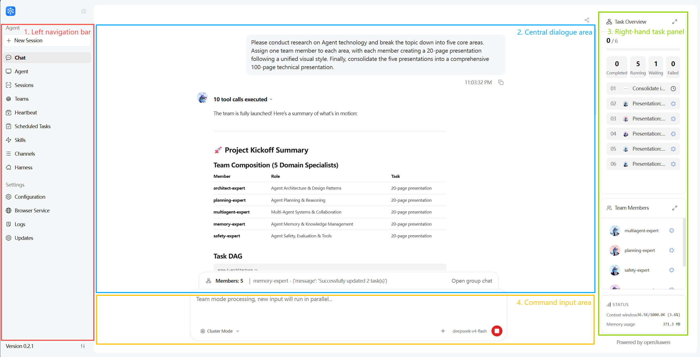
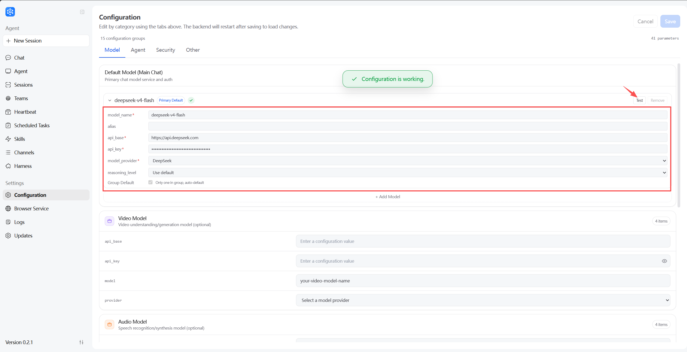
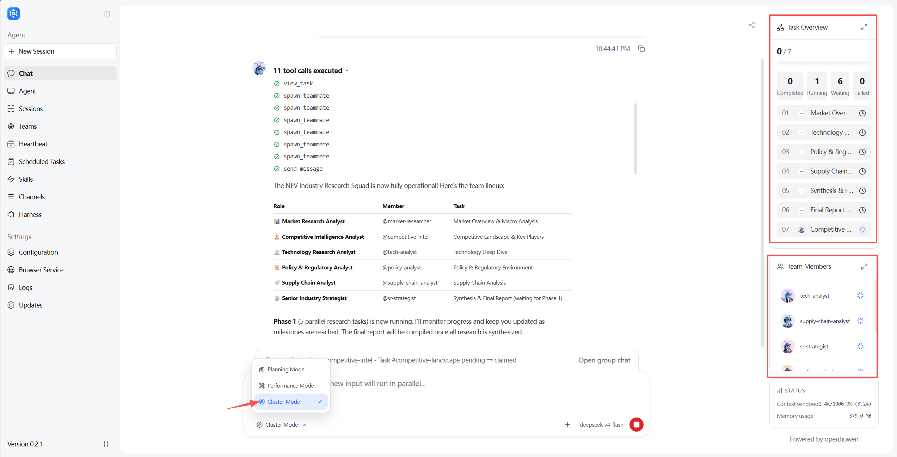
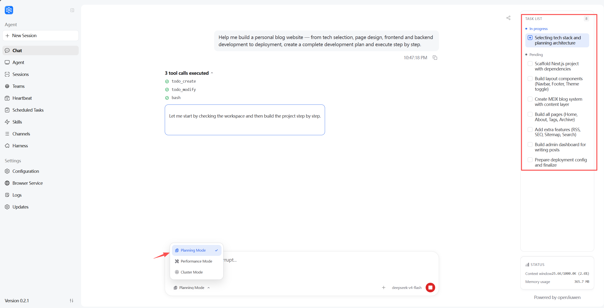
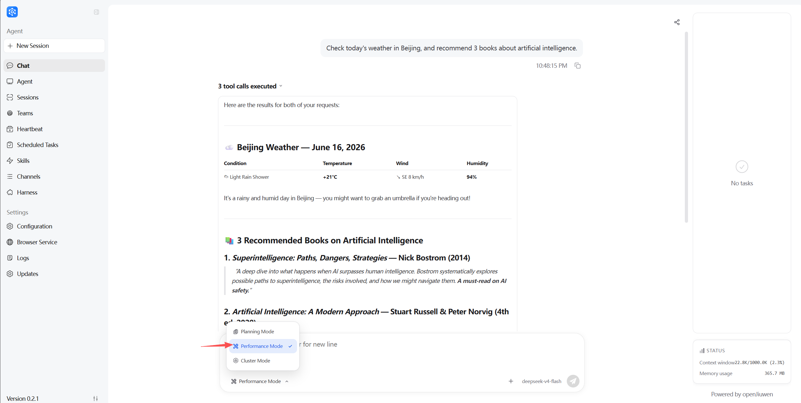
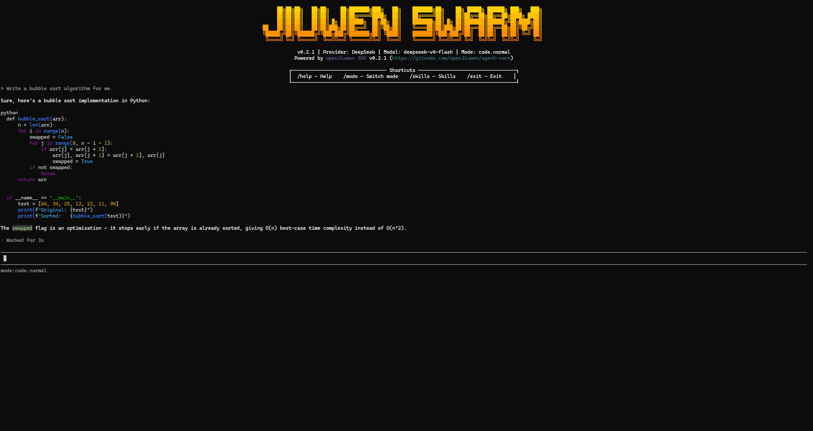

<p align="center">
  
</p>

<h1 align="center">JiuwenSwarm</h1>

<p align="center">
  <strong>Understands Your Intent, Evolves Autonomously — Swarm Collaboration for Complex Tasks</strong>
</p>

<p align="center">
  <a href="README_CN.md">Chinese</a>
  ·
  <a href="README.md">English</a>
  ·
  <a href="docs/README.md">Docs</a>
  ·
  <a href="docs/README_EN.md">Docs (EN)</a>
  ·
  <a href="https://openjiuwen.com">Website</a>
  ·
  <a href="https://gitcode.com/openJiuwen/jiuwenswarm">GitCode</a>
</p>

<p align="center">
  <a href="LICENSE">
    
  </a>
  <a href="https://gitcode.com/openJiuwen/jiuwenswarm/releases">
    
  </a>
  
  
  
  
</p>

<p align="center">
  
</p>

---

## Introduction

**JiuwenSwarm** is an Agent system that makes multi-agent collaboration truly work. Designed for developers and teams who need to automate complex tasks, it helps users drive multi-agent collaboration, Skill self-evolution, and tool invocation through natural language — delivering end-to-end from intent to result. Compared to similar projects, JiuwenSwarm's core differentiators are: Skill self-evolution makes capabilities grow stronger with use, swarm collaboration enables multiple Agents to specialize and coordinate on complex tasks, and multi-platform access covers mainstream IM platforms.

### Why JiuwenSwarm

| Capability | Value |
| --- | --- |
| Multi-Agent Collaboration | Complex tasks are no longer a single Agent's battlefield: Leader automatically decomposes tasks, assembles teams, and multiple Agents specialize and negotiate dynamically |
| Distributed Agent Swarm | Break through single-machine compute limits: Leader/Teammate deploy across processes and machines, coordinating at scale |
| Swarmflow | Orchestrate workflows with natural language: Leader automatically decomposes into multi-stage workflows, with Agents seamlessly handing off between stages |
| Skill Self-Evolution | Capabilities grow stronger with use, not rigid over time: automatically detects error signals and user dissatisfaction, then optimizes Skill definitions |
| Skill Hub Sharing | Capability assets are built once and reused everywhere: Skills can be searched, installed, combined, and remixed across developers |
| Auto Harness | Evaluation-driven, end-to-end automated Harness optimization: not training model weights, but letting the Harness learn and optimize automatically in practice |
| AI Infrastructure Compatibility | One system adapts to multiple inference backends: compatible with Huawei Cloud MaaS and other mainstream platforms, supports OpenAI-compatible APIs and local models |
| Tool Permissions & Security | Every step is under your control: pre-execution approval for tools, file access whitelists, sensitive operation interception |

## Latest Updates

- **2026-05-18**: `v0.2.0` released — JiuwenClaw officially upgraded to JiuwenSwarm, desktop app with auto-update, Swarm mode and evolution enhancements, CLI/TUI command extensions.
- **2026-05-21**: openJiuwen Roundtable livestream — open sharing on Swarm Skills Hub ecosystem co-building and Skills self-evolution.
- **2026-06-02**: `v0.2.1` released — Swarm cluster mode frontend display optimization, TUI integration with Auto Harness new commands, automated evolution and scheduled task system improvements.
- **2026-06-12**: Invited to Singapore Lorong AI community event.

## Installation & Launch

### Desktop

| Platform | Download | Notes |
| --- | --- | --- |
| Windows | [Download Windows Version](https://openjiuwen.com/jiuwenswarm) | For Windows 10 / 11 |
| macOS | [Download macOS Version](https://openjiuwen.com/jiuwenswarm) | For Intel / Apple Silicon |

Download and follow the installer prompts to get started.

### Command Line

```bash
# Install JiuwenSwarm
pip install jiuwenswarm

# Use China mirror (recommended)
pip install jiuwenswarm -i https://pypi.tuna.tsinghua.edu.cn/simple

# Initialize JiuwenSwarm (first-time setup)
jiuwenswarm-init

# Start JiuwenSwarm
jiuwenswarm-start
```

After launching, visit http://localhost:5173 to open the frontend.

To use TUI (terminal interface), open a new terminal after starting JiuwenSwarm:

```bash
# Install JiuwenSwarm-tui
pip install jiuwenswarm-tui

# Use China mirror (recommended)
pip install jiuwenswarm-tui -i https://pypi.tuna.tsinghua.edu.cn/simple

# Start JiuwenSwarm-tui
jiuwenswarm-tui
```

> For detailed installation instructions, see: [Install Guide](docs/en/InstallGuide.md)

## Quick Start

### Configure Model

JiuwenSwarm supports multiple model platforms: Huawei Cloud MaaS, OpenAI, DeepSeek, DashScope, SiliconFlow, OpenRouter and other OpenAI-compatible APIs, as well as local model deployment.



### Start a Conversation

JiuwenSwarm supports three execution modes — switch as needed:

| Mode | Description | Best For |
| --- | --- | --- |
| Plan Mode | Decomposes requirements into concrete steps, executes step by step | Complex tasks, need to confirm each step |
| Performance Mode | Flexible handling, supports parallel tasks | Simple tasks, fast response |
| Swarm Mode | Leader orchestrates multiple specialized Agents in coordinated collaboration | Large complex tasks, multi-role collaboration |

**Swarm Mode** (default)

Example input:

```text
Conduct an in-depth research on the new energy vehicle industry and generate an analysis report.
```



**Planning Mode**

Example input:

```text
Help me build a personal blog website — from tech selection, page design, frontend and backend development to deployment, create a complete development plan and execute step by step.
```



**Performance Mode**

Example input:

```text
Check today's weather in Beijing, and recommend 3 books about artificial intelligence.
```



### TUI Interface

Experience JiuwenSwarm in the terminal — ideal for headless environments or CLI-preferred users.

Example input:

```text
Write a bubble sort algorithm for me.
```



> For detailed operation guide, see: [Quick Start](docs/en/Quickstart.md)

## Documentation

For common usage instructions and feature documentation, see: [Documentation](docs/README_EN.md)

## Roadmap

| Feature | Status | ETA | Value |
| --- |-----| --- | --- |
| Swarmflow Stateful Operators | In Development | 2026-07 | Workflow nodes support human intervention and state memory — Humans can participate as stateful operators, approving, correcting, or taking over subsequent steps based on intermediate results |
| Team Mode Same-Session Feishu Integration | In Development | 2026-07 | Feishu users join as Human Agents in the same session, collaborating with AI Agent teams — human-AI mixed squads for more precise decisions |

## FAQ

For solutions to common issues, see: [FAQ](docs/en/FAQ.md).

## Contributing

We welcome developers to contribute to JiuwenSwarm. You can contribute in the following ways:

- Report bugs, feature requests, or usage issues: [Issues](https://gitcode.com/openJiuwen/jiuwenswarm/issues)
- Submit code, documentation, or examples: [Pull Requests](https://gitcode.com/openJiuwen/jiuwenswarm/pulls)
- Share Skills: [Swarm Skills Hub](https://swarmskills.openjiuwen.com/)

Please read the [Contributing Guide](docs/en/Contributing.md) before contributing to understand the debugging workflow, code style, and commit conventions. For the contribution roadmap, see the [openJiuwen Contribution Page](https://openjiuwen.com/contribute).

### Contributors

Thanks to all developers who have contributed to JiuwenSwarm: [View Contributor List](https://gitcode.com/openJiuwen/jiuwenswarm/project_members)

## Community

| Channel | Purpose | Link |
| --- | --- | --- |
| Website | Product info, updates, and ecosystem | [Visit Website](https://openjiuwen.com) |
| SIG | Technical roadmap, engineering practices, ecosystem building | [Join SIG](https://openjiuwen.com/community/sig-center) |
| Swarm Skills Hub | Browse, publish, and reuse JiuwenSwarm Skills | [Visit Swarm Skills Hub](https://swarmskills.openjiuwen.com/) |

## License

This project is licensed under [Apache License 2.0](LICENSE).