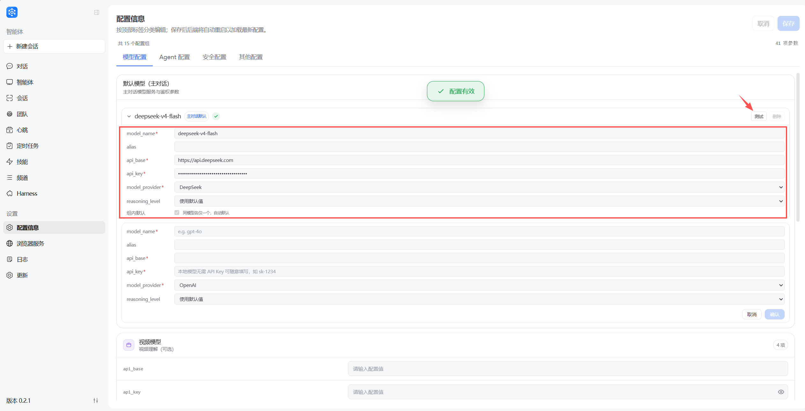
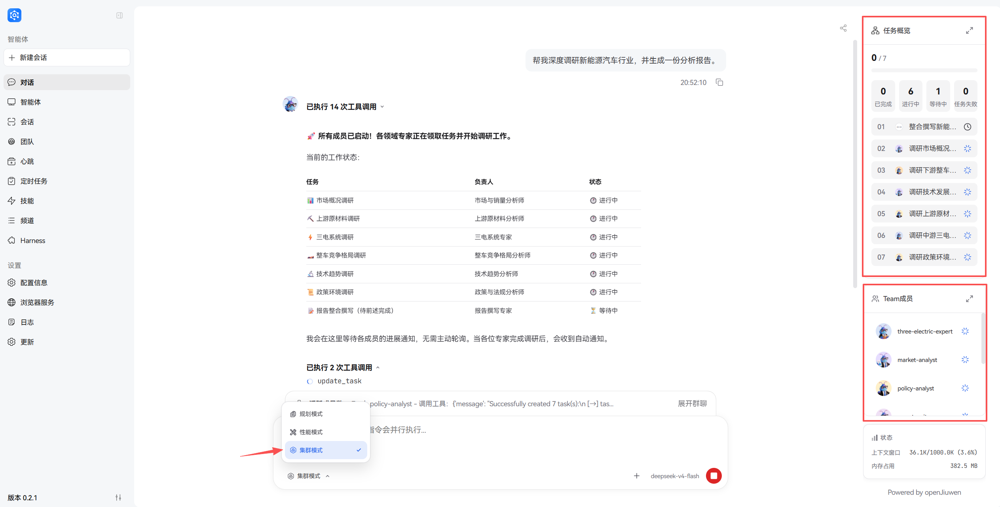
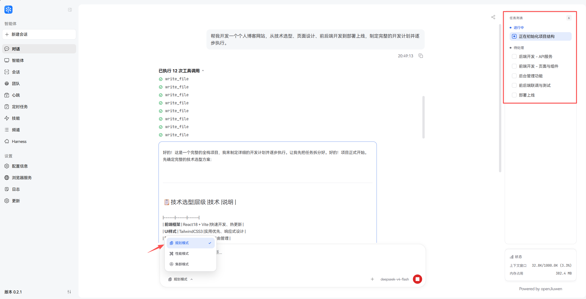
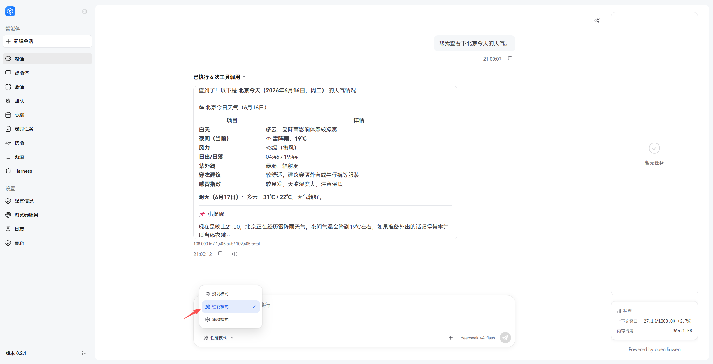
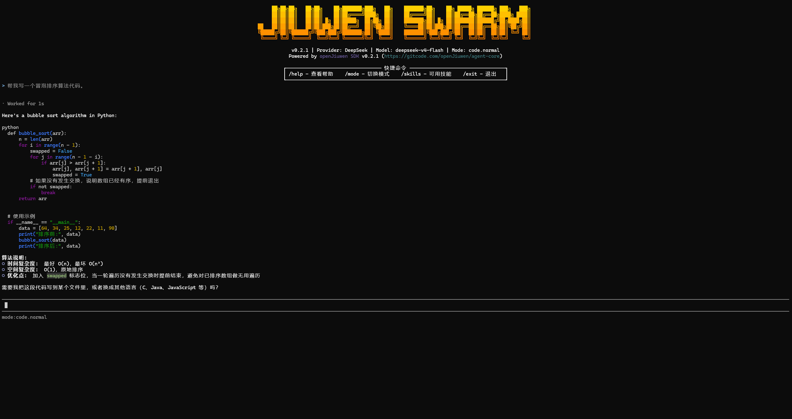

<p align="center">
  
</p>

<h1 align="center">JiuwenSwarm</h1>

<p align="center">
  <strong>懂你所想自主演进，蜂群协作完成复杂任务</strong>
</p>

<p align="center">
  <a href="README_CN.md">中文</a>
  ·
  <a href="README.md">English</a>
  ·
  <a href="docs/README.md">文档</a>
  ·
  <a href="docs/README_EN.md">Docs</a>
  ·
  <a href="https://openjiuwen.com">官网</a>
  ·
  <a href="https://gitcode.com/openJiuwen/jiuwenswarm">GitCode</a>
</p>

<p align="center">
  <a href="LICENSE">
    
  </a>
  <a href="https://gitcode.com/openJiuwen/jiuwenswarm/releases">
    
  </a>
  
  
  
  
</p>

<p align="center">
  
</p>

---

## 简介

**JiuwenSwarm** 是一款让多智能体真正协作起来的 Agent 系统，面向需要自动化处理复杂任务的开发者和团队，帮助用户通过自然语言驱动多 Agent 协作、Skill 自演进和工具调用，实现从意图到结果的端到端交付。与同类项目相比，JiuwenSwarm 的核心差异在于：Skill 自演进让能力越用越强、蜂群协作让多 Agent 专业分工、协同完成复杂任务、多端接入覆盖主流 IM 平台。

### 为什么选择 JiuwenSwarm

| 能力 | 价值 |
| --- | --- |
| 多智能体协作 | 复杂任务不再是一个 Agent 的战场：Leader 自动拆解任务、组建团队，多个 Agent 专业分工、动态协商 |
| 分布式 Agent Swarm | 突破单机算力瓶颈：Leader/Teammate 跨进程、跨机器部署，多机协同处理大规模任务 |
| Swarmflow | 用自然语言驱动工作流编排：Leader 自动拆解为多阶段工作流，各阶段 Agent 自动衔接 |
| Skill 自演进 | 能力越用越强而非越跑越僵：执行出错或用户不满时自动检测信号、优化 Skill 定义 |
| Skill Hub 流通 | 能力资产一次沉淀、处处复用：Skill 在开发者之间搜索、安装、组合与二次创作 |
| Auto Harness | 评测驱动、端到端自动优化 Harness：不是训练模型权重，而是让 Harness 在实战中自动学习、自动优化 |
| AI 基础设施亲和 | 一套系统适配多种推理后端：兼容华为云 MaaS 等主流平台，支持 OpenAI 兼容接口与本地模型 |
| 工具权限与安全防护 | 每一步操作都在你的掌控中：工具执行前审批、文件访问白名单、敏感操作拦截 |

## 最新动态

- **2026-05-18**：`v0.2.0` 发布，JiuwenClaw 正式升级为 JiuwenSwarm，桌面端发布与自动更新、Swarm 模式与演进能力增强、CLI/TUI 命令扩展。
- **2026-05-21**：openJiuwen 圆桌派直播，开放式分享 Swarm Skills Hub 生态共建与 Skills 自演进。
- **2026-06-02**：`v0.2.1` 发布，Swarm 集群模式前端显示优化、TUI 接入 Auto Harness 新指令、自动化演进与定时任务体系完善。
- **2026-06-12**：受邀参加新加坡 Lorong AI 社区活动。

## 安装与启动

### 桌面版

| 系统 | 下载链接 | 说明 |
| --- | --- | --- |
| Windows | [下载 Windows 版本](https://openjiuwen.com/jiuwenswarm) | 适用于 Windows 10 / 11 |
| macOS | [下载 macOS 版本](https://openjiuwen.com/jiuwenswarm) | 适用于 Intel / Apple Silicon |

下载后按照提示安装使用。

### 命令行版

```bash
# 安装 JiuwenSwarm
## 方式一：默认安装
pip install jiuwenswarm

## 方式二：使用国内镜像源（推荐）
# 清华源
pip install jiuwenswarm -i https://pypi.tuna.tsinghua.edu.cn/simple

# 初始化 JiuwenSwarm（首次启动）
jiuwenswarm-init

# 启动 JiuwenSwarm
jiuwenswarm-start
```

启动后访问 http://localhost:5173 打开前端页面即可使用。

如需使用 TUI（终端交互界面），在启动 JiuwenSwarm 后另开终端：

```bash
# 安装 JiuwenSwarm-tui
## 方式一：默认安装
pip install jiuwenswarm-tui

## 方式二：使用国内镜像源（推荐）
# 清华源
pip install jiuwenswarm-tui -i https://pypi.tuna.tsinghua.edu.cn/simple

# 启动 JiuwenSwarm-tui
jiuwenswarm-tui
```

> 详细安装指导请见：[安装指南](docs/zh/安装指南.md)

## 快速上手

### 配置模型

JiuwenSwarm 支持多种模型平台：华为云 MaaS、OpenAI、DeepSeek、DashScope、SiliconFlow、OpenRouter 等 OpenAI 兼容接口，也支持本地模型部署。



### 执行对话

JiuwenSwarm 支持三种执行模式，按需切换：

| 模式 | 说明 | 适用场景 |
| --- | --- | --- |
| 规划模式 | 将需求分解为具体步骤，按计划逐步执行 | 复杂任务、需确认每步结果 |
| 性能模式 | 灵活处理，支持并行任务 | 简单任务、快速响应 |
| 集群模式 | Leader 编排多个专业 Agent 分工协同 | 大型复杂任务、需多角色协作 |

**集群模式**（默认）

示例输入：

```text
帮我深度调研新能源汽车行业，并生成一份分析报告。
```



**规划模式**

示例输入：

```text
帮我开发一个个人博客网站，从技术选型、页面设计、前后端开发到部署上线，制定完整的开发计划并逐步执行。
```



**性能模式**

示例输入：

```text
帮我查看下北京今天的天气。
```



### TUI 界面

在终端中体验 JiuwenSwarm，适合无 GUI 环境或偏好命令行的用户。

示例输入：

```text
帮我写一个冒泡排序算法代码。
```



> 详细操作指南请见：[Quick Start](docs/zh/Quickstart.md)

## 文档导航

如需了解查看JiuwenSwarm 的常用使用说明与功能文档，请见：[文档导航](docs/README.md)

## Roadmap

| 功能 | 状态  | 预计时间 | 价值 |
| --- |-----| --- | --- |
| Swarmflow 有状态算子 | 规划中 | 2026-07 | 工作流节点支持人工介入，作为有状态算子参与流程，根据中间结果审批、修正或接管后续步骤 |
| Team 模式同 Session 飞书联机 | 规划中 | 2026-07 | 飞书用户作为 Human Agent 加入同会话，与 AI Agent 团队共同协作，人机混合编队让决策更精准 |

## 常见问题

如需查询使用 JiuwenSwarm 中常见问题的解决方案，请见：[FAQ](docs/zh/FAQ.md)。

## 参与贡献

欢迎开发者参与 JiuwenSwarm 的建设。你可以通过以下方式贡献：

- 提交 Bug、功能建议或使用问题：[Issues](https://gitcode.com/openJiuwen/jiuwenswarm/issues)
- 提交代码、文档或示例：[Pull Requests](https://gitcode.com/openJiuwen/jiuwenswarm/pulls)
- 分享 Skill：[Swarm Skills Hub](https://swarmskills.openjiuwen.com/)

贡献前请阅读 [贡献指南](docs/zh/贡献指南.md)，了解调试流程、代码风格和提交规范。贡献路径地图见 [openJiuwen 贡献页面](https://openjiuwen.com/contribute)。

### 贡献者

感谢所有为 JiuwenSwarm 做出贡献的开发者：[查看贡献者列表](https://openjiuwen.com/community/contributors)

## 加入社区

| 入口 | 用途 | 链接 |
| --- | --- | --- |
| 官网 | 产品介绍、动态与生态建设 | [访问官网](https://openjiuwen.com) |
| SIG | 技术路线、工程实践、生态共建 | [加入 SIG](https://openjiuwen.com/community/sig-center) |
| Swarm Skills Hub | 浏览、发布和复用 JiuwenSwarm Skill | [访问 Swarm Skills Hub](https://swarmskills.openjiuwen.com/) |
    
## License  

本项目基于 [Apache License 2.0](LICENSE) 开源。