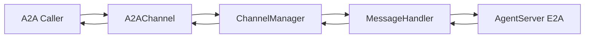

# A2A Integration Guide

This page explains the Gateway-side **A2A Server** (`A2AChannel`): implementation location, configuration, mapping to internal `Message`/E2A, and local verification commands. For outbound A2A (agent calling external services), see section 7.

> **Implementation**: `jiuwenswarm/gateway/channel_manager/protocol/a2a/a2a_connect.py` (`A2AChannel` + `a2a-sdk`). **Entrypoint process**: `python -m jiuwenswarm.gateway.app_gateway` (registered and started in `jiuwenswarm/gateway/app_gateway.py`). In case of mismatch, source code is the source of truth.

---

## 0. Document Location and Source of Truth

| Location | Role |
|------|------|
| **docs/en/A2A.md** (this page) | Integration and dev debugging: modules, config, mapping, verification |
| `jiuwenswarm/gateway/channel_manager/protocol/a2a/a2a_connect.py` | A2A HTTP service, `AgentCard`, request/response to `Message` conversion |
| `jiuwenswarm/gateway/app_gateway.py` | Env loading, `A2AChannel` construction, `channel_manager.register_channel` |
| `jiuwenswarm/gateway/message_handler/message_handler.py` | Gateway↔AgentServer E2A exchange and internal `Message` orchestration |
| `jiuwenswarm/gateway/channel_manager/channel_manager.py` | Channel registration and `robot_messages` → `Channel.send` dispatch |
| [E2A-protocol.md](E2A-protocol.md) | Inner protocol between Gateway and AgentServer |

---

## 1. Responsibility Boundary

- **Inbound (this page)**: external A2A client → `A2AChannel` → `ChannelManager` → `MessageHandler` → E2A → AgentServer; responses return through the same path, emitted as `TaskStatusUpdateEvent` / `TaskArtifactUpdateEvent` (streaming) or aggregated result (non-streaming).
- **Outbound**: Agent-side access to external A2A services (for example via A2A MCP Hub style tooling) belongs to the AgentServer adapter layer (see section 7), not `A2AChannel`.

---

## 2. Comparison with Web / ACP Channels

| Item | Web | ACP | A2A (current) |
|------|-----|-----|-------------|
| Bindings | `WEB_HOST` / `WEB_PORT` / `WEB_PATH` | `ACP_GATEWAY_*` | `A2A_SERVER_*` |
| Config source | Env + CLI (`--host`, etc.) | Env only | Env only |
| `.env` loading | `app_gateway` calls `load_dotenv(get_env_file())`, i.e. `~/.jiuwenswarm/config/.env` | same | same |

---

## 3. Environment Variables (Gateway)

Set these in `~/.jiuwenswarm/config/.env` or process environment (read by `app_gateway.py`):

Before enabling A2A, make sure the optional dependency is installed:

```bash
pip install "jiuwenswarm[a2a]"
# or (repo/dev environment)
uv sync --extra a2a
```

| Variable | Default | Notes |
|------|------|------|
| `A2A_SERVER_ENABLED` | disabled when unset | `1` / `true` / `yes` / `on` enable it |
| `A2A_SERVER_HOST` | `127.0.0.1` | HTTP bind address; `0.0.0.0` is common for external access |
| `A2A_SERVER_PORT` | `19100` | avoid conflicts with Web/ACP ports |
| `A2A_SERVER_PATH` | `/a2a` | JSON-RPC entry path |
| `A2A_SERVER_PROTOCOL_VERSION` | `1.0.0` | written into `AgentCard.AgentInterface.protocol_version` |
| `A2A_SERVER_CARD_PATH` | `/.well-known/agent-card.json` | Agent Card path |
| `A2A_SERVER_EXTENDED_CARD_PATH` | `/agent/authenticatedExtendedCard` | Extended Card path |
| `A2A_SERVER_APP_NAME` | `JiuwenSwarm Gateway A2A Server` | Agent Card `name` |
| `A2A_SERVER_APP_DESCRIPTION` | `A2A ingress for JiuwenSwarm Gateway` | Agent Card `description` |
| `A2A_SERVER_APP_VERSION` | `0.1.0` | Agent Card `version` |

AgentServer connectivity still follows existing gateway config (for example `AGENT_SERVER_URL`) and is independent from the A2A listening endpoint.

When `A2A_SERVER_ENABLED=true` but `jiuwenswarm[a2a]` (or `uv sync --extra a2a`) is not installed, Gateway startup remains non-blocking; A2A channel startup failure is reported in logs with actionable install hints.

---

## 4. External Endpoints

- **JSON-RPC**: `http://{A2A_SERVER_HOST}:{A2A_SERVER_PORT}{A2A_SERVER_PATH}`
- **Agent Card**: `http://{host}:{port}/.well-known/agent-card.json` (path defined by `A2AChannelConfig.card_path`, default `/.well-known/agent-card.json`)

`AgentCard` is built in `A2AChannel.start()`: `supported_interfaces[0].url` points to the JSON-RPC endpoint above; `capabilities.streaming` and skills are defined in code.

---

## 5. Data Flow (Overview)



Inbound A2A `message.parts` are mapped into internal `Message.params.query` and optional `files`; no dedicated `params["a2a"]` extension object is written. Outbound internal `Message.payload` is mapped to A2A `Part` list (including multimodal parts and textified tool events).

---

## 6. Field Mapping Summary

### 6.1 Request (A2A → `Message`)

| A2A / context | Internal |
|--------------|------|
| `task_id` or generated value | `Message.id` (used to correlate replies) |
| `context_id` | `Message.session_id` |
| `parts[].text` | merged into `params.query` |
| non-text parts (`url` / `data` / `raw`) | `params.files[]` (includes web-compatible redundant keys) |
| metadata | `Message.metadata` |

### 6.2 Response (`Message` → A2A)

| Internal | A2A |
|------|-----|
| `payload.content`, tool-related events, etc. | `Part(text=...)`, etc. |
| `payload.files[]` | `Part` url / data / raw fields |

---

## 7. Outbound A2A (Agent Side)

- This repository currently does not include a dedicated A2A MCP Hub registration module. If/when that capability is restored, follow the actual wiring code and environment variable definitions.

---

## 8. Local Verification (Examples)

Non-streaming:

```bash
curl -sS -X POST "http://127.0.0.1:${A2A_SERVER_PORT:-19100}${A2A_SERVER_PATH:-/a2a}" \
  -H 'Content-Type: application/json' \
  -d '{"jsonrpc":"2.0","id":"t1","method":"SendMessage","params":{"message":{"messageId":"m1","contextId":"c1","role":"ROLE_USER","parts":[{"text":"ping"}]}}}'
```

Streaming:

```bash
curl -sS -N -X POST "http://127.0.0.1:${A2A_SERVER_PORT:-19100}${A2A_SERVER_PATH:-/a2a}" \
  -H 'Content-Type: application/json' \
  -d '{"jsonrpc":"2.0","id":"t2","method":"SendStreamingMessage","params":{"message":{"messageId":"m2","contextId":"c2","role":"ROLE_USER","parts":[{"text":"ping"}]}}}'
```

Start both AgentServer and Gateway, and ensure `A2A_SERVER_ENABLED=true`.

---

## 9. Known Extension Points

- Authentication, rate limit, timeout, and observability metrics are better enforced by gateway or upstream proxy, while keeping `A2AChannel` focused on protocol/message mapping.
- If `jiuwenswarm/resources/.env.template` does not include A2A/ACP keys, append them manually in local `.env` (consistent with section 2).
