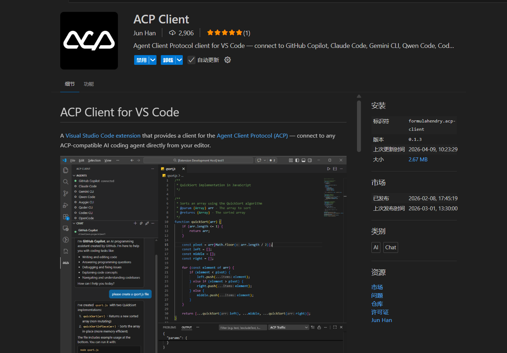
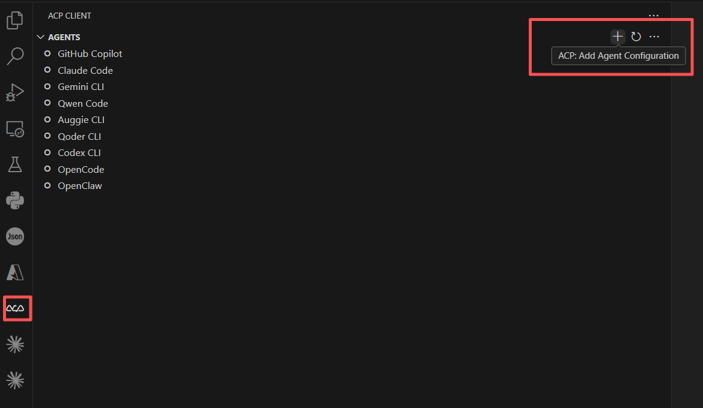

# Quick Start

JiuwenSwarm supports connecting to the ACP client in VS Code.
Pre-installation Preparation
- Environment Dependencies:
  - Complete the installation of JiuwenSwarm
  - Configure the model in the web UI: Settings → Configuration → Model Configuration

**Note: Users may complete installation and configuration based on their actual needs using the following methods.**

# VS Code ACP Client Setup (Source Code)

For users who cloned the repository.

1. Install the ACP Client extension from the marketplace. Search for `formulahendry.acp-client` and install it.

2. In the extension, click the `+` button (`ACP: Add Agent Configuration`).

3. For `Name`, enter: `jiuwenswarm`.
4. For `Command`:
   - Windows: enter the absolute path to `<repo>/scripts/run_gateway_acp.cmd`
   - Linux / macOS: enter the absolute path to `<repo>/scripts/run_gateway_acp.sh`
5. Leave `Config / Arguments` empty.
6. Start the main process in the terminal first: `python -m jiuwenswarm.app`
7. Connect to `jiuwenswarm` in the extension, then chat in the window.

> Note: The scripts use the `.venv` under the project root by default.

# VS Code ACP Client Setup (pip install / Wheel)

For users who installed JiuwenSwarm via `pip install jiuwenswarm`.

1. Install the ACP Client extension from the marketplace. Search for `formulahendry.acp-client` and install it.
2. In the extension, click the `+` button (`ACP: Add Agent Configuration`).
3. For `Name`, enter: `jiuwenswarm`.
4. For `Command`, enter: `jiuwenswarm-acp`
5. Leave `Config / Arguments` empty.
6. Start the main process in the terminal first: `python -m jiuwenswarm.app`
7. Connect to `jiuwenswarm` in the extension, then chat in the window.

> Note: `jiuwenswarm-acp` is a command-line entry point auto-generated by pip install, just like `jiuwenswarm-init` and `jiuwenswarm-start`. Make sure VS Code is running in the same virtual environment where jiuwenswarm is installed. If not, provide the full path instead, e.g. `C:\path\to\venv\Scripts\jiuwenswarm-acp.exe` on Windows, or `/path/to/venv/bin/jiuwenswarm-acp` on Linux/macOS.