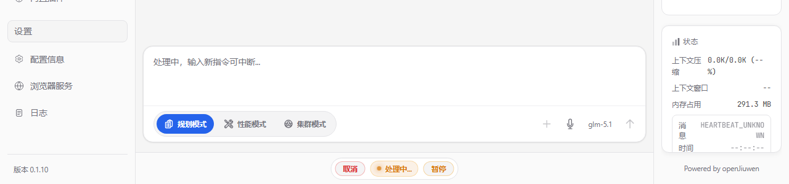
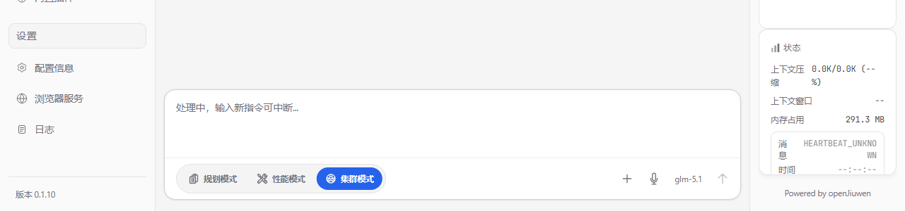
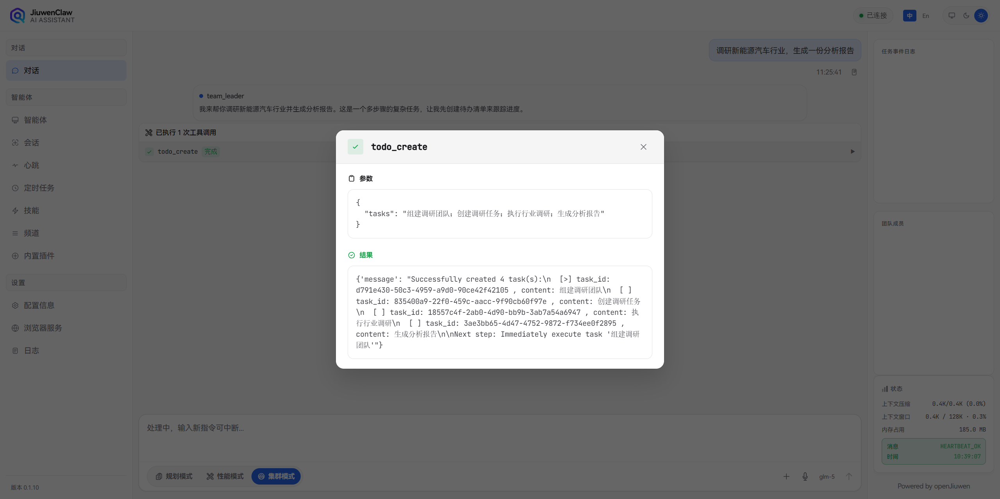
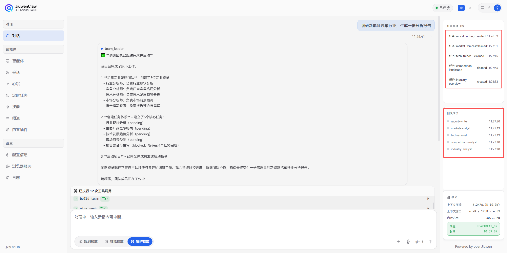
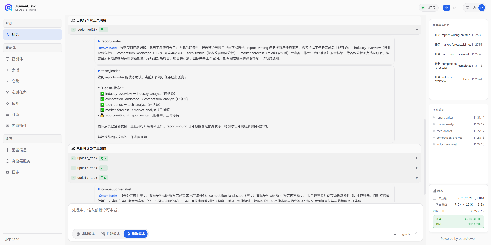
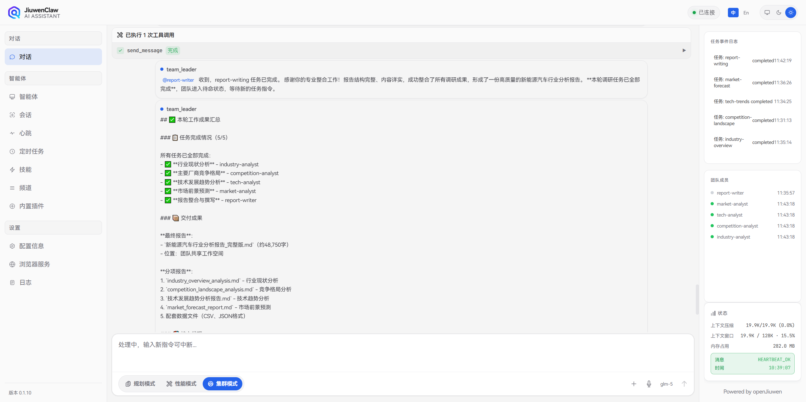
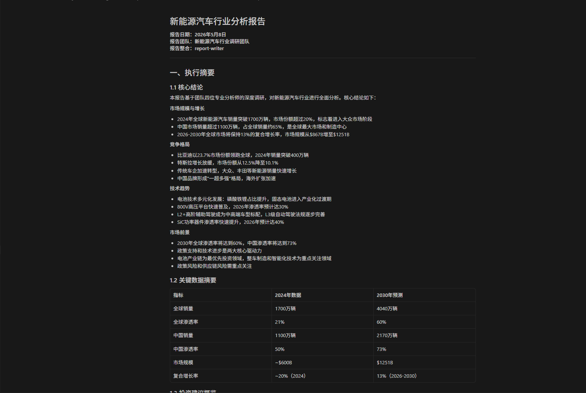

# Agent Team user guide

## Introduction

Agent Team is a core collaboration feature of the JiuwenSwarm platform. It lets multiple agents form a team around one goal and complete complex work together. Unlike boosting a single agent’s capability, Agent Team emphasizes teamwork, division of labor, and continuous delivery.

---

## Concepts

### 1.1 Positioning of Agent Team

**Agent Team is not “a stronger single agent”—it is multi-agent teamwork.**

Imagine you need to finish a complex task—for example, “deep-dive an industry and produce an analysis report.” That work spans multiple phases:

- research and information gathering  
- data analysis and structuring  
- writing and layout  
- review and polish  

If you rely on one agent, it must master research, analysis, writing, and proofreading at once, and run steps strictly one after another, which is inefficient.

Agent Team’s idea is: **let specialized agents form a team; each handles what it does best, and they complete the job together.**

> **Analogy**: Like a project team—a lead coordinates, researchers gather facts, analysts process data, and writers produce the report. Everyone focuses on their role; the team delivers the outcome.

### 1.2 Why use Agent Team?

**Limits of a single agent:**

1. **Hard to cover many phases well** — one agent rarely excels at research, analysis, execution, and proofreading all at once  
2. **Serial execution is slow** — work must proceed step by step with little parallelism  
3. **Long chains are error-prone** — omissions and drift accumulate  
4. **Hard to improve continuously** — outputs from each phase are hard for other phases to reuse and refine in time  

**Benefits of Agent Team:**

1. **Specialization** — each agent focuses on its strength; higher quality per phase  
2. **Parallelism** — multiple agents can work at once and lift throughput  
3. **Handoffs** — later steps consume earlier outputs directly  
4. **Continuous delivery** — the team pushes until the final goal is met  

### 1.3 From Harness Engineering to Coordination Engineering

Traditional agent development often focuses on **Harness Engineering** (harnessing a single agent):

- Making one agent more capable  
- Better prompts  
- Richer tools  

Agent Team shifts toward **Coordination Engineering** (orchestrating collaboration):

- How multiple agents divide work  
- Collaboration mechanics and process  
- Task flow and result aggregation  

> **Takeaway**: The core of Agent Team is not “the strongest agent,” but **better coordination**—how you organize the team, assign tasks, and move the process forward.

---

## Usage guide

### 2.1 When to use Agent Team

**When is Agent Team a good fit?**

Agent Team fits these kinds of tasks:

| Task trait | Good for Agent Team? | Notes |
|------------|----------------------|-------|
| **Long chain, many steps** | Yes | Multiple phases that can run somewhat independently |
| **Clear role split** | Yes | Different phases need different expertise |
| **Parallelizable** | Yes | Some work can run concurrently |
| **Needs iteration** | Yes | Multiple rounds of refinement |
| **Simple Q&A** | No | One agent is enough |
| **Single-step task** | No | No real need for teamwork |

**Typical scenarios:**

1. **Deep research → report**  
   - Research agent gathers information  
   - Analysis agent processes data  
   - Writing agent drafts the report  
   - Proofreading agent polishes content  

2. **Materials → proposal**  
   - Organize agent sorts materials  
   - Analysis agent extracts key points  
   - Design agent shapes the proposal  
   - Review agent refines the plan  

3. **Multi-role content production**  
   - Creative agent proposes ideas  
   - Writing agent drafts content  
   - Editing agent improves layout  
   - Review agent checks quality  

4. **Complex split execution**  
   - Planning agent breaks down work  
   - Execution agents run tasks in parallel  
   - Merge agent integrates results  
   - Validation agent checks completeness  

### 2.2 Collaboration flow

**Core collaboration path:**

```text
User states goal → Leader analyzes → Leader forms team → Leader breaks down tasks
→ Teammates claim tasks → Teammates execute → Teammates report back
→ Leader consolidates → Final deliverable
```

**Step by step:**

#### Step 1: User states the goal

The user describes the objective in natural language, for example:

- “Research the new energy vehicle industry and produce an analysis report.”  
- “Organize these technical docs into a user guide.”  

#### Step 2: Leader analyzes requirements

After receiving the goal, the Leader agent:

- Understands the core need  
- Maps phases of work  
- Estimates roles required  
- Drafts an overall execution plan  

#### Step 3: Leader forms the team

The Leader:

- Selects agent roles (e.g. research, analysis, writing)  
- Assigns work per role  
- Sets dependencies between tasks  

#### Step 4: Teammates claim tasks

Teammates:

- Claim tasks that match their strengths  
- Confirm scope, requirements, and inputs  
- Prepare resources and start execution  

#### Step 5: Teammates execute

Teammates:

- Complete work per task specification  
- Escalate to the Leader when blocked  
- Produce intermediate results or deliverables  

#### Step 6: Teammates report results

When tasks finish, teammates:

- Report outcomes to the Leader  
- Submit intermediate artifacts or deliverables  
- Wait for follow-up assignments  

#### Step 7: Leader consolidates results

The Leader:

- Integrates outputs from all teammates  
- Checks task completion  
- Produces the final deliverable  

> **Important**: This is **team collaboration**, not the user manually invoking agents one by one. You only state the goal; the team runs the workflow automatically.

**Task dependencies:**

Tasks can depend on each other:

- **Prerequisite** — must finish before dependents can run  
- **Dependent** — waits on prerequisite outputs  
- **Parallel** — no blocking dependency; can run concurrently  

Example for “research → report”:

- Research (prerequisite) → Analysis (dependent) → Writing (dependent)  
- Layout may run in parallel with parts of writing  
- Proofreading waits until drafting completes  

### 2.3 Starting Agent Team mode

Agent Team mode is a dedicated collaboration mode on JiuwenSwarm. You can start it as follows:

**Method 1: Switch from the chat UI**

On the JiuwenSwarm chat page, switch to **cluster mode** (Agent Team mode). This is the simplest path—pick the mode in the conversation UI.



After you click **Cluster mode**, the UI switches to Agent Team mode:



**Method 2: `/mode` in a channel**

In a channel conversation, run:

```text
/mode team
```

The current thread enters Agent Team mode, and the Leader agent coordinates tasks.

**How to write prompts in Agent Team mode**

Prompting is similar to normal chat, but for smoother runs:

1. **State the goal clearly** — describe the final deliverable, e.g. “Research the new energy vehicle industry and produce an analysis report.”  
2. **Define scope** — boundaries such as “focus on the domestic market, last three years.”  
3. **Add constraints** — format, length, tone, e.g. “include charts; at least 5,000 words.”  
4. **Prefer one complete message** — put the full request in one prompt when possible to avoid repeated replanning.  

### 2.4 Team Skills

In Agent Team mode you can still use and develop **Skills**. Each agent can configure and use skills; the team can also share skill resources.

**Team Skills concepts:**

- **Personal skills** — configured and used by each agent, stored under `workspaces/<agent_name>_workspace/skills/`  
- **Team-shared skills** — team-level skills under `team-workspace/skills/`, available to all members  

**How skills help the team:**

1. **Stronger expertise** — skills extend what each agent can do in its domain  
2. **Shared tooling** — one shared skill set avoids duplicate setup  
3. **Higher efficiency** — skills help agents finish assigned work faster  

> For detailed usage and development of Team Skills, see [Team Skill developer guide](TeamSkill.md).

### 2.5 Team Memory

**Round definition**: In Agent Team, a round is one complete team collaboration cycle, typically including task assignment, execution, reporting, and consolidation.

In Agent Team mode, each team has two-layer memory: each member's own **personal memory** (independent read/write) and a shared **`TEAM_MEMORY.md`** (read-only to all members; the Leader writes it via an extractor agent at the end of each round).

**Team lifecycle and memory behavior:**

| Lifecycle | Personal Memory | Team Memory | Applicable Scenarios |
|-----------|-----------------|-------------|----------------------|
| **Temporary team** | Read-only access to parent agent's workspace memory | None | One-off tasks, use-and-discard |
| **Persistent team** | Each member reads/writes independently | Auto-extracted + accumulated across rounds | Long-term collaboration, experience accumulation |

**Detailed explanation:**

- **Temporary team**:
  - Members have read-only access to the parent agent's workspace memory and cannot pollute the source memory
  - No team memory; nothing persists after the team is destroyed
  - Suitable for one-off tasks and use-and-discard scenarios

- **Persistent team**:
  - Each member has independent personal memory with read/write support
  - Team memory is auto-extracted by the Leader at the end of each round and accumulates across rounds
  - Predefined members' existing workspaces are continued via symlink
  - Suitable for long-term collaboration and scenarios requiring experience accumulation

**Memory hierarchy and access permissions:**

| Layer | Access Permission | Writer |
|-------|-------------------|--------|
| Personal memory | Exclusive to the member | The member itself (via memory tool calls in session) |
| Team memory | Read-only to all members | Leader writes via extractor agent at the end of each round |

For the full storage layout, extraction categories (`[decision]` / `[lesson]` / `[member]` / `[context]`), and cross-team / cross-member isolation, see [Memory → Agent Team Memory](Memory.md#advanced-agent-swarm-team-memory).

---

## Case study

### Goal

Deep research on the new energy vehicle industry and deliver an analysis report.

### User input

```text
Research the new energy vehicle industry—development status, major vendors, and technology trends—and produce an analysis report.
```

### Collaboration process

**Leader analyzes requirements**

After receiving the goal, the Leader:

- Phases: industry overview, competitive landscape, technology trends, market outlook, integration and writing  
- Roles: industry analyst, competitive analyst, technology analyst, market analyst, writing lead  
- Plan: research first, then analysis, then writing  



**Leader forms the team**

The Leader assigns roles, for example:

- Industry analyst — industry overview  
- Competitive analyst — OEM competitive landscape  
- Technology analyst — technology trends  
- Market analyst — market outlook  
- Writing lead — integrate and write the report  



**Team Agent executes**

After assignment, team agents execute their tasks.



**Leader summarizes results**

The Leader merges all outputs:

- Checks completion  
- Integrates the final report  
- Delivers results to the user  



### Output

Final deliverable: a complete new energy vehicle industry report including:

- Industry development status  
- Major player analysis  
- Technology trend summary  
- Charts and figures as produced  



---

## Collaboration model

### 3.1 Roles

**Leader Agent responsibilities**

The Leader is the team lead. Main duties:

| Responsibility | Description |
|----------------|-------------|
| **Goal understanding** | Interpret the user’s objective and core needs |
| **Team formation** | Assemble the right agent team for the task |
| **Task planning** | Decompose work and assign teammates |
| **Key decisions** | Approve important choices and coordinate execution |
| **Overall progress** | Monitor progress and keep the team moving |
| **Consolidation** | Merge teammate outputs into the final artifact |

**Teammate Agent responsibilities**

Teammates are executors. Main duties:

| Responsibility | Description |
|----------------|-------------|
| **Claim tasks** | Take work that fits their strengths |
| **Execute independently** | Deliver per task specification |
| **Escalate** | Ask the Leader when blocked |
| **Report results** | Report completion and outcomes to the Leader |
| **Submit artifacts** | Hand off intermediates for downstream steps |

**Tiered autonomy**

Agent Team uses **tiered autonomous collaboration**:

- **Not fully manual orchestration** — users need not assign every sub-task  
- **Not unmanaged** — the Leader coordinates so execution stays orderly  
- **Autonomous claiming** — teammates can pick suitable tasks and apply their strengths  
- **Joint advancement** — Leader and teammates push the work forward together  

> **Summary**: The Leader coordinates; teammates execute; both sides complete the task together.

### 3.2 Shared collaboration

**Team shared workspace**

Agent Team provides a shared workspace where members collaborate on the same intermediate artifacts.

**Typical shared content:**

- Research outputs  
- Analysis data  
- Report drafts  
- Intermediate documents  
- Task status  

**Why sharing helps:**

1. **Continuous flow** — research, analysis, drafts, and other artifacts move through the team  
2. **Less duplication** — agents reuse prior outputs instead of redoing work  
3. **Live reference** — later steps can immediately use earlier outputs  
4. **Joint refinement** — multiple agents can improve the same document  

**Shared workspace layout**

Agent Team storage has two layers: **team shared workspace** and **per-member workspaces**.

- **Team shared workspace (`team-workspace`)** — shared by all members; holds team artifacts and shared skills. Each Agent Team session gets its own folder containing `team-workspace`.  
- **Per-member workspaces (`workspaces`)** — private space per agent for config, memory, skills, and todos.  

Full path layout:

```text
.agent_teams/                          ← Agent Team root
└── <team_name>/                       ← one folder per team
    ├── team-workspace/                ← shared by all members
    │   ├── artifacts/                 ← team outputs
    │   │   ├── code/                  ← code artifacts
    │   │   ├── docs/                  ← document artifacts
    │   │   └── reports/               ← report artifacts
    │   └── skills/                    ← team-shared skills
    └── workspaces/                    ← per-member workspaces
        └── <agent_name>_workspace/    ← each agent’s private space
            ├── AGENT.md               ← agent configuration
            ├── memory/                ← personal long-term memory (general scenario)
            ├── coding_memory/         ← personal coding memory (coding scenario)
            ├── skills/                ← skill library
            ├── todo/                  ← todos
            └── ...                    ← other agent-specific files
```

**Collaboration mechanisms:**

- **Shared directory** — one team directory holds intermediate artifacts  
- **Conflict control** — reduces clashes when multiple agents edit the same file  
- **Version management** — tracks changes to intermediates for traceability  

> **UX**: Users can view shared intermediates and follow progress without manually passing files.

### 3.3 Task progression

**Event-driven execution**

Agent Team does not stop after a one-time assignment; it advances through events:

**How progression works:**

1. **Task status changes** — completing a task can automatically unlock the next  
2. **Messaging** — agents coordinate via messages  
3. **Recovery** — the team can recover and adjust when exceptions occur  

**What users can observe:**

1. **Automatic advancement** — after prerequisites finish, downstream tasks start  
2. **Leader approval for key decisions** — important choices may require Leader sign-off  
3. **Traceable team state** — users can follow task progress, member status, and consolidated results  

**Example chain** for “research → report”:

- Research completes → analysis starts automatically  
- Analysis completes → writing starts automatically  
- Writing completes → proofreading starts automatically  
- Proofreading completes → Leader summarizes results  

> **Takeaway**: Agent Team keeps running as a team—it does not end after a single assignment. Tasks flow automatically; collaboration continues until the final goal is reached.

---

## FAQ

### Q1: Agent Team vs normal chat?

**Normal chat**: one agent interacting with the user—good for simple Q&A and single-step tasks.

**Agent Team**: multiple agents collaborating—good for complex, multi-phase work.

### Q2: How do I know if I need Agent Team?

Ask:

- Does the task need multiple phases?  
- Do different phases need different expertise?  
- Can parts run in parallel?  
- Does it need multiple refinement rounds?  

If the answers are mostly yes, Agent Team is a good fit.

### Q3: Leader vs Teammate?

**Leader Agent**: coordination—goal understanding, team formation, task planning, key decisions, overall progress, consolidation.

**Teammate Agent**: execution—claim tasks, execute independently, escalate, report results, submit artifacts.

### Q4: How does Agent Team keep tasks moving?

Agent Team uses event-driven mechanics:

- Task status changes automatically trigger follow-on tasks  
- Agents coordinate via messaging  
- Exceptions can be recovered and adjusted automatically  

### Q5: Can users see collaboration?

Yes. Users can observe:

- Task progress  
- Agent member status  
- Intermediate artifacts and consolidated results  

### Q6: Can multiple Team sessions run in the same channel at the same time?

Local runtime supports multiple concurrent Team sessions in the same channel. Switching the currently viewed session only affects the UI display and does not stop background tasks of other sessions; pause, cancel, and delete operations act on the specified session only.

Distributed runtime keeps single-active-session semantics per channel. Creating or switching to another Team session first stops the existing active or pending session in that channel, so remote member bootstrap, transport connections, and runtime resources are not reused across sessions.

---

## Appendix

### Related resources

- [openJiuwen tech blog: Agent Team](https://openjiuwen.com/blogs/blog-artical?id=225)

---

*Simplified Chinese: [Agent Team](../zh/AgentTeam.md)*
