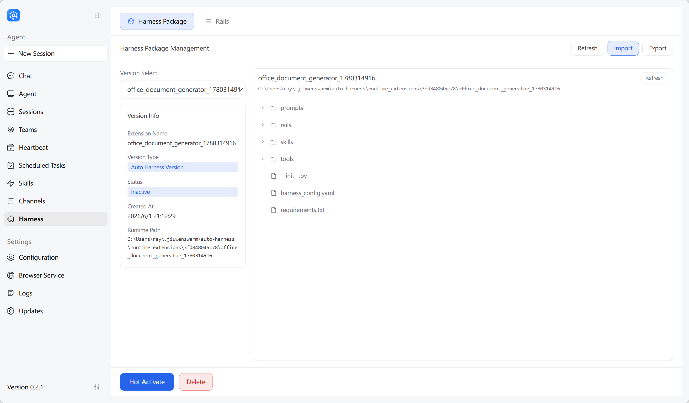

# Auto Harness

## Introduction

Auto Harness is an agent self-optimization solution built on openJiuwen Agent Core, provided by the JiuwenSwarm platform. It brings "post-training" to the Harness layer — enabling agents to autonomously analyze gaps in their own Harness, generate improvement plans, implement and verify changes, and deliver results as PRs or runtime packages.

> **Agent = Model + Harness**: The LLM provides model capability, but the Harness (prompts, tools, rails, skills, and orchestration logic) determines how the agent actually performs. Auto Harness automates the optimization of the Harness itself.

---

## Features

### 1.1 Background & Motivation

Harness is the "body" of an Agent — the LLM provides model capability, but the Harness (prompts, tools, rails, skills, and orchestration logic) determines how the agent actually performs. If the LLM is the brain, the Harness is the torso and limbs that execute capabilities in practice.


Key Harness components that need optimization:

| Component | Description |
|-----------|-------------|
| **Prompts** | System prompts defining behavior patterns and role |
| **Tools** | Available tool set affecting capability boundaries |
| **Rails** | Runtime safety guards controlling behavior boundaries |
| **Skills** | Reusable skill templates encapsulating domain capabilities |

Traditional tuning has been a manual, experience-driven process — adjusting prompts, swapping tools, and adding rails requires repeated trial and error. Hard-won tuning knowledge rarely transfers across scenarios; changing a domain or client often means starting over.

Auto Harness automates this: agents generate their own benchmarks, run evaluations, identify weaknesses, implement fixes, and verify results — forming a complete autonomous optimization loop.

### 1.2 Two-Layer Architecture

openJiuwen designs the Harness as two layers, with Auto Harness optimizing both:

| Layer | Role | Contents | Optimization Method |
|-------|------|----------|-------------------|
| **Meta Harness** | Common foundation, shared by all agents | Prompts, tools, rails, skills | Modify source → Submit PR → Merge |
| **Expert Harness** | Pluggable domain extensions, loaded on demand | Office, compliance, content production expertise | Generate Package → Hot-load → Use immediately |

Safety boundary between layers: Meta layer changes require PR review before merging; Expert layer packages take effect immediately via hot-loading with no service restart.

### 1.3 Two Pipelines

#### Meta Evolve Pipeline (Base Layer)

Benchmarks against industry best practices, automatically analyzes gaps and improves underlying Harness capabilities.

```
Research → Assess current state → Create optimization plan → Implement in isolated worktree → CI verification (auto-fix on failure) → Commit → Publish PR → Extract learnings
```

Typical scenario: Benchmarking Claude Code's context compression features, automatically absorbing implementation approaches and submitting a PR.

#### Extended Evolve Pipeline (Extension Layer)

Injects new domain capabilities into agents, generating hot-loadable runtime extension packages.

```
Assess extension gaps → Design extension plan → Parallel build/verify (with dependency wave orchestration) → Merge multiple extensions → User confirmation → Hot-load activation
```

Typical scenario: Enhancing an agent's office productivity (PPT/Word/Excel processing, sensitive info detection). Multiple extension packages can be stacked and mounted on the same agent simultaneously.


### 1.4 Core Mechanism: Evaluation-Driven Closed-Loop

Both pipelines share the same core mechanism:

```
Evaluate → Identify gaps → Plan improvements → Implement changes → Re-evaluate
```

Key capabilities:

- **Worktree isolation**: Each task executes in an isolated Git Worktree, separate from the main workspace; the Assess phase uses a read-only snapshot
- **Auto-fix loop**: Automatically enters a fix cycle on CI failure until passing
- **Scheduled runs**: Configure scheduled tasks (e.g., every 48 hours) to automatically benchmark competitors, evaluate, improve, and submit PRs
- **Experience accumulation**: Insights and lessons from optimization are stored for future reference

---

## Interactive Usage

### 2.1 TUI Commands

Manage Auto-Harness task creation, execution, and monitoring via the `/auto-harness` command in the JiuwenSwarm TUI.

#### Command Overview

| Command | Usage | Description |
|---------|-------|-------------|
| **run** | `run [--pipeline <pipeline>] <query>` | Execute a one-time optimization task |
| **schedule** | `schedule start --interval <hours> [--pipeline <pipeline>] <query>` | Create a scheduled optimization task |
| | `schedule list` | List all scheduled tasks |
| | `schedule status <task_id>` | View task details |
| | `schedule logs <task_id> [--history <n>]` | View task execution logs |
| | `schedule cancel <task_id>` | Cancel a scheduled task |
| | `schedule delete <task_id>` | Delete a scheduled task |
| **issue** | `issue fix <issue_numbers>` | Create a fix task for specified GitCode issues |
| | `issue scan [--repo <repo>] [--page <n>] [--labels <labels>] [--force-refresh]` | Scan repository GitCode issues |
| | `issue status` | View issue processing status |
| | `issue delete <issue_numbers>` | Delete issue processing records |

#### Pipeline Types

| Parameter Value | Description |
|----------------|-------------|
| `optimize_expert_harness` | Expert Harness optimization (generate local extension package, hot-load activation) |
| `optimize_meta_harness` | Meta Harness optimization (modify source code → submit PR, requires git configuration) |

During pipeline execution, extension packages are **automatically activated by default** — no manual confirmation needed.

#### Configuration Requirements

The `optimize_meta_harness` pipeline requires the following fields (configure via `/config edit` or `/status config`):

| Field | Required | Description |
|-------|----------|-------------|
| `git.user_name` | Yes | Git commit username |
| `git.user_email` | Yes | Git commit email |
| `gitcode.access_token` | No | GitCode API Token (can also be provided via `GITCODE_ACCESS_TOKEN` environment variable) |

If configuration is incomplete, the system will prompt for missing fields when creating a task.

---

#### `/auto-harness run` — One-Time Execution

Execute a single Auto-Harness optimization task.

**Usage:**

```
/auto-harness run [--pipeline <pipeline>] <query>
```

**Flow:**

1. If `--pipeline` is not specified, interactively select the pipeline type
2. If `optimize_meta_harness` is selected, automatically check git configuration completeness
3. Create and execute a one-time task
4. Automatically enter real-time log tailing mode (similar to `tail -f`)

**Examples:**

```
/auto-harness run Optimize database query performance
/auto-harness run --pipeline optimize_expert_harness Improve context compression capabilities
```

---

#### `/auto-harness schedule` — Scheduled Task Management

Manage scheduled Auto-Harness optimization tasks.

**Subcommands:**

| Command | Description |
|---------|-------------|
| `schedule start --interval <hours> [--pipeline <pipeline>] <query>` | Create a scheduled task |
| `schedule list` | List all tasks |
| `schedule status <task_id>` | View task details |
| `schedule logs <task_id> [--history <n>]` | View task execution logs |
| `schedule cancel <task_id>` | Cancel a task |
| `schedule delete <task_id>` | Delete a task |

##### schedule start — Create Scheduled Task

```
/auto-harness schedule start --interval <hours> [--pipeline <pipeline>] <query>
```

| Parameter | Required | Description |
|-----------|----------|-------------|
| `--interval` / `-i` | Yes | Execution interval (hours), options: 1, 2, 4, 8, 12, 24 |
| `--pipeline` / `-p` | No | Pipeline type, interactively selected if not specified |
| `<query>` | Yes | Optimization goal description |

Flow:
1. If pipeline is not specified, interactively select
2. If `optimize_meta_harness` is selected, check git configuration
3. Interactively confirm whether to execute immediately once
4. Create the scheduled task

Examples:

```
/auto-harness schedule start --interval 4 Improve context compression capabilities
/auto-harness schedule start -i 2 -p optimize_meta_harness Submit database optimization PR
```

##### schedule logs — View Execution Logs

```
/auto-harness schedule logs <task_id> [--history <n>]
```

| Mode | Description |
|------|-------------|
| Default | Real-time log tailing of current run (`tail -f` mode), supports Ctrl+C to interrupt |
| `--history <n>` | View historical execution logs, `n` is the history index (0 = most recent) |

---

#### `/auto-harness issue` — GitCode Issue Auto-Processing

Manage automatic GitCode issue processing: scan issue trackers, create fix tasks, view processing status, and clean up records.

Requires `git.user_name`, `git.user_email` and `gitcode.access_token` (or `GITCODE_ACCESS_TOKEN` environment variable).

**Subcommands:**

| Command | Description |
|---------|-------------|
| `issue fix <issue_numbers>` | Create fix tasks for specified GitCode issues |
| `issue scan [--repo <repo>] [--page <n>] [--labels <labels>] [--force-refresh]` | Scan repository GitCode issues |
| `issue status` | View issue processing status |
| `issue delete <issue_numbers>` | Delete issue processing records |

##### issue fix — Create Fix Task

```
/auto-harness issue fix <issue_numbers>
```

| Parameter | Description |
|-----------|-------------|
| `<issue_numbers>` | Issue numbers, comma-separated for multiple (e.g., `1272,1271,1270`) |
| `--repo <repo>` | Target repository, supports `jiuwenswarm` / `agent_core`, interactively selected if not specified |

Issues already associated with an open or merged PR are automatically skipped.

Examples: `/auto-harness issue fix 1286`, `/auto-harness issue fix 1272,1271,1270`

##### issue scan — Scan Issues

```
/auto-harness issue scan [--repo <repo>] [--page <n>] [--labels <labels>] [--force-refresh]
```

| Parameter | Description |
|-----------|-------------|
| `--repo <repo>` | Target repository, interactively selected if not specified |
| `--page <n>` | Page number, default 1 |
| `--labels <labels>` | Label filter, comma-separated, defaults to bug-type labels only |
| `--force-refresh` | Force refresh from GitCode API (uses cache by default) |

Displays: issue number, title, labels, difficulty assessment, last updated time.

##### issue status / delete

```
/auto-harness issue status
/auto-harness issue delete <issue_numbers>
```

- `issue status`: Displays all issue processing records in a table (number, status, stage, progress, details)
- `issue delete`: Deletes processing records for specified issues

### 2.2 Web-based Package Management

Extension artifacts generated by the Extended Evolve Pipeline are managed as **Harness Packages** through a visual Web interface for import, export, and hot-load activation.

#### What is a Package

A Harness Package is a hot-loadable extension component that can inject Tools, Skills, and Rails into a running agent **without service restart**.

#### Key Operations

| Operation | Description |
|-----------|-------------|
| **Activate** | Activate manually from the package list; multiple packages can be active simultaneously with all injected capabilities stacking together |
| **Deactivate** | Disable a specific package; its injected capabilities are immediately removed from the agent |
| **Deactivate All** | One-click to disable all active packages, restoring the agent to its original state |
| **Delete** | Permanently remove a specific package from the system |
| **Export** | Export a package to a file for backup or installation on another agent/environment |
| **Import** | Import a package from a file, enabling capability sharing and cross-environment migration |

#### Activation Flow

```
Extension verified → Preview component manifest → Dynamically injected → Takes effect immediately
```



---

## FAQ

### Q1: How to choose between Meta Harness and Expert Harness?

- **Meta Harness**: For improving foundational capabilities — optimizing prompts, adjusting tool config, refining rails. Changes require PR review.
- **Expert Harness**: For introducing new domain capabilities — injecting new tools, skills, and rails. Packages are hot-loaded immediately after generation.

### Q2: How is a Harness Package different from a regular Python package?

Harness Packages are hot-loadable component packages injected at runtime via the `runtime_extension_loader` — no service restart needed.

---
