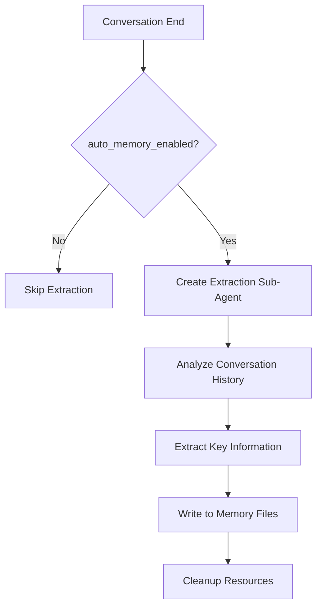

# Auto Memory

Auto Memory is JiuwenSwarm's post-conversation memory extraction feature. After each conversation ends, it automatically analyzes the dialogue content, extracts information worth retaining long-term, and writes it to memory files with project-isolated storage.

---

## Overview

- **Automatic Extraction**: After conversation ends, the system automatically analyzes and extracts key information without user intervention
- **Project Isolation**: Each project stores memory independently, avoiding cross-project information confusion
- **Configurable Toggle**: Flexible enable/disable via config file or TUI command

---

## Enabling

### Config File

Set `auto_memory_enabled` in `config.yaml`:

```yaml
# Auto Memory: Automatically extract memories after conversation ends, stored per-project
auto_memory_enabled: true
```

### TUI Command

Toggle via `/memory` command in TUI terminal:

```
/memory          # Enter memory management interface
/memory toggle   # Show all memory toggles
/memory toggle auto_memory_enabled   # Toggle auto memory switch
```

In the interactive interface, select the `Auto-memory: on/off` option to toggle.

---

## Storage Path

Auto Memory stores memories isolated by project path:

```
~/.jiuwenswarm/projects/{sanitized-project-path}/memory/
├── MEMORY.md                    # Long-term memory
├── YYYY-MM-DD.md                # Daily memory
└── consolidated_{hash}.md       # Consolidated memory (optional)
```

Where `{sanitized-project-path}` is the project path after safety processing (special characters replaced with underscores).

---

## How It Works

### Extraction Timing

Auto Memory triggers at the following moments:

1. **Conversation End**: After each user-Agent conversation ends, the system checks if memory extraction is needed
2. **Non-streaming Request**: Triggers after `process_message` returns result
3. **Streaming Request**: Triggers after `process_message_stream` completes

### Extracted Content

The system analyzes conversation content through a sub-Agent, extracting the following types of information:

| Information Type | Description | Example |
|-----------------|-------------|---------|
| User Preferences | Preferences or habits explicitly expressed by user | "User prefers pytest framework" |
| Project Decisions | Technical choices, architecture decisions | "Project adopts FastAPI as backend framework" |
| Key Facts | Facts that need long-term retention | "Database connection string stored in .env file" |
| Problem Solutions | Debugging process, root causes | "Login failure caused by JWT expiry time misconfiguration" |

### Extraction Flow



---

## Configuration

| Config Item | Description | Default Value |
|------------|-------------|---------------|
| `auto_memory_enabled` | Whether to enable auto memory extraction | `false` |

---

## TUI Interaction

### `/memory` Command

Enter `/memory` command in TUI to display memory management interface:

```
Memory
Select a memory file to edit:

  Auto-memory: on          [Press Enter to toggle]
  Project memory           Checked in at ./JIUWENSWARM.md
  Local memory             Saved in ./JIUWENSWARM.local.md
  User memory              Saved in ~/.jiuwen/JIUWENSWARM.md
  Open auto-memory folder
```

Select the `Auto-memory: on/off` row and press Enter to toggle auto memory.

---

## Notes

1. **First Enable**: After first enabling auto memory, restart the session for it to take effect
2. **Storage Space**: Long-term use accumulates memory files; recommend periodic cleanup of outdated content
3. **Sensitive Information**: System automatically filters passwords, API keys, etc. (via `memory.forbidden_memory_definition` config)
4. **Performance Impact**: Extraction runs asynchronously in background, does not affect conversation response speed

---

## See Also

- [Configuration](Configuration.md) — Config file details
- [Quick start (TUI)](Quickstart_tui.md) — TUI command usage