# China Channels

JiuwenSwarm supports integration with multiple Chinese chat platforms. Below are detailed configuration instructions for each channel.

## Xiaoyi

[Demo video](../assets/videos/xiaoyi_channel.mp4)

### 1. Create a Xiaoyi Agent

Create a **JiuwenSwarm-mode** agent on the [Xiaoyi Open Platform](https://developer.huawei.com/consumer/cn/hag/abilityportal/#/) to connect to your JiuwenSwarm service.

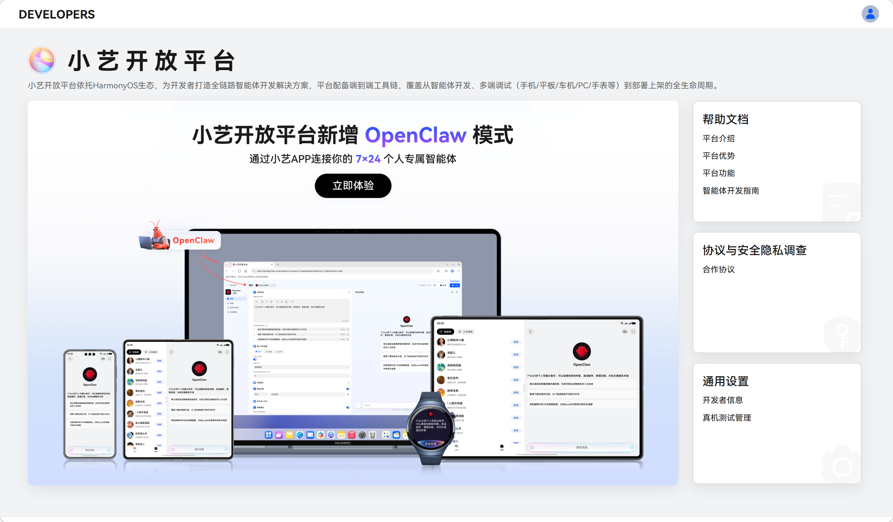

#### Step 1: Create a JiuwenSwarm-mode agent.


#### Step 2: Create credentials and whitelist

Click to create new credentials and **save the AK and SK**.

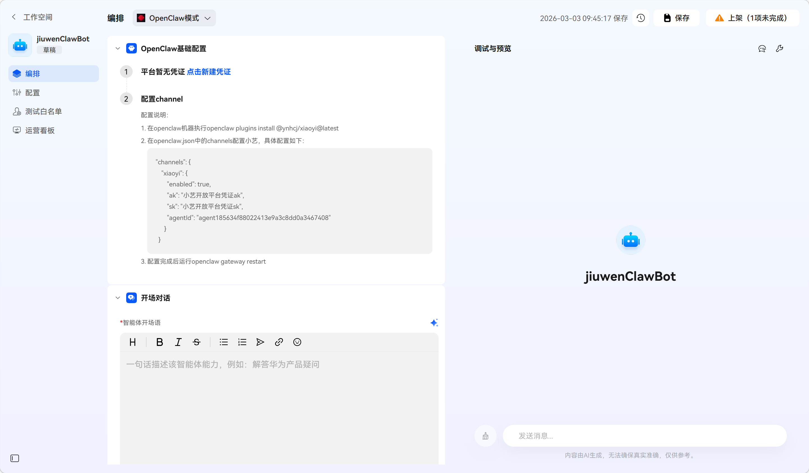


The Xiaoyi Open Platform provides on-device debugging capabilities. By configuring whitelist groups and adding user accounts, you can test the agent on HarmonyOS terminals. After successful addition and publishing, the agent can be used in the Xiaoyi app on the terminal.

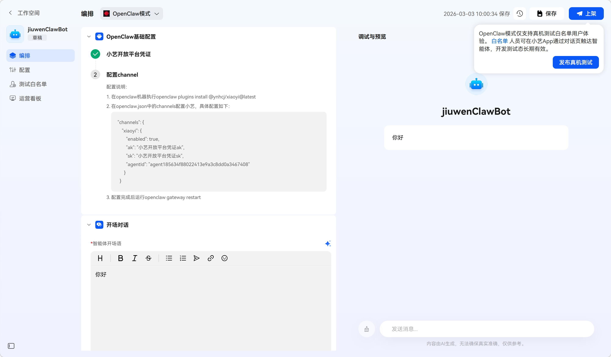


Select the new user group:


#### Step 3: Publish the agent

Fill in the opening dialogue and click the publish button:

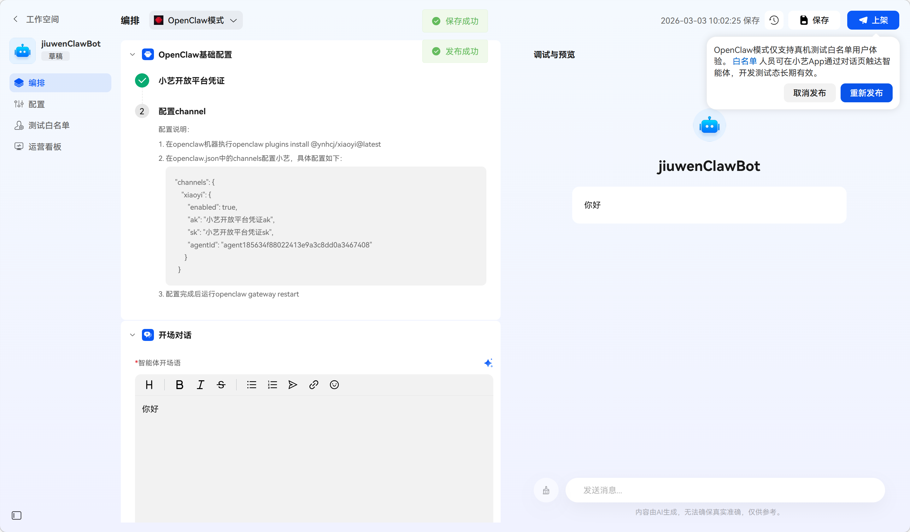

#### Step 4: Enable push notifications (optional)

Click to enable the trigger, fill in the name and save, then enter the apiID in JiuwenSwarm:

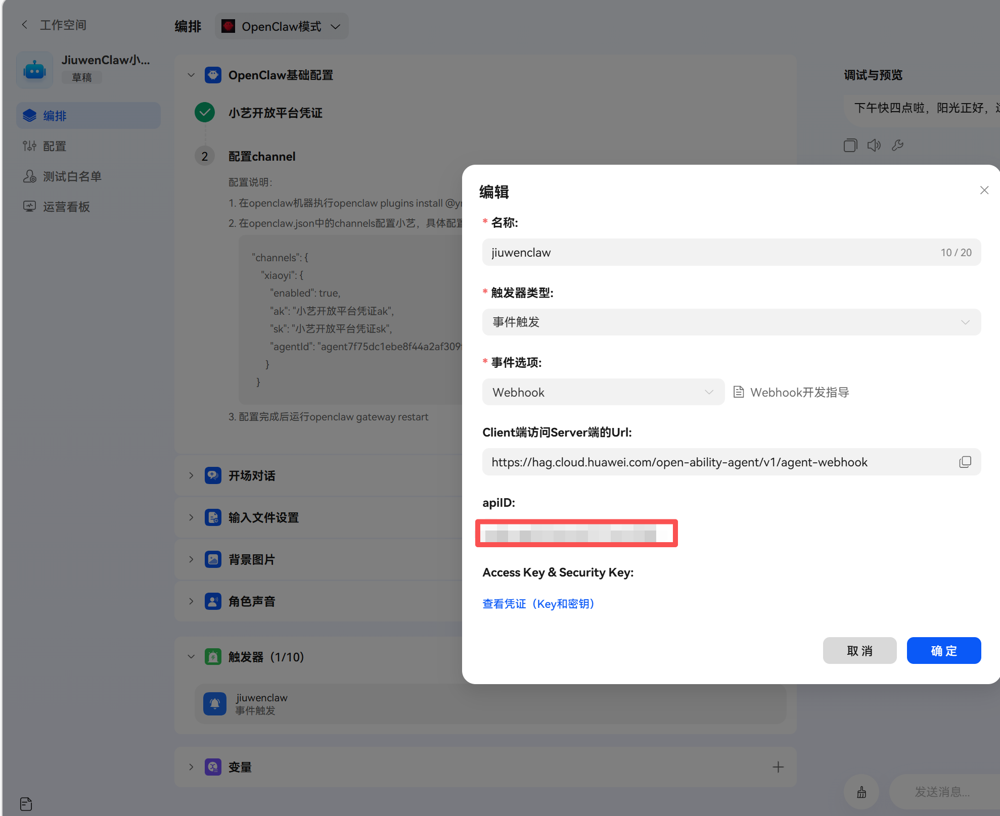

Click variable editing and enable the push_id system variable:

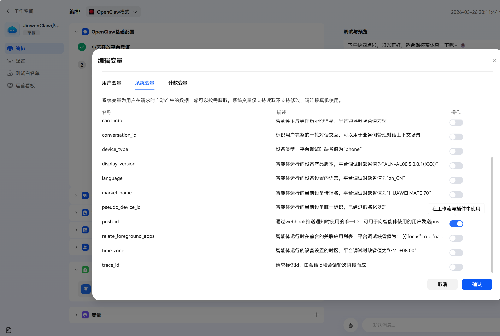

> 💡 **Note**: `api_id` is the API identifier of the trigger, and `push_id` is the identifier for receiving push messages. When enabling push notifications, both must be used together — neither can be omitted.

### 2. Bind the Channel

#### Option A: Web UI

Paste the **AK**, **SK**, and **agentId** from the Xiaoyi Open Platform into JiuwenSwarm's Xiaoyi channel, enable it, and save to start chatting. If push is enabled, you can also fill in the api_id (optional):

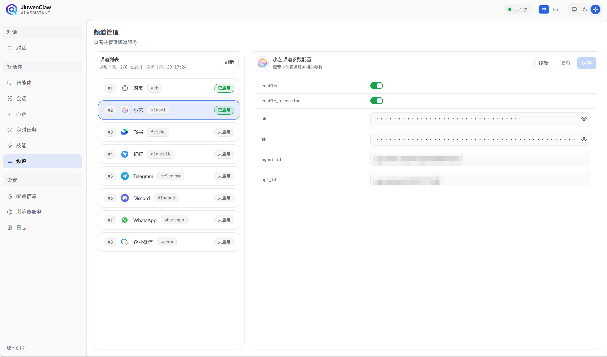

#### Option B: Edit config file

Edit `~/.jiuwenswarm/config/config.yaml`:

``````yaml
channels:
  xiaoyi:
    mode: xiaoyi_channel
    ak: "<ak from platform>"
    sk: "<sk from platform>"
    agent_id: "<your agent id>"
    api_id: "<trigger apiId>"
    push_id: "<trigger push_id (required when push notifications are enabled)>"
    uid: ""
    api_key: ""
    push_url: ""
    file_upload_url: ""
    phone_tools_enabled: false
    send_file_allowed: true
    enable_streaming: true
    enabled: true
``````

If the service is already running it will auto-reload; otherwise run `jiuwenswarm-start`.

### 3. Chat with the Agent

**Option 1:** Chat directly on the web with the agent application

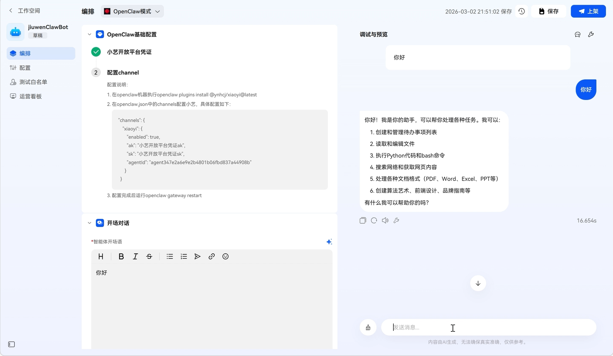

**Option 2:** On a HarmonyOS terminal, open the Xiaoyi app, find the published agent, and chat directly


---

## Feishu (Lark)

### 1. Create a Feishu Custom App

1. Visit [Feishu Open Platform](https://open.feishu.cn/) and sign in.

2. In the developer console, click **Create custom app**.

3. Fill in the app name, description, and upload an icon, then click **Create**.

   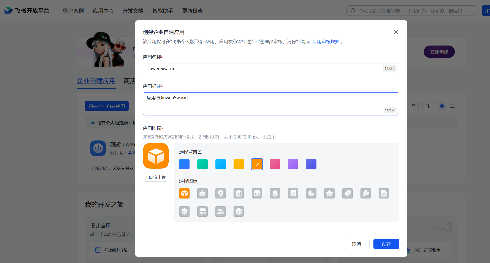

### 2. Add Bot Capability

1. In the app configuration page, select **Add capability** from the left sidebar.

2. Under **Bot**, click **Add**.

   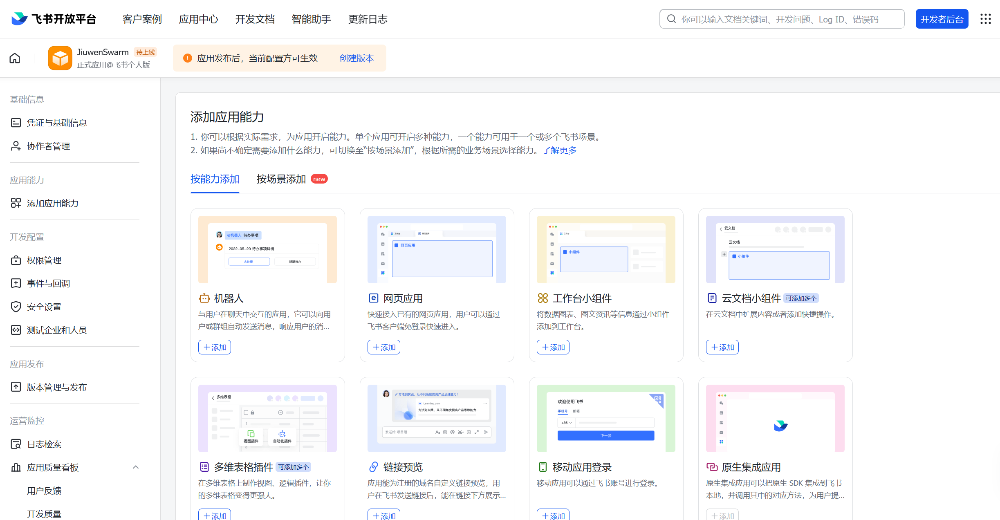

### 3. Save App Credentials

1. Open the Feishu bot admin console.

2. Copy **App ID** and **App Secret** into JiuwenSwarm's Feishu channel, enable, and save.

   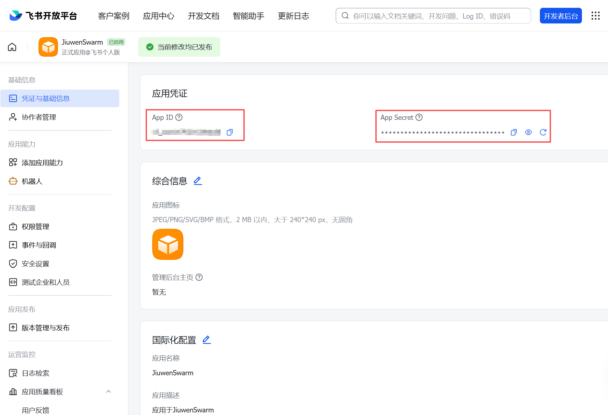

   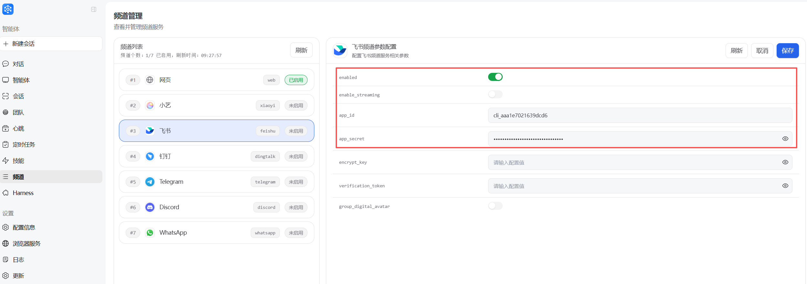

### 4. Configure Permissions

1. Select **Permission management** → **API permissions** from the left sidebar.

2. Search and enable the following key permissions (for sending and receiving messages):
   - `im:message:send`: Send messages as the app
   - `im:message.p2p_msg:readonly`: Get private messages sent to the bot
   - `im:message.group_at_msg:readonly`: Receive group chat @bot message events
   - `im:resource:upload`: Upload images and files
   - `contact:user.employee_id:readonly`: Get user ID information

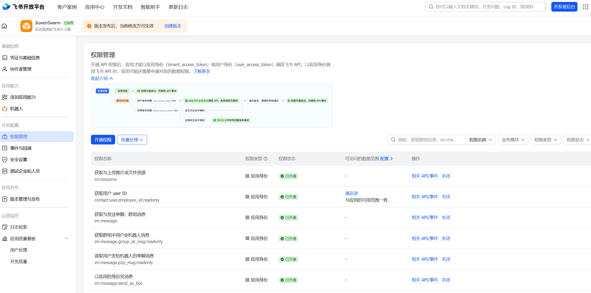

### 5. Configure Event Subscription (Receive Messages)

1. Select **Events & callbacks** from the left sidebar.

2. **Add events**:
   - `im.message.receive_v1` (receive message event)
   - `im.message.message_read_v1` (message read)

3. **Add callback**:
   - `card.action.trigger` (card interaction callback)

4. (Optional) **Configure encryption policy**: If encryption is enabled, save the **Encrypt Key**.

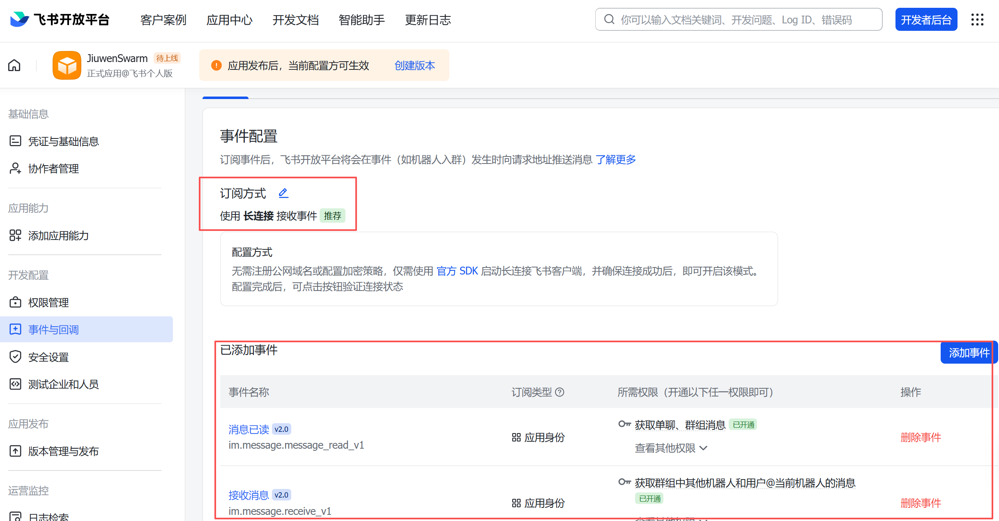

### 6. Publish the App

1. Select **Version management & release** from the left sidebar, click **Create version**.

2. Fill in the version number, update notes, and select the availability scope.

3. Submit for review. If the enterprise has review exemption enabled, the version goes live immediately.

4. Sign in to the Feishu app with the account that submitted the app to see the published chat bot.

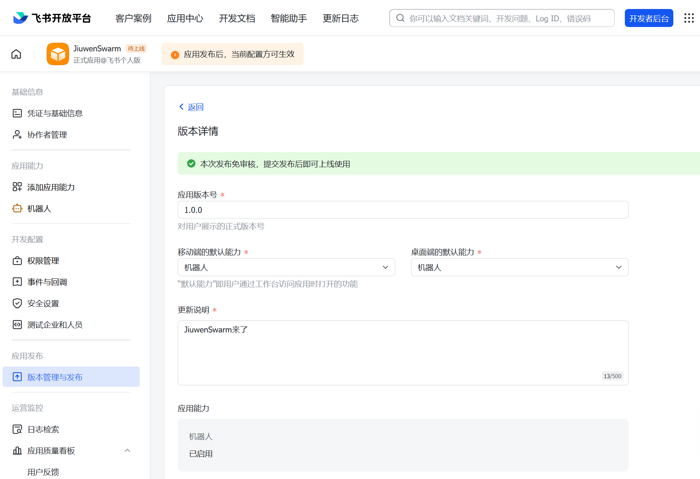

### 7. Add Bot to a Group (Optional)

1. Open the Feishu client and enter the group where you want to add the bot.

2. Click **Group settings** → **Group bots** → **Add bot**, search for your app name and add it.

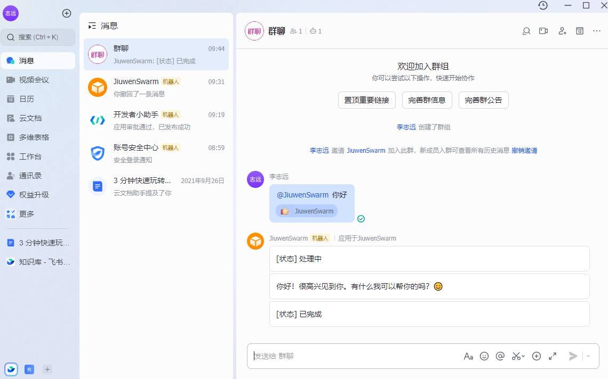

### 8. Configure Feishu Channel

After starting the frontend service, open **Channels → Feishu**, enable it, and configure the **App ID** and **App Secret** saved in step 3.

### 9. Enable Group Digital Avatar (Optional)

After completing the basic Feishu bot setup, you can enable the digital avatar feature so the bot automatically replies in group chats on behalf of a designated user.

> In Feishu, the digital avatar responds when someone **@mentions the bot**, **@mentions the represented user**, or **mentions the user's name** in the message text.

#### Prerequisites

- Feishu bot has been created, published, and added to the target group (see step 7)

#### Configuration Steps

1. In the JiuwenSwarm channel management page, open the Feishu channel settings and enable the **`group_digital_avatar`** toggle. Configure **`my_user_id`** and **`bot_name`**.

   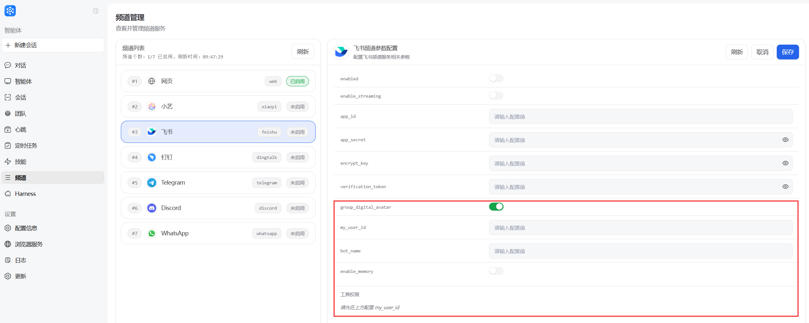

2. Set **`my_user_id`** (required): the Feishu `open_id` of the user this avatar represents. Obtain it as follows:
   - Log in to the Feishu API Debug Console, go to the [Send Message API](https://open.feishu.cn/document/server-docs/im-v1/message/create)
   - Set `receive_id_type` to **open_id**
   - Click **Quick Copy open_id**, select the target user in the popup, and the obtained open_id is the `my_user_id`

   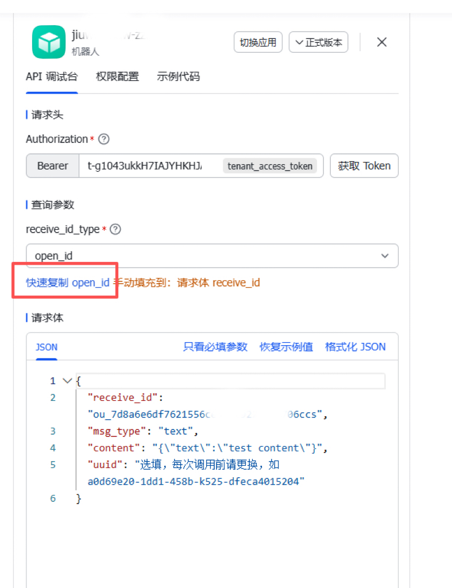

   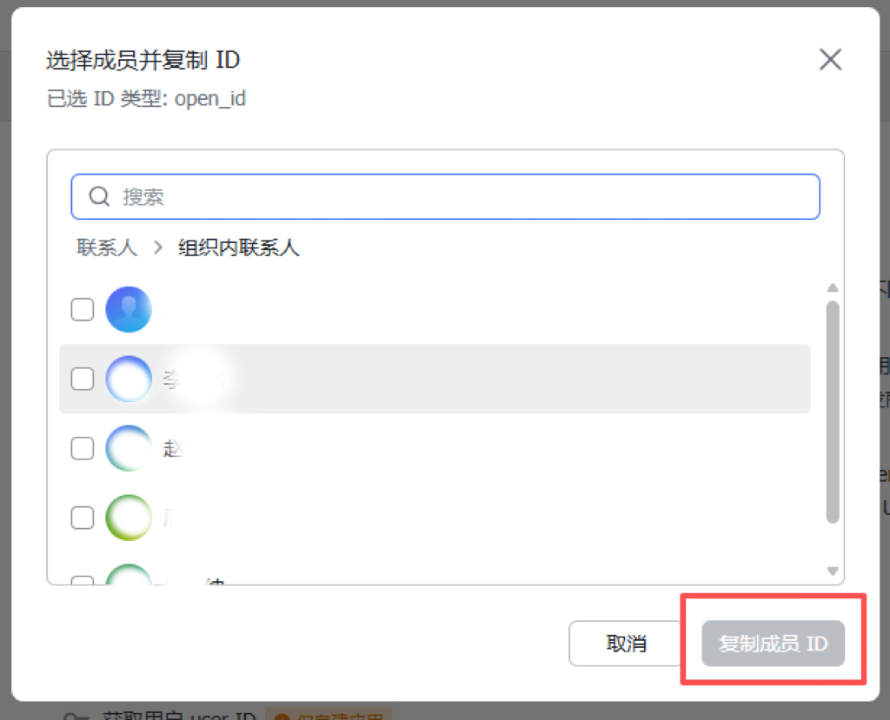

3. Set **`bot_name`**: the bot's display name in the group, used for @mention detection.

4. (Optional) Enable **`enable_memory`** to let the bot read and search local memory files in group chats.

5. **Configure tool / path permissions**: Pre-configure which tools are allowed and which paths are accessible.

   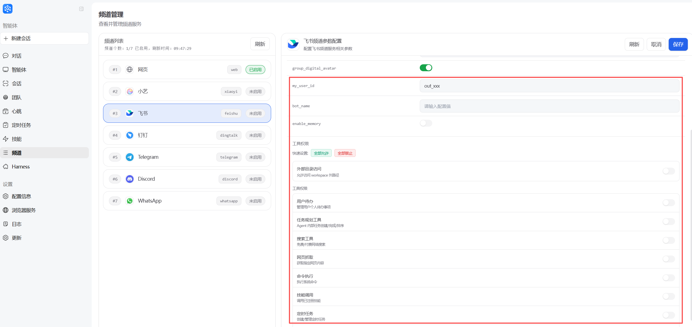

You can also configure via `~/.jiuwenswarm/config/config.yaml`:

``````yaml
channels:
  feishu:
    app_id: "your App ID"
    app_secret: "your App Secret"
    enabled: true
    group_digital_avatar: true
    my_user_id: "ou_xxxx"
    bot_name: "bot name"
    enable_memory: false

permissions:
  owner_scopes:
    feishu:
      "ou_xxxx":
        defaults:
          "*": "allow"
        tools:
          bash:
            "*": "deny"
            patterns:
              "git status *": "allow"
              "git log *": "allow"
          write:
            "*": "deny"
  deny_guidance_message: "This tool is not authorized in digital avatar mode."
``````

6\. The Feishu bot needs the following additional permissions:

   - `im:message.group_msg:readonly` - Retrieve all messages in the group
   - `contact:contact.base:readonly` - Retrieve basic contact information
   - `contact:user.base:readonly` - Retrieve basic user information
   - `im:message.p2p_msg:readonly` - Retrieve private messages sent to the bot

#### Fields

| Field | Description |
|:------|:------------|
| `group_digital_avatar` | Enable group digital avatar |
| `my_user_id` | **Required**: Feishu `open_id` of the represented user |
| `bot_name` | Bot display name in the group |
| `enable_memory` | Enable group chat memory |
| `owner_scopes` | Tool permissions scoped by `channel_id` + `user_id` |

### 10. Multiple Feishu Bots (`feishu_enterprise`)

Use `channels.feishu_enterprise` when one JiuwenSwarm instance must serve **multiple Feishu apps**.

Each bot is a separate channel; `channel_id` looks like `feishu_enterprise:<app_id>`.

Configure via `~/.jiuwenswarm/config/config.yaml`:

``````yaml
channels:
  feishu_enterprise:
    bot_a:
      app_id: "cli_xxx"
      app_secret: "xxx"
      encrypt_key: ""
      verification_token: ""
      allow_from: []
      enable_streaming: true
      chat_id: ""
      enabled: true
    bot_b:
      app_id: "cli_yyy"
      app_secret: "yyy"
      encrypt_key: ""
      verification_token: ""
      allow_from: []
      enable_streaming: true
      chat_id: ""
      enabled: true
``````

#### vs Single `feishu`

- `feishu`: single channel, `channel_id` is always `feishu`
- `feishu_enterprise`: multiple channels, each bot uses an independent `channel_id`
- In multi-bot scenarios, recent session information is tracked per bot

---

## DingTalk

### 1. Prerequisites

- Your account must be an **enterprise admin** or have **developer permissions**.
- The enterprise must have **DingTalk Developer Console** enabled.

### 2. Create an Internal App Bot

#### Step 1: Open the Developer Console

- Visit [https://open-dev.dingtalk.com](https://open-dev.dingtalk.com)
- After logging in, select **App development** → **Internal org apps** → **Create app**


#### Step 2: Fill in App Information

- App name: e.g. `JiuwenSwarm`
- App type: **Bot**


#### Step 3: Add Bot Capability

- After creation, open the app details page
- Click **Capabilities** → **Bot** → **Enable bot configuration**
- Fill in the bot name and intro


#### Step 4: Configure Message Receiving Mode

Select **Stream mode** (WebSocket long connection) — no public IP required.

### 3. Configure Permissions

On the **Permission management** page, enable the following permissions as needed:
- Send DM/group messages: `qyapi_robot_sendmsg`
- Lookup user by mobile: `topapi_v2_user_getbymobile`
- Send interactive cards: `Card.Instance.Write`
- Streaming card updates: `Card.Streaming.Write`

### 4. Publish the App & Bot

#### Step 1: Save and Publish the Bot

- On the bot configuration page, click **Save**
- Return to the app homepage, click **Version management & release** → **Publish**
- Fill in the version number, update log, visibility scope, etc.

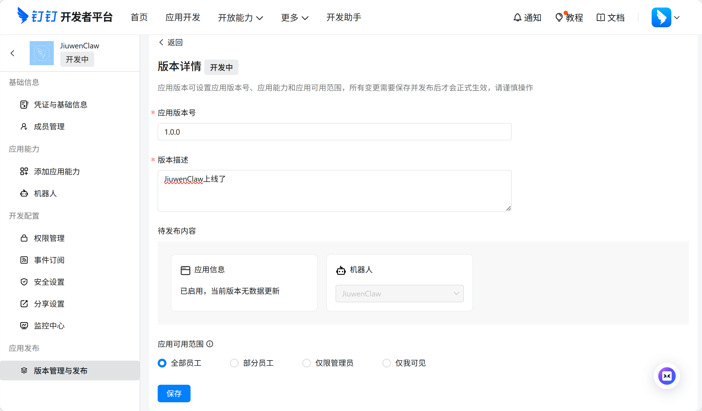

#### Step 2: Confirm Publishing

- Click **Confirm publish**
- Status changes to **Published** and the bot is ready to use

> 💡 After publishing, search the bot name in the DingTalk client to add it to group chats or DMs.

### 5. Configure DingTalk Channel

Copy **Client ID** and **Client Secret** from **Credentials & basic info**.

In JiuwenSwarm, open **Channels → DingTalk**, enable it, and configure **client_id** and **client_secret**, then save:


---

## WeCom (WeChat Work)

### 1. Create a Bot in WeCom

1. Open the WeCom client, go to **Workbench** → **Smart bot**, click **Create bot** → **Manual creation**

   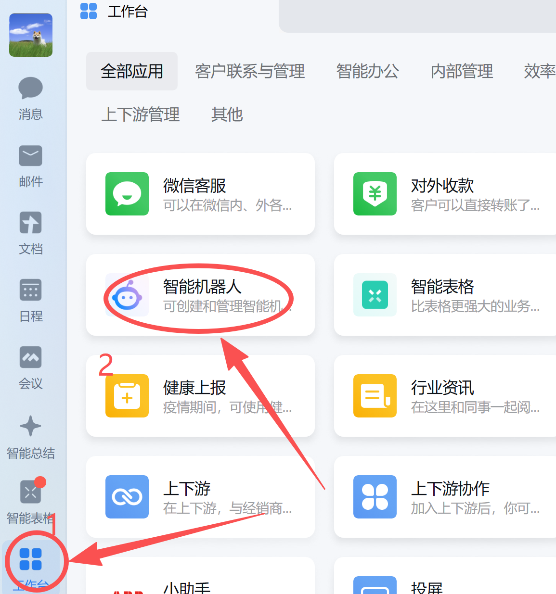

   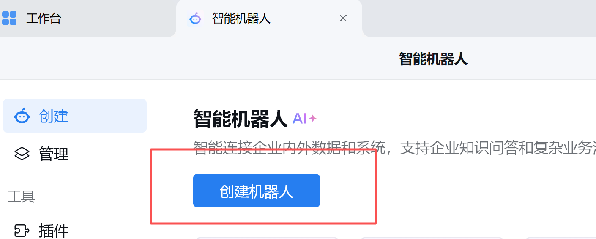

   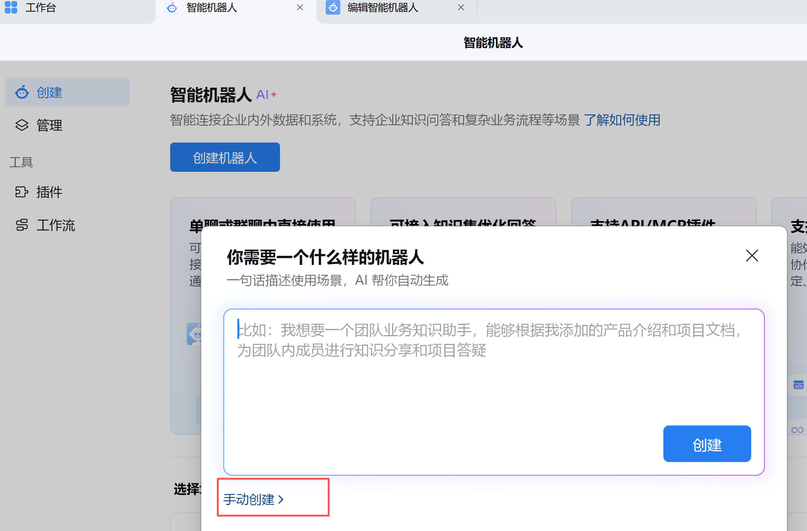

2. On the creation page, select **API mode**

   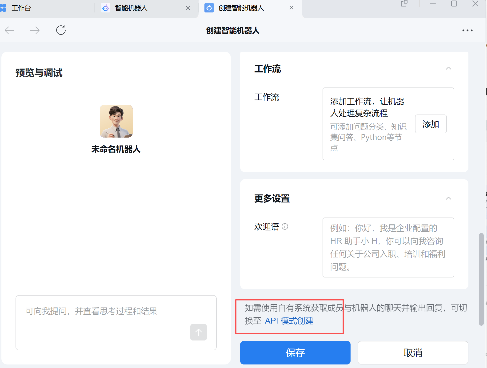

3. On the API configuration page, select **Long connection** as the connection method

   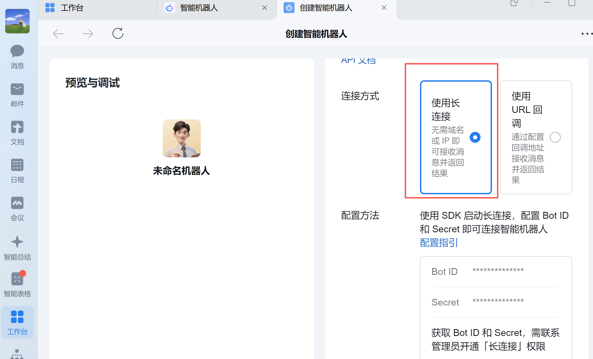

4. After configuration, the page will automatically generate and display **Bot ID** and **Secret** — save these securely

### 2. Link JiuwenSwarm

1. In JiuwenSwarm, open **Channels** and select **WeCom**.

2. Enter the **botId** and **secret** saved in step 1, then click save.

   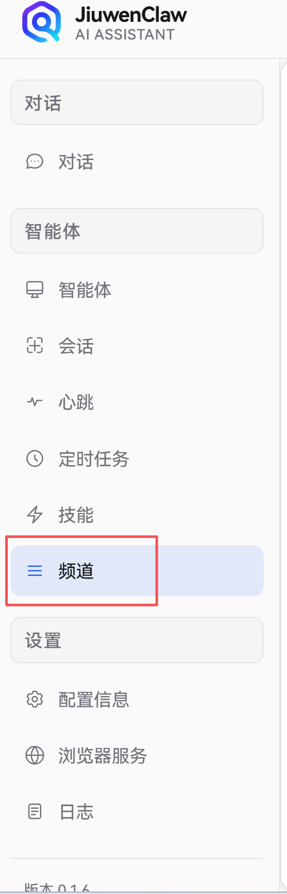

   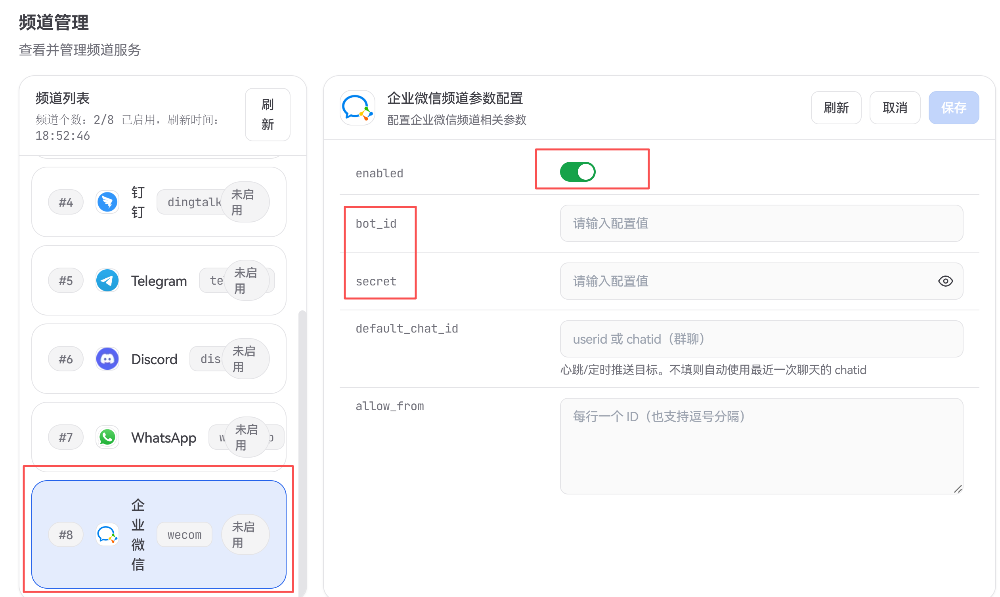

### 3. Chat with the WeCom Bot

> ⚠️ **Note**: If you cannot find the bot after configuration, navigate to: Workbench → Smart bot → Details → Use → Send message.

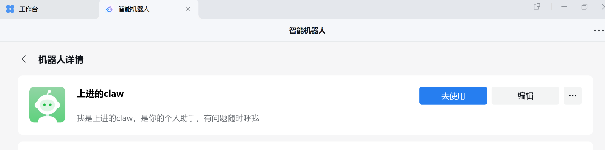

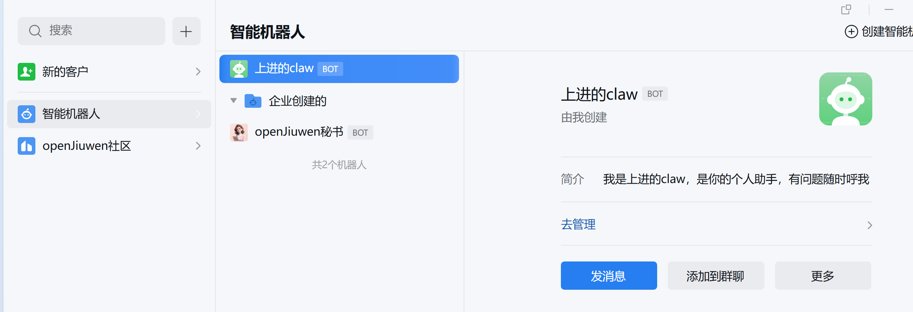

1. In WeCom, find the newly added bot, send a test message — receiving a reply means the connection is successful.

2. On mobile WeCom, send a test message — receiving a reply means the connection is successful.

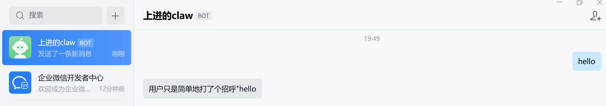

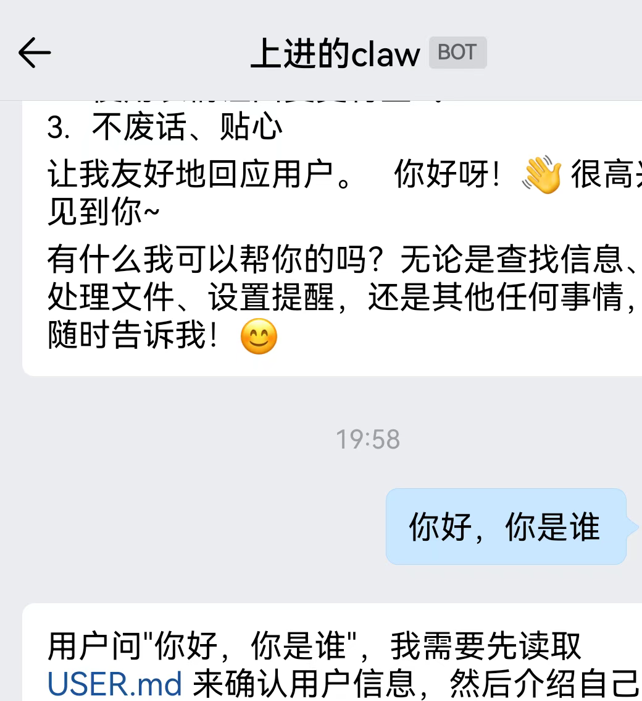

### 4. Enable Group Digital Avatar (Optional)

After completing the basic WeCom bot setup, you can enable the digital avatar feature.

> ⚠️ **Note**: In WeCom, group messages must **@mention the bot** for the bot to receive them.

#### Prerequisites

- WeCom bot has been created and linked to JiuwenSwarm
- Bot has been added to the target group

#### Configuration Steps

1. In the JiuwenSwarm channel management page, open the WeCom channel settings and enable the **`group_digital_avatar`** toggle. Before enabling the digital avatar, you need to have a private chat with the bot once; otherwise, an error `[AiBotSDK] [WARN] Reply ack error` will be reported.

   

2. Set **`my_user_id`** (required): the WeCom account of the user this avatar represents. Obtain it as follows:
   - Open the [WeCom Admin Console](https://work.weixin.qq.com/wework_admin/login)
   - Go to **Contacts** → **Organization** → **Department** → **Member details**
   - The **Account** field shown on the page is the `my_user_id`

   

   

3. Set **`bot_name`** (optional): the bot's display name in the group.

4. (Optional) Enable **`enable_memory`** to let the bot read and search local memory files in group chats.

5. **Configure tool / path permissions**: Pre-configure which tools are allowed.

   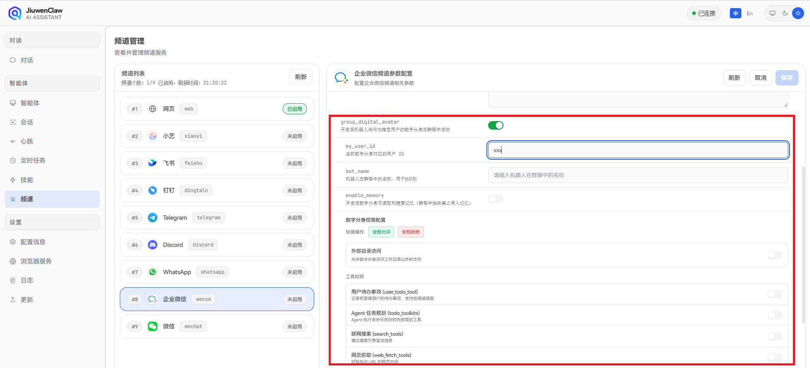

You can also configure via `~/.jiuwenswarm/config/config.yaml`:

``````yaml
channels:
  wecom:
    bot_id: "your Bot ID"
    secret: "your Secret"
    send_file_allowed: true
    enabled: true
    group_digital_avatar: true
    my_user_id: "account"
    bot_name: "bot name"
    enable_memory: false

permissions:
  owner_scopes:
    wecom:
      "account":
        defaults:
          "*": "allow"
        tools:
          bash:
            "*": "deny"
            patterns:
              "git status *": "allow"
              "git log *": "allow"
          write:
            "*": "deny"
  deny_guidance_message: "This tool is not authorized in digital avatar mode."
``````

#### Fields

| Field | Description |
|:------|:------------|
| `group_digital_avatar` | Enable group digital avatar |
| `my_user_id` | **Required**: WeCom account of the represented user |
| `bot_name` | Optional: bot display name in the group |
| `enable_memory` | Enable group chat memory |
| `owner_scopes` | Tool permissions scoped by `channel_id` + `user_id` |

---

## Personal WeChat

### 1. Prerequisites

- You are an **Android** or **iOS** user
- You are a **HarmonyOS** user and don't mind using **Zhuoyitong**
- Due to current Personal WeChat limitations, scheduled tasks cannot be sent after a long period of inactivity

> 💡 **Tip**: After a user sends a message to ClawBot, the app can send up to **10** independent messages.

### 2. Android or iOS Setup

#### Step 1: Upgrade WeChat Version

In WeChat, go to **Me** → **Settings** → **About WeChat** → **Version Update**:
- iOS: upgrade to the latest version
- Android: upgrade to the latest version

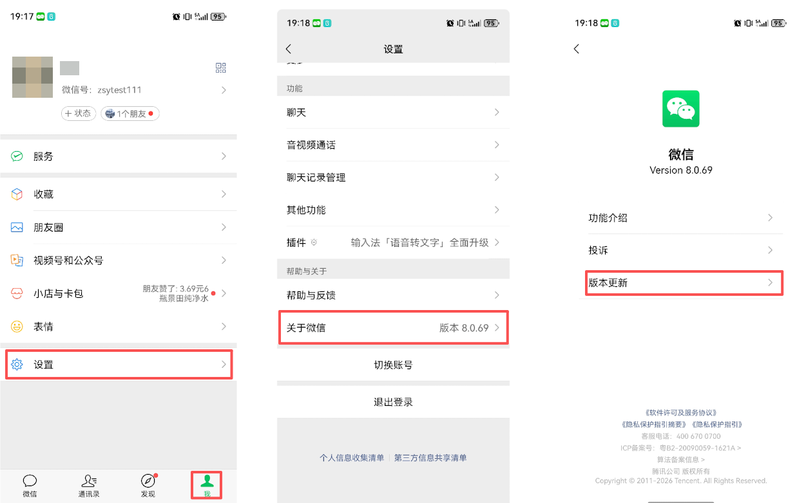

#### Step 2: Scan QR Code to Connect

- Open the latest version of JiuwenSwarm frontend, click **Channels** → **WeChat**, enable the WeChat configuration and save. A **QR code** will appear.

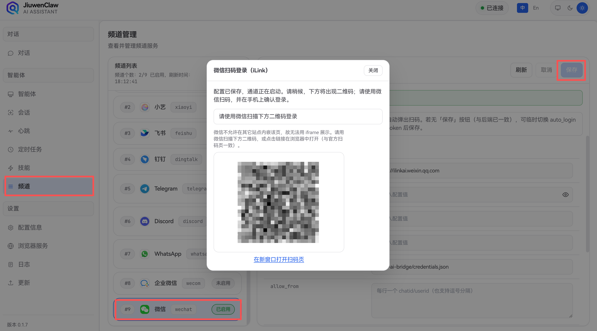

- Open WeChat on your phone, tap the **+** → **Scan**, scan the QR code to complete the connection.

### 3. HarmonyOS Setup

Since the HarmonyOS WeChat version does not yet support the **ClawBot** feature, you can connect through **Zhuoyitong**:

#### Step 1: Install WeChat Dual Account

- Download **WeChat Dual Account** through **Zhuoyitong** and log in to WeChat again.

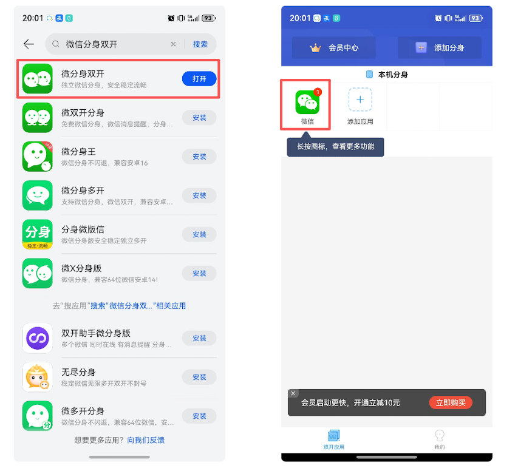

#### Step 2: Upgrade & Connect

- Follow the same upgrade and connection steps as in **Android / iOS Setup**.