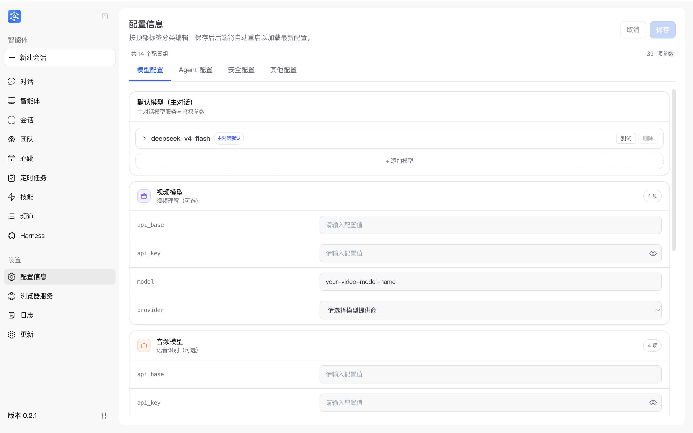
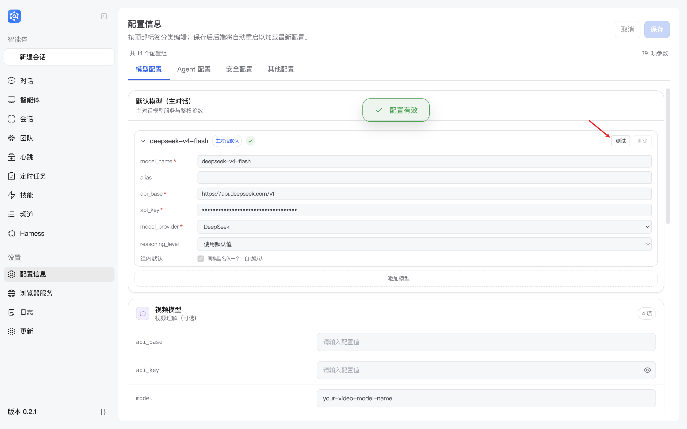
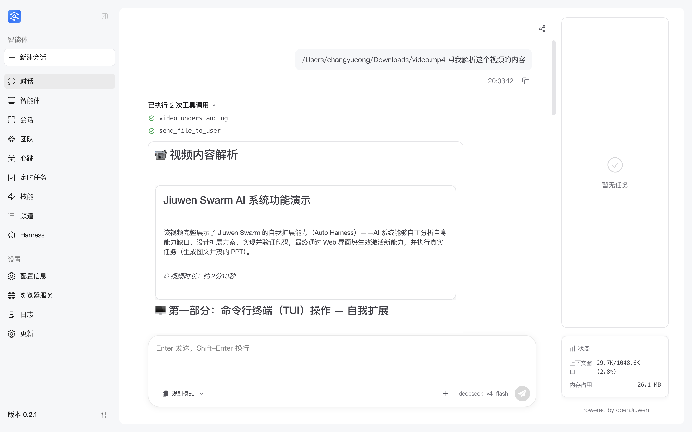
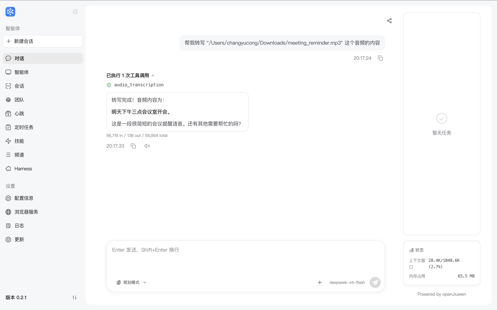
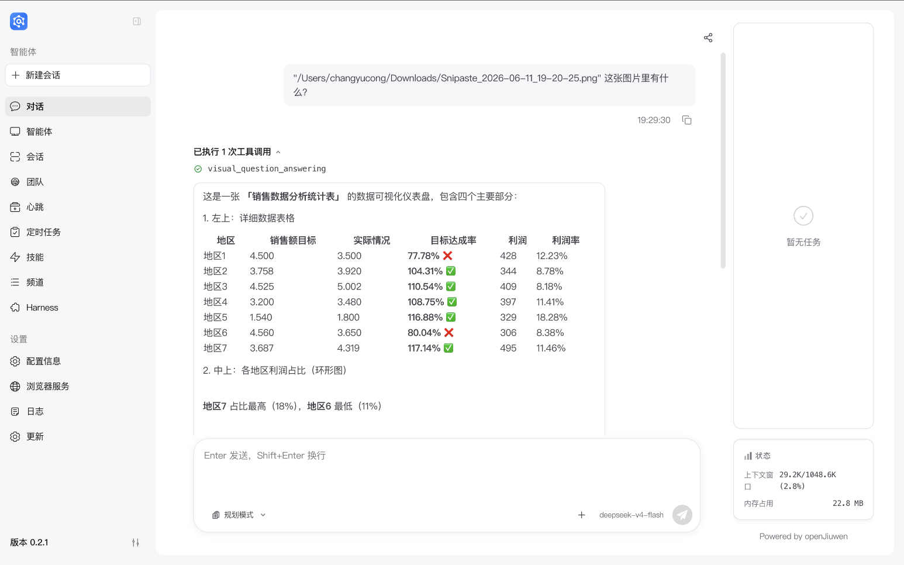
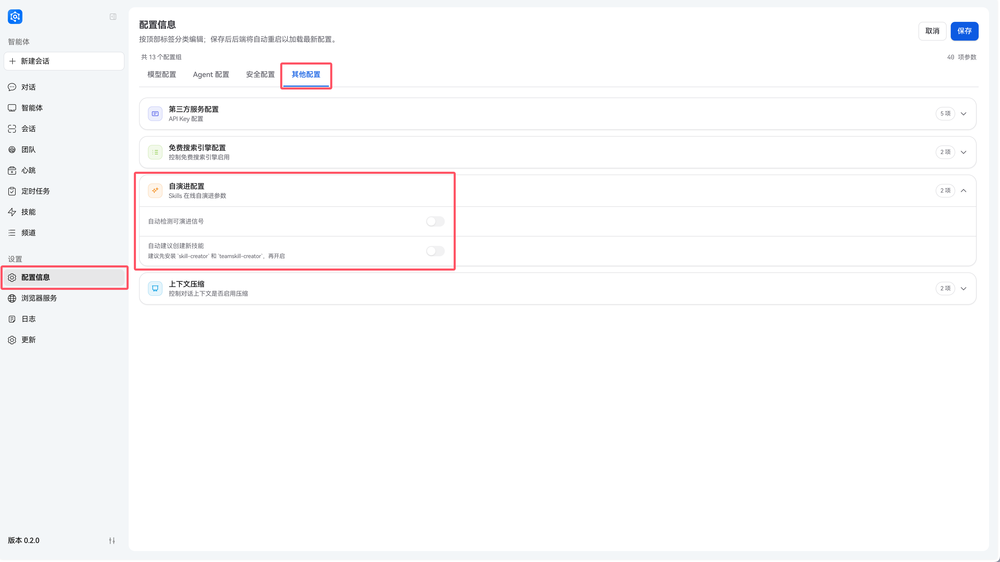
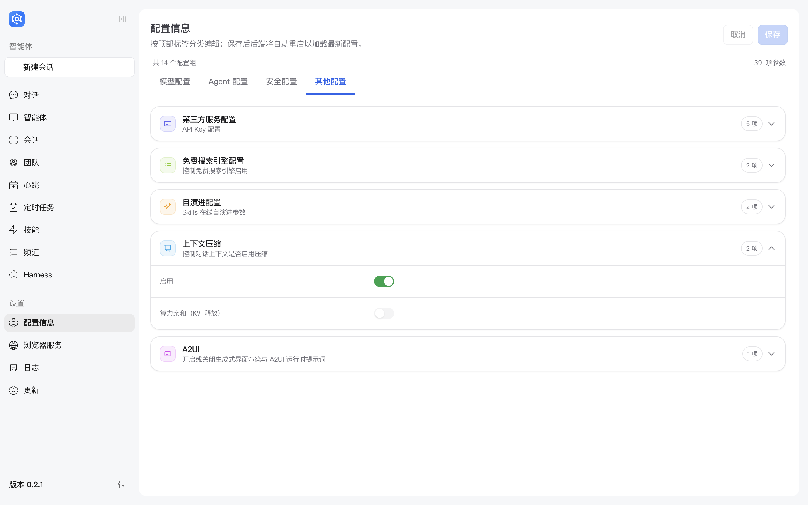
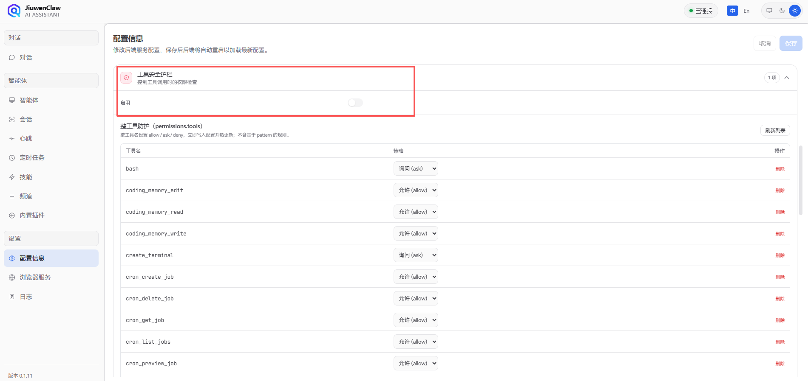

# Configuration Information

JiuwenSwarm configuration serves as the foundational setup for your interactions with the agent. Proper configuration allows you to connect to various model services, enable multimodal capabilities, integrate third-party services, and adjust system behavior parameters.

This document details each configuration option in the JiuwenSwarm frontend panel to help you get started quickly and fully leverage the system's capabilities.

---

## 1. Configuration Entry

Open **Configuration** from the left navigation bar to view and edit settings for models, third-party services, free search, and more. Click **Save** after changes; whether you need to wait for services to become ready depends on your deployment.



The configuration panel contains the following main sections:

- **Model Configuration**: Default chat model, video/audio/vision models (see [2. Model Configuration](#2-model-configuration))
- **Embedding Configuration**: Vector embedding service (see [3. Embedding Configuration](#3-embedding-configuration))
- **Third-Party Services**: Jina, Bocha, Serper, Perplexity, GitHub, etc. (see [4. Third-Party Service Configuration](#4-third-party-service-configuration))
- **Self-Evolution Configuration**: Automatic skill improvement (see [5. Self-Evolution Configuration](#5-self-evolution-configuration))
- **Context Compression**: Dialogue history management (see [6. Context Compression](#6-context-compression))
- **Tool Security Guardrails**: Tool invocation permission checks (see [7. Tool Security Guardrails](#7-tool-security-guardrails))
- **Memory Sensitive-Info Filtering**: Memory system privacy protection settings (see [8. Memory Sensitive-Info Filtering](#8-memory-sensitive-info-filtering))
- **Skill Symphony and Skill Retrieval**: Skill-tree retrieval, skill score, and skill orchestration settings (see [9. Skill Symphony and Skill Retrieval Configuration](#9-skill-symphony-and-skill-retrieval-configuration))

The panel also includes **Free Search Engine Configuration**, **Multi-Agent / Team Configuration**, **A2UI**, and **Email Configuration** sections. Configure them as needed.

> 💡 **Tip**: Model configuration (`api_base`, `api_key`, `model`, `model_provider`) is required; all other configurations are optional.

---

## 2. Model Configuration

> Before using JiuwenSwarm, you must obtain an API key from your chosen model provider. Visit the provider's official website and follow instructions to apply for an API key.

### 2.1 Supported Model Types

JiuwenSwarm supports multiple model types to meet diverse scenario requirements:

| Model Type       | Purpose                                                                 | Capability Requirements                                                                 | Required |
| ---------------- | ----------------------------------------------------------------------- | ---------------------------------------------------------------------------------------- | -------- |
| **Default Model** | Core dialogue model; handles text chat, task planning, tool calling, etc | Must support **Function Calling** and multi-turn dialogue                                 | ✅ Yes    |
| **Video Model**   | Video understanding and analysis; supports video Q&A, scene detection    | Must support **video understanding** and process video input                             | ⭕ No     |
| **Audio Model**   | Speech recognition and processing; supports ASR, audio content analysis   | Must support **speech recognition / audio understanding**                                 | ⭕ No     |
| **Vision Model**  | Image understanding and analysis; supports image Q&A, OCR, captioning    | Must support **image understanding** and process image input                              | ⭕ No     |
| **Image Generation Model** | Generate images from text descriptions; supports AI painting, image creation | Must support **image generation** and create images from text | ⭕ No     |

> 💡 **Tip**: The default model is essential for system operation and must be configured correctly. Video, audio, vision, and image generation models are optional; configure them only when multimodal capabilities are needed. The image generation model is not shown in the frontend configuration panel yet; configure it via the main config (`models.image_gen`) or environment variables (`IMAGE_GEN_API_BASE`, etc.).

### 2.2 Configuration Fields

Each model type supports the following parameters:

| Field              | Description                  | Remarks                                                                                      |
| ------------------ | ---------------------------- | -------------------------------------------------------------------------------------------- |
| `api_base`         | Base URL for model API        | Use the provider's API endpoint; **do not include `/chat/completions`**; appended automatically |
| `api_key`          | Model API key                | Obtained from the model provider; keep confidential                                           |
| `model`            | Model identifier             | Use exact model ID such as `gpt-4o`, `claude-3-opus`, `deepseek-chat`                                         |
| `model_provider`   | Model provider type          | Supports `OpenAI`, `DeepSeek`, `DashScope`, `SiliconFlow`, `InferenceAffinity`, `OpenRouter` for API format adaptation; video/audio/vision models currently support `OpenAI` only |

> 💡 **Test Function**: The configuration panel provides a **Test button**. After filling in the model configuration, you can click "Test" to verify the API connection. The system will send a simple test request and display "Test Successful" if successful, or show error information otherwise.



#### Configuration Examples

**OpenAI-compatible API**

```
api_base: https://api.openai.com/v1
api_key: sk-your-openai-api-key
model: gpt-4o
model_provider: OpenAI
```

> 💡 **Tip**: Most model providers offer OpenAI-compatible APIs. You can adjust `api_base` and `model` parameters based on your actual provider.

### 2.3 Multi-Model Management and Aliases

The **Model List** section in the configuration panel supports maintaining multiple models simultaneously for quick switching between different models.

Each model entry contains the following fields:

| Field | Required | Description |
|------|---------|------|
| `model_name` | Yes | Model name at the API layer (e.g., `gpt-4o`, `deepseek-chat`) |
| `api_base` | Yes | API endpoint for this model |
| `api_key` | Yes | API key for this model |
| `model_provider` | Yes | Provider (e.g., `OpenAI`, `DeepSeek`) |
| `reasoning_level` | No | Reasoning intensity; optional `off` / `low` / `medium` / `high`; leave empty to unset |
| `temperature` | No | Sampling temperature, default `0.95` |

**`alias` Rules**:
- If empty, it automatically defaults to `model_name` when saved;
- Must be globally unique across all configured models: cannot duplicate another model's `alias` or `model_name`;
- When switching models (Web dropdown / CLI `/model <name>`), you can use either `alias` or `model_name` as the identifier.

The first item in the list is the default model; you can drag to reorder or click "Set as Default" to change the default.

### 2.4 Multimodal Model Usage Examples

Once video, audio, or vision models are configured, JiuwenSwarm enables corresponding multimodal features automatically. Below are application scenarios for each model type:

#### Video Model

Using **GLM-4.6V-Flash11** video understanding API as an example:

When you send a video file to JiuwenSwarm and ask a question, the system will invoke the video model for analysis:

```
User: Analyze this video and list the main scenes.
[Attachment: meeting_recording.mp4]

JiuwenSwarm: Based on video analysis, the main scenes are:
1. Opening remarks (0:00–2:30)
2. Project progress report (2:30–8:15)
3. Issue discussion (8:15–12:00)
4. Summary and next steps (12:00–15:00)
```



#### Audio Model

Using **GLM-ASR-2512** audio model as an example:

When you send an audio file, the system will invoke the audio model for speech recognition or analysis:

```
User: Transcribe this audio recording.
[Attachment: voice_message.m4a]

JiuwenSwarm: Transcription:
"Project review meeting at 3 PM tomorrow in Conference Room B. Please prepare materials in advance..."
```



#### Vision Model

Using **GLM-4.6V-Flash11** vision model as an example:

When you send an image and ask a question, the system will invoke the vision model for image understanding:

```
User: Extract data from the table in this image.
[Attachment: data_chart.png]

JiuwenSwarm: Extracted sales data:
- January: 1.2M
- February: 1.35M
- March: 1.48M
Showing an upward trend...
```



---

## 3. Embedding Configuration

Embedding models convert text into vector representations and form the core of JiuwenSwarm's memory system for semantic retrieval.

### 3.1 Purpose

- **Semantic search**: Vectorize memory content for similarity-based retrieval rather than simple keyword matching
- **Memory recall**: Improve accuracy when querying historical information
- **Hybrid retrieval**: Combine with BM25 full-text search for optimal recall

> 💡 **Tip**: Embedding configuration is optional. If not set, the system uses a mock provider for basic retrieval. Configuring an embedding model improves semantic search precision. See the [Memory](Memory.md) documentation for details.

### 3.2 Configuration Fields

| Field              | Description                     | Reference Format                        | Remarks                                   |
| ------------------ | ------------------------------- | --------------------------------------- | ----------------------------------------- |
| `embed_api_base`   | Base URL for embedding API      | `https://api.siliconflow.cn/v1`         | Embedding service API endpoint            |
| `embed_api_key`    | Embedding service API key       | `sk-xxxxxxxxxxxxxxxx`                   | Obtained from the service provider        |
| `embed_model`      | Embedding model name            | `BAAI/xxx`                              | Chinese-optimized embedding recommended   |

---

## 4. Third-Party Service Configuration

This section summarizes configuration for search and external services. All items below appear on the **Configuration** page (all optional).

| Field | Description | Reference |
| --- | --- | --- |
| `jina_api_key` | Jina; web scraping and some search capabilities | [Jina](https://jina.ai/) |
| `bocha_api_key` | Bocha Web Search | [Bocha Open Platform](https://open.bochaai.com/) |
| `serper_api_key` | Serper Search | [Serper](https://serper.dev/) |
| `perplexity_api_key` | Perplexity | [Perplexity](https://www.perplexity.ai/) |
| `github_token` | GitHub; SkillNet, etc. | [GitHub Tokens](https://github.com/settings/tokens) |
| `teamskills_user_token` | TeamSkillsHub user token | [TeamSkillsHub](https://teamskills.openjiuwen.com) |

> ⚠️ **Note**: All optional. If unset, related features may be unavailable or fall back to degraded strategies; exact behavior depends on your product version.

Two additional related configuration groups:

- **Free Search Engine Configuration**: `free_search_ddg_enabled` (DuckDuckGo) and `free_search_bing_enabled` (Bing) toggles control whether free search engines are enabled.
- **Other TeamSkillsHub settings**: `teamskills_market_url` (marketplace URL), `teamskills_system_token` (system token), and `teamskills_allowed_download_hosts` (allowed download hosts), configured as needed.

---

## 5. Self-Evolution Configuration

Self-evolution controls the automatic improvement of JiuwenSwarm's Skills.



### Toggles

The frontend shows two options under **Self-Evolution Configuration**:

- **Auto-detect evolution signals**: disabled by default. When enabled, the system scans failures, corrections, and other evolution signals after chat and tool execution. This maps to `react.evolution.auto_scan`; env `EVOLUTION_AUTO_SCAN` takes precedence.
- **Auto-suggest new skill creation**: disabled by default. When enabled, the system can propose creating a new Skill when no suitable Skill exists. This maps to `react.evolution.skill_create`; env `SKILL_CREATE` takes precedence.

> 📖 For details on the self-evolution mechanism, see [Skill Self-Evolution](SkillSelfEvolution.md).

---

## 6. Context Compression

Context compression manages dialogue history retention strategies.



### Toggle

- **Field**: `react.context_engine_config.enabled`
- **Default**: `true` (enabled)
- **Purpose**: Automatically compress and offload dialogue history when exceeding context window limits to maintain fluent interaction.

This section also provides a **Compute Affinity (KV Release)** toggle (`react.context_engine_config.enable_kv_cache_release`, default `false`).

When enabled, the system will:

1. Monitor message count and token usage
2. Archive low-priority content when thresholds are reached
3. Preserve lightweight indexes to free space for ongoing tasks

### Compute Affinity (KV Release)

**Compute Affinity (KV Release)** is an advanced optimization feature of context compression for managing GPU memory usage.

- **Field**: `context_engine.kv_release_enabled`
- **Default**: `false` (disabled)
- **Purpose**: When enabled, the system dynamically releases KV Cache (key-value cache) that is no longer needed during conversations, saving GPU memory and allowing longer dialogue contexts.

**KV Cache Explanation**:
- KV Cache is a cache used by large language models during inference to store intermediate computation results
- As conversation rounds increase, KV Cache continues to grow, consuming significant GPU memory
- With KV Release enabled, the system intelligently determines and releases cache data from historical conversations that are no longer needed

**Applicable Scenarios**:
- Long-running conversations requiring extensive history retention
- Environments with limited GPU memory
- Tasks requiring ultra-long context processing

> 📖 For details on the context compression mechanism, see [Context Compression & Offloading](ContextCompression.md).

---

## 7. Tool Security Guardrails

Security guardrails enforce permission checks during tool invocation.



### Toggle

- **Field**: `permissions.enabled`
- **Default**: `false` (disabled)
- **Purpose**: When enabled, the system performs permission checks before sensitive tool operations and follows policies to allow, prompt for confirmation, or deny actions.

When enabled, the system will:

1. Check permission rules for each tool call
2. Resolve action: `allow`, `ask`, or `deny`
3. Prompt user confirmation for `ask`-classified operations

### Example Permission Rules

```yaml
permissions:
  enabled: true
  schema: tiered_policy
  permission_mode: normal  # normal | strict; maps severity to action
  defaults:
    "*": "allow"           # Allow all actions by default
  tools:
    bash: ask              # Require confirmation for command execution
    mcp_exec_command: ask
    write_file: ask
  rules:
    - id: shell_allow_ls
      tools: [bash, mcp_exec_command, create_terminal]
      pattern: "ls *"
      severity: LOW        # normal mode: LOW/MEDIUM → allow
    - id: shell_ask_rm
      tools: [bash, mcp_exec_command, create_terminal]
      pattern: "rm *"
      severity: HIGH       # normal mode: HIGH/CRITICAL → ask
```

---

## 8. Memory Sensitive-Info Filtering

Memory sensitive-info filtering protects user privacy by preventing sensitive information from being written to the memory system.

### Toggle

- **Field**: `memory.filter_enabled`
- **Default**: `true` (enabled)
- **Purpose**: When enabled, the system automatically detects and filters sensitive information before writing to memory.

### Filtered Content Types

The system automatically identifies and filters the following types of sensitive information:

| Type | Description | Example |
| --- | --- | --- |
| **Personal Identity Information** | Names, ID numbers, phone numbers, etc. | Zhang San, 110101199001011234 |
| **Bank Account Information** | Bank card numbers, Alipay/WeChat accounts | 622202\*\*\*\*\*1234 |
| **Address Information** | Detailed home or company addresses | No. X Street, Chaoyang District, Beijing |
| **Email Addresses** | Personal or work email | xxx@example.com |
| **Passwords / Keys** | Various passwords, API keys, etc. | password123, sk-xxxx |

> 📖 For details on the memory system, see the [Memory](Memory.md) documentation.

---

## 9. Skill Symphony and Skill Retrieval Configuration

Symphony settings control two related capabilities: **Skill Retrieval** finds candidate skills from installed skills, and **Skill Orchestration** uses the skill score to organize candidates into a confirmable, executable skill chain.

### 9.1 Frontend switches

The configuration panel exposes two related switches:

| Switch | Config key | Default | Purpose |
| --- | --- | --- | --- |
| **Enable Skill Retrieval** | `symphony.skill_retrieval.enabled` | `false` | Registers skill-tree retrieval tools such as `skill_branch_explore`, `skill_branch_peek`, and `skill_index_build` |
| **Enable Skill Symphony** | `symphony.enabled` | `false` | Registers skill score and orchestration tools such as `symphony_read_score`, `symphony_refresh_score`, and `symphony_compose_score` |

The two switches are independent. Skill Retrieval answers "how to find candidate skills"; Skill Symphony answers "how to orchestrate candidate skills into a route". If only Skill Retrieval is enabled, the system only gets skill-tree retrieval. If only Skill Symphony is enabled, the system can read and refresh the skill score, but candidate skills do not automatically come from Skill Retrieval.

### 9.2 Skill index and skill score

Related pages are under **Skills** in the left sidebar:

| Page | Purpose |
| --- | --- |
| **Skill Index** | Builds the local installed-skill tree index used for step-by-step retrieval |
| **Skill Graph** | Builds and displays connectable relationships between skills for orchestration |

After installing, uninstalling, or heavily modifying skills, rebuild the skill index. If the skill changes affect relationships between skills, also run an incremental build or full rebuild on the Skill Graph page.

### 9.3 Symphony settings in the main config

Advanced build, retrieval, and orchestration parameters are configured in the user runtime config file:

```text
~/.jiuwenswarm/config/config.yaml
```

Common settings:

| Setting | Default | Description |
| --- | --- | --- |
| `symphony.paths.skills_root` | Empty string | Skill source directory; empty means the runtime default is used |
| `symphony.paths.score_dir` | Empty string | Skill score artifact directory; empty means the runtime default is used |
| `symphony.fingerprint.scan.max_depth` | Empty | Maximum skill-file scan depth; empty means the runtime default is used |
| `symphony.fingerprint.extraction.workers` | `4` | Skill fingerprint extraction concurrency |
| `symphony.fingerprint.extraction.batch_size` | `2` | Skill fingerprint extraction batch size |
| `symphony.fingerprint.extraction.body_limit` | Empty | Body length limit for fingerprint extraction; empty means the runtime default is used |
| `symphony.fingerprint.normalization.workers` | `4` | Skill fingerprint normalization concurrency |
| `symphony.fingerprint.normalization.batch_size` | `2` | Skill fingerprint normalization batch size |
| `symphony.fingerprint.normalization.duplicate_name_similarity_threshold` | `0.8` | Similarity threshold for detecting near-duplicate skill names |
| `symphony.fingerprint.normalization.max_vocab_size` | Empty | Maximum dynamic vocabulary size; empty means the runtime default is used |
| `symphony.build.workers` | `4` | Skill score build concurrency |
| `symphony.build.batch_size` | `16` | Skill score build batch size |
| `symphony.build.require_consensus` | `false` | Whether multiple judgments must agree before accepting a relationship |
| `symphony.build.min_edge_confidence` | `0.1` | Minimum edge confidence written into the skill score |
| `symphony.orchestration.mode` | `fast` | Orchestration mode. The current runtime uses the fast orchestration path |
| `symphony.orchestration.top_k` | `3` | Maximum number of candidate routes retained during orchestration |
| `symphony.orchestration.max_depth` | `4` | Maximum skill-chain search depth |
| `symphony.orchestration.min_edge_confidence` | `0.3` | Minimum skill-score edge confidence preferred by orchestration |
| `symphony.skill_retrieval.artifact_root` | Empty string | Skill index artifact directory; empty means the default workspace is used; can be supplied by `SYMPHONY_SKILL_RETRIEVAL_ROOT` |
| `symphony.skill_retrieval.build.branching_factor` | `128` | Skill-tree split-threshold base; controls how coarse or fine the tree is |
| `symphony.skill_retrieval.build.max_depth` | `6` | Maximum skill-tree depth |
| `symphony.skill_retrieval.build.root_categories` | Empty string | Root taxonomy configuration used to stabilize the first tree layer |
| `symphony.skill_retrieval.build.max_workers` | `2` | Skill index build concurrency |
| `symphony.skill_retrieval.build.max_retries` | `2` | Retry count for failed LLM classification or grouping calls |
| `symphony.skill_retrieval.build.request_timeout_seconds` | `420` | Timeout for one LLM build request |
| `symphony.skill_retrieval.build.classification_batch_limit` | `32` | Maximum number of skills per classification call |
| `symphony.skill_retrieval.build.discovery_seed` | `42` | Random seed used during build sampling for better reproducibility |
| `symphony.skill_retrieval.build.postprocess_enabled` | `true` | Whether to clean up unclear or too-small branches after build |
| `symphony.skill_retrieval.build.postprocess_max_passes` | `1` | Maximum number of postprocess passes after build |
| `symphony.skill_retrieval.build.postprocess_min_skills` | `6` | Minimum skill-count reference used by postprocess branch cleanup |
| `symphony.skill_retrieval.build.equivalence_enabled` | `false` | Whether to merge semantically duplicate branches |
| `symphony.skill_retrieval.retrieve.compact_codes_enabled` | `false` | Whether retrieval uses more compact node codes |
| `symphony.skill_retrieval.retrieve.flatten_tree` | `false` | Whether retrieval flattens the skill tree |
| `symphony.skill_retrieval.retrieve.max_exposure_depth` | `1` | Maximum tree depth exposed by one `skill_branch_explore` call |

> 📖 For details about Skill Retrieval, the skill score, and Skill Orchestration, see [Symphony: Skill Retrieval, Orchestration, and Dispatch](symphony.md).

---

## 10. Advanced Configuration

Beyond the **Configuration** page, the product may use a **main configuration** for timeouts, temperature, heartbeat interval, context thresholds, and toggles that work together with **context compression**, **permissions**, **memory restrictions**, and similar UI switches. **This document does not state where those files live on disk**; for offline edits or bulk rollout, contact your administrator.

### 10.1 Common logical keys (conceptual paths)

These are **conceptual** paths in the main configuration for cross-reference with ops or release notes; they are **not** a one-to-one list of every UI field.

| Item (conceptual path) | Description | Typical default |
| --- | --- | --- |
| `preferred_language` | UI language | `zh` |
| `models.*.model_client_config.timeout` | Model request timeout (seconds) | `1800` |
| `models.*.model_client_config.verify_ssl` | Verify SSL | `false` |
| `models.*.model_config_obj.temperature` | Temperature | `0.95` |
| `heartbeat.every` | Heartbeat interval (seconds) | `3600` |
| `react.context_engine_config.dialogue_compressor_config.tokens_threshold` | Dialogue compression token threshold | `100000` |
| `react.context_engine_config.round_level_compressor_config.trigger_context_ratio` | Round-level compression trigger ratio of the effective context budget | `0.9` |

<a id="dotenv-configuration"></a>

### 10.2 Runtime parameters outside the Configuration page

Fine-grained options for browser automation, network proxies, or some search paths may be supplied by the **runtime or deployment template** and **may not** appear on the **Configuration** page. Typical users only need required UI fields and business keys; leave the rest to admins or ops.

### 10.3 Precedence (conceptual)

Generally, from highest to lowest: **values you save in the web Configuration UI** → **environment-injected variables** → **built-in product defaults**. Exact behavior depends on your version and deployment.

> 💡 **Tip**: If changes do not seem to apply immediately, wait briefly or ask an admin whether services have reloaded.

---

## FAQ

### Q: Configurations not taking effect after saving?

A: The system hot-reloads configuration after saving (and only schedules a process restart when necessary). Please wait a few moments and retry. If issues persist, verify configuration format correctness.

### Q: How to view the currently active model?

A: Model information is displayed on the configuration panel. You may also check system logs for the actual model being called.

### Q: Are multimodal models required?

A: No. Video, audio, and vision models are optional and only required for their respective multimodal functions.

---
