# Conversation

Conversation is the most commonly used entry point in JiuwenSwarm. It is not just chat, but the primary interface for receiving and executing tasks. Here, you can ask questions, assign tasks, add requirements, and review both progress and outcomes.

---

## 1. Getting Started

### 1.1 Conversation Overview

**Positioning of the Conversation Page**

The conversation page is JiuwenSwarm's core interaction interface. It is not only a chat window, but a **workbench for task intake and execution**. Through conversation, you can:

- **Ask questions**: Obtain information and clarifications
- **Assign tasks**: Let the agent execute concrete operations
- **Add requirements**: Adjust scope dynamically during execution
- **Track progress**: See task status and outcomes in real time

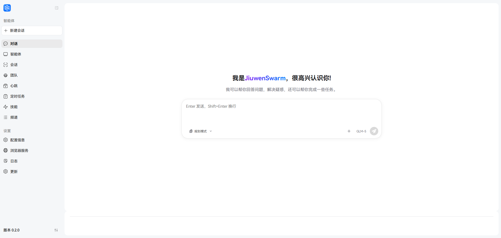

**Core Capabilities**

| Capability | Description |
|:---|:---|
| **Natural Language Understanding** | Describe needs in plain language without memorizing complex commands |
| **Task Planning** | Automatically break complex requests into executable subtask sequences |
| **Dynamic Adjustment** | Insert new requirements or modify plans at any point during execution |
| **Tool Orchestration** | Automatically choose and combine suitable tools to complete tasks |
| **Result Feedback** | Clearly present the execution process and final results |

---

### 1.2 How to Start a Conversation

**Basic Workflow**

1. **Describe your request**: Enter your requirement or task in the input box
2. **Send the message**: Click send or press Enter
3. **Review the response**: The agent interprets your request and starts execution
4. **Continue refining**: Add follow-up requirements or adjust direction based on progress

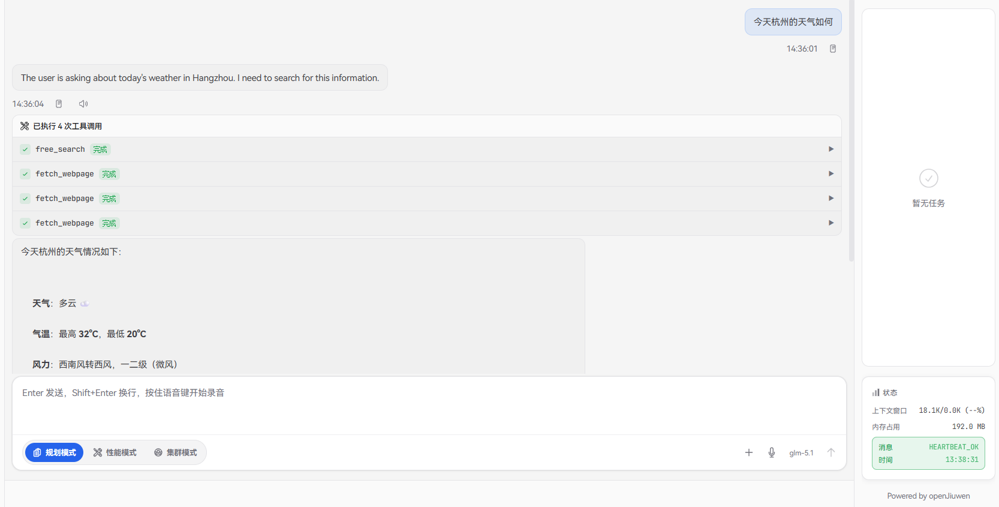

**Tips for Better Prompts**

For better execution quality, include the following elements when describing requirements:

| Element | Description | Example |
|:---|:---|:---|
| **Goal** | What you want to achieve | "Generate API documentation" |
| **Scope** | Where the request applies | "For all interfaces in the `src/api` directory" |
| **Constraints** | Special requirements or limits | "Use Chinese and output in Markdown format" |
| **Output format** | Expected output form | "Write to `docs/api.md`" |

**Prompt Quality Comparison**

| Recommended ✅ | Too vague ❌ |
|:---|:---|
| "Help me organize all Markdown files in `docs/zh`, verify heading hierarchy, fix formatting issues, and produce a change checklist." | "Organize docs" |
| "Analyze the code structure in `src/core`, generate an architecture diagram as PNG, and save it to `docs/architecture.png`." | "Analyze code" |
| "Translate `README.md` into English while preserving the original format, and write to `README_EN.md`." | "Translate README" |

**First-time Usage Suggestions**

- Start with **small tasks with clear goals** to quickly understand agent capabilities
- If the first result is not ideal, **continue adding requirements** instead of starting over
- Use **follow-up questions and refinements** to improve execution quality

---

### 1.3 Common Operations During Conversation

During task execution, you can perform the following operations at any time:

**Dynamic Adjustment Actions**

| Action | Description | Typical scenario |
|:---|:---|:---|
| **Add requirements** | Append details or change direction on the current running task | Missing details, need to adjust output format or constraints |
| **Insert new task** | Add a brand-new independent task into the queue | A higher-priority independent need appears |
| **Interrupt task** | Stop a task currently in progress | Need to halt or change direction |
| **Adjust priority** | Reorder pending tasks | Re-prioritize execution sequence |
| **End task** | Mark a task completed or cancelled | Task is no longer needed |
| **View status** | Check current task list and progress | Understand overall progress |

> **Add requirements vs Insert new task**: "Add requirements" refines or extends an **existing task** (e.g., "also add charts to the report"), while "Insert new task" adds a **brand-new independent task** (e.g., "also translate another document for me").

**Core Feature: Adjust While Chatting**

JiuwenSwarm supports **real-time dynamic adjustment**. When you add new requirements while tasks are running, the system will:

1. **Understand the new requirement**: Parse your newly added input
2. **Assess impact**: Evaluate effects on current tasks
3. **Re-plan**: Integrate new requirements into the task queue
4. **Continue execution**: Proceed with the updated plan

**Example: Full Dynamic Adjustment Walkthrough**

The following example chains common dynamic adjustment operations, showing the complete process from task planning to execution, adjustment, and review:

**Step 1: Assign a task**

```
User: Process December invoice data and generate a summary report. Start by creating a todo list.

Agent: Task list:
  [1]	Get December invoice data file	🔄 In progress
  [2]	Read and parse invoice data	⏳ Pending
  [3]	Data cleaning and validation	⏳ Pending
  [4]	Generate summary report	⏳ Pending
  [5]	Output report file	⏳ Pending

▶ Start task [1]...
```

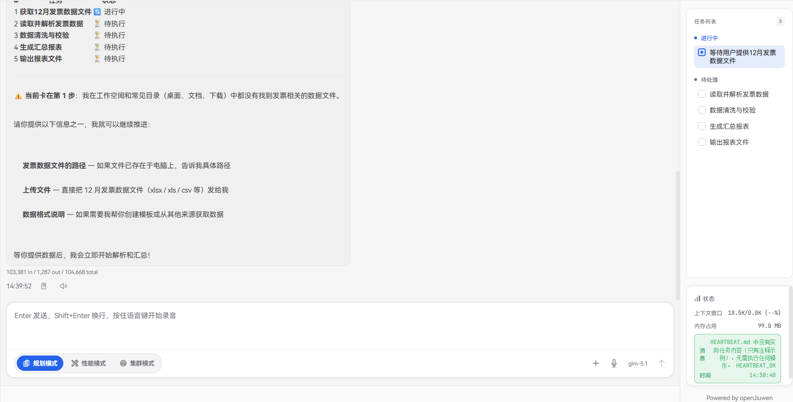

**Step 2: Insert a new task**

```
User: Also process January invoices, merge both months, and email finance.

Agent: Task list updated:
  [1]	Get December and January invoice data files	🔄 In progress
  [2]	Read and parse December and January invoice data	⏳ Pending
  [3]	Data cleaning and validation (Dec + Jan)	⏳ Pending
  [4]	Merge data and generate summary report	⏳ Pending
  [5]	Export report file and email finance	⏳ Pending

▶ Continue execution...
```

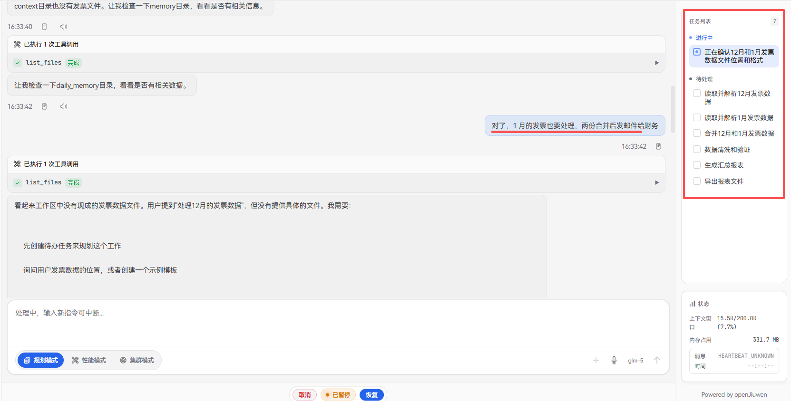


---

## 2. Execution Modes

### 2.1 Mode Overview

JiuwenSwarm supports multiple execution modes. Different modes fit different scenarios, and you can choose based on task characteristics.

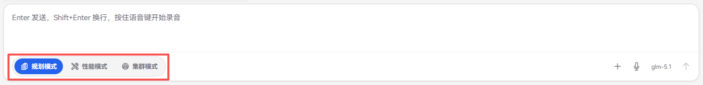

**Mode Comparison**

| Mode | How it runs | Best for | Characteristics |
|:---|:---|:---|:---|
| **Task Planning** | Decomposes requirements into concrete steps and executes by plan | Complex and multi-step tasks requiring progress tracking | Clear and controllable process; supports dynamic adjustment |
| **Performance Mode** | Handles requests flexibly and supports parallel tasks | Clear goals where fast results are preferred | Fast response; efficiency-first |
| **Cluster Mode** | Multi-agent collaborative execution | Large-scale tasks requiring specialized division of labor | Complementary capabilities; collaborative processing |

**Mode Switching**

You can switch execution modes in the following ways:

- **UI switch**: Select the execution mode at the bottom of the conversation page
- **Command switch**: Use `/mode` or `/switch` (see [CLI Commands](#3-cli-commands))

---

### 2.2 Task Planning Mode

#### 2.2.1 Concept Overview

**What is task planning?**

Task planning is one of JiuwenSwarm's core capabilities. It gives the agent **structured task decomposition and dynamic management**. For complex or multi-step requests, the agent automatically parses them into executable subtasks and systematically records/tracks them through built-in todo tools.

**Core Value**

| Capability | Description |
|:---|:---|
| **Dynamic decomposition** | Automatically splits complex requests into executable subtask sequences |
| **Real-time tracking** | Updates subtask status as each step completes, making progress visible and controllable |
| **Flexible intervention** | Supports adding requirements or urgent insertions mid-execution without breaking the overall flow |
| **Goal preservation** | Reduces goal drift and execution gaps in long-running tasks |

**Applicable Scenarios**

- Tasks with many steps that need phased completion
- Tasks likely to change during execution
- Tasks where process transparency is important
- Tasks requiring confirmation at each stage


---

### 2.3 Performance Mode

#### 2.3.1 Concept Overview

**What is performance mode?**

Performance Mode (Fast Mode) is optimized for simple and clear tasks. In this mode, the agent will:

- **Respond quickly**: Reduce planning overhead and execute directly
- **Process in parallel**: Run multiple independent tasks at the same time
- **Prioritize efficiency**: Complete work as fast as possible

**Applicable scenarios**

- Tasks with clear goals and straightforward steps
- Tasks where fast results are preferred
- Tasks that do not require detailed process decomposition
- Multiple simple tasks that need batch processing

#### 2.3.2 Practical Example

**Case: Batch document rewriting**

```
User: Rewrite the following two technical docs so they are easier for beginners:
1. docs/api.md
2. docs/architecture.md

Agent: 🔍 Processing docs in parallel...

  Rewriting completed! Both beginner-friendly versions are saved.

  Original file                 Beginner version
  ContextCompression.md         ContextCompression_Beginner.md
  Heartbeat.md                  Heartbeat_Beginner.md

  🎉 Both beginner-friendly docs are saved in the same directories as the originals. Want me to refine anything else?
```

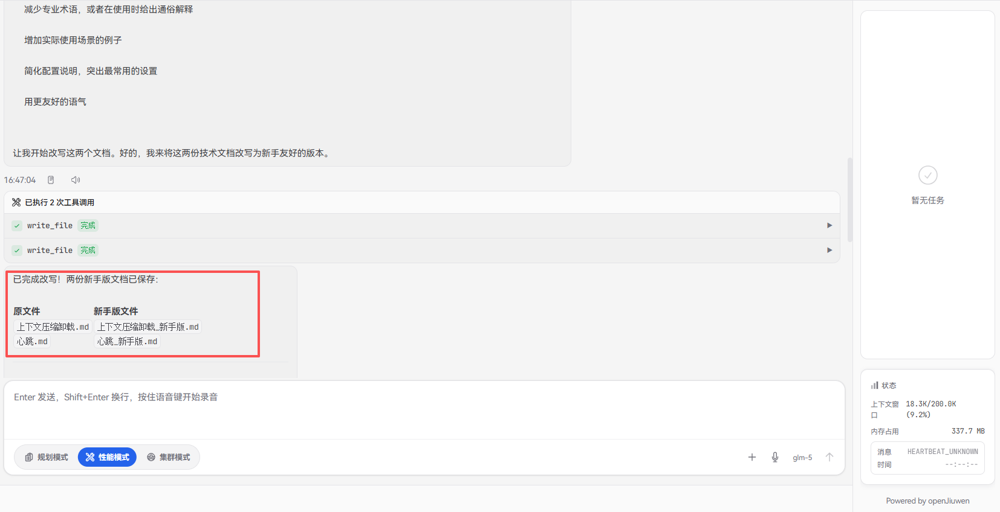

---

### 2.4 Cluster Mode

#### 2.4.1 Concept Overview

**What is cluster mode?**

Cluster Mode (Team Mode) is JiuwenSwarm's multi-agent collaboration mode. Multiple specialized agents work together, each owning a focused domain, to complete complex tasks.

**Core characteristics**

- **Specialized division of labor**: Different agents handle different domains
- **Collaborative execution**: Agents communicate and coordinate
- **Complementary capabilities**: Combine multiple specialized strengths
- **Result integration**: Aggregate outputs from all agents

**Applicable scenarios**

- Large-scale, cross-domain complex tasks
- Tasks requiring multiple professional skill sets
- Tasks difficult for a single agent to complete alone

#### 2.4.2 Practical Example

**Case: Full-stack project development**

```
User: Build a user management system including frontend UI, backend APIs, and database design.

Agent: 🤖 Starting cluster mode and assigning work:
[team_leader] I can help build a user management system. Before we start, I need to confirm several key details so the solution matches your requirements...

User: Use the default approach.

Agent:
[team_leader] ✅ Team formed and started!
[frontend-dev] Received! I have reviewed the task board.
[backend-dev] Project kickoff received!
[qa-engineer] Project kickoff received!
```

The screenshots below are ordered roughly as the conversation unfolds.

1. **Requirements alignment**  
   Conversation UI where the Team Leader confirms scope and key details with the user before cluster startup.

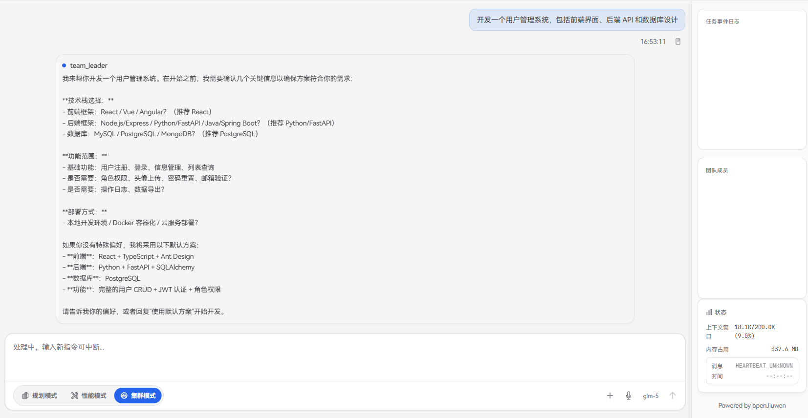

2. **Pickup and parallel start**  
   Conversation and status UI when specialized agents pick up subtasks and start work in parallel.

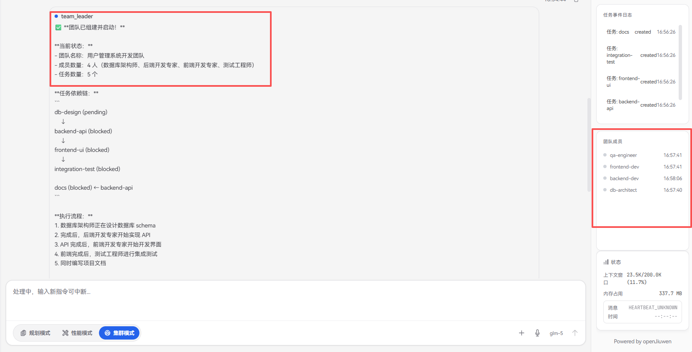

3. **Collaboration in progress**  
   Conversation UI as multiple agents continue coordinated execution (exact layout depends on the product).

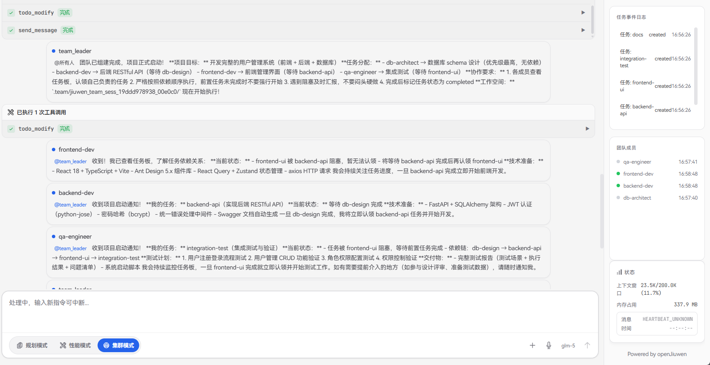

4. **Workspace output paths**  
   Example directory layout and important file paths under `workspace` after the task produces outputs.

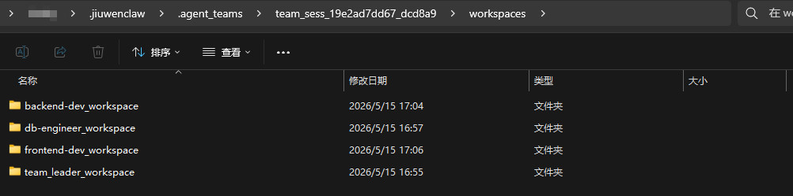

5. **Frontend showcase**  
   Example frontend pages of the output user management system.

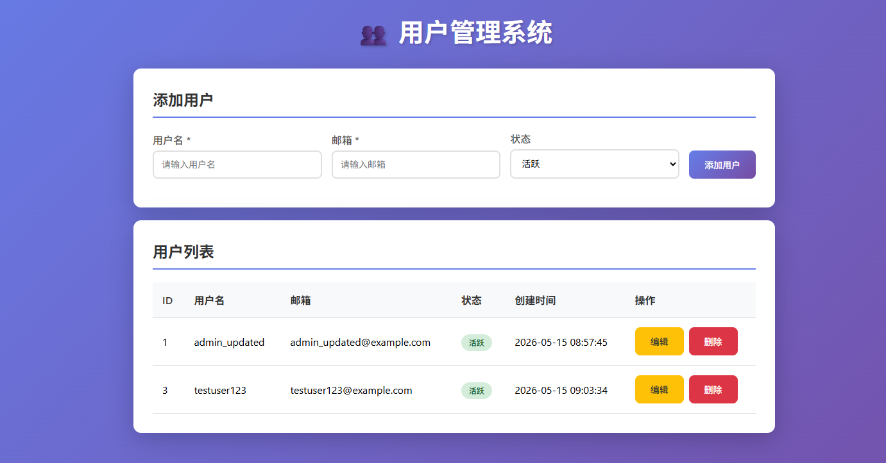

> **Note**: The cluster mode example above demonstrates the basic multi-agent collaboration flow. In practice, please verify whether cluster mode can fully deliver your engineering goals based on your project needs.

---

## 3. CLI Commands

### 3.1 Command Overview

JiuwenSwarm supports controlling sessions and modes through "special prefix commands." These commands are recognized and processed by the system **before the message reaches the agent** — they do not need the agent to execute them, and instead directly change the system's running state (such as switching modes or creating new sessions).

> **All CLI commands can be typed directly in the chat input box** — you do not need a separate command-line terminal. Enter a slash command starting with `/` in the message box and the system will recognize and execute it.

> **Important: Whether a command takes effect depends on the channel.** Some commands are intercepted and handled by the system only on certain channels; on others they may be forwarded to the agent as ordinary messages. See "Channel Scope" below.

**Channel Scope**

JiuwenSwarm commands are categorized by handling layer:

| Level | Handler | Applicable channels | Description |
| :--- | :--- | :--- | :--- |
| **Gateway interception** | Gateway layer | Feishu, DingTalk, WeCom, WeChat, WhatsApp, Xiaoyi | Intercepted at the gateway — not forwarded to the agent — and change system state directly |
| **Client-side handling** | Client | TUI (terminal) | Handled locally by the TUI client; coordinates with AgentServer via `session.create` and similar calls |
| **No interception** | — | Web conversation page | Not intercepted — sent to the agent as a normal chat message for the agent to interpret |

> **Web conversation page**: Slash commands starting with `/` are **not** intercepted by the gateway and are treated as ordinary messages to the agent — they **will not truly switch sessions or modes**. To start a new chat or change modes in the Web UI, use on-page buttons and menus (such as **New Conversation** or the mode selector). For precise control via commands, use an IM-controlled channel or the TUI.

**Primary Mode and Secondary Mode Explained**

JiuwenSwarm's execution modes are organized in two levels:

- **Primary mode**: Determines the agent's overall working style, such as agent mode (`agent`), code mode (`code`), or team collaboration mode (`team`)
- **Secondary mode**: A finer execution strategy under the primary mode, such as planning mode (`plan`) which decomposes tasks before executing, or fast mode (`fast`) which executes directly

> **Note**: Not all primary modes have secondary modes. Currently `agent` and `code` support secondary modes (`plan`/`fast`/`normal`), while `team` does not yet support secondary mode switching. You can use `/mode` to specify a primary+secondary combination directly (e.g., `/mode agent.plan`), or use `/switch` to change only the secondary mode under the current primary mode.

**Command categories**

| Type | Command | Description | Applicable channels |
| :--- | :--- | :--- | :--- |
| **Session control** | `/new_session` | Create a new session | IM controlled channels |
| **Mode switching** | `/mode` | Switch primary mode (can also specify primary+secondary combination) | IM controlled channels |
| **Mode switching** | `/switch` | Switch secondary mode (under the current primary mode) | IM controlled channels |
| **Skill management** | `/skills list` | List available skills | IM controlled channels |
| **Workspace** | `/workspace_dir` | Set workspace path | TUI |
| **Session reset** | `/clear` (aliases `/new`, `/reset`) | Clear conversation history and create a new session | TUI |

**Usage suggestions**

- **Natural language first**: In most cases, describe your needs directly in natural language
- **Use commands as support**: Use commands when you need quick switching or precise control
- **Do not mix**: Avoid combining commands and natural language in a single message
- **Mind the channel**: Make sure your channel supports the command; otherwise it will be treated as a regular message only

---

### 3.2 Common Commands

#### `/new_session` — Create a New Session

**Purpose**

Think of this as **starting a new blank conversation inside the same channel**. The new conversation **does not** inherit the prior session's chat history — the agent only continues from this new session context. Existing records from earlier sessions **are not deleted**; they remain in the system and can be recalled or reopened later via history or session lists as needed.

On supported IM channels, the system switches to a new `session_id` before handling later messages and cancels still-running work on the old session. Under `workspace/session/`, the per-session directory is usually created **on first write** (e.g. todo or file save), so you do not need to rely on folders appearing the exact moment you issue the command.

**Channel scope**

| Channel | Description |
| :--- | :--- |
| **IM controlled channels** (Feishu, DingTalk, WeCom, WeChat, WhatsApp, Xiaoyi) | ✅ Supported: intercepted by gateway; subsequent messages run in the new session context |
| **TUI (terminal)** | The TUI **does not** expose gateway `/new_session`. Use **`/clear`** (**`/reset`** and **`/new`** are aliases — see table above) to start a fresh blank session |
| **Web conversation page** | ❌ **Do not rely on slash commands**: `/new_session` does not truly apply — use UI controls such as **New Conversation** |

**Usage**

On IM-controlled channels, send exactly one line consisting of **`/new_session` only**, with **no trailing parameters**.

```
/new_session
```

The TUI **does not** provide this gateway command. To start a new blank session in the TUI, send **`/clear`** (same behavior as **`/reset`** / **`/new`** — one built-in handler).

**What happens on IM controlled channels** (gateway: recognize control commands, then refresh session binding)

- The message **is not** passed to the agent for parsing.
- A new `session_id` is generated for this channel and saved in state; the **previous session** has cancellation signaled on gateway and AgentServer sides (including in-flight tasks).
- A fixed confirmation is echoed, e.g. `[CLI command received], session_id has been changed to <new_sid>`.
- You can still see **earlier** messages in the IM window; **from your next outgoing message**, traffic uses the new `session_id` and the agent uses the new session context.

**What happens in the TUI for `/clear`**

- If no task is running: generate a new `session_id`, attempt `session.create`, switch the active session, **clear the on-screen message list for this session**, fetch history for the new session, and show `Started a fresh conversation in <session_id>`.

**workspace/session/ example (written on demand)**

```
workspace/session/
  feishu_17f2b4b32e0_ab12cd/   ← new session dir (may appear once there is a write)
    todo.md                     ← todo and similar (created on first write)
```

**Notes**

- Old session data and history remain available; that is compatible with "open a new blank context"
- On IM controlled channels, `/new_session` cancels tasks still running on the old session (gateway and AgentServer)
- The command must be **on its own line and match exactly** `/new_session`; forms like `/new_session xxx` are invalid

---

#### `/mode` — Switch Primary Mode

**Purpose**

Set the primary execution mode for the current channel, which affects the Agent's execution strategy. You can also specify a primary+secondary combination directly.

**Channel scope**

| Channel | Handling | Actual effect |
| :--- | :--- | :--- |
| **IM controlled channels** (Feishu, DingTalk, WeCom, WeChat, WhatsApp, Xiaoyi) | Gateway intercepts → updates channel state → cancels old tasks → not forwarded to agent | ✅ Truly switches mode |
| **TUI (terminal)** | Client-side handling | ✅ Truly switches mode |
| **Web conversation page** | Gateway **does not intercept** → forwarded to agent as a regular message | ❌ Does not actually switch mode |

**Supported modes**

| Mode | Description |
| :--- | :--- |
| `agent` | Agent mode (default) |
| `code` | Code mode |
| `team` | Team collaboration mode |
| `agent.plan` | Agent mode + Planning secondary mode |
| `agent.fast` | Agent mode + Fast secondary mode |
| `code.plan` | Code mode + Planning secondary mode |
| `code.normal` | Code mode + Normal secondary mode |

> `/mode agent.plan` has the same effect as first running `/mode agent` then `/switch plan`, but is more concise.

**Usage**

**Template**: `/mode` + `<mode-field>`

`<mode-field>` can be a primary mode name (such as `agent`, `code`, or `team`), or a dot-joined primary+secondary combination (consistent with the **Supported modes** table above).

**Example**: Switch to Agent mode with Fast secondary mode:

```
/mode agent.fast
```

**System response**

```
mode has been changed to agent.fast
```

---

#### `/switch` — Switch Secondary Mode

**Purpose**

Switch the secondary execution strategy under the current primary mode. Only effective for primary modes that support secondary modes (currently `agent` and `code` support this; `team` does not yet).

**Channel scope**

Same as `/mode` — only truly effective on IM controlled channels and TUI; treated as a regular message on the Web conversation page.

**Supported modes**

| Mode | Description |
| :--- | :--- |
| `plan` | Planning mode — decompose tasks first, then execute step by step |
| `fast` | Fast mode — reduce planning, execute directly |
| `normal` | Normal mode — default execution strategy |

**Usage**

```
/switch plan
/switch fast
/switch normal
```

---

#### `/skills list` — List Skills

**Purpose**

List all currently available skills.

**Channel scope**

| Channel | Handling | Actual effect |
| :--- | :--- | :--- |
| **IM controlled channels** (Feishu, DingTalk, WeCom, WeChat, WhatsApp, Xiaoyi) | Gateway intercepts → calls `skills.list` → replies with notification | ✅ Truly lists skills |
| **TUI (terminal)** | Client-side handling | ✅ Truly lists skills |
| **Web conversation page** | Gateway **does not intercept** → forwarded to agent as a regular message | ❌ Agent responds in natural language; may be inaccurate |

**Usage**

```
/skills list
```

**System response**

```
[Skill List]
1. document-writer (skillnet)
   Document writing and optimization
2. code-analyzer (skillnet)
   Code analysis and refactoring
3. data-processor (clawhub)
   Data processing and transformation
...
```

---

#### `/workspace_dir` — Set Workspace Path (TUI Only)

**Purpose**

Set the workspace path for terminal UI outbound requests. This command is only available in TUI.

**Channel scope**

Only available in the TUI (terminal) client; not available on other channels.

**Usage**

```
/workspace_dir get              # View current path
/workspace_dir set C:\Projects  # Set path
/workspace_dir clear            # Clear path
```

**Persistence**

Stored in `~/.jiuwenswarm/tui-workspace-dir`.

📢 For a more detailed command reference, see [Slash Commands Reference](SlashCommands.md).

---

## 4. Conversation Logic

### 4.1 Execution Flow

Basic logic behind JiuwenSwarm conversations:

```
User Input → Intent Understanding → Mode Selection → Task Handling → Result Feedback
```

**Detailed flow**

1. **Intent understanding**: Parse natural language and identify real requirements
2. **Mode selection**: Choose an execution strategy based on task traits and current mode
3. **Task handling**:
   - **Task planning mode**: Decompose into subtasks and execute by plan
   - **Performance mode**: Execute quickly, with parallel support
   - **Cluster mode**: Delegate to multiple agents for collaboration
4. **Result feedback**: Present results in a clear and understandable way

### 4.2 Dynamic Adjustment Mechanism

JiuwenSwarm can re-plan task lists during execution based on new user input:

- **Real-time listening**: Continuously receive new user messages
- **Impact evaluation**: Evaluate how new requirements affect current tasks
- **Intelligent merge**: Integrate new requirements into the queue appropriately
- **Seamless continuation**: Keep execution flow coherent and uninterrupted

### 4.3 Task Planning Mechanism Details

**Core mechanism**

Core logic of task planning mode:

1. **Requirement parsing**: Parse user requests into executable subtask sequences
2. **Task recording**: Systematically record all subtasks via todo tools
3. **Status tracking**: Update each subtask status in real time
4. **Dynamic adjustment**: Let users insert, modify, or cancel tasks anytime

**Tool support**

JiuwenSwarm provides a complete todo toolkit (`TodoToolkit`). Tasks are persisted as Markdown in `workspace/session/{session_id}/todo.md`, isolated by session with concurrency-safe read/write.

| Tool | Description |
| :--- | :--- |
| `todo_create` | Create the initial todo list |
| `todo_insert` | Insert a new task at a specified position |
| `todo_complete` | Mark a task as completed |
| `todo_remove` | Remove a specified task |
| `todo_list` | List all current todo items |

**Task states**

| State | Description |
| :--- | :--- |
| `waiting` | Pending execution |
| `running` | In progress |
| `completed` | Completed |
| `cancelled` | Cancelled |
