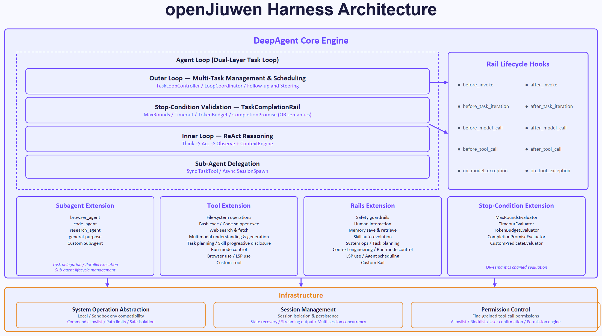
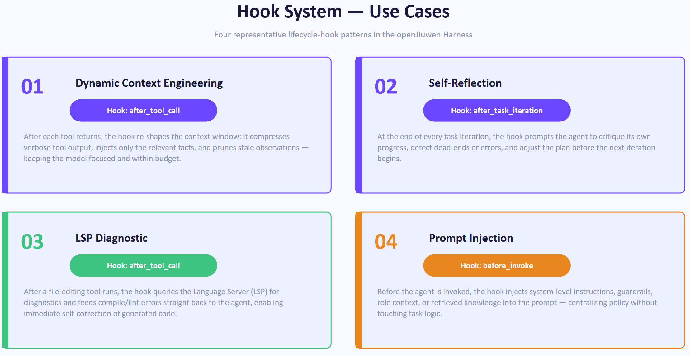
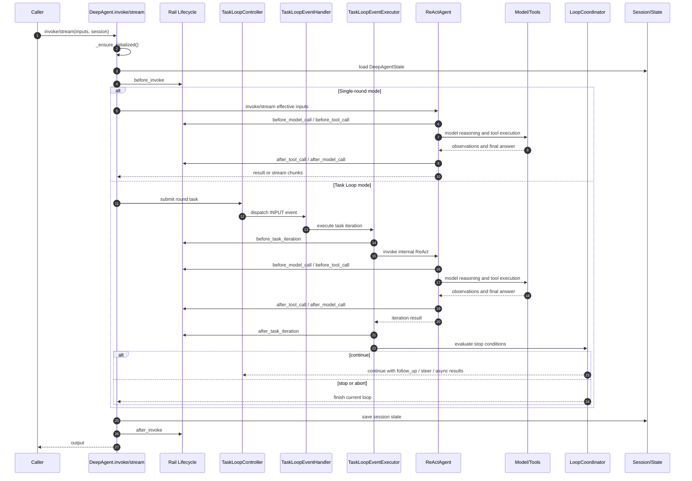

# openJiuwen Harness

## Introduction

`Agent = Model + Harness`. openJiuwen Harness is the general-purpose agent runtime framework in openJiuwen for Harness Engineering. It turns a large language model from a "conversational reasoning unit" into a task execution system that can plan, call tools, manage context, obey permissions, delegate subtasks, and evolve over time.

The core goal of Harness Engineering is to build the engineered execution environment around the model. This environment manages task loops, tools, context, state, permissions, memory, verification, stop conditions, and feedback loops, keeping agents controllable, reliable, and extensible in long-running tasks and complex environments. openJiuwen Harness targets general agent scenarios; code editing, research, browser operation, multimodal tasks, system operations, team collaboration, and business automation can all be built on the same Harness capabilities.

## 1. Conceptual Positioning

### 1.1 What Is Harness?

Harness is the engineering control layer of an agent. The model generates reasoning and action intent, while the Harness places that intent into a controlled execution system. In other words, openJiuwen Harness does not replace the model; it supplies the execution, state, constraints, and feedback mechanisms outside the model:

- Turn user goals into task loops that can keep making progress.
- Govern tool calls through unified registration, filtering, permission checks, and auditing.
- Organize context into static prompts, dynamic attachments, session state, and long-term memory.
- Split the execution process into extensible lifecycle events.
- Delegate complex tasks to sub-agents while isolating sub-agent context.
- Unify completion conditions, timeouts, round limits, token budgets, and custom predicates into one stop strategy.
- Embed safety, human confirmation, plan mode, and verification gates into the runtime.

### 1.2 Responsibilities of DeepAgent

`DeepAgent` is the runtime body of Harness. Internally, it reuses a ReAct reasoning loop; externally, it adds task management, state management, Rail lifecycle hooks, sub-agent delegation, and infrastructure integration.

DeepAgent has two runtime modes:

- Single-round ReAct mode: suitable for short tasks and direct tool calls.
- Dual-layer Task Loop mode: suitable for long-running tasks, multi-round progress, follow-up, steering, abort, task planning, and stop-condition control.

### 1.3 Design Principles

- Generality: Harness targets many kinds of agent execution scenarios.
- Governability: model actions must pass through tool, permission, state, and stop-condition governance.
- Extensibility: features extend through Rails, Tools, SubAgents, and Stop Evaluators.
- Recoverability: task state, plans, pending follow-ups, and plan-mode state are persisted into the session.
- Composability: Workspace, SysOperation, Permission, PromptAttachment, ContextEngine, and other infrastructure pieces are decoupled and composable.
- Evolvability: trajectory collection, skill use, skill creation, and skill evolution form a feedback loop for experience reuse.

## 2. Overall Architecture



The architecture has three layers:

- DeepAgent Core Engine: task loop, stop conditions, ReAct reasoning, sub-agent delegation, and Rail lifecycle.
- Extension: four extension surfaces: Subagent, Tool, Rails, and Stop-Condition.
- Infrastructure: system operation abstraction, session management, and permission control.

## 3. Core Features

### 3.1 Agent Loop: From ReAct to a Dual-Layer Task Loop

The Agent Loop is the execution backbone of Harness. The inner ReAct loop is responsible for Think -> Act -> Observe. The outer Task Loop turns open-ended goals into multi-round task execution, state updates, and completion checks.

The outer loop is composed of `TaskLoopController`, `LoopCoordinator`, `TaskLoopEventHandler`, `TaskLoopEventExecutor`, and `LoopQueues`. It submits each round as a `CoreTask`, waits for execution to complete, and evaluates whether another round is needed. Runtime interaction also lives at this layer:

- `follow_up`: queue a user follow-up for the next round.
- `steer`: inject runtime guidance into the current task.
- `abort`: cancel the outer task loop and try to interrupt the inner ReAct loop.

Task planning and task completion are two key capabilities of the Agent Loop:

- `TaskPlanningRail` connects todo tools, `TaskPlan`, task dependencies, progress reminders, and multi-model selection to the loop.
- `TaskCompletionRail` unifies max rounds, timeout, completion promise, repeated confirmation, and custom stop conditions.

Stop conditions use OR semantics: if any condition is met, the loop stops. Built-in evaluators include `MaxRoundsEvaluator`, `TimeoutEvaluator`, `TokenBudgetEvaluator`, `CompletionPromiseEvaluator`, and `CustomPredicateEvaluator`.

### 3.2 Rail Lifecycle: Lifecycle Extension Mechanism

Rails are the lifecycle extension surface of Harness. A Rail does not replace the main flow; it injects capabilities at key points in outer tasks, inner model calls, and tool calls.

| Lifecycle event | Location | Typical use |
| --- | --- | --- |
| `before_invoke` / `after_invoke` | Outer DeepAgent | Initialize resources, load skills, clean caches, sync external memory |
| `before_task_iteration` / `after_task_iteration` | Outer Task Loop | Rewrite task instructions, sync todo, detect completion promises, trigger evolution |
| `before_model_call` / `after_model_call` | Inner ReAct | Assemble prompts, inject safety rules, compress context, collect trajectories |
| `before_tool_call` / `after_tool_call` | Inner ReAct | Permission checks, plan-mode restrictions, LSP diagnostics, progress reminders |
| `on_model_exception` / `on_tool_exception` | Inner ReAct | Repair context and govern exceptions |

The following figure shows four representative Harness lifecycle-hook use cases: dynamic context engineering, self-reflection, LSP diagnostics, and prompt injection.



Common Rails can be grouped by capability:

- Execution control: `TaskPlanningRail`, `TaskCompletionRail`, `AgentModeRail`.
- Tools and system operations: `SysOperationRail`, `ProgressiveToolRail`, `LspRail`, `McpRail`.
- Safety and permissions: `SafetyPromptRail`, `PermissionInterruptRail`, `VerificationRail`.
- Context and memory: `ContextAssembleRail`, `ContextProcessorRail`, `MemoryRail`, `CodingMemoryRail`, `ExternalMemoryRail`.
- Skills and evolution: `SkillUseRail`, `EvolutionRail`, `SkillCreateRail`, `SkillEvolutionRail`.
- Sub-agents: `SubagentRail`, `VerificationContractRail`.

### 3.3 Tool & Execution: Tools, System Operations, and Permission Governance

Tool & Execution is the execution layer that turns model intent into real-world action. Tools describe metadata through `ToolCard`, execute actions through `Tool` instances, and are exposed to the model through the ability manager.

Major tool families include:

- File system: `read_file`, `write_file`, `edit_file`, `glob`, `list_files`, `grep`.
- Shell and code execution: `bash`, `powershell`, `code`.
- Web and external resources: web search/fetch, MCP resource list/read.
- Multimodal: OCR, VQA, audio transcription, audio QA, audio metadata, video understanding.
- Code intelligence: LSP definition/reference/symbol/call hierarchy.
- Workflow helpers: todo, skill, subagent, plan mode, worktree, cron, `ask_user`.

For the full built-in tool index, see [3.12 Built-in Capabilities Index](#312-built-in-capabilities-index).

`SysOperationRail` registers file, shell, and optional code tools. All system operations execute through a shared `SysOperation`, so local execution, sandboxing, working-directory restriction, and permission control are handled consistently.

When the tool set is large, `ProgressiveToolRail` provides progressive tool disclosure: the model sees only meta tools and basic tools by default, then uses `tool_search` to search for tools and `load_tools` to load the tools needed for the current session. This reduces context noise and lowers the chance of misusing high-risk tools.

Permission governance is composed of `PermissionEngine` and `PermissionInterruptRail`. `PermissionEngine` evaluates allow / ask / deny policies, while `PermissionInterruptRail` intercepts every tool call before execution and handles direct allow, direct deny, HITL confirmation, "allow once", and "always allow" flows. Shell commands go through AST analysis, and external path checks are combined with the current decision using the stricter result.

Workspace is the persistence boundary of the execution layer. The default schema includes `AGENT.md`, `SOUL.md`, `HEARTBEAT.md`, `IDENTITY.md`, `memory/`, `coding_memory/`, `todo/`, `messages/`, `skills/`, `agents/`, and `context/session_memory.md`. It also supports custom directories, localized default content, team workspace links, and worktree links.

### 3.4 Agent Mode: Runtime Modes and Plan Mode Constraints

Different modes are an important runtime policy layer in Harness. `AgentMode` currently supports two modes: `normal` and `plan`. `normal` is the default execution mode and allows regular tool calls and task execution. `plan` is a read-only planning mode for understanding, exploration, and solution design before real execution begins. Mode state is stored in session-scoped `DeepAgentState.plan_mode`, including `mode`, `pre_plan_mode`, and `plan_slug`.

`AgentModeRail` registers `switch_mode`, `enter_plan_mode`, and `exit_plan_mode`. During the model/tool lifecycle, it injects mode instructions, filters model-visible tools, and intercepts tool calls that do not match the current mode.

| Capability | Mechanism |
| --- | --- |
| Mode switching | `switch_mode` switches the session runtime mode between `normal` and `plan` |
| Plan file initialization | `enter_plan_mode` creates or reuses `.plans/<slug>.md` under the workspace |
| Plan exit | `exit_plan_mode` reads the full plan and restores the mode that was active before entering plan mode |
| Tool visibility | `plan` mode hides todo/session tools; `normal` mode hides `enter_plan_mode` / `exit_plan_mode` |
| Write restrictions | `plan` mode blocks shell/git write operations to avoid modifying the real workspace during planning |
| File-write restrictions | `write_file` / `edit_file` can only write the plan file in `plan` mode |
| Sub-agent collaboration | After entering `plan` mode, `task_tool` can be registered dynamically to support planning-time sub-agent exploration |

### 3.5 Context & Memory: Context Engineering and Memory System

Context & Memory ensures the model sees the right information at the right time. Harness uses an extended `SystemPromptBuilder` to manage static prompt sections, such as `identity`, `safety`, `skills`, `tools`, `todo`, `task_tool`, `memory`, `workspace`, `context`, `completion_signal`, and `verification_contract`.

Dynamic context is managed by `PromptAttachmentManager`. It stores auto-attached content by session and section for the current model call, then injects it into the final context window as separate user messages. Good candidates for PromptAttachment include long context files, heartbeat, memory recall, external memory prefetch, dynamic plan-mode state, and LSP diagnostics.

Context engineering is mainly handled by two Rails:

- `ContextAssembleRail`: injects workspace structure, context files, tool lists, and file-based prompt sections.
- `ContextProcessorRail`: configures ContextEngine processors, compresses long conversations, offloads large tool results, repairs incomplete tool_call / ToolMessage context, and manages session memory.

The memory system covers three scenarios:

| Rail | Scenario | Capabilities |
| --- | --- | --- |
| `MemoryRail` | General long-term memory | Initialize memory manager, register memory tools, inject memory-use prompts |
| `CodingMemoryRail` | Project/task memory | Automatic recall, vector + BM25 hybrid retrieval, top-5 memory or index injection |
| `ExternalMemoryRail` | External memory systems | Provider initialization, prefetch, sync_turn, provider tool registration, and circuit breaking |

### 3.6 Subagent & Verification: Sub-Agent Delegation and Verification Gates

Subagent & Verification splits complex work across more specialized agents and introduces independent verification after high-risk implementation work.

Synchronous sub-agents are delegated through `task_tool`:

- The parent agent waits for the sub-agent to finish after calling the tool.
- The sub-agent uses an isolated session.
- `browser_agent` and `verification_agent` use deterministic sub-session IDs, so context can be reused after failures.

Asynchronous sub-agents are delegated through session tools:

- `sessions_spawn`: submit a background subtask.
- `sessions_list`: inspect background tasks.
- `sessions_cancel`: cancel a background task.
- `SessionToolkit`: maintain background task state.

Publicly exported built-in sub-agents include `browser_agent`, `code_agent`, `research_agent`, `verification_agent`, and `mobile_gui_agent`; `general-purpose` can be injected automatically with `add_general_purpose_agent=True`. For the full list, see [3.12 Built-in Capabilities Index](#312-built-in-capabilities-index).

Verification gates have two layers: the parent agent and the verification agent. `VerificationContractRail` injects the verification contract into the parent agent and requires a verification agent after non-trivial implementation. `VerificationRail` restricts the verification agent's tool set and write permissions, ensuring that the verification agent only reads, searches, runs verification commands, and reports results without modifying project files.

### 3.7 Skill & Evolution: Skill Reuse and Experience Evolution

Skill & Evolution lets Harness do more than execute the current task: it can also convert execution experience into reusable capability.

`SkillUseRail` manages skill usage:

- Supports multiple `skills_dir` directories.
- Supports both `all` and `auto_list` exposure modes.
- Registers `skill_tool` and `list_skill`.
- Supports enabled/disabled filtering.
- Refreshes incrementally based on `SKILL.md` mtime.
- Can inject evolution experience into skill descriptions.

`EvolutionRail` manages experience collection and evolution triggers:

- Collects model-call trajectories.
- Collects tool-call trajectories.
- Supports triggers after invoke, model call, tool call, and task iteration.
- Supports background asynchronous evolution, concurrency limits, and host-visible events.

Concrete evolution capabilities include `SkillCreateRail`, `TeamSkillCreateRail`, `SkillEvolutionRail`, `TeamSkillEvolutionRail`, and `TrajectoryRail`. They can propose new skills, evolve existing skills, or distill team skills from tool-call patterns, collaboration patterns, and historical trajectories.

### 3.8 Coding Intelligence: LSP Code Intelligence

LSP stands for Language Server Protocol. It is a standard protocol between editors or developer tools and language servers. Through a unified interface, it provides code intelligence capabilities such as go-to-definition, reference lookup, symbol indexing, implementation lookup, call hierarchy, and diagnostics. Harness uses LSP to expose editor-grade code understanding to the Agent, so coding agents do not have to rely only on text search and can understand code structure through a language server.

#### LSP Tool and Rail

`LspRail` is the lifecycle entry point for LSP capabilities. It initializes the LSP subsystem and registers a single `lsp` tool into the Agent's ability manager. The `lsp` tool is the unified tool entry point for model calls to LSP capabilities: it receives an operation type, file path, line/character position, or query condition, then returns structured results.

`LspRail` creates the tool based on the Agent's workspace, sys_operation, language, and agent_id, binding LSP capabilities to the current workspace and runtime. When the Agent finishes or the Rail is unloaded, `LspRail` removes the tool and shuts down the LSP subsystem.

#### Code Intelligence Operations

The `lsp` tool supports eight code intelligence operations:

| Operation | Purpose |
| --- | --- |
| `goToDefinition` | Find the definition location of a symbol |
| `findReferences` | Find references to a symbol |
| `documentSymbol` | List functions, classes, variables, and other symbols in one file |
| `workspaceSymbol` | Search symbols across the entire workspace |
| `goToImplementation` | Find implementations of an interface or abstract method |
| `prepareCallHierarchy` | Prepare the call hierarchy item at the current position |
| `incomingCalls` | Find methods that call the current function |
| `outgoingCalls` | Find methods called by the current function |

#### Code Diagnostics

LSP supports not only code navigation but also code diagnostics. After the Agent modifies files, `LspRail` triggers the language server to reanalyze the code. Before the next model call, Harness injects diagnostic information into the context. These diagnostics help the Agent discover syntax errors, type errors, unresolved references, call signature mismatches, and similar issues, forming an `edit -> diagnose -> fix` coding loop.

LSP execution is workspace-aware: paths are resolved relative to the workspace, gitignored results are filtered, and large files are not sent to the language server. If a language server is not configured for the current language, the `lsp` tool returns an explicit error. This makes the capability suitable for semantic navigation, impact analysis, call-chain understanding, and post-edit diagnosis and repair.

### 3.9 Multimodal Understanding: Images, Audio, and Video

Harness wraps image, audio, and video understanding as tools, so the Agent can bring non-text materials into task context.

Image tools are driven by `VisionModelConfig`:

- `image_ocr`: extract text from images while preserving structure, line breaks, numbers, and symbols as much as possible.
- `visual_question_answering`: answer visual questions based on an image and optional OCR results.
- Local image paths and HTTP(S) image URLs are supported; sandbox-only paths are rejected to avoid accessing paths that are not visible to the tool.

Audio tools are driven by `AudioModelConfig`:

- `audio_transcription`: transcribe speech in audio into text.
- `audio_question_answering`: answer questions based on audio content.
- `audio_metadata`: identify audio duration and, when ACR is configured, song metadata.
- Local audio paths and HTTP(S) audio URLs are supported, with `max_audio_bytes` limiting download size.

Video tools are driven by the vision model:

- `video_understanding`: accept a local video or HTTP(S) video URL and answer questions about the video content.
- Local videos are encoded as data URLs; calls can limit `max_tokens`, `temperature`, and `timeout_seconds`.

Multimodal model configuration can be passed explicitly or constructed from environment variables. `VisionModelConfig.from_env()` reads variables such as `VISION_API_KEY`, `VISION_BASE_URL`, and `VISION_MODEL`; `AudioModelConfig.from_env()` reads variables such as `AUDIO_API_KEY`, `AUDIO_BASE_URL`, `AUDIO_TRANSCRIPTION_MODEL`, and `AUDIO_QUESTION_ANSWERING_MODEL`. When `enable_read_image_multimodal=True`, reading an image through `read_file` can include native multimodal input. When it is disabled, `read_file` returns only image metadata and suggests using vision tools.

### 3.10 Web & External Resources: Web and External Resource Access

Harness can connect Web and external resource systems into the Agent task loop, allowing agents to perform research search, webpage fetching, and cross-system resource reading.

Web tools cover two main scenarios:

- `free_search` / `paid_search`: search and research tasks, using free or paid search providers depending on deployment.
- `fetch_webpage`: fetch webpage content for material organization, citation checking, and later context injection.

MCP is integrated through `McpRail`. DeepAgent can register MCP servers through `mcps`; after initialization, `McpRail` registers `list_mcp_resources` and `read_mcp_resource` for the Agent, allowing the model to discover and read registered MCP resources. This is useful for connecting document repositories, data sources, tool runtimes, or external system resources to Harness without placing all content into the prompt ahead of time.

### 3.11 Isolated Execution & Automation: Isolated Execution and Long-Term Automation

Harness also provides tools for isolated execution and long-term automation, allowing agents to operate closer to real engineering environments under explicit constraints.

`WorktreeRail` registers `enter_worktree` and `exit_worktree`, and manages a per-agent `WorktreeManager`. The Agent can enter an isolated git worktree before running file operations and shell commands, avoiding pollution of the main workspace. On exit, it can choose to keep or remove the worktree. This capability is suitable for code modification, experimental refactoring, parallel verification, and tasks that need an isolated rollback boundary.

The cron tool family integrates with a host-provided scheduled-task backend. It can expose a unified `cron` tool, and it can also remain compatible with split tool forms such as list/get/create/update/delete/toggle/preview. This capability is suitable for long-term automation, periodic tasks, scheduled reminders, and agent workflows that need to maintain plans across sessions.

### 3.12 Built-in Capabilities Index

This section provides a quick index of Harness built-in capabilities. Whether a capability is actually visible in the model-callable tool list depends on `create_deep_agent` parameters, explicitly registered rails, host-provided backends, permission configuration, and the current runtime environment.

#### Built-in Tool

| Capability Family | Representative Tools | Main Purpose | Enablement / Source |
| --- | --- | --- | --- |
| Files and search | `read_file`, `write_file`, `edit_file`, `glob`, `grep`, `list_files` | Read, write, edit, and locate workspace context by glob or text search | Registered by `SysOperationRail`; constrained by workspace, sys_operation, and permission policy |
| Shell and code execution | `bash`, `powershell`, `code` | Run shell commands, scripts, and code snippets | Registered by `SysOperationRail`; `powershell` is mainly for Windows, and `code` can be enabled by rail configuration |
| Todo / planning | `todo_create`, `todo_list`, `todo_get`, `todo_modify` | Manage session-level task lists for long-task decomposition, tracking, and state updates | Mounted by related rails or host configuration, persisted under the workspace todo area |
| Web | `free_search`, `paid_search`, `fetch_webpage` | Web search, webpage fetching, and material organization | Available after Web tools are registered; search tools depend on deployment and provider configuration |
| Multimodal | `image_ocr`, `visual_question_answering`, `audio_transcription`, `audio_question_answering`, `audio_metadata`, `video_understanding` | Image OCR / VQA, audio transcription / QA / metadata, and video QA | Depends on `VisionModelConfig` / `AudioModelConfig`; supports local or HTTP(S) media |
| LSP code intelligence | `lsp` | Definitions, references, symbols, implementations, call hierarchy, and code diagnostics | Registered by `LspRail`; depends on language servers and the current workspace |
| MCP external resources | `list_mcp_resources`, `read_mcp_resource` | List and read resources from registered MCP servers | Registered by `McpRail`; DeepAgent connects MCP servers through `mcps` |
| Sub-agent delegation | `task_tool`, `sessions_spawn`, `sessions_list`, `sessions_cancel` | Delegate synchronous subtasks or create, inspect, and cancel background sub-agent tasks | Registered by `SubagentRail`; sync/async form depends on `enable_async_subagent` |
| Skill / tool discovery | `skill_tool`, `list_skill`, `search_tools`, `load_tools` | Invoke skills, list skills, and progressively search/load tools | Registered by `SkillUseRail` and `ProgressiveToolRail`; depends on skill directories and progressive-tool config |
| Memory / Coding Memory | `memory_*`, `coding_memory_*` | Read and write long-term memory, coding experience, and project knowledge | Registered by `MemoryRail`, `CodingMemoryRail`, and related memory rails |
| Agent mode and user interaction | `switch_mode`, `enter_plan_mode`, `exit_plan_mode`, `ask_user` | Switch normal/plan modes and request user input at key decision points | Registered by `AgentModeRail`, `AskUserRail`, or host interaction rails |
| Worktree / Cron | `enter_worktree`, `exit_worktree`, `cron`, `cron_list_jobs`, `cron_get_job`, `cron_create_job`, `cron_update_job`, `cron_delete_job`, `cron_toggle_job`, `cron_preview_job` | Enter isolated git worktrees and manage scheduled/periodic automation | Registered by `WorktreeRail` or a host cron backend; cron supports both unified and split tool forms |
| Mobile GUI / browser runtime | Mobile coordinate/navigation tools, browser runtime tools | Mobile GUI actions, browser task execution, runtime health checks, and cancellation control | Registered by mobile GUI / browser runtime tool packages or host runtimes |

#### Built-in Rail

| Rail | Main Responsibility | Enablement / Source |
| --- | --- | --- |
| `SecurityRail` | Base safety guardrails and prompt/tool security checks | Auto-added by `create_deep_agent` unless a compatible user rail is already provided |
| `TaskPlanningRail` | Task planning, decomposition, and model-selection assistance | Auto-added when `enable_task_planning=True`; can also be registered explicitly |
| `SkillUseRail` | Discover, load, and invoke workspace / team skills | Auto-added when `skills` is configured or `enable_skill_discovery=True`; can also be registered explicitly |
| `SubagentRail` | Register synchronous `task_tool` or async session tools and inject sub-agent guidance | Auto-added when `subagents` are configured; async mode is controlled by `enable_async_subagent` |
| `SysOperationRail` | Register file, shell, and code-execution system-operation tools | Usually registered explicitly, bound to workspace and sys_operation |
| `ProgressiveToolRail` | Progressive tool disclosure, tool search, and on-demand loading | Registered when progressive-tool capability is configured |
| `LspRail` | Initialize the LSP subsystem, register `lsp`, and inject code diagnostics | Explicitly registered; depends on language servers and workspace code |
| `McpRail` | Register MCP resource list/read tools | Explicitly registered and used with `mcps` to connect MCP servers |
| `MemoryRail`, `CodingMemoryRail`, `ExternalMemoryRail` | Manage long-term memory, coding memory, and external memory reads/writes | Registered explicitly as needed or assembled by the host |
| `AgentModeRail` | Manage normal/plan modes, register mode-switching tools, and enforce Plan Mode tool filtering and write restrictions | Enable plan mode or register explicitly; see the Agent Mode section in 3.4 |
| `AskUserRail`, `ConfirmInterruptRail` | Request user input, confirmation, or interrupt recovery during execution | Registered for HITL scenarios or host interaction capabilities |
| `PermissionInterruptRail`, `SafetyPromptRail` | Intercept tool calls for permission checks, user confirmation, and safety prompt injection | Enabled through `permissions` or safety rails |
| `TaskCompletionRail` | Determine task completion and support outer Task Loop stop conditions | Registered for Task Loop or custom completion evaluation scenarios |
| `SessionRail` | Manage sub-session context and lifecycle capabilities | Registered for sub-agent / session scenarios |
| `VerificationRail`, `VerificationContractRail` | Restrict verification-agent permissions and inject verification contracts into the parent agent | Registered for implementation, regression verification, and high-risk tasks |
| `SkillCreateRail`, `TeamSkillCreateRail`, `SkillEvolutionRail`, `TeamSkillEvolutionRail` | Create personal/team skills and evolve reusable experience | Registered for skill self-evolution or team skill distillation |
| `TrajectoryRail`, `ContextEvolutionRail`, `EvolutionRail`, `EvolutionInterruptRail` | Collect trajectories, trigger context/skill evolution, and handle evolution interrupts | Registered in experience-evolution pipelines |
| `HeartbeatRail` | Maintain runtime heartbeat and long-task status | Registered when long tasks or host heartbeat awareness are needed |

#### Built-in Subagent

| Subagent | Main Purpose | Enablement / Source |
| --- | --- | --- |
| `browser_agent` | Browser use, webpage interaction, and tasks requiring browser runtime | `build_browser_agent_config` / `create_browser_agent` |
| `code_agent` | Code reading, local implementation, and engineering changes | `build_code_agent_config` / `create_code_agent` |
| `research_agent` | Search research, material organization, fact checking, and report synthesis | `build_research_agent_config` / `create_research_agent` |
| `verification_agent` | Read changes, run verification commands, inspect regression risk, and report conclusions | `build_verification_agent_config` / `create_verification_agent` |
| `mobile_gui_agent` | Mobile GUI operation, coordinate taps, scrolling, text input, and navigation | `build_mobile_gui_agent_config` / `create_mobile_gui_agent` |
| `general-purpose` | General fallback sub-agent that can inherit the parent prompt, tools, mcps, and skills | Injected automatically when `add_general_purpose_agent=True` |
| `plan_agent`, `explore_agent` | Planning/exploration templates present in source | Internal templates / not the main exports from `subagents/__init__.py`; use concrete assembly code as the source of truth |

## 4. Runtime Flow

### 4.1 Runtime Sequence Diagram



### 4.2 Runtime Main Flow

The sequence diagram in 4.1 describes the runtime process after the agent has already been created. The main flow proceeds as follows:

1. The caller starts a run through `invoke/stream(inputs, session)`.
2. `DeepAgent.invoke` or `DeepAgent.stream` first executes `_ensure_initialized()` to ensure that workspace, MCP, Rails, and task-loop runtime objects are initialized.
3. DeepAgent loads `DeepAgentState` from the session and triggers the `before_invoke` lifecycle event.
4. In single-round mode, DeepAgent calls the internal `ReActAgent` directly. The inner ReAct loop triggers model/tool-level Rail hooks around model reasoning and tool execution, then returns a result or stream chunks to DeepAgent.
5. In Task Loop mode, DeepAgent submits the current round to `TaskLoopController`; the event is dispatched by `TaskLoopEventHandler`, and `TaskLoopEventExecutor` executes the task iteration.
6. Each Task Loop iteration triggers `before_task_iteration`, calls the internal `ReActAgent` to complete Think / Act / Observe, and then triggers `after_task_iteration`.
7. `LoopCoordinator` decides whether to continue, stop, or abort based on stop conditions, abort signals, follow-up, steering, or asynchronous sub-agent results.
8. When the run finishes, DeepAgent saves session state, triggers `after_invoke`, and returns output to the caller.

### 4.3 Single-Round Mode and Task Loop Mode

Single-round mode focuses on low overhead and immediate response. It is suitable for one-shot Q&A, short tool tasks, and automation that does not need planning or multi-round progress. Although there is no outer Task Loop, inner hooks such as `before_model_call`, `after_model_call`, `before_tool_call`, and `after_tool_call` still take effect.

Task Loop mode focuses on long-running progress and controlled convergence. It is suitable for task planning, asynchronous sub-agents, runtime intervention, explicit completion conditions, and multi-round verification. Compared with single-round mode, Task Loop maintains additional round state, stop conditions, and runtime interaction queues, allowing the agent to keep moving toward the goal across iterations.

### 4.4 Runtime Interaction and State

Harness supports three kinds of runtime interaction:

- `follow_up(query)`: append a follow-up question to the current task.
- `steer(message)`: inject guidance into a running agent.
- `abort()`: cancel the current task loop.

These interactions enter `TaskLoopEventHandler` through the controller event queue, then write to `LoopQueues` or trigger `LoopCoordinator.request_abort()`. The Task Loop consumes these signals at iteration boundaries, so it can append requirements, adjust direction, or end the task without breaking the consistency of the current tool call.

DeepAgent runtime state is saved into the session. Core state includes:

- Current iteration count.
- TaskPlan.
- Stop-condition state.
- Pending follow-ups.
- Plan-mode state.

State persistence allows long-running tasks to resume and lets external runtimes inspect task progress. `invoke` and `stream` save and clear the current run state after completion. If asynchronous session-spawn subtasks are still pending, the controller is retained to wait for later results.

## 5. Usage Guide

### 5.1 Suitable Scenarios

Harness is suitable for:

- Long-running task execution.
- Multi-tool automation.
- Multi-round research and information organization.
- Browser tasks.
- Multimodal understanding.
- Code semantic navigation, reference analysis, call-chain analysis, and post-edit diagnostics.
- File and system operations.
- Web/MCP external knowledge and resource access.
- Code modification and verification in isolated worktrees.
- Scheduled and periodic task automation.
- High-risk tasks that require permission confirmation.
- Tasks that require planning, verification, and rollback.
- Agents that need memory, skill reuse, and self-evolution.

### 5.2 Complete DeepAgent Example

In the example below, `AgentModeRail()` enables mode capabilities. If `default_mode` is not explicitly passed, the Agent starts from `AgentMode.NORMAL` / `normal`.

```python
import asyncio

from openjiuwen.core.single_agent import AgentCard, create_agent_session
from openjiuwen.harness import Workspace, create_deep_agent
from openjiuwen.harness.rails import (
    AgentModeRail,
    ContextAssembleRail,
    ContextProcessorRail,
    SysOperationRail,
    TaskCompletionRail,
    VerificationContractRail,
)
from openjiuwen.harness.schema.config import SubAgentConfig


async def main():
    # The business side creates the model from its existing model configuration,
    # such as OpenAI, Huawei Cloud, or a local model adapter.
    model = ...

    workspace = Workspace(root_path="./workspace", language="en")

    research_agent = SubAgentConfig(
        agent_card=AgentCard(
            name="research_agent",
            description="Research, fact-checking, and report-material specialist",
        ),
        system_prompt=(
            "You are research_agent. Retrieve sources, cross-check facts, "
            "and summarize evidence, citations, and uncertainties for the main Agent."
        ),
        model=model,
        workspace=workspace,
    )

    agent = create_deep_agent(
        model=model,
        card=AgentCard(
            name="deep_agent",
            description="A general task execution agent that can plan, use tools, and delegate to sub-agents",
        ),
        workspace=workspace,
        system_prompt=(
            "You are a rigorous DeepAgent. First understand the goal, then plan the steps. "
            "When needed, read and modify workspace files, call sub-agents, and reuse skills. "
            "Finally, provide clear results, key evidence, and remaining risks."
        ),
        enable_task_loop=True,
        enable_task_planning=True,
        max_iterations=20,
        subagents=[research_agent],
        skills=["./skills"],
        enable_skill_discovery=True,
        permissions={
            "enabled": True,
            "permission_mode": "normal",
            "tools": {
                "read_file": "allow",
                "write_file": "ask",
                "edit_file": "ask",
                "bash": "ask",
                "code": "ask",
            },
            "defaults": {"*": "ask"},
            "external_directory": {"*": "ask"},
        },
        rails=[
            SysOperationRail(with_code_tool=True),
            ContextAssembleRail(),
            ContextProcessorRail(preset=True),
            TaskCompletionRail(
                max_rounds=8,
                timeout_seconds=1200,
                completion_promise="Complete the user goal and report completed items, unfinished items, and verification results.",
            ),
            AgentModeRail(),
            VerificationContractRail(),
        ],
    )

    session = create_agent_session(session_id="deep-agent-demo", card=agent.card)

    run_task = asyncio.create_task(
        agent.invoke(
            {
                "query": (
                    "Read the materials under ./workspace/input, prepare a technical proposal summary, "
                    "delegate key fact checks to research_agent when needed, and write the result to "
                    "./workspace/output/summary.md."
                )
            },
            session=session,
        )
    )

    # While the task is still running, you can append requirements, adjust direction,
    # or terminate the task.
    await asyncio.sleep(2)
    await agent.follow_up("Add a risk-assessment section and mark assumptions that need human confirmation.", session=session)
    await agent.steer("Prioritize factual accuracy; do not guess missing information for completeness.", session=session)
    # await agent.abort(session=session)

    result = await run_task
    print(result.get("output", result))


asyncio.run(main())
```

This example covers workspace, permission governance, task planning, context engineering, stop conditions, verification contracts, sub-agents, and skill discovery. `TaskPlanningRail`, `SubagentRail`, `SkillUseRail`, and the default safety Rail are automatically assembled by `create_deep_agent` based on configuration, so the example does not register them manually.

## 6. Extension Development

### 6.1 Custom Rail

```python
from openjiuwen.harness.rails import DeepAgentRail


class AuditRail(DeepAgentRail):
    priority = 70

    async def before_tool_call(self, ctx):
        tool_name = ctx.inputs.tool_name
        tool_args = ctx.inputs.tool_args
        # Record audit information.

    async def after_task_iteration(self, ctx):
        # Run after each outer task iteration.
        ...
```

### 6.2 Custom Tool

A custom tool needs a ToolCard and Tool execution logic. Tools can be connected in three ways:

- Pass them as parameters to `create_deep_agent(tools=[...])`.
- Register them into the ability manager during Rail initialization.
- Declare a package or entry_point through `harness_config.yaml`.

System-operation tools should connect to the shared `SysOperation` to avoid bypassing the execution boundary of Harness.

### 6.3 Custom Sub-Agent

Use `SubAgentConfig` to describe a sub-agent:

```python
SubAgentConfig(
    agent_card=AgentCard(name="review_agent", description="Review specialist"),
    system_prompt="You are responsible for independent review and feedback.",
    tools=[...],
    rails=[...],
    enable_task_loop=False,
)
```

### 6.4 Custom Stop Condition

Implement `StopConditionEvaluator` for a custom stop condition, then pass it to `TaskCompletionRail(evaluators=[...])`. The outer loop evaluates all stop conditions with OR semantics.

## 7. Code Directory

The core Harness implementation is located at:

```text
openjiuwen/harness/
  cli/                        CLI entrypoints and command support
  deep_agent.py               DeepAgent runtime implementation
  factory.py                  DeepAgent creation and assembly entrypoint
  harness_config/             Declarative YAML configuration assembly
  lsp/                        LSP subsystem and language server management
  prompts/                    Prompt sections, tool descriptions, and dynamic attachments
  rails/                      Lifecycle extension mechanisms
  resources/                  Harness resource definitions
  schema/                     Config, state, task plan, stop-condition schemas
  security/                   Permission engine and security policies
  subagents/                  Built-in sub-agents
  task_loop/                  Outer task loop
  tools/                      Tool implementations
  workspace/                  Workspace schema and directory management
```
