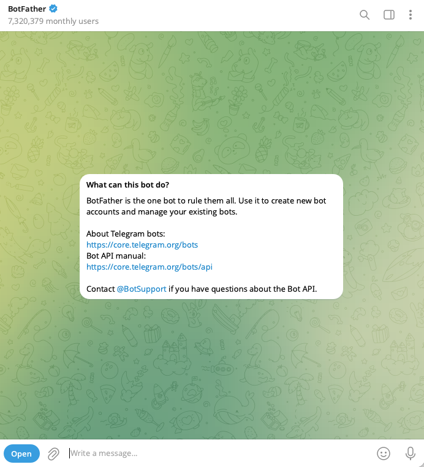
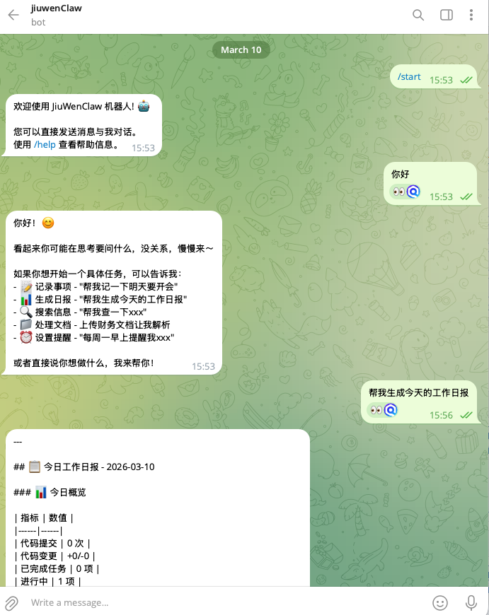

# International Channels

JiuwenSwarm supports integration with multiple international chat platforms. Below are detailed configuration instructions for each channel.

## Telegram

### 1. Create a Telegram Bot

Use [@BotFather](https://t.me/BotFather) to create a bot and get a **Bot Token**.

**Step 1:** Search for `@BotFather` in Telegram and open the conversation.



**Step 2:** Send `/newbot` and follow the prompts.

BotFather will ask you to enter:
- **Bot display name** (e.g. `JiuwenSwarm Bot`)
- **Bot username** (must end with `bot`, e.g. `jiuwenswarm_bot`)


**Step 3:** **Save the Bot Token**

After creation, BotFather returns a token in the format `123456789:ABCDefGhIJKlmN...`. Save it securely — you'll need it for configuration.

> ⚠️ **Note**: The Bot Token is equivalent to the bot's password — do not leak it. If the token is exposed, use `/revoke` in BotFather to regenerate it.

### 2. Bind the Channel

#### Option A: Web UI (recommended)

In JiuwenSwarm's frontend, click the **Agent** / **Channels** card, fill in the Bot Token in the Telegram channel module, enable it, and save.


#### Option B: Edit `config.yaml`

Edit `~/.jiuwenswarm/config/config.yaml`:

``````yaml
channels:
  telegram:
    bot_token: "<your Bot Token>"
    allow_from: []
    parse_mode: Markdown
    group_chat_mode: mention
    enabled: true
``````

If the service is already running it will auto-reload; otherwise run `jiuwenswarm-start`.

### 3. Configuration

| Field | Description | Default |
|:------|:------------|:--------|
| `bot_token` | Bot Token from @BotFather (**required**) | empty |
| `allow_from` | Allowed Telegram `user_id` whitelist; empty = all users | `[]` |
| `parse_mode` | Message parse mode: `Markdown`, `HTML`, or `None` | `Markdown` |
| `group_chat_mode` | Group chat response mode | `mention` |
| `enabled` | Enable Telegram channel | `false` |

#### Group Chat Modes

When the bot is added to a Telegram group, `group_chat_mode` controls how the bot responds:

| Mode | Description |
|:-----|:------------|
| `mention` | **Only respond to @mentions** (recommended) |
| `reply` | **Only respond to replies** |
| `all` | **Respond to all messages** |
| `off` | **Disable group chat** |

### 4. Start Chatting

**Option 1:** Search for your bot's username in Telegram and send a message to start chatting.



**Option 2:** Add the bot to a group and interact based on the `group_chat_mode` setting.


### 5. Get `user_id` (Whitelist)

To configure the `allow_from` whitelist, you need to obtain the user's Telegram `user_id`:

1. Search for `@userinfobot` in Telegram and send any message to get your `user_id`.

2. Add the obtained `user_id` to the `allow_from` list:

``````yaml
channels:
  telegram:
    bot_token: "<your Bot Token>"
    allow_from:
      - "123456789"
      - "987654321"
    enabled: true
``````

> 💡 **Tip**: When `allow_from` is an empty list, all users can use the bot. After setting a whitelist, only users in the list can chat with the bot.

---

## Discord

Discord channel integration is supported in the current version. Configure and enable the Discord Bot in **Channel Management**, or manually edit `config.yaml`.

For step-by-step instructions (Developer Portal bot creation, intents, install link, channel management), see [Discord.md](Discord.md).

### Configuration fields

- `bot_token`
- `application_id`
- `guild_id`
- `channel_id`
- `block_dm`
- `allow_from`
- `enabled`

Configure in `~/.jiuwenswarm/config/config.yaml` as follows:

``````yaml
channels:
  discord:
    bot_token: "Discord Bot Token"
    application_id: "Application ID"
    guild_id: "Target server Guild ID"
    channel_id: "Target channel Channel ID"
    block_dm: false
    allow_from: []
    enabled: true
``````

### Quick Start Guide

1. Create a Bot in the Discord Developer Portal and get the `bot_token`
2. On the Bot tab, enable **Message Content Intent**
3. Invite the bot to the target server and grant read/write channel permissions
4. Fill in the configuration in JiuwenSwarm and enable `enabled: true`

### Fields

| Field | Description | Default |
|:------|:------------|:--------|
| `bot_token` | Discord Bot Token (required) | empty |
| `application_id` | Application ID (optional, recommended) | empty |
| `guild_id` | Listen only to the specified server | empty |
| `channel_id` | Listen/reply only to the specified channel | empty |
| `block_dm` | When `true`, DMs are not processed | `false` |
| `allow_from` | Allowed Discord user ID list | `[]` |
| `enabled` | Enable Discord channel | `false` |