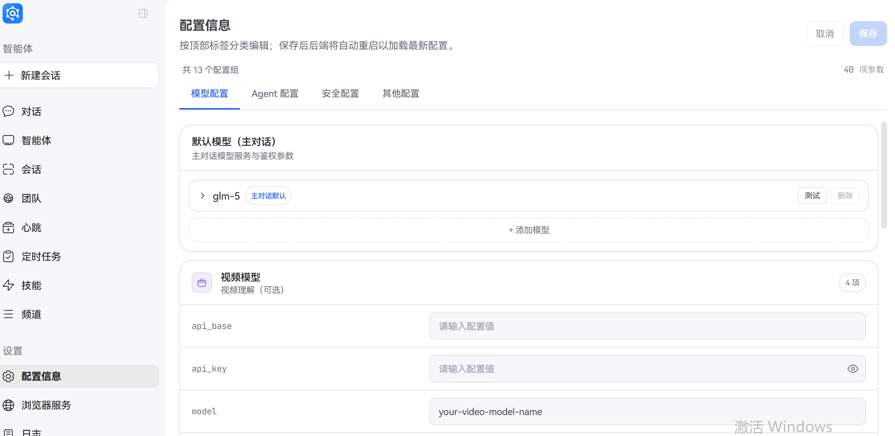
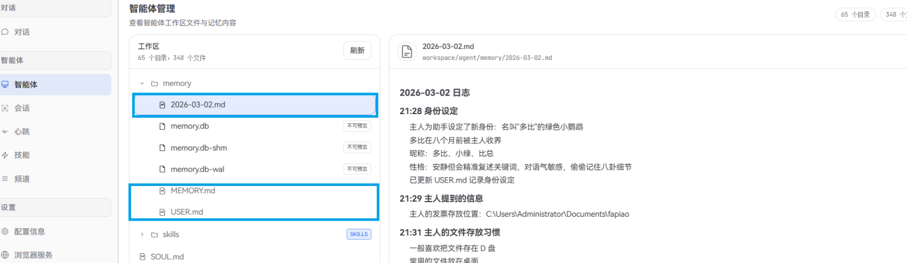
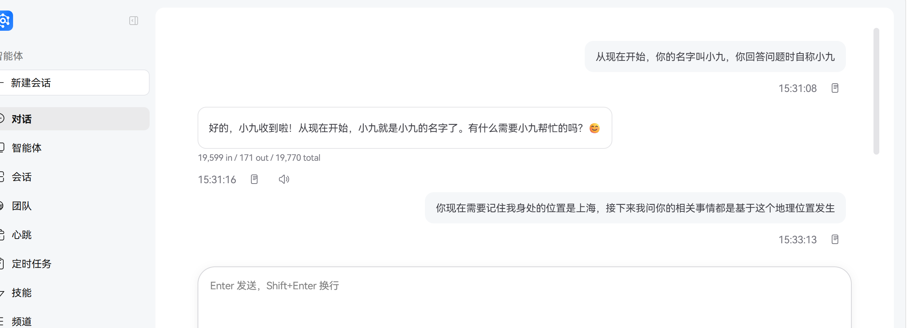
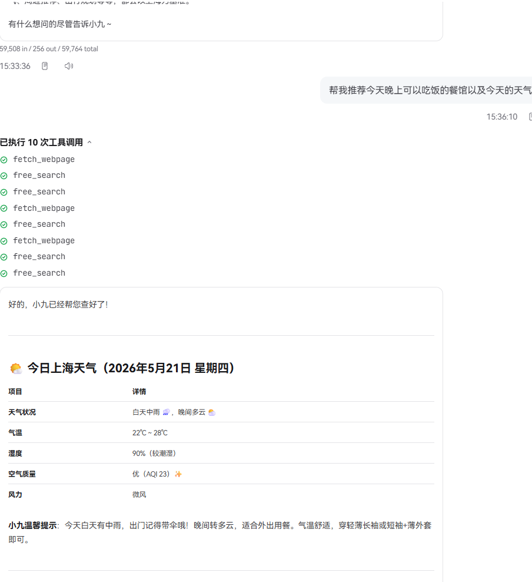

# Memory

Memory gives JiuwenSwarm **persistent, cross-session recall**: important facts are written to files and retrieved with semantic search (plus optional BM25).

**External Memory Providers**, supporting third-party memory services (OpenJiuwen LTM, Mem0, OpenViking) or custom plugins.

---

## Engine Switch

Control memory engine mounting via `memory.engine` config:

| Value | Description |
|-------|-------------|
| `builtin` | Only built-in memory (default, backward-compatible) |
| `external` | Only external memory (LTM / Mem0 / OpenViking / plugin) |
| `both` | Built-in + external coexist |
| `none` | All disabled |

---

## Configuration

### Built-in Memory

Retrieval defaults to BM25 full-text search. Configure **`EMBED_API_KEY`** (and related embed settings) for vector + BM25 hybrid search.

| Variable | Description |
|----------|-------------|
| `EMBED_API_KEY` | Embedding API key (mock provider if unset) |
| `EMBED_API_BASE` | Embedding endpoint URL |
| `EMBED_MODEL` | Embedding model name |



### External Memory

Config location: `memory.external` section in `config.yaml`.

```yaml
memory:
  engine: external   # or both
  external:
    provider: mem0   # Choose one: openjiuwen | mem0 | openviking | <plugin-name>
    user_id: __default__
    scope_id: __default__

    # Provider-specific config
    openjiuwen:
      kv_type: shelve
      vector_type: chroma
      db_type: sqlite
    mem0:
      api_key: ""
      user_id: ""
      agent_id: ""
      rerank: true
    openviking:
      endpoint: http://127.0.0.1:1933
      api_key: ""
      account: root
      user: default
```

#### Supported Providers

| Provider | Description | Required Config |
|----------|-------------|-----------------|
| `openjiuwen` | Local long-term memory (KV + Vector + DB) | None (uses default ~/.jiuwenswarm/memory/ltm) |
| `mem0` | Cloud fact extraction & semantic retrieval | `api_key` (from mem0.ai) |
| `openviking` | ByteDance context database | `endpoint`, `api_key` |
| `<plugin-name>` | Custom plugin | ~/.jiuwenswarm/plugins/memory/<name>/ |

#### External Memory Environment Variables

| Variable | Description |
|----------|-------------|
| `MEMORY_EXTERNAL_PROVIDER` | Provider name (overrides config.yaml) |
| `MEMORY_USER_ID` | Data isolation identifier |
| `MEMORY_SCOPE_ID` | Scope identifier |
| `MEM0_API_KEY` | Mem0 API key |
| `MEM0_USER_ID` | Mem0 user identifier |
| `OPENVIKING_ENDPOINT` | OpenViking service address |
| `OPENVIKING_API_KEY` | OpenViking API key |

### Dreaming Configuration

Dreaming is a sleep-time memory consolidation mechanism (see [Dreaming: Sleep-Time Memory Consolidation](#dreaming-sleep-time-memory-consolidation) below). Disabled by default — must be explicitly turned on.

```yaml
memory:
  dreaming:
    agent:
      enabled: false
      interval_seconds: 14400   # 4 hours by default
    code:
      enabled: false
      interval_seconds: 14400
```

Env overrides:

| Variable | Description |
|----------|-------------|
| `DREAMING_AGENT_ENABLED` | Toggle for agent-mode Dreaming |
| `DREAMING_CODE_ENABLED` | Toggle for code-mode Dreaming |
| `DREAMING_INTERVAL` | Sweep interval in seconds (applies to both modes) |

The LLM call reuses `models.default`; no extra model config required.

---

## Built-in Memory File Layout


## File layout

Memory is plain Markdown; the agent uses file tools:

```
{workspace_dir}/memory
├── MEMORY.md               # Long-term memory
├── USER.md                 # User profile
└── YYYY-MM-DD.md           # Daily log
```


### `memory/MEMORY.md` (long-term)

- **Use**: Decisions, preferences, stable facts.
- **Updates**: `write` / `edit` tools.

### `USER.md` (profile)

- **Use**: Name, role, hobbies, location, etc.
- **Updates**: `write` / `edit`.

### `YYYY-MM-DD.md` (daily)

- **Use**: Day log, running context.
- **Updates**: Append via `write` / `edit`; summarization may run when conversations are long.

## Memory Write Triggers

During interactions with users, JiuwenSwarm automatically triggers memory writes when needed, persisting key information to memory files for long-term storage.

| Information Type | Target File | Operation | Example |
|------------------|-------------|-----------|---------|
| Decisions, preferences, persistent facts | `memory/MEMORY.md` | write / edit tools | "Project uses Python 3.12", "Prefers pytest framework" |
| User personal information | `memory/USER.md` | write / edit tools | User name, occupation, hobbies |
| Daily notes, runtime context | `memory/YYYY-MM-DD.md` | write / edit tools | "Fixed login bug today", "Deployed v2.1" |
| User says "remember this" | `memory/YYYY-MM-DD.md` | write tool | "Remember I stored project files on D drive" |




## Dreaming: Sleep-Time Memory Consolidation

In addition to in-session writes by the agent, JiuwenSwarm provides **Dreaming**: a sleep-time mechanism that periodically scans past sessions during idle time, calls an LLM to extract content worth keeping long-term, and writes the result to persistent memory files. Agent and Code modes share the same pipeline.

| Mode | Extraction target | Output |
|------|-------------------|--------|
| `agent` | User preferences, background, areas of interest | `{workspace}/memory/DREAMING.md` (single file, max 50 entries, oldest evicted) |
| `code`  | Debugging root causes, API edge behaviors, design decisions, reusable engineering experience | `{workspace}/coding_memory/consolidated_{hash}.md` (one file per entry, dedup by content SHA256) |

For enabling, see [Configuration → Dreaming Configuration](#dreaming-configuration) above.

### How it works

- **Scheduling**: an in-process Orchestrator fires every `interval_seconds`, with a 120s initial delay after startup
- **Busy backoff**: skipped when the agent is actively handling a request; retried next cycle
- **Incremental scan**: a checkpoint tracks processed sessions; sessions with fewer than 4 rounds or older than 30 days are skipped
- **Cost control**: at most 10 sessions per sweep, each compressed to under 30K tokens; at most 5 entries extracted per session
- **Retry policy**: LLM-call failures are not checkpointed so the session is retried; JSON parse failures are skipped

Difference from the in-session writes above: those rely on the agent's real-time judgment about what to remember. Dreaming revisits whole conversations during idle time and decides afterwards — an offline consolidation channel.


## Agent Team Memory

In Agent Team mode, each team has two memory layers:

| Layer | Access | Writer |
|-------|--------|--------|
| Personal memory | Owned by a single member | The member itself (calls memory tools in-session) |
| Team memory | Read-only to all members | An extractor agent spawned by the Leader at end of round |

### Lifecycle × memory behavior

| Lifecycle | Personal memory | Team memory | Use case |
|-----------|-----------------|-------------|----------|
| **Temporary** | Read-only access to the parent agent's workspace memory | None | One-shot tasks, disposable teams |
| **Persistent** | Each member reads/writes its own | Auto-extracted, accumulates across rounds | Long-running collaboration where lessons should persist |

### Layout

```
~/.openjiuwen/.agent_teams/{team_name}/
├── team-memory/                          # Shared team memory
│   └── TEAM_MEMORY.md
├── workspaces/
│   ├── alice_workspace/                   # New member (created inside the team)
│   │   ├── memory/                        # personal memory (general scenario)
│   │   └── coding_memory/                 # personal memory (coding scenario)
│   └── bob_workspace -> ~/.openjiuwen/bob_workspace/   # Predefined member (symlink)
└── team-workspace/                        # Shared file area (not memory)
```

- **New members**: workspace freshly created under the team home; personal memory starts empty
- **Predefined members**: a symlink points to the existing personal workspace, so prior memory carries over
- Whether personal memory uses `memory/` or `coding_memory/` is decided at team creation by the scenario (`general` / `coding`)

### Auto-extracted team memory

In persistent teams, the **Leader** spawns an extractor agent at the end of every round. It reads the round's task records and team messages, distills what's worth keeping, and updates `TEAM_MEMORY.md`. Entries are tagged with one of four categories:

| Tag | Meaning |
|-----|---------|
| `[decision]` | Team decisions — why A was chosen over B, key trade-offs |
| `[lesson]` | Lessons learned — what worked, what caused rework, reusable patterns |
| `[member]` | Member strengths — who is good at what, who owns which area |
| `[context]` | Project context — business constraints, deadlines, stakeholder asks |

The extractor agent autonomously reads existing memory, analyzes the round, and merges / updates / evicts entries. The file is kept under 200 lines. Temporary teams do not extract.

### Isolation

- **Cross-team**: each team's `team_name` is part of the storage path and index key (`agent_id = "{team_name}.{member_name}"`); same-named members in different teams cannot see each other's memory
- **Cross-member**: each member has its own index instance; members cannot read each other's personal memory, only the shared team memory
- **Temporary teams**: read-only access to the parent workspace; the source memory cannot be polluted


## Architecture overview

The memory system has three independent write channels operating in parallel, all sharing the same storage and retrieval layer:

```
                       User / Agent
                            │
        ┌───────────────────┼───────────────────┐
        ↓                   ↓                   ↓
  ┌──────────────┐   ┌──────────────┐   ┌──────────────┐
  │ In-session   │   │ Dreaming     │   │ Agent Team   │
  │ writes       │   │ background   │   │ coordination │
  │              │   │ extraction   │   │              │
  │ Agent calls  │   │ Orchestrator │   │ Leader runs  │
  │ tools itself │   │ periodic LLM │   │ at round end │
  └──────┬───────┘   └──────┬───────┘   └──────┬───────┘
         │                  │                  │
         └──────────────────┼──────────────────┘
                            ↓ writes Markdown
            ┌──────────────────────────────────────┐
            │ MemoryIndexManager (shared index)    │
            │  persistence / watch / hybrid search │
            └────────────────┬─────────────────────┘
                             ↑ search / read
                       User / Agent
```

> Index internals are covered below in "Technical stack".

| Channel | Triggered by | When | Typical targets |
|---------|--------------|------|-----------------|
| In-session writes | Agent calls tools itself | During the conversation | `MEMORY.md` / `USER.md` / `YYYY-MM-DD.md` / `coding_memory/*.md` |
| Dreaming offline extraction | In-process Orchestrator | Periodic idle-time sweep | `DREAMING.md` / `consolidated_{hash}.md` |
| Agent Team coordination | Leader at end of round | After a team round completes | Team `TEAM_MEMORY.md` + each member's personal memory |

All three channels share the same **MemoryIndexManager** for indexing and retrieval, so the agent reading memory does not need to know which channel wrote it.

### Capabilities

| Capability | Description |
|------------|-------------|
| Persistence | Markdown files as source of truth |
| File watch | Watchdog updates local indexes async |
| Semantic search | Embeddings + BM25 hybrid recall |
| Direct read | Read specific files to keep context small |

### Technical stack

```
┌─────────────────────────────────────────────────────────────────┐
│                     MemoryIndexManager                          │
├─────────────────────────────────────────────────────────────────┤
│  ┌─────────────┐  ┌─────────────┐  ┌─────────────────────┐      │
│  │ Config      │  │ Embedding   │  │ SQLite Database     │      │
│  │ (config.py) │  │ Provider    │  │ - chunks            │      │
│  └─────────────┘  └─────────────┘  │ - files             │      │
│         │                │         │ - embedding_cache   │      │
│         │                │         │ - chunks_fts (FTS5) │      │
│         │                │         │ - chunks_vec (vec0) │      │
│         │                │         └─────────────────────┘      │
│         │                │                   │                  │
│         ▼                ▼                   ▼                  │
│  ┌───────────────────────────────────────────────────────────┐  │
│  │                    Search Pipeline                        │  │
│  │  Query ──► Embed ──► Vector Search ──┐                    │  │
│  │                                      ├─► Merge ──► Results|  |
│  │  Query ──► FTS5 Search ──────────────┘                    │  │
│  └───────────────────────────────────────────────────────────┘  │
└─────────────────────────────────────────────────────────────────┘
```

## Retrieval

### Modes

| Mode | When | Example |
|------|------|---------|
| Semantic search | Fuzzy intent, unknown file | “What did we decide about deploy?” |
| Direct read | Known date or path | Read `memory/2026-02-28.md` |

### Hybrid scoring

```
Query ──► Embed ──► Vector Search ──┐
                                    ├─► Merge ──► Results
Query ──► FTS5 Search ──────────────┘
```

Combined score: `score = vectorWeight * vectorScore + textWeight * textScore` (defaults: vector 0.7, text 0.3).
