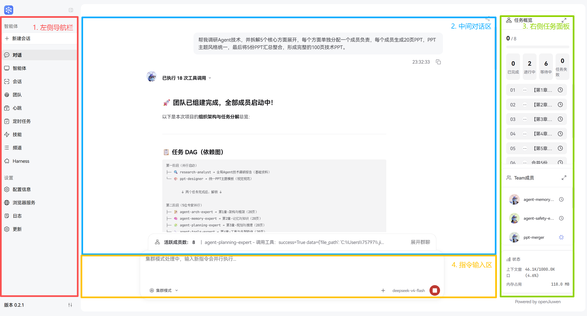
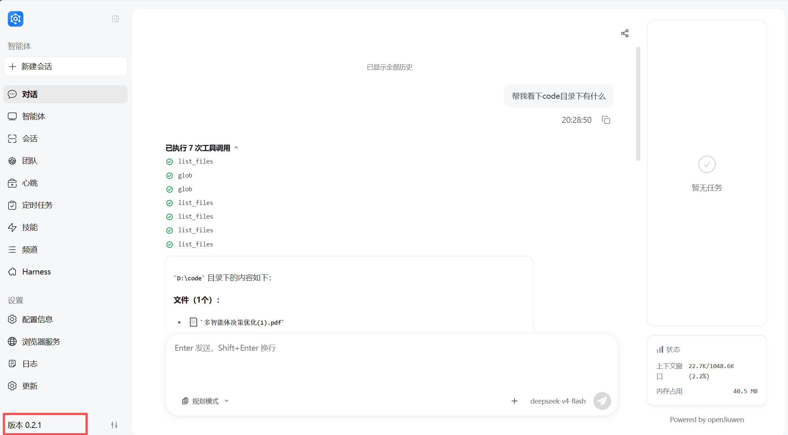
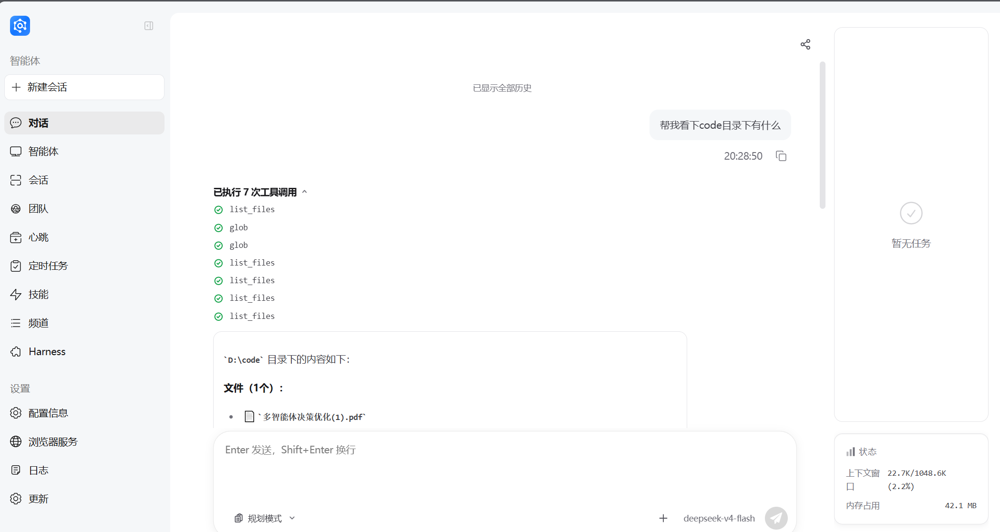
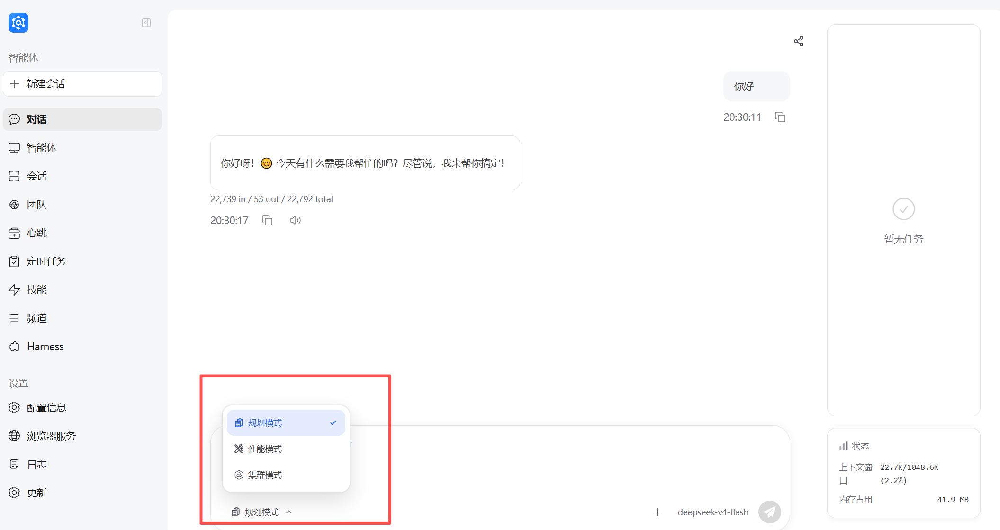
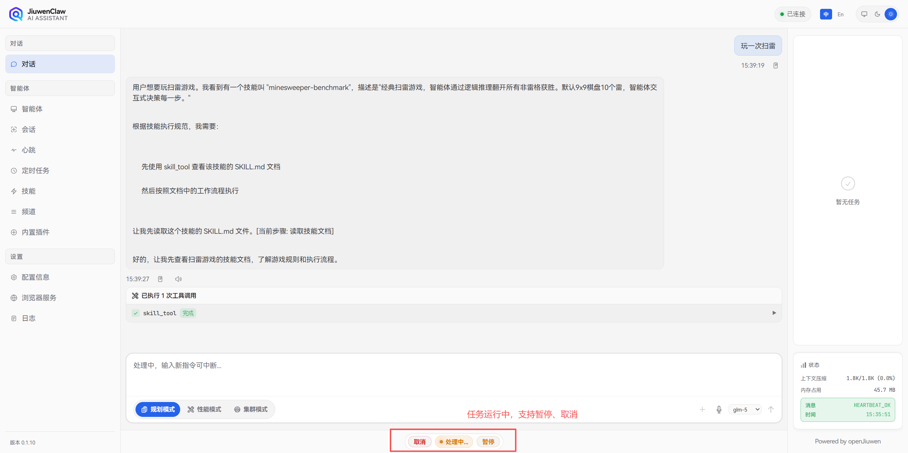
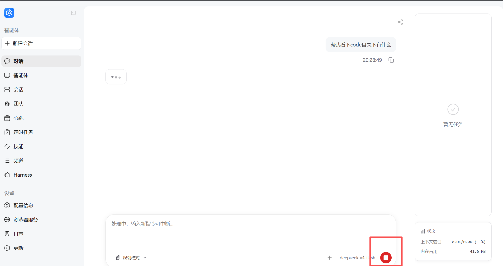
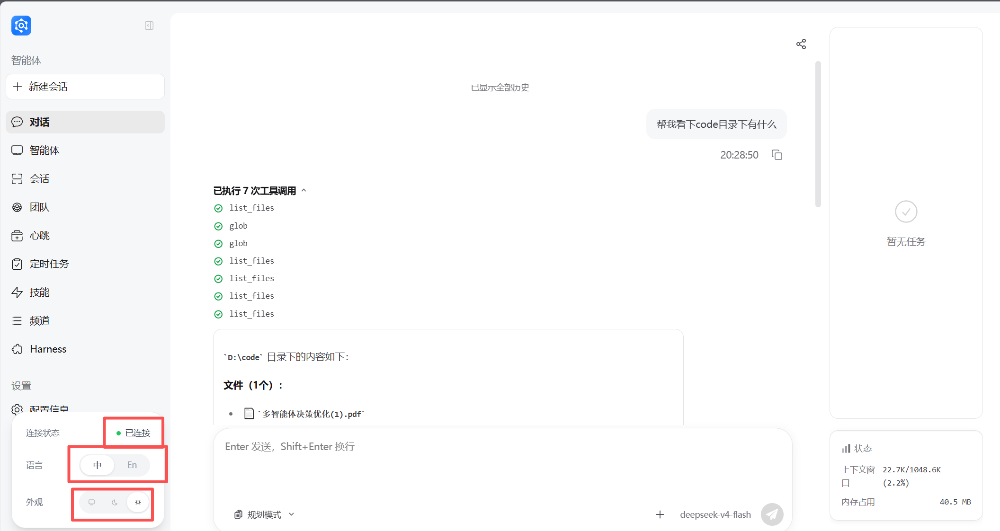

# JiuwenSwarm page overview (web)

> **Goal:** Help you understand the web UI structure, where features live, and how to interact with them. This is a foundation for deeper use.
>
> **Simplified Chinese:** [页面概览](../zh/页面概览.md)

---

## Overall layout

The JiuwenSwarm web app uses a classic three-column layout—common in professional tools and dev platforms—so information stays organized and actions are easy to reach.

### Layout at a glance

| Area | Position | Main purpose |
|------|----------|--------------|
| Left navigation | Left edge | Feature menu, version info |
| Main workspace | Center | Chat, task execution, controls |
| Right info panel | Right edge | Status, task list, system info |

 

### Layout notes

1. **Responsive design:** Regions resize with screen width.
2. **Collapsible sidebars:** You can fold the left and right areas to give the center more room.
3. **Layered information:** Core interaction is in the center; supporting details on the right.

> **Tip:** A wide display (e.g. 1920×1080 or higher) works best.

---

## Left navigation

The left bar is the main entry to features.

### Menu items

| Item | What it is | When to use it |
|------|------------|----------------|
| **Chat** | AI conversation: text in, multi-turn context | Q&A, tasks, code help, day-to-day use |
| **Agents** | Agent setup: switch personas, create custom agents, tune parameters | When you need a different style or domain expert |
| **Sessions** | Session list: history, restore context, new session | When continuing or finding past chats |
| **Team** | Team workspace management: create teams, view team directories, manage team sessions, share team resources (skills, artifacts, workspaces, etc.) | Multi-user collaboration, resource sharing, team project management |
| **Heartbeat** | Heartbeat / health: runtime checks, scheduled job signals | To confirm the system and cron-style work are healthy |
| **Scheduled tasks** | Cron-style jobs: create, edit, delete | Recurring work (e.g. daily reports, reminders) |
| **Skills** | Skills library: browse, install, configure extensions | Extra capabilities (e.g. deep search, PPT) |
| **Channels** | Outbound channels: Feishu, WeChat, Telegram, etc. | Push AI messages to other apps |
| **Harness** | Harness Package management: select Agent runtime mode, import/export extension packages, manage different version configurations | Switching native/extended mode, customizing Agent capabilities |
| **Configuration** | System and model settings | Change behavior or switch models |
| **Browser** | Browser automation | When the agent should drive a real browser |
| **Logs** | Application logs and traces | Debug issues and audit what happened |
| **Update** | App updates: check for new versions, download, install and restart | When upgrading to the latest version |

### Version info

- **Where:** **bottom-left** of the nav

- **What:** current JiuwenSwarm version
- **Why:** identify builds when reporting issues or checking compatibility

> **Note:** Some advanced features need the right permissions or config.

---

## Main workspace (center)

This is where most interaction happens.

### 1. Chat view

The primary surface for talking to JiuwenSwarm.

**Input**

- Type in the text box and send (e.g. Enter, depending on settings).

**What you see**

- Conversation history: full thread of messages
- **AI reply:** final answer and intermediate steps when shown
- **Tool calls:** tools the agent used and their results

### 2. Execution modes

JiuwenSwarm offers three execution modes. Pick the one that fits the task. Names in the app follow the UI (English strings are typically *Planning mode*, *Performance mode*, and *Cluster mode* in `en.json`).

> **Scope of this page:** only switching modes **in the app**. It does not cover changing config files or environment variables; for that, see [Configuration](Configuration.md).

| Mode (UI) | How it works | When to use it |
|------|------------|----------------|
| **Planning mode** | Breaks the request into steps and runs them in order | Complex work, step-by-step review, when you need to confirm each step |
| **Performance mode** | More flexible, can run parallel work | Simpler tasks, faster responses, when parallel helps |
| **Cluster mode** | Multi-agent: a leader coordinates specialists; subtasks in parallel; leader merges the output | Large jobs (e.g. PPT, deep research) that need many roles |

**Switching modes**

- Choose the mode in the **input area** of the main chat.
- Modes change how the agent plans and runs; in **Cluster mode** you can usually see how work is split and parallel work (as the UI shows).

### 3. Task control bar

While a task is **running**, you can often **manually** control the current run in the same area:

| State | Meaning | What you can do (typical) |
|------|---------|----------------------------|
| **Running** | The model is replying to your input | Wait; you can click **Stop** to terminate the current execution |
| **Stopped** | Stopped; the same user instruction will not continue | You can send a new input |

> 💡 **Tip**: In Cluster mode, clicking Stop pauses the current execution and you can resume it.

**Running (example)**  

**Stopped (example)**  

---

## Right info area

The right side shows system status and supporting context.

### 1. Top status row

| Item | What it shows |
|------|---------------|
| **Connection** | Backend link state (connected / disconnected / reconnecting) |
| **Language** | UI language (e.g. Chinese / English) |
| **Theme** | Light / dark / system |

### 2. Info panel

| Block | What it is | Why it helps |
|-------|------------|--------------|
| **Task list** | Current and queued work | See progress and queue |
| **Context compression** | Context compression state and compression ratio | Understand long threads |
| **Memory usage** | Current system memory consumption | Monitor resource usage |
| **Heartbeat** | System heartbeat status | Monitor system health |

> **Tip:** The info panel content updates in real time; you usually do not need to refresh manually.

---

## FAQ

**Q: The page feels slow?**  
A: Check your network, clear cache for the site, or try refreshing the page.

**Q: Connection shows “disconnected”?**  
A: Check that the backend is running and your network is OK.

---

> **Next steps:** [Quick start](Quickstart.md) and [Skills](Skills.md) for more detail (Chinese: [快速开始](../zh/Quickstart.md), [技能](../zh/技能.md)).
