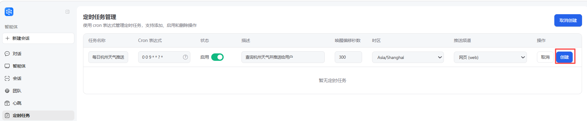
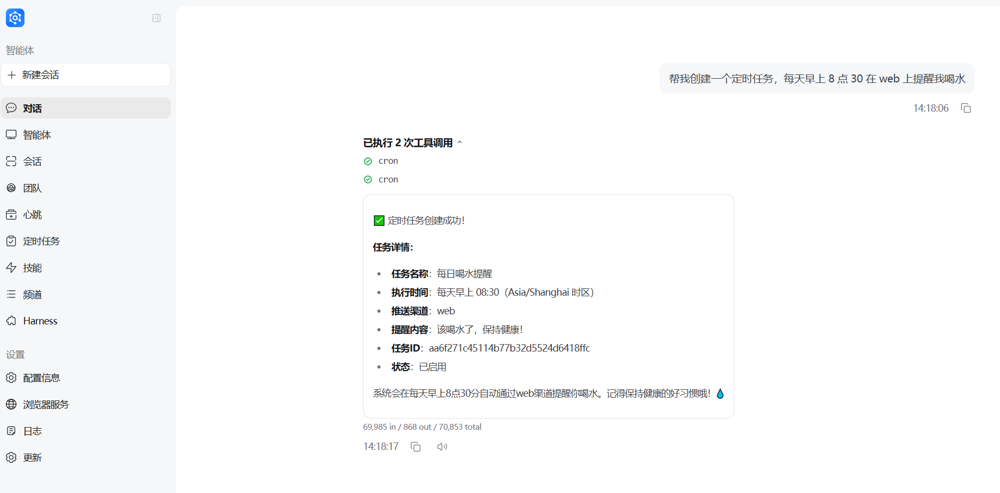

## Scheduled tasks (Cron)

How to create and manage a simple scheduled job in JiuwenSwarm and push results to a channel (e.g. web, Feishu).

---

### 1. What can cron jobs do?

- **Run a one-line instruction on a schedule**, e.g. “send me the weather in Hangzhou every morning at 9.”
- **Let the agent execute work** on a timer, such as running searches and generating results.
- **Team / SwarmFlow on a schedule** (`mode=team`, etc.): wake multi-agent workflows for reports, comparisons, and other complex jobs (see [§6](#6-team-mode-and-swarmflow-multi-agent-scheduled-jobs)).
- **Multi-channel delivery** — scheduled tasks are currently supported on web, Feishu, WeCom, DingTalk, and WeChat. Non-web channels must be enabled in channel management; see [Channels](Channels.md).

---

### 2. Create a job in the web UI

1. Open **Cron / Scheduled tasks**.
2. Click **New job** and fill in:

   - **Task name**: e.g. `Daily Hangzhou weather update`
   - **Cron expression** (supports seven-field cron expressions):
     - Every day at 09:00: `0 0 9 * * ? *`
     - Minute 15 every hour: `0 15 * * * ? *`
   - **Status (enabled)**: on means enabled
   - **Description (task content)**: a natural-language description of what the agent should do at the scheduled time, e.g.
     `Check the weather in Hangzhou and send it to the user`
   - **Wake offset in seconds** (how long before the scheduled delivery time the task starts): `300` (default)
   - **Timezone**: usually `Asia/Shanghai`
   - **Delivery channel**: select from the dropdown:
     - `Web (web)`: deliver to the web panel



3. Save. Jobs are stored in `~/.jiuwenswarm/agent/home/cron_jobs.json` and picked up by the scheduler.

---

### 3. Common cron expressions

- **Daily 09:00**: `0 0 9 * * ? *`
- **Daily 18:30**: `0 30 18 * * ? *`
- **Monday 09:00**: `0 30 9 ? * MON *`
- **Every hour on the hour**: `0 0 * * * ? *`

Format (7 fields, space-separated):
`second minute hour day month weekday year`
---

### 4. Create via chat (optional)

If the agent has `cron_create_job`, you can say things like:

> “Create a scheduled task to remind me to drink water on the web every morning at 8:30.”

The agent fills `cron_expr`, `description`, `targets`, etc., equivalent to using the form.



---

### 5. Push to the TUI channel

When `targets` is `tui` (also the default for `/cron add`):

- The scheduler **intentionally omits** `session_id`, so results are not filtered out after a TUI restart or session switch.
- The Gateway **broadcasts** these session-less notifications to **every connected TUI window**, so each open terminal receives the cron result.
- To scope reminders differently, use `targets=web`, or manage jobs via `/cron` in TUI and view them in the Web panel.

Session-scoped chat streams are routed to a single TUI window by `session_id`; cron push to TUI is the exception and reaches all windows.

---

### 6. Team mode and SwarmFlow (multi-agent scheduled jobs)

Besides the default single-agent path, cron jobs now support **Team mode**: at wake time the gateway starts multi-agent collaboration and may run a **SwarmFlow** workflow (see [Agent Team](AgentTeam.md) and [TUI SwarmFlow Guide](TUISwarmFlowGuide.md)).

#### 6.1 Supported execution modes (`mode`)

| `mode` | Description |
|---|---|
| `agent.fast` | **Default**. Single agent, fast path; good for reminders and simple queries |
| `agent` / `agent.plan` / `plan` | Single agent with planning or deeper reasoning |
| `team` | Multi-agent team; may use SwarmFlow |
| `team.plan` | Team with planning-oriented collaboration |
| `code.team` | Code-oriented team collaboration |

When creating jobs from TUI/Web, pass `mode=`. The UI loads supported modes and default timeouts via `cron.job.meta`.

#### 6.2 Examples

```text
# Weekly team report pushed to TUI
/cron add name=model-weekly cron_expr="0 9 * * 1" description="Compare GLM vs DeepSeek and output a Markdown report" mode=team targets=tui

# Simple reminder with default agent.fast
/cron add name=water cron_expr="0 30 8 * * *" description="Remind me to drink water" targets=tui
```

Optional **`timeout_seconds`** (60–259200) overrides the per-run timeout:

| Mode | Default timeout |
|---|---|
| Normal modes (e.g. `agent.fast`) | 600 s (10 min) |
| `team` / `team.plan` / `code.team` | 1200 s (20 min) |

```text
/cron add name=long-report cron_expr="0 9 * * 1" description="..." mode=team timeout_seconds=3600 targets=tui
```

#### 6.3 Execution and delivery (vs single-agent jobs)

**Execution path**

- Non-team jobs: unary Agent call on channel `__cron__`, session `cron_{timestamp}_{job_id}`.
- Team jobs: **streaming** AgentServer call with `mode=team`, same isolated session `cron_{timestamp}_{job_id}` — **not** the creator TUI `session_id`.

**Why an isolated session**

- `session_id` on the job is still stored (mainly for IM routing on Feishu and similar channels).
- Team runs use `cron_*` so closing the creator TUI does not trigger `cancel_agent_sessions_on_disconnect` against an in-flight team cron stream.
- **Trade-off**: SwarmFlow / team progress is **not** shown live in the creator TUI window during the run (events use the `cron_*` session).

**Result push**

All `targets` channels (`web`, `tui`, Feishu, DingTalk, WeCom, etc.) share the same `_push_to_targets` delivery path and body formatting:

| Scenario | Push body format |
|---|---|
| **Successful completion** | `{agent output}` (no job-name prefix, no `[cron]` prefix) |
| **Failure / timeout / no valid report** | Status text starting with `[cron]` (e.g. `[cron] 任务执行失败: …`), not wrapped with a job-name prefix |
| **In-progress placeholder** | `{job name} 正在执行中，结果稍后补发（push_at=…）` |

Channel differences are mainly **routing**, not body format:

- **`web`**: delivered to the Web chat panel; placeholders can be replaced by final results via `payload.cron.is_placeholder` and `run_id`.
- **`tui`**: intentionally omits `session_id`; Gateway **broadcasts** to every connected TUI window. Broadcast may be missed if no TUI is online at completion time.
- **Feishu / DingTalk / WeCom and other IM channels**: route via the job’s bound `session_id` and `metadata`; group-created jobs may use IMOutboundPipeline routing.

Keep the gateway running, or inspect jobs via `/cron show` or the Web Cron panel.

**Team completion detection**

Gateway and AgentServer share `jiuwenswarm/common/cron_team_completion.py` so runs do not end early when:

- A leader interim reply or placeholder text appears before the real report;
- Harness delegation still has open `team.task` entries or busy members;
- SwarmFlow has not reached `completed` while the leader already emitted an interim `chat.final`.

Structured signals (workflow completed + leader final, or harness leader final with no open tasks) gate stream end and `result_text`.

#### 6.4 Implementation map (developers)

| Module | Role |
|---|---|
| `gateway/cron/scheduler.py` | Wake/push scheduling; team stream consume/timeout; broadcast formatting |
| `gateway/cron/models.py` | `mode` / `timeout_seconds` validation and defaults |
| `common/cron_team_completion.py` | Shared team-round completion state machine |
| `server/runtime/agent_adapter/team_helpers.py` | Cron team streams and early finish of background tasks |
| `channels/tui/.../cron.ts` | `/cron` subcommands and `mode` / `timeout_seconds` |

See also [Slash commands — `/cron`](SlashCommands.md#cron-scheduled-task-management).
