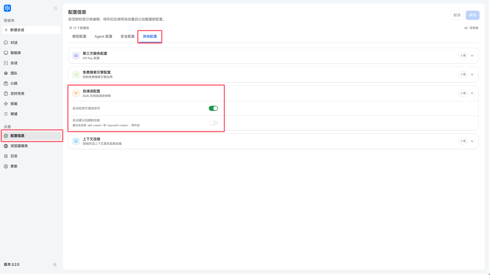
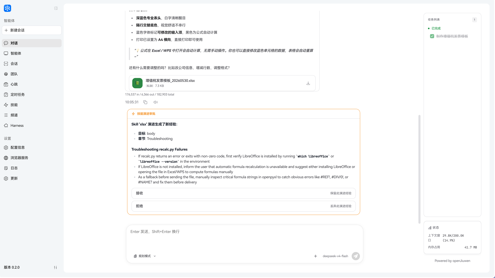
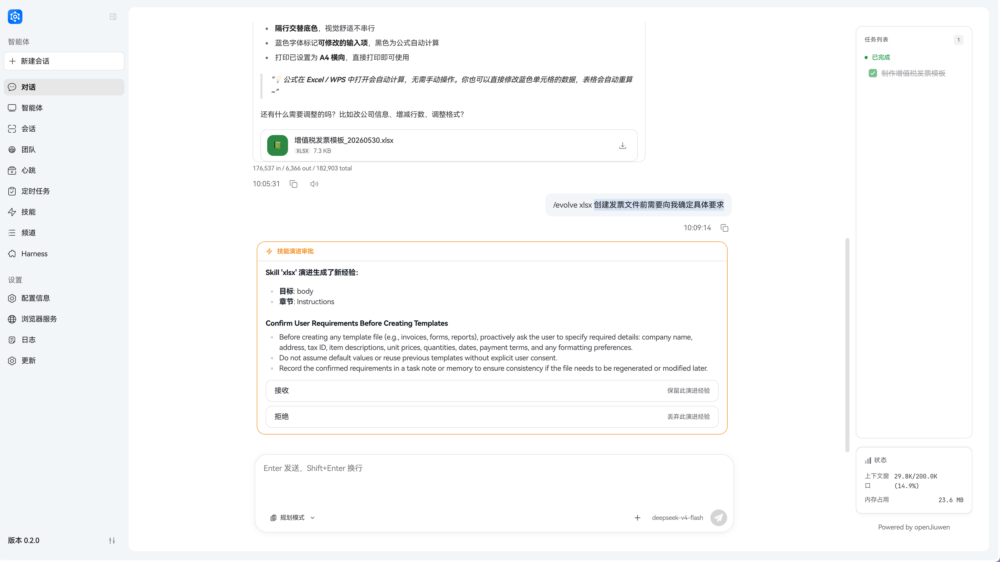
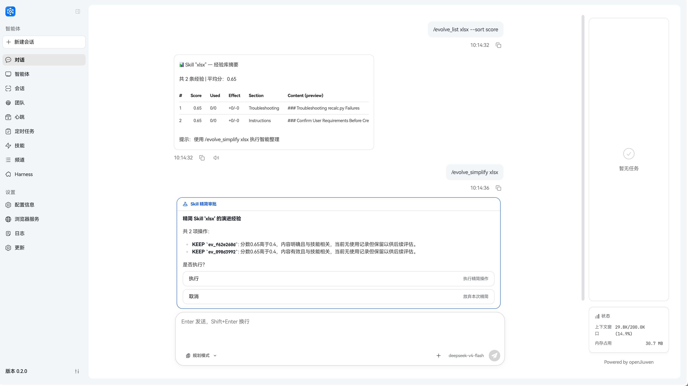
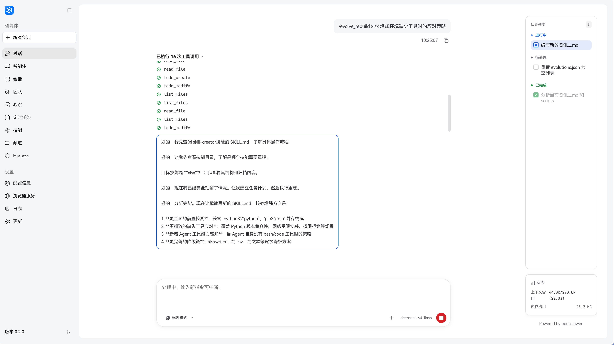

# Skill self-evolution

Most agents **freeze** skills after deployment: tool errors become log lines; user corrections do not change behavior. JiuwenSwarm uses the **openJiuwen evolution stack** with **`SkillCallOperator`** to unify skill reads/writes and evolution, plus **signal detection** that turns failures and user corrections into updates stored in **`evolutions.json`** and merged back into **`SKILL.md`** when appropriate.

## Core components

### SkillCallOperator

Central entry for skills: read `SKILL.md`, run skill logic, load accumulated evolution notes. When improvements are detected, they go to `evolutions.json` and are merged on the next skill call so the agent always sees the latest guidance.

### SkillOptimizer

Drives evolution: receives signals from `SignalDetector`, decides if they matter, calls the LLM for concrete changes, and writes evolution records. **`/evolve`** invokes this path.

### SkillEvolutionManager

Orchestrates scanning, LLM-generated records, `evolutions.json` I/O, and optional **solidify** into `SKILL.md`. Connects `SignalDetector`, `SkillOptimizer`, and `SkillCallOperator`.

### SignalDetector

Rule-based (no LLM): watches tool results for error patterns and user phrases that look like corrections, and attributes signals to the active skill.

---

## What counts as a signal?

### Execution failures

Timeouts, HTTP errors, exceptions, etc. Keywords include: `error`, `exception`, `failed`, `failure`, `timeout`, `connection error`, `econnrefused`, `enoent`, `permission denied`, `command not found`, and similar.

### User corrections

Phrases like “wrong”, “should be”, “not that”, or English: `that's wrong`, `should be`, `actually`—treated as negative feedback for the current skill.

---

## What happens after a signal?

### Failure → troubleshooting notes

Failure context is turned into actionable bullets under **Troubleshooting** (or similar) in the skill doc.

```text
Raw:
Tool 'weather-check' returned: Error: API timeout after 30s

Evolved:
## Troubleshooting
- On weather API timeout, check network first; consider retries or a fallback.
```

### Correction → examples

User corrections become **Examples** so the next run matches real intent.

```text
Raw:
User: No—I meant Shanghai, not Beijing

Evolved:
## Examples
- For "Shanghai weather" use Shanghai coordinates, not the default Beijing.
```

---

## Evolution flow

```text
User chat / tool run
        │
        ▼
┌───────────────────┐
│  SignalDetector   │
└────────┬──────────┘
         ▼
┌─────────────────────────────┐
│    SkillEvolutionManager    │  .scan()
└────────────┬────────────────┘
             ▼
┌─────────────────────────────┐
│    SkillEvolutionManager    │  .generate()
└────────────┬────────────────┘
             ▼
┌─────────────────────────────┐
│      evolutions.json        │
└────────────┬────────────────┘
             ▼ (optional)
┌─────────────────────────────┐
│         .solidify()         │  merge into SKILL.md
└─────────────────────────────┘
```

---

## Evolution file

Per-skill `evolutions.json`:

```json
{
  "skill_id": "<skill_name>",
  "version": "1.0.0",
  "updated_at": "2024-01-15T10:30:00Z",
  "entries": [
    {
      "id": "ev_1234abcd",
      "source": "execution_failure",
      "timestamp": "2024-01-15T10:30:00Z",
      "context": "API timeout after 30s",
      "change": {
        "section": "Troubleshooting",
        "action": "append",
        "content": "## FAQ\n- On API timeout..."
      },
      "applied": false
    }
  ]
}
```

`applied: false` = pending solidify; `applied: true` = merged into `SKILL.md`.

---

## Effect

Skills stay **living documents**: risks, examples, and fixes accumulate from real use. On the next skill load, `evolutions.json` is merged so behavior improves without manual editing.

---

## How to use

When using Skill self-evolution, first decide what you want to do:

- Let the system discover and preserve experience in the background: enable **Auto-detect evolution signals**.
- Immediately improve an existing Skill: use the `/evolve` commands.
- Let the system propose creating a new Skill when there is a capability gap: enable **Auto-suggest new skill creation**.

### Enable auto-evolution

In **Self-Evolution Configuration**, enable the options you need:

- **Auto-detect evolution signals**: lets the system scan failures, corrections, and other evolution signals after chat and tool execution; maps to `evolution.auto_scan` and is disabled by default.
- **Auto-suggest new skill creation**: lets the system propose creating a new Skill when no suitable Skill exists; maps to `evolution.skill_create` and is disabled by default.

If you manage settings through a config file, the corresponding keys are:

```yaml
evolution:
  auto_scan: false
  skill_create: false
```

Environment variables take precedence: `EVOLUTION_AUTO_SCAN` overrides `auto_scan`, and `SKILL_CREATE` overrides `skill_create`.



### Automatic path

When **Auto-detect evolution signals** is enabled, the system scans for evolution signals after tool execution and conversation turns. Common signals include tool failures, execution errors, user corrections, and explicit negative feedback.

When valid signals are found, the system generates evolution experience for the relevant Skill. The next time that Skill is used, the experience is loaded automatically.



### Manual evolution

If a Skill just failed, behaved incorrectly, or needs a specific improvement, use:

```bash
/evolve <skill_name> [user_query]
```

Example:

```bash
/evolve xlsx confirm detailed requirements before creating an invoice file
```



In **Planning Mode**, the system first scans the current conversation for tool failures and user corrections. If no clear signal is detected, provide `user_query` to describe what should be improved.

In **Cluster Mode**, `/evolve <skill_name>` must include an evolution intent, for example:

```bash
/evolve pptx add recovery steps when team report export fails
```

### Inspect and organize evolution experience

To inspect one Skill's evolution records and scores, use:

```bash
/evolve_list <skill_name> [--sort score]
```

Example:

```bash
/evolve_list xlsx --sort score
```

In **Planning Mode**, bare `/evolve` still returns a pending-record summary for visible Skills. Cluster Mode does not support bare `/evolve`; it requires a Skill name and an evolution intent.

If a Skill's experience library becomes repetitive, too long, or unclear, generate a cleanup proposal:

```bash
/evolve_simplify <skill_name> [user_intent]
```

Example:

```bash
/evolve_simplify xlsx merge duplicate export-failure records
```

The cleanup proposal is approval-gated. It is not written silently.



### Rebuild `SKILL.md`

When a Skill has accumulated enough evolution experience and you want to reorganize it into `SKILL.md`, use:

```bash
/evolve_rebuild <skill_name> [user_intent]
```

Example:

```bash
/evolve_rebuild xlsx add fallback steps when required tools are missing
```

This command creates a follow-up task and continues as a normal Agent / Cluster Mode task. It is not a direct overwrite button for `SKILL.md`.



### Skill auto-creation

Existing Skill evolution improves Skills that already exist. If the current task exposes a missing capability, enable **Auto-suggest new skill creation** in **Self-Evolution Configuration**. If you manage settings through a config file, use:

```yaml
evolution:
  skill_create: true
```

When enabled, the system registers `SkillCreateRail`. In Cluster Mode, it registers `TeamSkillCreateRail`. When the system judges that the task should become a reusable Skill, it proposes creation and completes it through follow-up work.

Notes:

- `skill_create` is disabled by default.
- `SKILL_CREATE=true` overrides the config file.

### Supported modes

| Mode | Support |
|---|---|
| Planning Mode `agent.plan` | Existing Skill evolution, inspection, cleanup, rebuild, and Skill auto-creation. |
| Cluster Mode `team` | Team Skill evolution, inspection, cleanup, and rebuild; `/evolve <skill_name>` requires an evolution intent. |
| Code mode / `agent.fast` | `/evolve` Skill self-evolution commands are not supported. |

### Approval and status

- `/evolve` and `/evolve_simplify` do not silently write changes. The backend pushes a confirmation question.
- Accepting persists or solidifies the generated records; rejecting discards the generated content.
- Accepted Cluster Mode Skill evolution syncs the team skill directory.
- While evolution or approval is pending, supplemental input is queued until evolution completes.

### Manage evolution experience

Evolution experience is stored in each Skill's `evolutions.json`. In normal use, prefer:

- Web UI **View skill experience**: edit `change.content`, or delete an entry and save.
- `/evolve_list <skill_name>`: inspect records and scores.
- `/evolve_simplify <skill_name> [user_intent]`: clean up, merge, or remove low-value experience.
- `/evolve_rebuild <skill_name> [user_intent]`: reorganize experience into `SKILL.md`.

Do not modify fields other than `change.content`, such as `id`, `source`, `timestamp`, `context`, `section`, `action`, `target`, `relevant`, or `applied`. These fields are generated and maintained by the system.

Location:

```
~/.jiuwenswarm/workspace/agent/skills/<skill_name>/
├── SKILL.md
├── evolutions.json
└── ...
```

```json
{
  "entries": [
    {
      "id": "ev_1cdbc3a5",
      "source": "execution_failure",
      "timestamp": "2026-03-09T09:33:08Z",
      "context": "Error context",
      "change": {
        "section": "Troubleshooting",
        "action": "append",
        "content": "Evolved content",
        "relevant": true
      },
      "applied": false
    }
  ]
}
```

After saving in the frontend, the updated experience content is loaded automatically in the next conversation.
