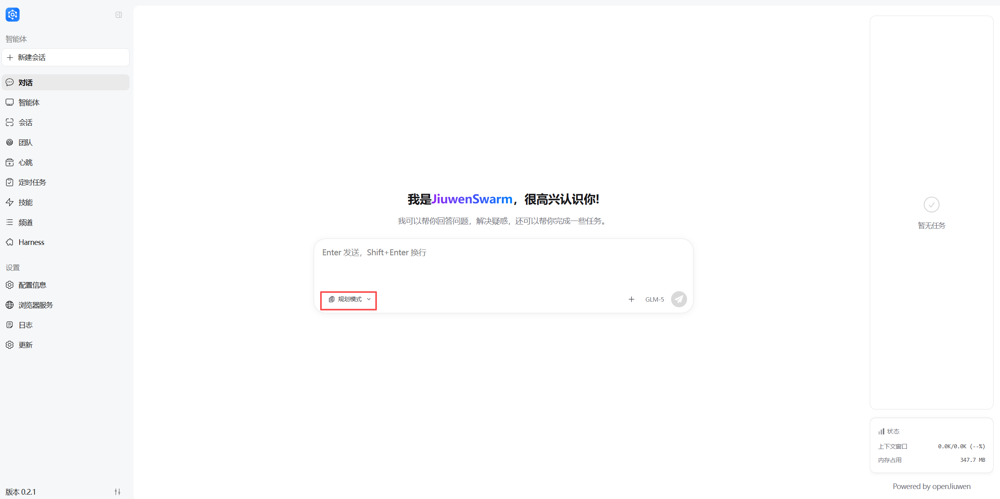

# Task planning

For long, shifting tasks, users need to **interrupt**, **insert new work**, and **merge outcomes** (e.g. finish December invoices, then add January and email a combined summary) without losing thread. JiuwenSwarm’s **task planning** mode uses structured todo tools so the agent can break work down and adapt when requirements change.

[Demo video](../assets/videos/todo.mp4)

## Core idea: dynamic breakdown and live updates

Complex requests are split into subtasks and tracked with built-in todo tools. After each subtask, state updates so progress stays visible. **openJiuwen** interrupt/resume and scheduling help insert urgent items or new goals without breaking the overall flow.

## Todo tools

JiuwenSwarm provides a series of tools covering the full task management workflow. Tasks are persisted as JSON in `workspace/todo/{session_id}/todo.json`, isolated per session with safe concurrent access.

### Tools

| Tool | Description |
| :--- | :--- |
| `todo_create` | Create the initial todo list. **Note**: If a todo list already exists for the session, it will be overwritten. |
| `todo_modify` | Modify a specified todo list, including updating, deleting, cancelling, and appending subtasks. |
| `todo_list` | List all current todo items, their states, and a summary of each subtask. |
| `todo_get` | Get the detailed description of a specified subtask. |

### States

| State | Meaning |
| :--- | :--- |
| `pending` | Not started |
| `in_progress` | In progress |
| `completed` | Done |
| `cancelled` | Cancelled |

### Typical flow

1. User asks for something complex → `todo_create` breaks it into steps.
2. User adds work mid-flight → `todo_modify` inserts it at the appropriate position.
3. Subtask done → `todo_modify` updates its state.
4. Cancel or delete a task → `todo_modify`.
5. Check status anytime → `todo_list`.
6. Get detailed information about a subtask anytime → `todo_get`.

This reduces **lost goals** and **broken execution** on long jobs.

You can toggle task planning in the chat UI. The current chat enables task planning by default and can be switched to performance mode or cluster mode.

