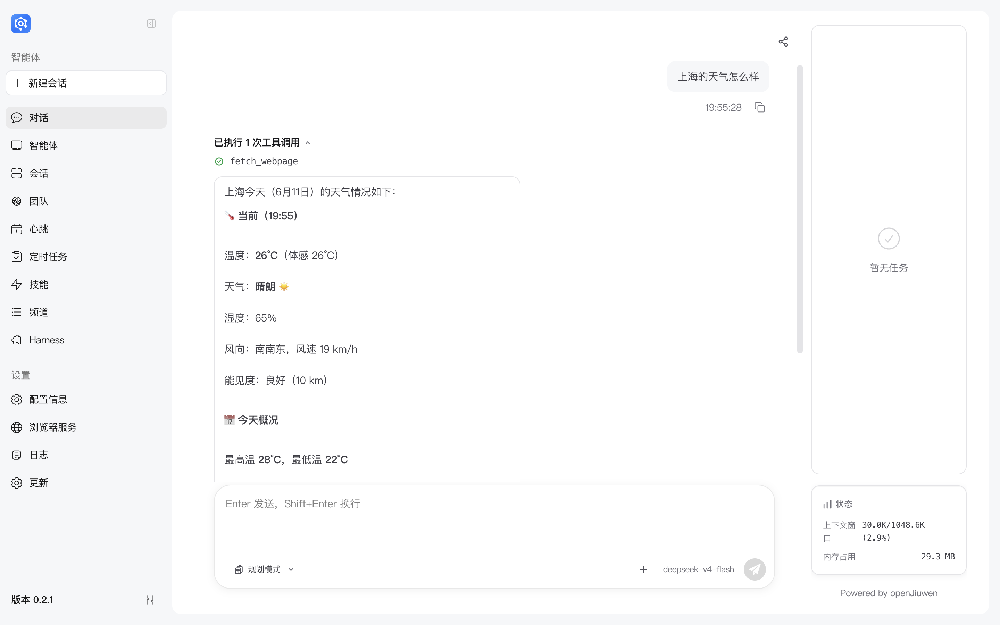

# JiuwenSwarm installation guide

> **Important:** Finishing installation does not mean the app is ready to use. You must complete model configuration first. See [Configuration](#configuration) for model setup.

---

## Prerequisites

Before installing JiuwenSwarm, make sure your system meets the following requirements:

| Dependency | Version | Notes |
|------------|---------|-------|
| OS | Windows 10/11, macOS 10.15+, Linux | Common desktop OS supported |
| Python | 3.10 – 3.12 | Python 3.11 recommended |
| Node.js | 18.x or newer | Used for the web UI |
| Git | Latest | Required for source install |

### Environment check

Run these commands in a terminal:

```bash
# Check Python
python --version

# Check Node.js
node --version

# Check Git
git --version
```

---

## First-time installation

### Option 1: Desktop installer (dmg / exe)

For Windows and macOS users who want a ready-to-run app without setting up Python / Node.js themselves. Download the installer for your platform from the gitcode [Release](https://gitcode.com/openJiuwen/jiuwenswarm/releases) page.

| Platform | Artifact |
|----------|----------|
| Windows | `JiuwenSwarm-setup-<version>.exe` |
| macOS | `JiuwenSwarm-<version>.dmg` |

Releases: https://gitcode.com/openJiuwen/jiuwenswarm/releases

#### 1. macOS: download the dmg with curl (recommended)

> ⚠️ **Important:** A `.dmg` downloaded through a browser gets a macOS quarantine flag (`com.apple.quarantine`). When opened it triggers a Gatekeeper check and may report "damaged and can't be opened" or "can't be verified developer". Downloading from the terminal with `curl` does not add the quarantine flag, so the dmg mounts and installs normally.

```bash
# Replace <version> with the target version
curl -L --fail -o JiuwenSwarm-<version>.dmg \
  https://gitcode.com/openJiuwen/jiuwenswarm/releases/download/JiuwenSwarm<version>/JiuwenSwarm-<version>.dmg
```

#### 2. Install and first launch

- **macOS**: double-click to mount the dmg, then drag `JiuwenSwarm.app` into `Applications`. You may right-click it in Finder and choose "Open".
- **Windows**: double-click the downloaded installer (`.exe`) and follow the prompts; it initializes the workspace automatically.

On first launch the app creates `~/.jiuwenswarm/`. Then follow [Post-start verification](#3-post-start-verification) to finish model configuration.

> Match the version to the actual download link on the Release page. For Windows auto-update behavior, see [Windows auto-update design](WindowsAutoUpdateDesign.md).

---

### Option 2: pip install

#### 1. Installation steps

```bash
# Create a virtual environment (recommended)
python -m venv jiuwenswarm-env

# Activate the virtual environment
# Windows:
jiuwenswarm-env\Scripts\activate
# macOS/Linux:
source jiuwenswarm-env/bin/activate

# Install JiuwenSwarm
## Option 1: default install
pip install jiuwenswarm

## Option 2: use a China mirror (recommended)
# Tsinghua mirror
pip install jiuwenswarm -i https://pypi.tuna.tsinghua.edu.cn/simple

# Aliyun mirror
pip install jiuwenswarm -i https://mirrors.aliyun.com/pypi/simple/
```

#### 2. First launch

```bash
# Initialize JiuwenSwarm (first run)
jiuwenswarm-init
# Start JiuwenSwarm
jiuwenswarm-start
```

After the first start, the app creates the config directory `~/.jiuwenswarm/`.

#### 3. Post-start verification

After a successful start, verify the installation with these steps:

1. **Open the Web UI**: in your browser go to `http://localhost:5173`
2. **Open configuration**: in the left sidebar choose **Configuration**
3. **Configure the model**: follow [Configuration](Configuration.md) to set up your model API
4. **Confirm it works**:
   - The Web UI loads
   - After model configuration you can run a basic chat



> 💡 **Tip:** If the Web UI does not load, check `~/.jiuwenswarm/logs/` for errors.

#### 4. Restarting the service

If you closed JiuwenSwarm and want to run it again:

```bash
# Start again
jiuwenswarm-start
```

---

### Option 3: Install from source (uv)

#### 1. Install uv

```bash
# Windows (PowerShell)
powershell -ExecutionPolicy ByPass -c "irm https://astral.sh/uv/install.ps1 | iex"

# macOS/Linux
curl -LsSf https://astral.sh/uv/install.sh | sh
```

#### 2. Clone and install

```bash
# Clone the repository
git clone https://gitcode.com/openJiuwen/jiuwenswarm.git

# Enter project directory
cd jiuwenswarm

# Create venv and install dependencies with uv
uv venv
uv pip install -e .
```

#### 3. Build the front end

> ⚠️ **Important:** With a source (editable) install you must build the front end manually, or startup will fail with `dist directory not found`.

```bash
# Enter front-end directory
cd jiuwenswarm/channels/web

# Install front-end dependencies
npm install

# Build
npm run build

# Copy build output into the user workspace
# Windows:
xcopy /E /I dist %USERPROFILE%\.jiuwenswarm\channels\web\frontend\dist
# macOS/Linux:
cp -r dist ~/.jiuwenswarm/channels/web/frontend/dist

# Back to repo root
cd ..
```

**Notes:**

- `pip install -e .` / `uv pip install -e .` is an editable install that points at your source tree.
- `web/dist` is ignored by `.gitignore` and is not shipped in the repo.
- You must build and copy artifacts to `~/.jiuwenswarm/channels/web/frontend/dist`.

#### 4. First launch

```bash
# Activate virtual environment
# Windows:
.venv\Scripts\activate
# macOS/Linux:
source .venv/bin/activate

# Initialize JiuwenSwarm (first run)
jiuwenswarm-init
# Start
jiuwenswarm-start
```

#### 5. Restarting the service

```bash
# After activating the virtual environment
jiuwenswarm-start
```

---

### Option 4: Install from source (conda)

#### 1. Check and install conda

**Check if conda is installed:**

```bash
conda --version
```

If a version is printed, conda is installed and you can skip installation.

**Install conda (if missing):**

Miniconda (lightweight) is recommended:

| System | How to install |
|--------|----------------|
| Windows | PowerShell commands below |
| macOS | `brew install --cask miniconda` or download the installer |
| Linux | Commands below |

**Install Miniconda on Windows (PowerShell):**

```powershell
# Download Miniconda installer
Invoke-WebRequest -Uri "https://repo.anaconda.com/miniconda/Miniconda3-latest-Windows-x86_64.exe" -OutFile "miniconda.exe"

# Silent install (default location)
start /wait "" .\Miniconda3-latest-Windows-x86_64.exe /InstallationType=[JustMe|AllUsers] /AddToPath=[0|1] /RegisterPython=[0|1] /S /D=<install_path>

# After install, open a new terminal and run conda --version. If it prints a version, install and PATH are OK.
```

**Install Miniconda on Linux:**

```bash
# Download and install Miniconda
curl -sSL https://repo.anaconda.com/miniconda/Miniconda3-latest-Linux-x86_64.sh -o miniconda.sh
bash miniconda.sh -b -p $HOME/miniconda3

# Add to PATH
export PATH="$HOME/miniconda3/bin:$PATH"

# Initialize conda (optional; takes effect after restarting the shell)
conda init
```

#### 2. Create the conda environment

```bash
# Create environment
conda create -n jiuwenswarm python=3.11

# Initialize conda (first time)
conda init
# After init, close the window and open a new session before activate

# Activate environment
conda activate jiuwenswarm
```

#### 3. Clone and install

```bash
# Clone the repository
git clone https://gitcode.com/openJiuwen/jiuwenswarm.git

# Enter project directory
cd jiuwenswarm

# Install dependencies
pip install -e .
```

#### 4. Build the front end

> ⚠️ **Important:** With a source (editable) install you must build the front end manually, or startup will fail with `dist directory not found`.

```bash
# Enter front-end directory
cd jiuwenswarm/channels/web

# Install front-end dependencies
npm install

# Build
npm run build

# Copy build output into the user workspace
# Windows:
xcopy /E /I dist %USERPROFILE%\.jiuwenswarm\channels\web\frontend\dist
# macOS/Linux:
cp -r dist ~/.jiuwenswarm/channels/web/frontend/dist

# Back to repo root
cd ..
```

**Notes:**

- `pip install -e .` is an editable install that points at your source tree.
- `web/dist` is ignored by `.gitignore` and is not shipped in the repo.
- You must build and copy artifacts to `~/.jiuwenswarm/channels/web/frontend/dist`.

#### 5. First launch

```bash
# Initialize JiuwenSwarm (first run)
jiuwenswarm-init
# Start
jiuwenswarm-start
```

#### 6. Restarting the service

```bash
# Activate environment, then start
conda activate jiuwenswarm
jiuwenswarm-start
```

---

## Version upgrades

| Current range | Approach | Notes |
|---------------|----------|-------|
| Same major (e.g. 0.1.x → 0.1.y) | [Routine version upgrades](#routine-version-upgrades) | Upgrade directly; no backup required |
| Cross-major (e.g. 0.1.x → 0.2.x) | [Major version upgrades](#major-version-upgrades) | Back up data first |

---

### Routine version upgrades

#### pip install upgrade

```bash
# Activate your virtual environment
# Then upgrade
pip install --upgrade jiuwenswarm
```

#### Source install upgrade

```bash
# Enter project directory
cd jiuwenswarm

# Pull latest
git pull

# Reinstall
pip install -e .

# Rebuild the front end (when it changed)
cd jiuwenswarm/channels/web
npm install
npm run build

# Copy build output
# Windows:
xcopy /E /I dist %USERPROFILE%\.jiuwenswarm\channels\web\frontend\dist
# macOS/Linux:
cp -r dist ~/.jiuwenswarm/channels/web/frontend/dist

cd ..
```

---

### Major version upgrades

> ⚠️ Always back up your data before upgrading across major versions.

#### 1. Data backup

**Windows:**

```bash
# Back up the whole config and data directory
xcopy "%USERPROFILE%\.jiuwenswarm" "%USERPROFILE%\.jiuwenswarm_backup" /E /I

# Or with PowerShell (recommended)
Copy-Item -Path "$env:USERPROFILE\.jiuwenswarm" -Destination "$env:USERPROFILE\.jiuwenswarm_backup" -Recurse
```

**macOS/Linux:**

```bash
# Back up the whole config and data directory
cp -r ~/.jiuwenswarm ~/.jiuwenswarm_backup

# Or with rsync (recommended; preserves permissions)
rsync -av ~/.jiuwenswarm ~/.jiuwenswarm_backup
```

**What to back up:**

| Path | Description |
|------|-------------|
| `config/config.yaml` | Main config (models, API keys, etc.) |
| `config/.env` | Environment variables |
| `agent/memory/` | User memory data |
| `agent/home/` | Identity and task data |
| `agent/skills/` | Skills library (custom skills and config) |
| `agent/workspace/` | Workspace files |

#### 2. Perform the upgrade

Pick the steps that match how you installed JiuwenSwarm:

##### pip install upgrade

Same as [Routine version upgrade – pip install upgrade](#pip-install-upgrade):

```bash
# Activate virtual environment
# Windows:
jiuwenswarm-env\Scripts\activate
# macOS/Linux:
source jiuwenswarm-env/bin/activate

# Upgrade
pip install --upgrade jiuwenswarm
```

##### Source install upgrade

Same as [Routine version upgrade – source install upgrade](#source-install-upgrade):

```bash
# Enter project directory
cd jiuwenswarm

# Pull latest
git pull

# Reinstall
pip install -e .
```

#### 3. Data migration

After upgrading, migrate data so config and stores match the new version.

##### Step 1: Review config changes

```bash
# View the new config template (source install)
cat docs/config_template.yaml

# Or read the changelog
# https://gitcode.com/openJiuwen/jiuwenswarm/blob/develop/docs/CHANGELOG.md
```

##### Step 2: Migrate configuration

1. **Compare old and new config shape**

   New releases may add or remove options. Check:
   - New required keys in `config.yaml`
   - New variables in `.env`
   - Deprecated or renamed keys

2. **Migrate by hand**

   ```bash
   # Back up the new default config
   cp ~/.jiuwenswarm/config/config.yaml ~/.jiuwenswarm/config/config.yaml.new

   # Restore from backup (use with care)
   # Prefer diff/merge in an editor instead of blind overwrite
   ```

3. **Common migration cases**

   | Case | What to do |
   |------|------------|
   | New model support | Add the new model block in `config.yaml` |
   | API endpoint change | Update URLs in `.env` |
   | Renamed keys | Map old → new using the changelog |
   | Removed keys | Delete obsolete entries |

##### Step 3: Migrate memory data

Memory is usually backward compatible; still verify:

```bash
# Inspect memory layout
ls ~/.jiuwenswarm/agent/memory/

# If something looks wrong, restore from backup
cp -r ~/.jiuwenswarm_backup/agent/memory/* ~/.jiuwenswarm/agent/memory/
```

##### Step 4: Verify migration

```bash
# Start the service
jiuwenswarm-start

# Watch logs for config errors
# Logs: ~/.jiuwenswarm/logs/
```

**Migration checklist:**

- [ ] Service starts cleanly
- [ ] Model config works (chat OK)
- [ ] Historical memory is readable
- [ ] Custom settings carried over
- [ ] No serious errors or warnings

---

## Configuration

After installation, configure models before normal use. Files live under:

- **Config directory:** `~/.jiuwenswarm/config/`
- **Main file:** `config.yaml`
- **Environment:** `.env`

For details see the [configuration guide](https://gitcode.com/openJiuwen/jiuwenswarm/blob/develop/docs/en/Configuration.md) ([Chinese](https://gitcode.com/openJiuwen/jiuwenswarm/blob/develop/docs/zh/%E9%85%8D%E7%BD%AE%E4%BF%A1%E6%81%AF.md)).


## FAQ

### Q: On start I see "Python version not supported"

Use Python 3.10, 3.11, or 3.12.

### Q: On start I see "Node.js not found"

Install Node.js 18.x or newer.

### Q: How do I check the installed version?

```bash
jiuwenswarm --version
```

### Q: How do I uninstall?

```bash
pip uninstall jiuwenswarm
```

---

## Related links

- **Web UI (page overview):** [Page-Overview.md](Page-Overview.md)（[简体中文版](../zh/页面概览.md)）
- **Repository:** https://gitcode.com/openJiuwen/jiuwenswarm
- **Issues:** https://gitcode.com/openJiuwen/jiuwenswarm/issues
- **Docs:** https://gitcode.com/openJiuwen/jiuwenswarm/tree/develop/docs

---

*Last updated: 2026-05-09*
