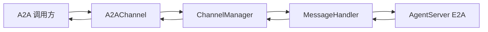

# A2A 接入说明

本文说明 Gateway 侧 **A2A Server**（`A2AChannel`）的实现位置、配置方式、与内部 `Message`/E2A 的对应关系及本地验证命令；出站 A2A（Agent 调外部）见 §7。

> **实现**：`jiuwenswarm/gateway/channel_manager/protocol/a2a/a2a_connect.py`（`A2AChannel` + `a2a-sdk`）。**入口进程**：`python -m jiuwenswarm.gateway.app_gateway`（`jiuwenswarm/gateway/app_gateway.py` 中注册并启动）。**冲突时**：以源码为准，并回头修正本文。

---

## 0. 文档位置与单一真源

| 位置 | 角色 |
|------|------|
| **docs/zh/A2A.md**（本文） | 接入与开发联调：模块、配置、映射、验证 |
| `jiuwenswarm/gateway/channel_manager/protocol/a2a/a2a_connect.py` | A2A HTTP 服务、`AgentCard`、请求/响应与 `Message` 互转 |
| `jiuwenswarm/gateway/app_gateway.py` | 环境变量读取、`A2AChannel` 构造与 `channel_manager.register_channel` |
| `jiuwenswarm/gateway/message_handler/message_handler.py` | 与 AgentServer 的 E2A 收发、内部 `Message` 编排 |
| `jiuwenswarm/gateway/channel_manager/channel_manager.py` | 频道注册与 `robot_messages` → `Channel.send` 派发 |
| [E2A-protocol.md](E2A-protocol.md) | Gateway↔AgentServer 内层协议 |

---

## 1. 职责边界

- **入站（本文）**：外部 A2A 客户端 → `A2AChannel` → `ChannelManager` → `MessageHandler` → E2A → AgentServer；回复沿同一路径返回，经 `TaskStatusUpdateEvent` / `TaskArtifactUpdateEvent` 输出（流式）或聚合结果（非流式）。
- **出站**：Agent 侧通过 A2A MCP Hub 等工具访问外部 A2A，接线在 AgentServer 适配层（见 §7），不在 `A2AChannel` 内实现。

---

## 2. 与 Web / ACP 通道的对照

| 项目 | Web | ACP | A2A（当前） |
|------|-----|-----|-------------|
| 绑定 | `WEB_HOST` / `WEB_PORT` / `WEB_PATH` | `ACP_GATEWAY_*` | `A2A_SERVER_*` |
| 配置来源 | 环境变量 + CLI（`--host` 等） | 仅环境变量 | 仅环境变量 |
| `.env` | `app_gateway` 启动时 `load_dotenv(get_env_file())`，即 `~/.jiuwenswarm/config/.env` | 同上 | 同上 |

---

## 3. 环境变量（Gateway）

在 `~/.jiuwenswarm/config/.env` 或进程环境中设置（`app_gateway.py` 读取）：

启用 A2A 前请先安装可选依赖：

```bash
pip install "jiuwenswarm[a2a]"
# 或（仓库/开发环境）
uv sync --extra a2a
```

| 变量 | 默认 | 说明 |
|------|------|------|
| `A2A_SERVER_ENABLED` | 未设则关闭 | `1` / `true` / `yes` / `on` 为开启 |
| `A2A_SERVER_HOST` | `127.0.0.1` | HTTP 监听地址；对外服务常用 `0.0.0.0` |
| `A2A_SERVER_PORT` | `19100` | 与 Web、ACP 端口勿冲突 |
| `A2A_SERVER_PATH` | `/a2a` | JSON-RPC 入口路径 |
| `A2A_SERVER_PROTOCOL_VERSION` | `1.0.0` | 写入 `AgentCard` 的 `AgentInterface.protocol_version` |
| `A2A_SERVER_CARD_PATH` | `/.well-known/agent-card.json` | Agent Card 对外路径 |
| `A2A_SERVER_EXTENDED_CARD_PATH` | `/agent/authenticatedExtendedCard` | Extended Card 对外路径 |
| `A2A_SERVER_APP_NAME` | `JiuwenSwarm Gateway A2A Server` | Agent Card `name` |
| `A2A_SERVER_APP_DESCRIPTION` | `A2A ingress for JiuwenSwarm Gateway` | Agent Card `description` |
| `A2A_SERVER_APP_VERSION` | `0.1.0` | Agent Card `version` |

AgentServer 连接仍由网关既有逻辑配置（例如 `AGENT_SERVER_URL` 等），与 A2A 监听端口独立。

当 `A2A_SERVER_ENABLED=true` 且未安装 `jiuwenswarm[a2a]`（或 `uv sync --extra a2a`）时，Gateway 主流程仍会继续启动；A2A 通道启动失败会在日志中输出明确安装指引。

---

## 4. 对外端点

- **JSON-RPC**：`http://{A2A_SERVER_HOST}:{A2A_SERVER_PORT}{A2A_SERVER_PATH}`
- **Agent Card**：`http://{host}:{port}/.well-known/agent-card.json`（路径由 `A2AChannelConfig.card_path` 定义，默认 `/.well-known/agent-card.json`）

`AgentCard` 在 `A2AChannel.start()` 内构造：`supported_interfaces[0].url` 指向上述 JSON-RPC；`capabilities.streaming` 与技能列表见源码。

---

## 5. 数据流（概要）



入站将 A2A `message.parts` 映射为 `Message.params` 的 `query` 与可选 `files`；不写入 `params["a2a"]` 等扩展结构。回包将内部 `Message.payload` 映射为 A2A `Part` 列表（含多模态与工具事件文本化）。

---

## 6. 字段映射摘要

### 6.1 请求（A2A → `Message`）

| A2A / 上下文 | 内部 |
|--------------|------|
| `task_id` 或生成值 | `Message.id`（与回包关联） |
| `context_id` | `Message.session_id` |
| `parts[].text` | 合并为 `params.query` |
| `parts` 中非文本（url / data / raw） | `params.files[]`（含与 web 对齐的冗余键） |
| 元数据 | `Message.metadata` |

### 6.2 响应（`Message` → A2A）

| 内部 | A2A |
|------|-----|
| `payload.content`、工具相关事件等 | `Part(text=...)` 等 |
| `payload.files[]` | `Part` 的 url / data / raw 等 |

---

## 7. 出站 A2A（Agent 侧）

- 当前仓库未包含独立的 A2A MCP Hub 注册模块；若后续恢复该能力，请以实际接线代码与环境变量定义为准。

---

## 8. 本地验证（示例）

非流式：

```bash
curl -sS -X POST "http://127.0.0.1:${A2A_SERVER_PORT:-19100}${A2A_SERVER_PATH:-/a2a}" \
  -H 'Content-Type: application/json' \
  -d '{"jsonrpc":"2.0","id":"t1","method":"SendMessage","params":{"message":{"messageId":"m1","contextId":"c1","role":"ROLE_USER","parts":[{"text":"ping"}]}}}'
```

流式：

```bash
curl -sS -N -X POST "http://127.0.0.1:${A2A_SERVER_PORT:-19100}${A2A_SERVER_PATH:-/a2a}" \
  -H 'Content-Type: application/json' \
  -d '{"jsonrpc":"2.0","id":"t2","method":"SendStreamingMessage","params":{"message":{"messageId":"m2","contextId":"c2","role":"ROLE_USER","parts":[{"text":"ping"}]}}}'
```

需同时启动 AgentServer 与 Gateway，且 `A2A_SERVER_ENABLED=true`。

---

## 9. 已知扩展点

- 鉴权、限流、超时与观测指标：由网关或前置代理统一补强时，保持 `A2AChannel` 只做协议与消息映射为宜。
- `jiuwenswarm/resources/.env.template` 未预置 A2A/ACP 键时，可在本地 `.env` 手工追加（与 §2 一致）。
