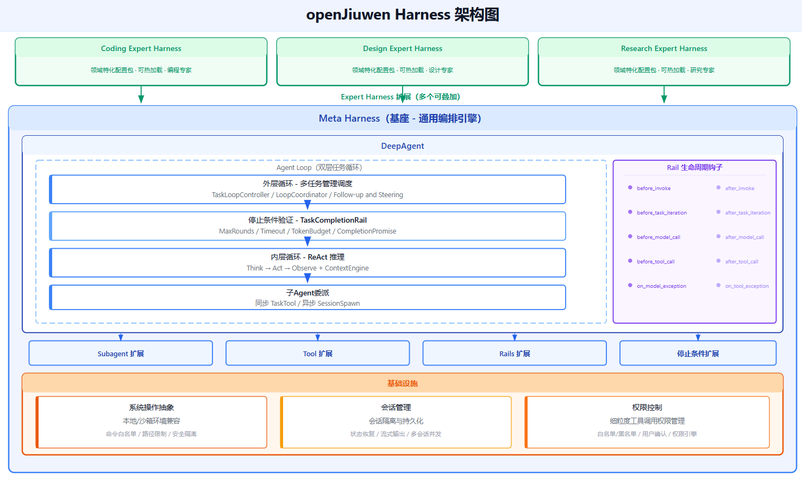
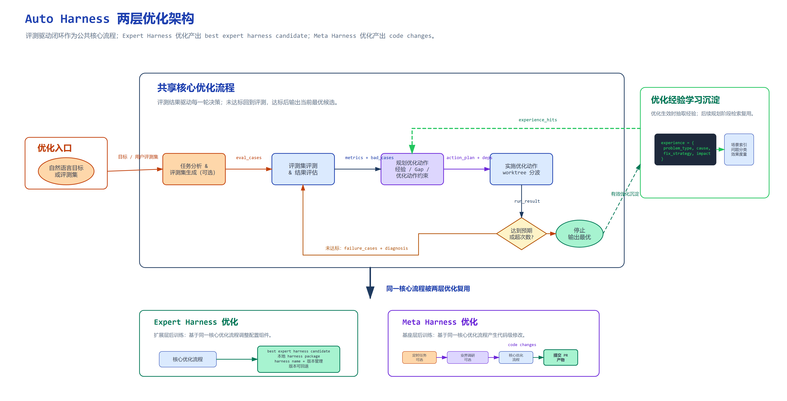
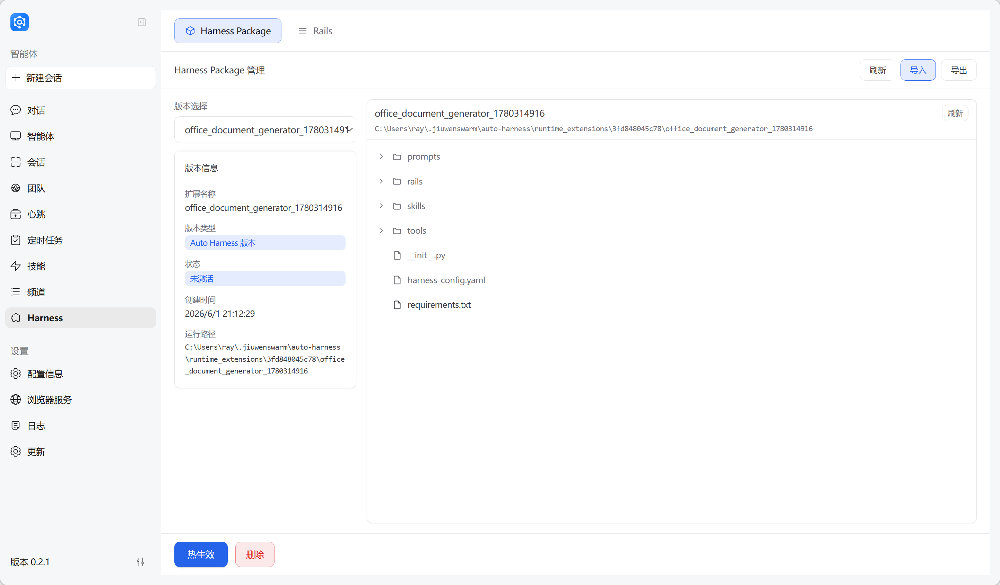

# Auto Harness

## 简介

Auto Harness 是 JiuwenSwarm 平台基于 openJiuwen Agent Core 的 Agent 自主优化方案，目标是对 Harness 层实现"后训练"——让 Agent 能够自主分析自身 Harness 的不足、生成改进方案、实现并验证修改，最终将优化成果以 Package 或 PR 的形式沉淀。

> **Agent = Model + Harness**：模型能力由 LLM 提供，但 Harness（提示词、工具、Rails、技能等编排逻辑）决定了 Agent 的实际表现。Auto Harness 让优化 Harness 这件事本身自动化。

---

## 一、特性介绍

### 1.1 背景与动机

Harness 是 Agent 的"后半身"——模型能力由 LLM 提供，但 Harness（提示词、工具、Rails、技能等编排逻辑）决定了 Agent 的实际表现。如果把 LLM 比作大脑，Harness 就是躯干和四肢，负责把大脑的能力落地执行。



Harness 需要优化的核心组件包括：

| 组件 | 说明 |
|------|------|
| **Prompts** | Agent 的系统提示词，决定行为模式和角色定位 |
| **Tools** | Agent 可调用的工具集，影响能力边界 |
| **Rails** | 运行时安全护栏，控制行为边界 |
| **Skills** | 可复用的技能模版，封装特定场景的完整能力 |

传统调优依赖人工经验：调整 prompt、替换工具、增加 Rail 需要反复试错，且调优手感难以跨场景复用，换一个领域或客户基本推倒重来。

Auto Harness 将这一过程自动化：Agent 为自己生成评测、执行评测、定位短板、实施修改、验证效果，形成完整的自主优化闭环。

### 1.2 两层架构

openJiuwen 将 Harness 设计为两层结构，Auto Harness 分别对这两层提供优化能力：

| 层面 | 定位 | 包含内容 | 优化方式 |
|------|------|---------|---------|
| **Meta Harness** | 通用底座，所有 Agent 共享 | prompts、tools、rails、skills 等基础组件 | 修改源码 → 提 PR 审查 → 合入主干 |
| **Expert Harness** | 领域扩展包，按需加载 | 办公、合规、内容生产等专家能力 | 生成 Package → 热加载 → 即插即用 |

两层之间的安全边界：Meta 层的每次改动需要提 PR 由人审查合入；Expert 层生成优化包后可直接热加载生效，无需重启服务。

### 1.3 两条 Pipeline

#### Meta Evolve Pipeline（基座层优化）

对标业界最佳实践，自动分析差距并改进 Harness 底层能力。

```
调研阶段 → 评估现状 → 制定优化计划 → 独立 worktree 实现 → CI 验证（失败自动修复）→ 提交变更 → 发布 PR → 总结经验
```

典型场景：对标 Claude Code 的上下文压缩特性，自动吸收实现方案并提交 PR。

#### Extended Evolve Pipeline（扩展层优化）

为 Agent 注入新的领域能力，生成可热加载的运行时扩展包。

```
评估扩展缺口 → 设计扩展方案 → 并行开发验证（支持依赖波次编排）→ 合并多个扩展 → 用户确认 → 热加载激活
```

典型场景：为 Agent 提升办公能力（PPT/WORD/Excel 处理、敏感信息检查），多个扩展包可叠加挂载到同一 Agent。



### 1.4 核心机制：评测驱动的闭环优化

两条 Pipeline 共享同一核心机制：

```
评测 → 识别差距 → 规划方案 → 实施修改 → 再评测
```

关键能力：

- **Worktree 隔离**：每个任务在独立 Git Worktree 中执行，与主工作区隔离；Assess 阶段使用只读快照
- **自动修复循环**：CI 验证失败时自动进入修复循环，直到通过为止
- **定时运行**：可配置定时任务自动对标竞品更新、评测、改进并提 PR
- **经验沉淀**：优化过程中的经验和教训自动入库，后续优化可参考历史记录

---

## 二、交互使用

### 2.1 TUI 指令使用

在 JiuwenSwarm TUI 中通过 `/auto-harness` 命令管理 Auto-Harness 任务的创建、执行与监控。

#### 命令总览

| 指令 | 命令 | 说明 |
|------|------|------|
| **run** | `run [--pipeline <pipeline>] <query>` | 执行一次性优化任务 |
| **schedule** | `schedule start --interval <hours> [--pipeline <pipeline>] <query>` | 创建定时优化任务 |
| | `schedule list` | 列出所有定时任务 |
| | `schedule status <task_id>` | 查看任务详情 |
| | `schedule logs <task_id> [--history <n>]` | 查看任务执行日志 |
| | `schedule cancel <task_id>` | 取消定时任务 |
| | `schedule delete <task_id>` | 删除定时任务 |
| **issue** | `issue fix <issue_numbers>` | 为指定 GitCode issue 创建修复任务 |
| | `issue scan [--repo <repo>] [--page <n>] [--labels <labels>] [--force-refresh]` | 扫描仓库 GitCode issue |
| | `issue status` | 查看 issue 处理状态列表 |
| | `issue delete <issue_numbers>` | 删除 issue 处理记录 |

#### Pipeline 类型

| 参数值 | 说明 |
|--------|------|
| `optimize_expert_harness` | Expert Harness 优化（生成本地扩展包，热加载生效） |
| `optimize_meta_harness` | Meta Harness 优化（修改源码 → 提 PR，需配置 git） |

Pipeline 执行过程中，扩展包**默认自动激活生效**，无需用户手动确认。

#### 配置要求

`optimize_meta_harness` Pipeline 需配置以下字段（通过 `/config edit` 或 `/status config` 编辑）：

| 字段 | 必填 | 说明 |
|------|------|------|
| `git.user_name` | 是 | Git commit 用户名 |
| `git.user_email` | 是 | Git commit 邮箱 |
| `gitcode.access_token` | 否 | GitCode API Token（也可通过环境变量 `GITCODE_ACCESS_TOKEN` 提供） |

若配置不完整，创建任务时系统会提示缺失字段。

---

#### `/auto-harness run` — 一次性执行

执行单次 Auto-Harness 优化任务。

**用法：**

```
/auto-harness run [--pipeline <pipeline>] <query>
```

**流程：**

1. 若未指定 `--pipeline`，交互式选择 Pipeline 类型
2. 若选择 `optimize_meta_harness`，自动检查 git 配置是否完整
3. 创建并执行一次性任务
4. 自动进入实时日志跟踪模式（类似 `tail -f`）

**示例：**

```
/auto-harness run 优化数据库查询性能
/auto-harness run --pipeline optimize_expert_harness 优化上下文压缩能力
```

---

#### `/auto-harness schedule` — 定时任务管理

管理定时执行的 Auto-Harness 任务。

**子命令：**

| 命令 | 说明 |
|------|------|
| `schedule start --interval <hours> [--pipeline <pipeline>] <query>` | 创建定时任务 |
| `schedule list` | 列出所有任务 |
| `schedule status <task_id>` | 查看任务详情 |
| `schedule logs <task_id> [--history <n>]` | 查看任务执行日志 |
| `schedule cancel <task_id>` | 取消任务 |
| `schedule delete <task_id>` | 删除任务 |

##### schedule start — 创建定时任务

```
/auto-harness schedule start --interval <hours> [--pipeline <pipeline>] <query>
```

| 参数 | 必填 | 说明 |
|------|------|------|
| `--interval` / `-i` | 是 | 执行间隔（小时），可选值 1、2、4、8、12、24 |
| `--pipeline` / `-p` | 否 | Pipeline 类型，未指定时交互选择 |
| `<query>` | 是 | 优化目标描述 |

流程：
1. 若未指定 pipeline，交互式选择
2. 若选择 `optimize_meta_harness`，检查 git 配置
3. 交互确认是否立即执行一次
4. 创建定时任务

示例：

```
/auto-harness schedule start --interval 4 优化上下文压缩能力
/auto-harness schedule start -i 2 -p optimize_meta_harness 提交数据库优化PR
```

##### schedule logs — 查看执行日志

```
/auto-harness schedule logs <task_id> [--history <n>]
```

| 模式 | 说明 |
|------|------|
| 默认 | 实时跟踪当前运行日志（`tail -f` 模式），支持 Ctrl+C 中断 |
| `--history <n>` | 查看历史执行日志，`n` 为历史索引（0 为最近一次） |

---

#### `/auto-harness issue` — GitCode Issue 自动处理

管理 GitCode issue 的自动处理：扫描 issue 矩阵、创建修复任务、查看处理状态、清理记录。

需要先配置 `git.user_name`、`git.user_email` 和 `gitcode.access_token`（或 `GITCODE_ACCESS_TOKEN` 环境变量）。

**子命令：**

| 命令 | 说明 |
|------|------|
| `issue fix <issue_numbers>` | 为指定 GitCode issue 创建修复任务 |
| `issue scan [--repo <repo>] [--page <n>] [--labels <labels>] [--force-refresh]` | 扫描仓库 GitCode issue |
| `issue status` | 查看 issue 处理状态 |
| `issue delete <issue_numbers>` | 删除 issue 处理记录 |

##### issue fix — 创建修复任务

```
/auto-harness issue fix <issue_numbers>
```

| 参数 | 说明 |
|------|------|
| `<issue_numbers>` | issue 编号，多个用逗号分隔，如 `1272,1271,1270` |
| `--repo <repo>` | 目标仓库，支持 `jiuwenswarm` / `agent_core`，未指定时交互选择 |

已关联 PR（open 或 merged）的 issue 自动跳过，不会创建重复任务。

示例：`/auto-harness issue fix 1286`、`/auto-harness issue fix 1272,1271,1270`

##### issue scan — 扫描 Issue

```
/auto-harness issue scan [--repo <repo>] [--page <n>] [--labels <labels>] [--force-refresh]
```

| 参数 | 说明 |
|------|------|
| `--repo <repo>` | 目标仓库，未指定时交互选择 |
| `--page <n>` | 页码，默认 1 |
| `--labels <labels>` | 标签过滤，逗号分隔，默认只显示 bug 类型 |
| `--force-refresh` | 强制从 GitCode API 刷新数据（默认使用缓存） |

展示内容：issue 编号、标题、标签、难度评估、更新时间。

##### issue status / delete

```
/auto-harness issue status
/auto-harness issue delete <issue_numbers>
```

- `issue status`：以表格列出所有 issue 处理记录（编号、状态、阶段、进度、详情）
- `issue delete`：删除指定 issue 的处理记录

---

### 2.2 Web 端 Package 管理及使用

Expert Harness Pipeline 生成的扩展成果以 **Harness Package** 形式管理，通过 Web 端可视化界面进行导入、导出和热生效管理。

#### 什么是 Package

Harness Package 是可热加载的扩展组件包，包含 Tools（工具）、Skills（技能）、Rails（安全护栏）三类能力，**无需重启服务**即可注入到运行中的 Agent。

#### 核心操作

| 操作 | 说明 |
|------|------|
| **激活** | 在 Package 列表中手动激活，多个 Package 可同时处于激活状态，各自注入的能力叠加生效 |
| **取消激活** | 关闭指定 Package，该包注入的能力立即从 Agent 移除 |
| **全部取消激活** | 一键关闭所有已激活的 Package，Agent 恢复到原始状态 |
| **删除** | 从系统中移除指定 Package，不可恢复 |
| **导出** | 将 Package 导出为文件，用于备份或在其他 Agent/环境安装 |
| **导入** | 从文件导入 Package，实现能力分享和跨环境迁移 |

#### 热激活流程

```
扩展验证通过 → 预览组件清单 → 动态注入运行时 → 即时生效
```



---

## 常见问题

### Q1：Meta Harness 和 Expert Harness 怎么选择？

- **Meta Harness**：适合改进底层通用能力——优化 prompt、调整工具配置、完善 Rails，改动需要提 PR 审查
- **Expert Harness**：适合引入新的领域能力——注入新工具、新技能、新 Rails，生成 Package 后热加载即可

### Q2：Harness Package 和普通 Python 包有什么区别？

Harness Package 是可热加载的组件包，通过 `runtime_extension_loader` 在运行时动态注入，无需重启服务即可生效。

---
