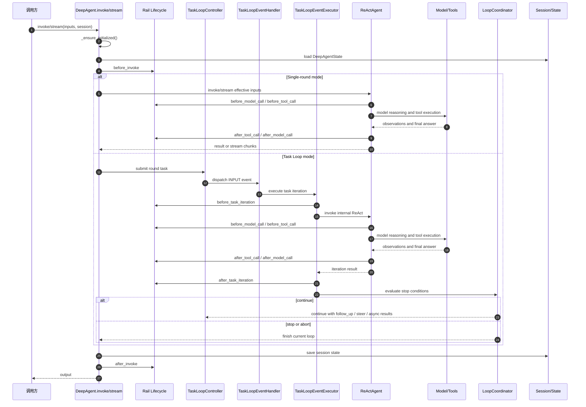

# openJiuwen Harness

## 简介

`Agent = Model + Harness`，openJiuwen Harness 是 openJiuwen 面向 Harness Engineering（驾驭工程）的通用 Agent 运行框架。它负责把大模型从“可对话的推理单元”驾驭为“可规划、可调用工具、可管理上下文、可受权限约束、可委派子任务、可持续演进的任务执行系统”。

Harness Engineering 的核心目标是构建模型之外的工程化执行环境。这个环境管理任务循环、工具、上下文、状态、权限、记忆、验证、停止条件和反馈回路，使 Agent 在长程任务和复杂环境中保持可控、可靠和可扩展。openJiuwen Harness 面向通用 Agent 场景；代码编辑、研究检索、浏览器操作、多模态任务、系统运维、团队协作和业务自动化都可以基于同一套 Harness 能力构建。


## 一、概念定位

### 1.1 Harness 是什么

Harness 是 Agent 的工程控制层。模型负责生成推理和行动意图，Harness 负责把这些意图放入受控执行系统中。因此，openJiuwen Harness 关注的不是替代模型，而是补齐模型外部的执行、状态、约束和反馈机制：

- 将用户目标转换为可持续推进的任务循环。
- 将工具调用纳入统一注册、筛选、权限和审计体系。
- 将上下文组织为静态 prompt、动态附件、会话状态和长期记忆。
- 将执行过程切分为可扩展的生命周期事件。
- 将复杂任务委派给子代理，并隔离子代理上下文。
- 将完成条件、超时、轮数、token 预算和自定义谓词纳入统一停止策略。
- 将安全、人机确认、计划模式和验证门控嵌入运行过程。

### 1.2 DeepAgent 的职责

`DeepAgent` 是 Harness 的运行时主体。它在内部复用 ReAct 推理循环，并在外层提供任务管理、状态管理、Rail 生命周期、子代理委派和基础设施接入。

DeepAgent 具备两种运行形态：

- 单轮 ReAct 模式：适合短任务和直接工具调用。
- 双层 Task Loop 模式：适合长程任务、多轮推进、follow-up、steer、abort、任务计划和停止条件控制。

### 1.3 Harness 的设计原则

- 通用性：Harness 面向多类型 Agent 执行场景。
- 可驾驭性：模型行动必须经过工具、权限、状态和停止条件治理。
- 可扩展性：功能以 Rails、Tools、SubAgents、Stop Evaluators 扩展。
- 可恢复性：任务状态、计划、pending follow-ups 和 plan mode 状态持久化到 session。
- 可组合性：Workspace、SysOperation、Permission、PromptAttachment、ContextEngine 等基础设施解耦组合。
- 可演进性：轨迹采集、Skill 使用、Skill 创建和 Skill 演进形成经验反馈闭环。

## 二、总体架构


架构由三层组成：

- DeepAgent Core Engine：任务循环、停止条件、ReAct 推理、子代理委派和 Rail 生命周期。
- Extension：Subagent、Tool、Rails、Stop-Condition 四类扩展面。
- Infrastructure：系统操作抽象、会话管理和权限控制。

## 三、核心特性

### 3.1 Agent Loop：从 ReAct 到双层任务循环

Agent Loop 是 Harness 的执行主干。内层 ReAct 循环负责 Think -> Act -> Observe，外层 Task Loop 负责把开放目标推进为多轮任务执行、状态更新和完成判断。

外层循环由 `TaskLoopController`、`LoopCoordinator`、`TaskLoopEventHandler`、`TaskLoopEventExecutor` 和 `LoopQueues` 组成。它把每轮任务提交为 `CoreTask`，等待执行完成后评估是否进入下一轮。运行中交互也挂在这一层：

- `follow_up`：把用户补充问题排入下一轮。
- `steer`：向当前任务注入运行时引导。
- `abort`：取消外层 task loop，并尝试中断内层 ReAct。

任务规划和任务完成是 Agent Loop 的两个关键能力：

- `TaskPlanningRail` 将 todo 工具、`TaskPlan`、任务依赖、进度提醒和多模型选择接入循环。
- `TaskCompletionRail` 统一承载最大轮数、超时、完成承诺、多次确认和自定义停止条件。

停止条件采用 OR 语义，任意条件满足即可停止。内置 evaluator 包括 `MaxRoundsEvaluator`、`TimeoutEvaluator`、`TokenBudgetEvaluator`、`CompletionPromiseEvaluator` 和 `CustomPredicateEvaluator`。

### 3.2 Rail Lifecycle：生命周期扩展机制

Rail 是 Harness 的生命周期扩展面。它不替换主流程，而是在外层任务、内层模型调用和工具调用的关键节点注入能力。

| 生命周期事件 | 位置 | 典型用途 |
| --- | --- | --- |
| `before_invoke` / `after_invoke` | 外层 DeepAgent | 初始化资源、加载 skills、清理缓存、同步外部记忆 |
| `before_task_iteration` / `after_task_iteration` | 外层 Task Loop | 改写任务指令、同步 todo、检测完成承诺、触发演进 |
| `before_model_call` / `after_model_call` | 内层 ReAct | 组装 prompt、注入安全规则、压缩上下文、采集轨迹 |
| `before_tool_call` / `after_tool_call` | 内层 ReAct | 权限判断、plan mode 限制、LSP 诊断、进度提醒 |
| `on_model_exception` / `on_tool_exception` | 内层 ReAct | 修复上下文、治理异常 |

下图展示了 Harness lifecycle hooks 的四类典型应用：动态上下文工程、自我反思、LSP 诊断和 Prompt Injection。


常用 Rail 可以按能力族理解：

- 执行控制：`TaskPlanningRail`、`TaskCompletionRail`、`AgentModeRail`。
- 工具与系统：`SysOperationRail`、`ProgressiveToolRail`、`LspRail`、`McpRail`。
- 安全与权限：`SafetyPromptRail`、`PermissionInterruptRail`、`VerificationRail`。
- 上下文与记忆：`ContextAssembleRail`、`ContextProcessorRail`、`MemoryRail`、`CodingMemoryRail`、`ExternalMemoryRail`。
- 技能与演进：`SkillUseRail`、`EvolutionRail`、`SkillCreateRail`、`SkillEvolutionRail`。
- 子代理：`SubagentRail`、`VerificationContractRail`。

### 3.3 Tool & Execution：工具、系统操作与权限治理

Tool & Execution 是 Harness 把模型意图落到真实环境的执行层。工具通过 ToolCard 描述元数据，通过 Tool 实例执行动作，并由 ability manager 统一暴露给模型。

主要工具族包括：

- 文件系统：`read_file`、`write_file`、`edit_file`、`glob`、`list_files`、`grep`。
- Shell 和代码执行：`bash`、`powershell`、`code`。
- Web 和外部资源：web search/fetch、MCP resource list/read。
- 多模态：OCR、VQA、音频转写、音频问答、音频元数据、视频理解。
- 代码智能：LSP definition/reference/symbol/call hierarchy。
- 工作流辅助：todo、skill、subagent、plan mode、worktree、cron、`ask_user`。

更完整的内置工具索引见 [3.12 内置能力索引](#312-内置能力索引)。

`SysOperationRail` 注册文件、Shell 和可选 code tool。所有系统操作通过共享 `SysOperation` 执行，从而统一接入本地执行、沙箱、工作目录限制和权限控制。

当工具集很大时，`ProgressiveToolRail` 负责渐进式工具暴露：模型默认只看到元工具和基础工具，再通过 `tool_search` 搜索工具，通过 `load_tools` 加载当前 session 需要的工具，减少上下文噪声和误用高风险工具的概率。

权限治理由 `PermissionEngine` 和 `PermissionInterruptRail` 组成。`PermissionEngine` 负责 allow / ask / deny 策略评估，`PermissionInterruptRail` 负责在工具调用前拦截所有工具，执行直接放行、直接拒绝、HITL 确认、“允许一次”和“总是允许”等流程。Shell 命令会经过 AST 分析，外部路径检查会与当前决策取更严格结果。

Workspace 是执行层的落盘边界。默认 schema 包括 `AGENT.md`、`SOUL.md`、`HEARTBEAT.md`、`IDENTITY.md`、`memory/`、`coding_memory/`、`todo/`、`messages/`、`skills/`、`agents/` 和 `context/session_memory.md`，并支持自定义目录、语言化默认内容、团队 workspace 链接和 worktree 链接。

### 3.4 Agent Mode：运行模式与 Plan Mode 约束

不同 mode 是 Harness 在工具执行层上的重要运行时策略。`AgentMode` 当前支持 `normal` 和 `plan` 两种模式：`normal` 是默认执行模式，允许常规工具调用和任务执行；`plan` 是只读规划模式，用于先理解、探索和设计方案，再进入实际执行。mode 状态存储在 session 级 `DeepAgentState.plan_mode` 中，包含 `mode`、`pre_plan_mode` 和 `plan_slug`。

`AgentModeRail` 负责注册 `switch_mode`、`enter_plan_mode` 和 `exit_plan_mode`，并在 model/tool 生命周期中注入模式提示、过滤模型可见工具、拦截不符合当前 mode 的工具调用。

| 能力 | 机制 |
| --- | --- |
| 模式切换 | `switch_mode` 在 `normal` 和 `plan` 之间切换 session 运行模式 |
| Plan 文件初始化 | `enter_plan_mode` 在 workspace 下创建或复用 `.plans/<slug>.md` |
| Plan 结束 | `exit_plan_mode` 读取计划全文并恢复进入 plan 前的模式 |
| 工具可见性 | `plan` 模式隐藏 todo/session tools；`normal` 模式隐藏 `enter_plan_mode` / `exit_plan_mode` |
| 写操作约束 | `plan` 模式禁止 shell/git 写操作，避免规划阶段修改真实工作区 |
| 文件写入约束 | `write_file` / `edit_file` 在 `plan` 模式下只能写 plan 文件 |
| 子代理协同 | 进入 `plan` 模式后可动态注册 `task_tool`，支持规划期委派子代理探索问题 |

### 3.5 Context & Memory：上下文工程与记忆系统

Context & Memory 负责让模型在合适的时间看到合适的信息。Harness 使用扩展版 `SystemPromptBuilder` 管理静态 prompt section，例如 `identity`、`safety`、`skills`、`tools`、`todo`、`task_tool`、`memory`、`workspace`、`context`、`completion_signal` 和 `verification_contract`。

动态上下文由 `PromptAttachmentManager` 管理。它按 session 和 section 存储本次模型调用自动附加的内容，并以独立 user message 注入最终上下文窗口。适合放入 PromptAttachment 的内容包括长上下文文件、heartbeat、memory recall、external memory prefetch、plan mode 动态状态和 LSP diagnostics。

上下文工程主要由两个 Rail 承担：

- `ContextAssembleRail`：注入 workspace 结构、context 文件、工具列表和文件型 prompt section。
- `ContextProcessorRail`：配置 ContextEngine processors，压缩长对话，offload 大工具结果，修复不完整 tool_call / ToolMessage 上下文，并管理 session memory。

记忆系统覆盖三类场景：

| Rail | 场景 | 能力 |
| --- | --- | --- |
| `MemoryRail` | 通用长期记忆 | 初始化 memory manager，注册 memory tools，注入记忆使用 prompt |
| `CodingMemoryRail` | 项目/任务记忆 | 自动召回、向量 + BM25 混合检索、注入 top5 记忆或索引 |
| `ExternalMemoryRail` | 外部记忆系统 | provider 初始化、prefetch、sync_turn、provider 工具注册和熔断 |

### 3.6 Subagent & Verification：子代理委派与验证门控

Subagent & Verification 负责把复杂任务拆给更专门的 Agent，并在高风险实现后引入独立验证。

同步子代理通过 `task_tool` 委派：

- 主代理调用工具后等待子代理完成。
- 子代理使用隔离 session。
- `browser_agent` 和 `verification_agent` 使用确定性子 session id，支持失败后复用上下文。

异步子代理通过 session tools 委派：

- `sessions_spawn` 提交后台子任务。
- `sessions_list` 查看后台任务。
- `sessions_cancel` 取消后台任务。
- `SessionToolkit` 维护后台任务状态。

公开导出的内置子代理包括 `browser_agent`、`code_agent`、`research_agent`、`verification_agent` 和 `mobile_gui_agent`；`general-purpose` 可由 `add_general_purpose_agent=True` 自动注入。完整清单见 [3.12 内置能力索引](#312-内置能力索引)。

验证门控分为父代理和验证代理两层：`VerificationContractRail` 注入父代理验证契约，要求非平凡实现后启动验证代理；`VerificationRail` 限制验证代理的工具集合和写权限，确保验证代理只读取、检索、运行验证命令和报告结果，不修改项目文件。

### 3.7 Skill & Evolution：技能复用和经验演进

Skill & Evolution 让 Harness 不只执行当前任务，还能把执行经验沉淀为可复用能力。

`SkillUseRail` 管理 Skill 使用：

- 支持多个 `skills_dir`。
- 支持 `all` 和 `auto_list` 两种暴露模式。
- 注册 `skill_tool` 和 `list_skill`。
- 支持 enabled/disabled 过滤。
- 按 `SKILL.md` mtime 增量刷新。
- 可把演进经验注入 skill 描述。

`EvolutionRail` 管理经验采集和演进触发：

- 采集模型调用轨迹。
- 采集工具调用轨迹。
- 支持 after_invoke、after_model_call、after_tool_call、after_task_iteration 触发。
- 支持后台异步演进、并发限制和 host-visible event。

具体演进能力包括 `SkillCreateRail`、`TeamSkillCreateRail`、`SkillEvolutionRail`、`TeamSkillEvolutionRail` 和 `TrajectoryRail`。它们可以基于工具调用模式、团队协作模式和历史轨迹提出新 skill、演进已有 skill 或沉淀团队技能。

### 3.8 Coding Intelligence：LSP 代码智能

LSP 即 Language Server Protocol，是编辑器或开发工具与语言服务器之间的标准协议。它用统一接口提供定义跳转、引用查找、符号索引、实现定位、调用层级和诊断等代码智能能力。Harness 通过 LSP 把“编辑器级代码理解能力”暴露给 Agent，使 Agent 在 coding 场景中不只依赖文本搜索，还能基于语言服务器理解代码结构。

#### LSP Tool 与 Rail

`LspRail` 是 LSP 能力的生命周期入口，负责初始化 LSP subsystem，并把单一 `lsp` tool 注册到 Agent 的 ability manager。`lsp` tool 是模型调用 LSP 能力的统一工具入口，负责接收操作类型、文件路径、行列位置或查询条件，并返回结构化结果。

`LspRail` 会根据 Agent 的 workspace、sys_operation、language 和 agent_id 创建工具，使 LSP 能力与当前工作区和 Agent 运行时绑定。Agent 结束或 Rail 卸载时，`LspRail` 会移除工具并关闭 LSP subsystem。

#### 代码智能操作

`lsp` tool 支持 8 类代码智能操作：

| 操作 | 用途 |
| --- | --- |
| `goToDefinition` | 查找符号定义位置 |
| `findReferences` | 查找符号引用 |
| `documentSymbol` | 获取单文件函数、类、变量等符号 |
| `workspaceSymbol` | 在整个 workspace 中搜索符号 |
| `goToImplementation` | 查找接口或抽象方法的实现 |
| `prepareCallHierarchy` | 获取当前位置的调用层级条目 |
| `incomingCalls` | 查找调用当前函数的方法 |
| `outgoingCalls` | 查找当前函数调用的方法 |

#### 代码诊断

LSP 不只支持代码导航，也支持代码诊断。Agent 修改文件后，`LspRail` 会触发语言服务器重新分析；下一轮模型调用前，Harness 会把诊断信息注入上下文。诊断内容可以帮助 Agent 发现语法错误、类型错误、未解析引用、调用签名不匹配等问题，形成“修改 -> 诊断 -> 修复”的 coding 闭环。

### 3.9 Multimodal Understanding：多模态理解

Harness 将图像、音频和视频理解封装为工具，使 Agent 可以把非文本资料纳入任务上下文。

图像工具由 `VisionModelConfig` 驱动：

- `image_ocr`：提取图片中的文字，尽量保留结构、换行、数字和符号。
- `visual_question_answering`：结合图片和可选 OCR 结果回答视觉问题。
- 支持本地图片路径和 HTTP(S) 图片 URL；sandbox-only 路径会被拒绝，避免工具访问不可见路径。

音频工具由 `AudioModelConfig` 驱动：

- `audio_transcription`：将音频语音转写为文本。
- `audio_question_answering`：基于音频内容回答问题。
- `audio_metadata`：识别音频时长，并在配置 ACR 时识别歌曲元数据。
- 支持本地音频路径和 HTTP(S) 音频 URL，并通过 `max_audio_bytes` 限制下载大小。

视频工具由视觉模型驱动：

- `video_understanding`：接收本地视频或 HTTP(S) 视频 URL，并围绕用户 query 进行视频内容问答。
- 本地视频会编码为 data URL；调用时可限制 `max_tokens`、`temperature` 和 `timeout_seconds`。

多模态模型配置可以显式传入，也可以通过环境变量构造：`VisionModelConfig.from_env()` 会读取 `VISION_API_KEY`、`VISION_BASE_URL`、`VISION_MODEL` 等变量；`AudioModelConfig.from_env()` 会读取 `AUDIO_API_KEY`、`AUDIO_BASE_URL`、`AUDIO_TRANSCRIPTION_MODEL`、`AUDIO_QUESTION_ANSWERING_MODEL` 等变量。`enable_read_image_multimodal=True` 时，`read_file` 读取图片可以附带原生多模态输入；关闭后只返回图片元数据并提示使用视觉工具。

### 3.10 Web & External Resources：网页与外部资源接入

Harness 支持把 Web 和外部资源系统接入 Agent 的任务循环，使 Agent 能执行研究检索、网页获取和跨系统资料读取。

Web 工具覆盖两类场景：

- `free_search` / `paid_search`：面向搜索和研究任务，可按部署环境使用免费或付费搜索 provider。
- `fetch_webpage`：获取网页内容，支持资料整理、引用核对和后续上下文注入。

MCP 通过 `McpRail` 接入。DeepAgent 可以通过 `mcps` 注册 MCP server；初始化后，`McpRail` 向 Agent 注册 `list_mcp_resources` 和 `read_mcp_resource`，让模型能发现并读取已经注册的 MCP resources。该能力适合把文档库、数据源、工具运行时或外部系统资源接入 Harness，而不需要把所有内容预先塞进 prompt。

### 3.11 Isolated Execution & Automation：隔离执行与长期自动化

Harness 还提供隔离执行和长期自动化相关工具，使 Agent 能在更接近真实工程环境的约束下运行。

`WorktreeRail` 注册 `enter_worktree` 和 `exit_worktree`，并管理 per-agent 的 `WorktreeManager`。Agent 可以进入隔离 git worktree 后执行文件操作和 shell 命令，避免污染主工作区；退出时可以选择保留或移除 worktree。该能力适合代码修改、实验性重构、并行验证和需要隔离回滚边界的任务。

Cron tool 族用于对接宿主提供的定时任务 backend。它可以暴露统一 `cron` 工具，也可以兼容拆分后的 list/get/create/update/delete/toggle/preview 等工具形态。该能力适合长期自动化、周期任务、定时提醒和需要跨 session 维持计划的 agent 工作流。

### 3.12 内置能力索引

本节用表格快速索引 Harness 的预置能力。表格中的能力是否实际出现在模型可调用工具列表中，取决于 `create_deep_agent` 参数、显式注册的 rails、宿主提供的 backend、权限配置和当前运行环境。

#### 内置 Tool

| 能力族 | 代表工具 | 主要用途 | 启用方式 / 来源 |
| --- | --- | --- | --- |
| 文件与搜索 | `read_file`、`write_file`、`edit_file`、`glob`、`grep`、`list_files` | 读取、写入、编辑文件，按 glob 或文本搜索定位上下文 | `SysOperationRail` 注册；受 workspace、sys_operation 和权限策略约束 |
| Shell 与代码执行 | `bash`、`powershell`、`code` | 执行 shell 命令、脚本和代码片段 | `SysOperationRail` 注册；`powershell` 主要用于 Windows 环境，`code` 可按 rail 配置启用 |
| Todo / 计划 | `todo_create`、`todo_list`、`todo_get`、`todo_modify` | 管理 session 级任务清单，支撑长任务拆解、追踪和状态更新 | 工具实例由相关 rail 或宿主配置挂载，落盘到 workspace 的 todo 区域 |
| Web | `free_search`、`paid_search`、`fetch_webpage` | 网络检索、网页抓取和资料整理 | Web tool 注册后可用；搜索工具受部署环境和 provider 配置影响 |
| 多模态 | `image_ocr`、`visual_question_answering`、`audio_transcription`、`audio_question_answering`、`audio_metadata`、`video_understanding` | 图片 OCR / VQA、音频转写 / 问答 / 元数据识别、视频内容问答 | 依赖 `VisionModelConfig` / `AudioModelConfig`，支持本地或 HTTP(S) 媒体 |
| LSP 代码智能 | `lsp` | 定义跳转、引用查找、符号检索、实现定位、调用层级和代码诊断 | `LspRail` 注册；依赖语言服务器和当前 workspace |
| MCP 外部资源 | `list_mcp_resources`、`read_mcp_resource` | 枚举和读取已注册 MCP server 的资源 | `McpRail` 注册；DeepAgent 通过 `mcps` 接入 MCP server |
| 子代理委派 | `task_tool`、`sessions_spawn`、`sessions_list`、`sessions_cancel` | 同步委派子任务，或异步创建、查看、取消后台子代理任务 | `SubagentRail` 注册；同步 / 异步形态由 `enable_async_subagent` 决定 |
| Skill / 工具发现 | `skill_tool`、`list_skill`、`search_tools`、`load_tools` | 调用技能、查看技能，渐进式搜索和加载工具 | `SkillUseRail`、`ProgressiveToolRail` 注册；受 skill 目录和渐进工具配置影响 |
| Memory / Coding Memory | `memory_*`、`coding_memory_*` | 读写长期记忆、代码经验和项目知识 | `MemoryRail`、`CodingMemoryRail` 等 memory rails 注册 |
| Agent 模式与用户交互 | `switch_mode`、`enter_plan_mode`、`exit_plan_mode`、`ask_user` | 切换普通 / 计划模式，在关键分支向用户发起确认或补充输入 | `AgentModeRail`、`AskUserRail` 或宿主交互 rail 注册 |
| Worktree / Cron | `enter_worktree`、`exit_worktree`、`cron`、`cron_list_jobs`、`cron_get_job`、`cron_create_job`、`cron_update_job`、`cron_delete_job`、`cron_toggle_job`、`cron_preview_job` | 进入隔离 git worktree，管理定时任务和周期自动化 | `WorktreeRail` 或宿主 cron backend 注册；cron 兼容统一工具和拆分工具两种形态 |
| 移动 GUI / 浏览器运行时 | 移动坐标 / 导航工具、浏览器运行时工具 | 移动端 GUI 操作、浏览器任务运行、运行时健康检查和取消控制 | 由移动 GUI / browser runtime 相关工具包或宿主 runtime 注册 |

#### 内置 Rail

| Rail | 主要职责 | 启用方式 / 来源 |
| --- | --- | --- |
| `SecurityRail` | 基础安全防护和 prompt/tool 安全检查 | `create_deep_agent` 默认自动补齐，除非用户提供同类 rail |
| `TaskPlanningRail` | 任务规划、拆解和模型选择辅助 | `enable_task_planning=True` 时自动补齐，也可显式注册 |
| `SkillUseRail` | 发现、装载和调用 workspace / team skills | 配置 `skills` 或 `enable_skill_discovery=True` 时自动补齐，也可显式注册 |
| `SubagentRail` | 注册同步 `task_tool` 或异步 session tools，注入子代理提示 | 配置 `subagents` 时自动补齐；异步模式由 `enable_async_subagent` 控制 |
| `SysOperationRail` | 注册文件、Shell、代码执行等系统操作工具 | 通常作为显式 rail 注册，绑定 workspace 和 sys_operation |
| `ProgressiveToolRail` | 渐进式工具暴露、工具搜索和按需加载 | 配置 progressive tool 能力时注册 |
| `LspRail` | 初始化 LSP subsystem，注册 `lsp` tool，注入代码诊断 | 显式注册；依赖语言服务器和工作区代码 |
| `McpRail` | 注册 MCP resource list/read 工具 | 显式注册，并配合 `mcps` 接入 MCP server |
| `MemoryRail`、`CodingMemoryRail`、`ExternalMemoryRail` | 管理长期记忆、代码记忆和外部记忆读写 | 按记忆能力需要显式注册或由宿主装配 |
| `AgentModeRail` | 管理 normal / plan 等 agent mode，注册模式切换工具，并执行 Plan Mode 工具过滤和写操作约束 | 启用 plan mode 或显式注册；详细机制见 3.4 的 Agent Mode 段落 |
| `AskUserRail`、`ConfirmInterruptRail` | 在任务执行中发起用户输入、确认或中断恢复 | HITL 场景显式注册或由宿主交互能力装配 |
| `PermissionInterruptRail`、`SafetyPromptRail` | 工具调用权限拦截、用户确认和安全提示注入 | 配置 `permissions` 或安全 rail 时启用 |
| `TaskCompletionRail` | 判断任务是否完成，配合外层 Task Loop 停止条件 | Task Loop 或自定义完成判定场景注册 |
| `SessionRail` | 管理子 session 相关上下文和生命周期能力 | 子代理 / session 场景注册 |
| `VerificationRail`、`VerificationContractRail` | 约束验证代理权限，向父代理注入验证契约 | 代码实现、回归验证和高风险任务场景注册 |
| `SkillCreateRail`、`TeamSkillCreateRail`、`SkillEvolutionRail`、`TeamSkillEvolutionRail` | 创建个人 / 团队技能，沉淀和演进技能经验 | 技能自演进或团队技能沉淀场景注册 |
| `TrajectoryRail`、`ContextEvolutionRail`、`EvolutionRail`、`EvolutionInterruptRail` | 采集轨迹、触发上下文/技能演进，并处理演进中断 | 经验演进链路注册 |
| `HeartbeatRail` | 运行心跳和持续任务状态维护 | 长任务或宿主需要心跳感知时注册 |

#### 内置 Subagent

| Subagent | 主要用途 | 启用方式 / 来源 |
| --- | --- | --- |
| `browser_agent` | 浏览器使用、网页交互和需要浏览器 runtime 的子任务 | `build_browser_agent_config` / `create_browser_agent` |
| `code_agent` | 代码阅读、修改、局部实现和工程化处理 | `build_code_agent_config` / `create_code_agent` |
| `research_agent` | 搜索研究、资料整理、信息核验和报告汇总 | `build_research_agent_config` / `create_research_agent` |
| `verification_agent` | 读取变更、运行验证命令、检查回归风险并输出验证结论 | `build_verification_agent_config` / `create_verification_agent` |
| `mobile_gui_agent` | 移动端 GUI 操作、坐标点击、滚动、输入和导航 | `build_mobile_gui_agent_config` / `create_mobile_gui_agent` |
| `general-purpose` | 通用任务兜底子代理，可继承主代理的 prompt、tools、mcps 和 skills | `add_general_purpose_agent=True` 时由 factory 自动注入 |
| `plan_agent`、`explore_agent` | 源码中存在的计划 / 探索类子代理模板 | 内部模板 / 非当前 `subagents/__init__.py` 主导出入口，使用时应以具体装配代码为准 |

## 四、运行流程

### 4.1 运行时时序图



### 4.2 运行时主流程说明

4.1 的时序图只描述 Agent 已经创建后的运行过程。主流程按以下顺序推进：

1. 调用方通过 `invoke/stream(inputs, session)` 发起一次运行。
2. `DeepAgent.invoke` 或 `DeepAgent.stream` 先执行 `_ensure_initialized()`，确保 workspace、MCP、Rails 和 task loop 运行时对象已经初始化。
3. DeepAgent 从 session 中加载 `DeepAgentState`，并触发 `before_invoke` 生命周期事件。
4. 如果是单轮模式，DeepAgent 直接调用内部 `ReActAgent`。内部 ReAct 在模型推理和工具执行前后触发 model/tool 级 Rail 钩子，然后把结果或流式 chunk 返回给 DeepAgent。
5. 如果是 Task Loop 模式，DeepAgent 将当前轮次提交给 `TaskLoopController`；事件经 `TaskLoopEventHandler` 分发后，由 `TaskLoopEventExecutor` 执行本轮任务迭代。
6. Task Loop 每轮迭代会先触发 `before_task_iteration`，再调用内部 `ReActAgent` 完成 Think / Act / Observe，随后触发 `after_task_iteration`。
7. `LoopCoordinator` 根据停止条件、abort 信号、follow-up、steer 或异步子代理结果决定继续下一轮、停止或中止。
8. 运行结束时，DeepAgent 保存 session state，触发 `after_invoke`，并向调用方返回 output。


### 4.3 单轮模式与 Task Loop 模式

单轮模式强调低开销和即时响应。它适合单次问答、短工具任务，以及不需要计划和多轮推进的自动化。虽然没有外层 Task Loop，Rails 的 `before_model_call`、`after_model_call`、`before_tool_call`、`after_tool_call` 等内层钩子仍然生效。

Task Loop 模式强调长程推进和可控收敛。它适合任务计划、异步子代理、运行中干预、明确完成条件和需要多轮验证的执行场景。相比单轮模式，Task Loop 额外维护轮次状态、停止条件和运行中交互队列，使 Agent 能在多个迭代中持续逼近目标。

### 4.4 运行中交互与状态

Harness 支持三类运行中交互：

- `follow_up(query)`：向当前任务追加后续问题。
- `steer(message)`：向运行中的 Agent 注入指导信息。
- `abort()`：取消当前任务循环。

这些交互会通过 controller 的事件队列进入 `TaskLoopEventHandler`，再写入 `LoopQueues` 或触发 `LoopCoordinator.request_abort()`。Task Loop 在每轮迭代边界消费这些信号，因此可以在不中断当前工具调用一致性的前提下追加需求、调整方向或结束任务。

DeepAgent 的运行状态保存在 session 中，核心状态包括：

- 当前迭代次数。
- TaskPlan。
- stop condition state。
- pending follow-ups。
- plan mode state。

状态保存使长程任务可以恢复，也使外部运行时可以读取当前任务进展。`invoke` 和 `stream` 在完成后会保存并清理本次运行状态；如果仍有异步 session-spawn 子任务未完成，controller 会保留以等待后续结果。

## 五、使用指导

### 5.1 适用场景

Harness 适用于：

- 长程任务执行。
- 多工具自动化。
- 多轮研究和资料整理。
- 浏览器任务。
- 多模态理解。
- 代码语义导航、引用分析、调用链分析和修改后诊断。
- 文件和系统操作。
- Web/MCP 外部资料接入。
- 隔离 worktree 中的代码修改和验证。
- 定时任务和周期任务自动化。
- 需要权限确认的高风险任务。
- 需要计划、验证和回滚的任务。
- 需要记忆、Skill 复用和自演进的 Agent。

### 5.2 完整 DeepAgent 示例

下面示例中的 `AgentModeRail()` 用于启用 mode 能力；未显式传入 `default_mode` 时，Agent 默认从 `AgentMode.NORMAL` / `normal` 模式开始。

```python
import asyncio

from openjiuwen.core.single_agent import AgentCard, create_agent_session
from openjiuwen.harness import Workspace, create_deep_agent
from openjiuwen.harness.rails import (
    AgentModeRail,
    ContextAssembleRail,
    ContextProcessorRail,
    SysOperationRail,
    TaskCompletionRail,
    VerificationContractRail,
)
from openjiuwen.harness.schema.config import SubAgentConfig


async def main():
    # model 由业务侧按现有模型配置创建，例如 OpenAI、华为云或本地模型适配器。
    model = ...

    workspace = Workspace(root_path="./workspace", language="cn")

    research_agent = SubAgentConfig(
        agent_card=AgentCard(
            name="research_agent",
            description="资料检索、信息核对和报告素材整理专家",
        ),
        system_prompt=(
            "你是 research_agent，负责检索资料、交叉核对事实，"
            "并把证据、出处和不确定性整理给主 Agent。"
        ),
        model=model,
        workspace=workspace,
    )

    agent = create_deep_agent(
        model=model,
        card=AgentCard(
            name="deep_agent",
            description="可计划、可调用工具、可委派子代理的通用任务执行智能体",
        ),
        workspace=workspace,
        system_prompt=(
            "你是一个严谨的 DeepAgent。你需要先理解目标，再规划步骤，"
            "必要时读取和修改工作区文件、调用子代理、复用 skill，"
            "最后给出清晰的执行结果、关键证据和剩余风险。"
        ),
        enable_task_loop=True,
        enable_task_planning=True,
        max_iterations=20,
        subagents=[research_agent],
        skills=["./skills"],
        enable_skill_discovery=True,
        permissions={
            "enabled": True,
            "permission_mode": "normal",
            "tools": {
                "read_file": "allow",
                "write_file": "ask",
                "edit_file": "ask",
                "bash": "ask",
                "code": "ask",
            },
            "defaults": {"*": "ask"},
            "external_directory": {"*": "ask"},
        },
        rails=[
            SysOperationRail(with_code_tool=True),
            ContextAssembleRail(),
            ContextProcessorRail(preset=True),
            TaskCompletionRail(
                max_rounds=8,
                timeout_seconds=1200,
                completion_promise="完成用户目标，并说明已完成项、未完成项和验证结果。",
            ),
            AgentModeRail(),
            VerificationContractRail(),
        ],
    )

    session = create_agent_session(session_id="deep-agent-demo", card=agent.card)

    run_task = asyncio.create_task(
        agent.invoke(
            {
                "query": (
                    "阅读 ./workspace/input 目录中的资料，整理一份技术方案摘要，"
                    "必要时委派 research_agent 核对关键事实，并把结果写入 "
                    "./workspace/output/summary.md。"
                )
            },
            session=session,
        )
    )

    # 任务仍在运行时，可以追加需求、调整方向或终止任务。
    await asyncio.sleep(2)
    await agent.follow_up("补充一节风险评估，并标出需要人工确认的假设。", session=session)
    await agent.steer("优先保证事实准确性，不要为了完整性臆测缺失资料。", session=session)
    # await agent.abort(session=session)

    result = await run_task
    print(result.get("output", result))


asyncio.run(main())
```

这个示例同时覆盖了 workspace、权限治理、任务规划、上下文工程、停止条件、验证契约、子代理和 skill 发现。`TaskPlanningRail`、`SubagentRail`、`SkillUseRail` 和默认安全 Rail 会由 `create_deep_agent` 根据配置自动装配，因此示例中不再重复手动注册。

## 六、扩展开发

### 6.1 自定义 Rail

```python
from openjiuwen.harness.rails import DeepAgentRail

class AuditRail(DeepAgentRail):
    priority = 70

    async def before_tool_call(self, ctx):
        tool_name = ctx.inputs.tool_name
        tool_args = ctx.inputs.tool_args
        # 记录审计信息

    async def after_task_iteration(self, ctx):
        # 每个外层任务轮次结束后执行
        ...
```

### 6.2 自定义 Tool

自定义工具需要提供 ToolCard 和 Tool 执行逻辑。工具可以通过三种方式接入：

- 作为参数传给 `create_deep_agent(tools=[...])`。
- 在 Rail 初始化时注册到 ability manager。
- 通过 `harness_config.yaml` 声明 package 或 entry_point。

系统操作类工具应接入共享 `SysOperation`，避免绕过 Harness 的执行边界。

### 6.3 自定义子代理

子代理使用 `SubAgentConfig` 描述：

```python
SubAgentConfig(
    agent_card=AgentCard(name="review_agent", description="审查专家"),
    system_prompt="你负责独立审查和反馈。",
    tools=[...],
    rails=[...],
    enable_task_loop=False,
)
```

### 6.4 自定义停止条件

自定义停止条件实现 `StopConditionEvaluator`，并传入 `TaskCompletionRail(evaluators=[...])`。外层循环按 OR 语义统一评估。

## 七、代码目录

Harness 的核心实现位于：

```text
openjiuwen/harness/
  cli/                        CLI 相关入口和命令支持
  deep_agent.py               DeepAgent 运行时主体
  factory.py                  DeepAgent 创建和装配入口
  harness_config/             声明式 YAML 配置装配
  lsp/                        LSP subsystem 与语言服务器管理
  prompts/                    Prompt section、工具描述和动态附件
  rails/                      生命周期扩展机制
  resources/                  Harness 资源定义
  schema/                     配置、状态、任务计划、停止条件等 schema
  security/                   权限引擎与安全策略
  subagents/                  内置子代理
  task_loop/                  外层任务循环
  tools/                      工具实现
  workspace/                  Workspace schema 与目录管理
```


