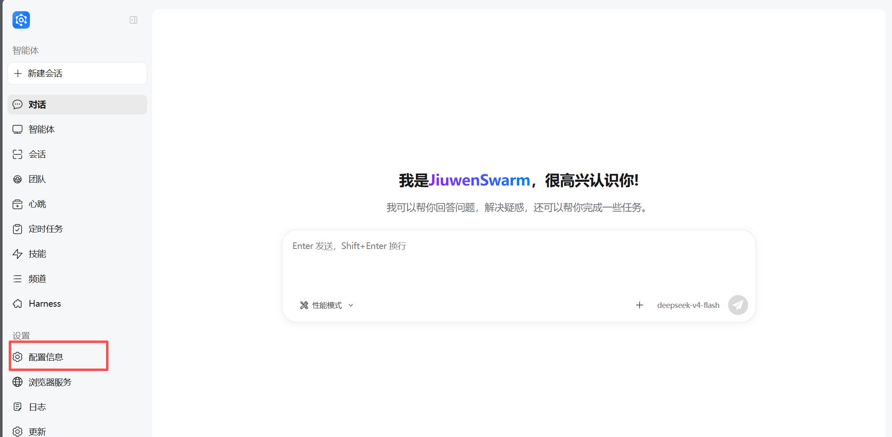
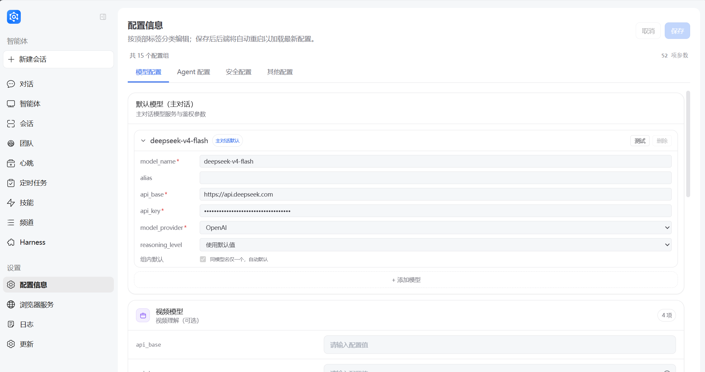
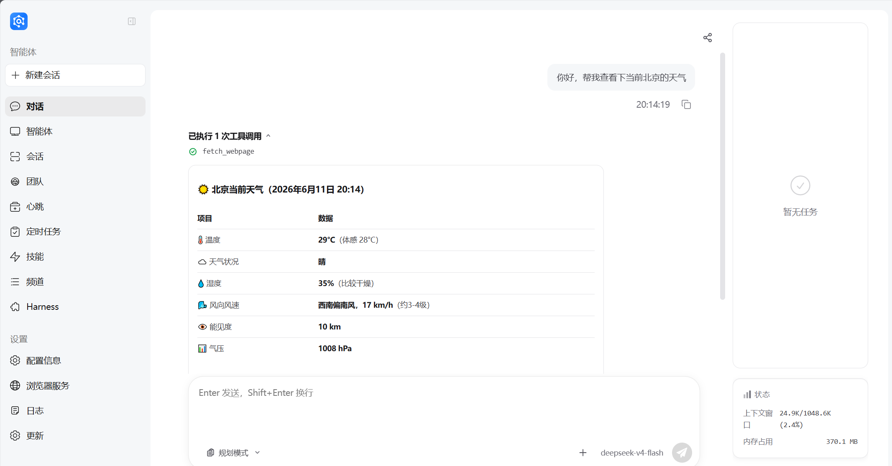
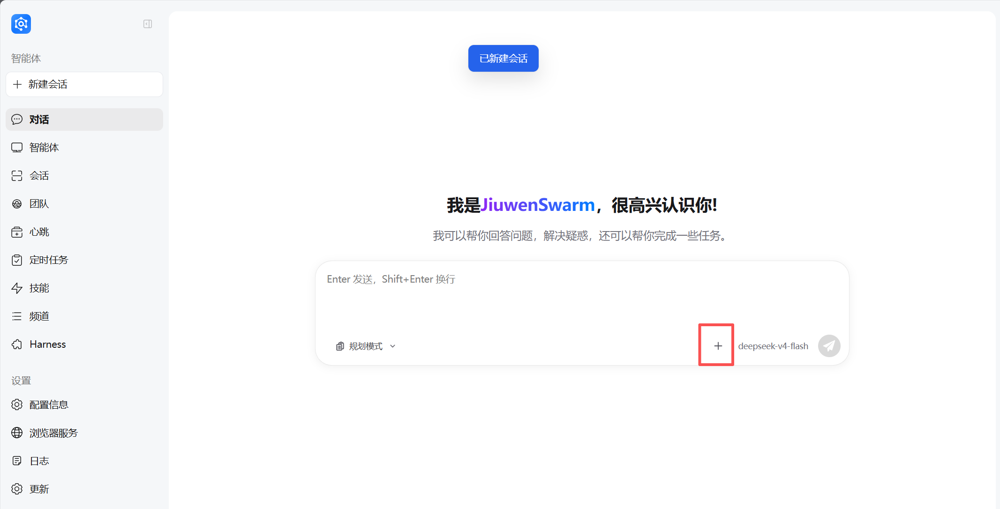
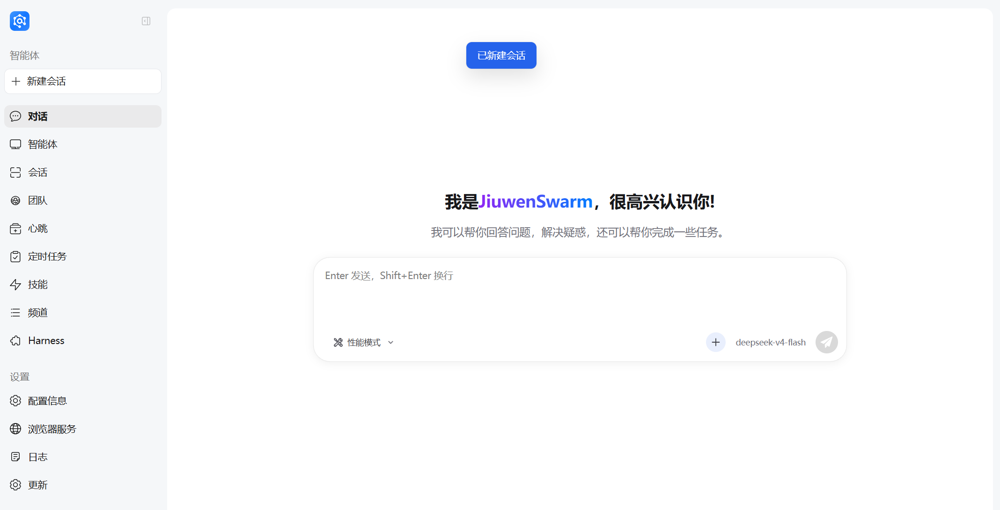
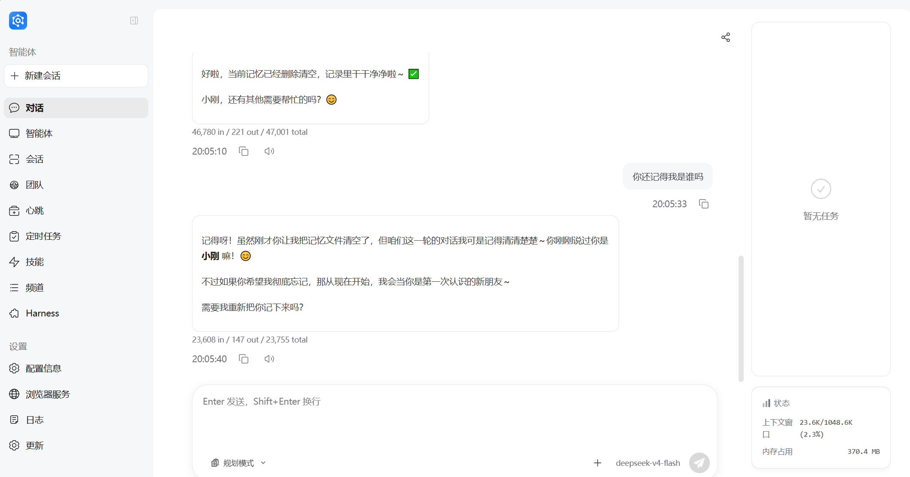
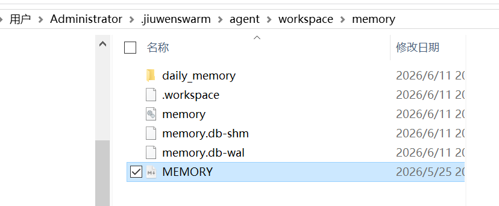

# 快速开始

> **⚠️ 版本同步**: 本文档应与英文版 [`docs/en/Quickstart.md`](../en/Quickstart.md) 保持同步。更新一版时请同时更新另一版。

## 安装

### 环境要求

在安装 JiuwenSwarm 之前，请确保您的系统满足以下要求：

| 依赖项 | 版本要求 | 说明 |
|--------|----------|------|
| 操作系统 | Windows 10/11, macOS 10.15+, Linux | 支持主流操作系统 |
| Python | ≥3.11, <3.14 | 推荐使用 Python 3.11 |
| Node.js | 18.x 或更高版本 | 用于前端界面 |
| Git | 最新版本 | 用于源码安装 |

检查 Node.js 版本：

```bash
node --version
# 预期输出：v18.x.x 或更高
```

### pip 安装

```bash
# 创建虚拟环境
python -m venv jiuwenswarm

# 激活虚拟环境
# Windows:
jiuwenswarm\Scripts\activate
# Linux/Mac:
source jiuwenswarm/bin/activate

# 安装 JiuwenSwarm
pip install jiuwenswarm
```

## 启动服务

```bash
# 初始化（首次运行）
jiuwenswarm-init

# 启动服务
jiuwenswarm-start
```

启动成功后，终端会显示后端服务运行状态：

```
[INFO] Starting JiuwenSwarm server...
[INFO] API server running at http://localhost:8000
[INFO] Web server running at http://localhost:5173
```

当看到类似上述提示时，表示服务已启动，在浏览器中访问 `http://localhost:5173` 即可使用。

### 终端 CLI

也可以直接在终端中与 JiuwenSwarm 对话：

```bash
jiuwenswarm chat "你好，介绍一下你自己"
```

详情见 [命令行指令 / 终端 CLI](命令行指令.md#终端-clijiuwenswarm-chat)。

**配置目录自动创建**：
首次启动服务后，系统会自动创建配置目录：
- **Windows**：`C:\Users\<你的用户名>\.jiuwenswarm`
- **Linux/Mac**：`~/.jiuwenswarm/`

配置文件、记忆文件等数据将存储在该目录下。
​适合基于JiuwenSwarm进行二次开发适配的用户。

### `uv`方式安装
- 使用`uv`新建虚拟环境
  ```bash
  # 使用uv新建虚拟环境（支持 3.11、3.12、3.13 任一版本）
  uv venv --python=3.11
  # 或 uv venv --python=3.12
  # 或 uv venv --python=3.13
  ```

- 执行uv同步操作

  进入项目根目录`jiuwenswarm/`执行：
  ```bash
  uv sync
  ```

- 安装前端依赖

  进入前端目录 jiuwenswarm/channels/web/frontend 安装依赖：
  ```bash
  cd jiuwenswarm/channels/web/frontend
  npm install
  ```

- 运行前端服务

  可以采取两种方式运行前端服务：
  - 静态运行前端服务（适合生产环境部署）
    ```bash
    npm run build
    cd ../../
    uv run jiuwenswarm-init
    uv run jiuwenswarm-start
    ```

  - 动态运行前端服务（适合开发调试）
    ```bash
    cd ../../
    uv run jiuwenswarm-init
    uv run jiuwenswarm-start dev
    ```

  运行完成后即可在网页前端访问JiuwenSwarm服务。

### `conda`方式安装
- 使用`conda`新建虚拟环境
  ```bash
  # 使用Anaconda新建虚拟环境（支持 3.11、3.12、3.13 任一版本）
  conda create -n JiuwenSwarm python=3.11
  # 或 conda create -n JiuwenSwarm python=3.12
  # 或 conda create -n JiuwenSwarm python=3.13
  ```
- 安装python依赖

  进入项目根目录`jiuwenswarm/`执行：
  ```bash
  # 模式1：开发模式安装（推荐，便于修改代码）
  pip install -e .

  # 模式2：普通安装
  pip install .
  ```
  **注意：** 该安装方式依赖项目的可安装包（pyproject.toml），同时会默认安装`jiuwenswarm`自己。

- 安装前端依赖

  进入前端目录 jiuwenswarm/channels/web/frontend 安装依赖：
  ```bash
  cd jiuwenswarm/channels/web/frontend
  npm install
  ```

- 运行前端服务

  可以采取两种方式运行前端服务：
  - 静态运行前端服务（适合生产环境部署）
    ```bash
    npm run build
    cd ../../
    jiuwenswarm-init
    jiuwenswarm-start
    ```

  - 动态运行前端服务（适合开发调试）
    ```bash
    cd ../../
    # 直接启动（不使用 uv run）
    jiuwenswarm-init
    jiuwenswarm-start dev
    ```

  运行完成后即可在网页前端访问JiuwenSwarm服务。

---

## 快速上手

#### 1️⃣ 对话模式

| 方式 | 说明                                        |
|------|-------------------------------------------|
| **Web前端** | 启动服务后访问 `http://localhost:5173`，通过浏览器直接对话 |
| **小艺频道** | 华为手机用户可直接唤醒小艺，与JiuwenSwarm对话               |
| **飞书频道** | 完成渠道配置后，在飞书中与JiuwenSwarm畅聊                 |

#### 2️⃣ 配置模型

### 远程访问（可选）

如需远程访问，执行以下命令：

```bash
# 启动 Web 服务
jiuwenswarm-web --host 0.0.0.0 --port <custom-port>

# 启动后端服务
jiuwenswarm-app
```

## 配置模型

在 Web 页面左侧找到「配置信息」，进入配置页面：



完善以下基本配置，完成后点击右上角「保存」：



**配置项说明：**

| Field | Environment variable | Description | Required |
|--------|------------------------|-------------|----------|
| `model_name` | `MODEL_NAME` | 模型名称，如 `deepseek-chat`、`gpt-4o` | ✅ 必填 |
| `api_base` | `API_BASE` | 模型 API 基础 URL，如 `https://api.deepseek.com` | ✅ 必填 |
| `api_key` | `API_KEY` | 模型 API 密钥 | ✅ 必填 |
| `model_provider` | `MODEL_PROVIDER` | 模型提供商，如 `OpenAI`、`DeepSeek`、`Anthropic` | ✅ 必填 |

**配置后测试：**

填写完配置后，建议点击「测试」按钮验证模型是否可用。测试通过会显示 ✅ 提示，若失败请检查：
- API Key 是否正确
- API Base URL 是否可访问
- 模型名称和 Provider 是否匹配

**注意事项：**

- **保存后自动重启**：点击保存后，后端会自动重启以加载新配置
- **必填项**：以上四项是模型运行的基础配置，必须填写完整才能正常使用
- **模型供应商**：`OpenAI`、`DashScope`、`SiliconFlow`、`InferenceAffinity`

## 开始对话

在 Web 页面左侧找到「对话」，输入问题即可开始：



## 会话管理

点击下方的「+」号，可清空当前会话并开启新会话：



清理后页面显示：



**什么时候需要清空会话？**

| 场景 | 说明 |
|------|------|
| **话题切换** | 当前对话已完成，想开始一个完全不同的新话题 |
| **上下文混乱** | 当前会话中讨论内容过多，模型理解出现偏差 |
| **重复/错误回复** | 模型陷入循环回复或给出与之前请求不相关的答案 |
| **隐私/敏感信息** | 当前会话中包含临时敏感信息，需要立即清除 |

**清空 vs 不清空会话的效果差异：**

| 对比项 | 不清空（继续当前会话） | 清空（开启新会话） |
|--------|------------------------|-------------------|
| **上下文保留** | ✅ 保留所有历史对话，模型了解完整背景 | ❌ 不保留任何对话历史，模型从零开始 |
| **Token 消耗** | ⚠️ 随对话增长，消耗更多 Token | ✅ 初始 Token 最少，成本更可控 |
| **回答相关性** | 早期话题可能干扰当前问题理解 | 每个问题独立处理，无历史干扰 |
| **隐私安全** | 历史对话持续存在于当前会话 | 敏感信息不会带入新会话 |

## 清空记忆

当你需要让 JiuwenSwarm 忘记之前的所有对话历史和用户信息时，可以清空记忆文件。

> **⚠️ 风险提示：** 清空记忆是**永久性操作**，删除的记忆文件**无法恢复**。操作前请确认：
> - 重要记忆是否已备份
> - 是否确实需要删除（还是仅想开始新的会话）

**与会话清理的区别：**

| 操作 | 作用范围 | 影响 | 适用场景 |
|------|---------|------|---------|
| **新建会话** | 当前对话窗口 | 不删除任何记忆，仅开启新对话线程 | 想换一个话题，但保留历史记忆供后续参考 |
| **清空记忆** | 所有记忆文件 | 永久删除所有历史对话、用户信息、项目记忆 | 彻底清除所有历史，保护隐私，或重置到初始状态 |

**适用场景：**
- **隐私保护**：清除包含敏感信息的历史记录
- **全新开始**：开始一个完全不同的项目或话题，避免历史信息干扰
- **调试排错**：记忆文件损坏或内容异常时重置
- **用户切换**：多用户共用环境时，清除上一个用户的信息

**清空记忆操作步骤：**

记忆文件存储路径：
- **Windows**：`C:\Users\<你的用户名>\.jiuwenswarm\agent\workspace\memory\`
- **Linux/Mac**：`~/.jiuwenswarm/agent/workspace/memory/`

**方式一：通过 Agent 删除**
直接告诉 JiuwenSwarm："请删除所有记忆文件" 或 "清空我的记忆"，Agent 会调用文件工具删除 memory 目录下的文件。


**方式二：手动删除**
停止 JiuwenSwarm 服务后，直接删除 `memory/` 目录下的所有 Markdown 文件即可。


> ⚠️ **注意**：清空记忆后无法恢复，请谨慎操作。建议定期备份重要的记忆文件。
