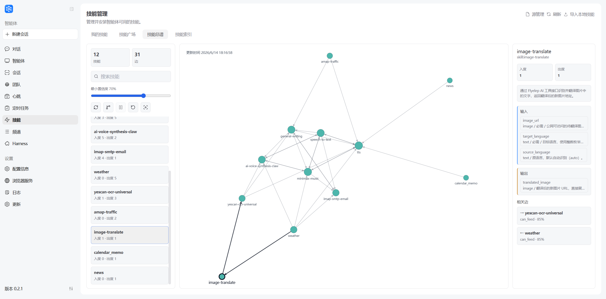
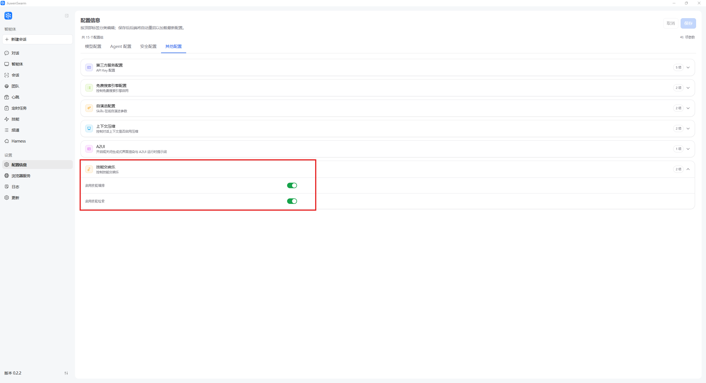
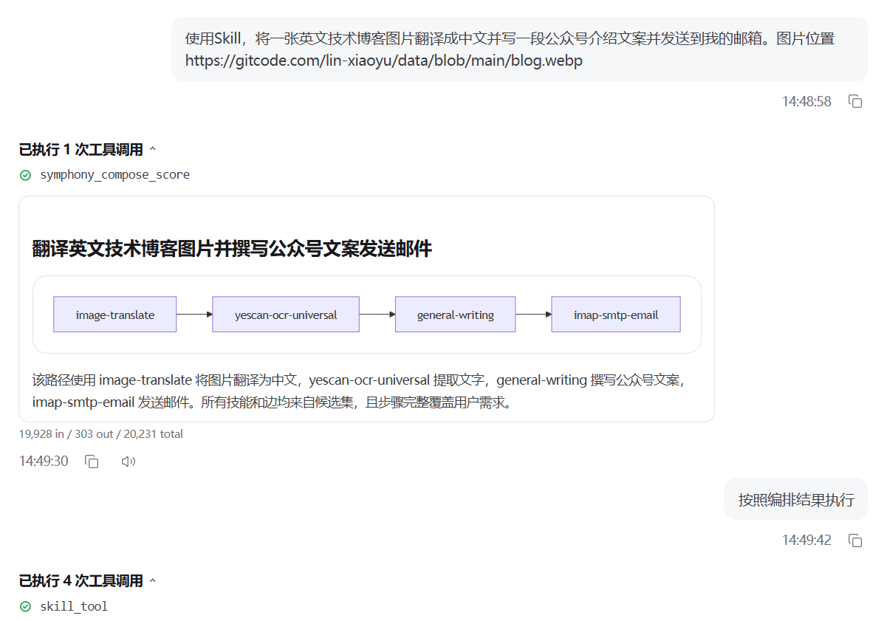

# Symphony：技能编排与智能分发
---

## 概念科普

### Symphony 是什么

Symphony（技能交响乐）是 JiuwenSwarm 面向海量已安装技能提供的技能编排与智能分发系统。它要解决的是两个问题：**怎么选**，以及**怎么用**。

- **技能检索**解决“怎么选”：把原本平铺的技能列表组织成可逐层浏览的技能树，让智能体按任务需求动态探索分支，找到候选技能。
- **技能编排**解决“怎么用”：基于候选技能、输入输出结构和技能依赖关系，生成一条可确认、可执行的技能链。

可以把 Symphony 理解为“双核心架构”：**检索用树，编排用图**。如果只需要调用一个明确的技能，按普通技能流程即可；Symphony 更适合“先找技能、再判断能否串起来、最后形成执行路线”的多步骤任务。在团队/集群模式中，这条路线也可以作为 Leader 分发后续任务的依据。

#### 用技能检索找到候选技能

技能检索是 JiuwenSwarm 面向**较大规模已安装技能**场景提供的技能目录检索能力。

当已安装技能数量较少时，智能体可以直接查看技能列表并选择合适技能；当技能数量达到几十、上百甚至更多时，直接把所有技能注入上下文会带来两个问题：

| 问题 | 影响 |
|------|------|
| 上下文占用过高 | 用户任务、文件内容和历史对话更容易被挤出上下文 |
| 注意力分散 | 模型容易被大量无关技能干扰，漏掉真正需要的技能 |

技能检索通过离线构建一棵**已安装技能树**，并在运行时提供目录浏览工具，让智能体像查目录一样逐层披露相关分支，再决定读取哪些 `SKILL.md`。

#### 用技能编排生成执行路线

如果说技能检索回答的是“选谁上场”，那么技能编排回答的就是“怎么让它们配合起来”。例如“先识别图片文字，再翻译，再写文案，最后发送邮件”这类任务，通常不是单个技能能完整完成的，需要把候选技能按输入输出依赖组织成一条稳定路线。

技能编排会围绕任务目标、已有输入和候选技能，参考技能总谱里的可衔接关系生成一条可执行路线。遇到缺失输入时，系统可以沿关系图反向查找能够补上该输入的上游技能；确认路线后，再继续执行具体技能。

技能编排的重点不是把技能简单排成列表，而是判断上游结果是否真的能喂给下游技能。可衔接关系、输入输出结构、任务语义都会影响最终编排。这样生成的不是“看起来相关”的技能组合，而是能够解释依赖关系、可确认、可执行的技能链。

技能总谱是编排使用的关系图。图中的每个节点代表一个技能，边代表一个技能的输出可以作为另一个技能的输入，也就是可衔接（`can_feed`）关系。它既可以帮助用户理解技能之间如何组合，也会为技能编排提供可参考的候选关系。



技能总谱展示的是“可衔接候选关系”，不是已经执行过的任务记录，也不保证所有场景都一定能直接串联。实际使用时仍需结合技能详情、输入参数和任务目标确认。

#### 它解决什么问题

- **技能太多时怎么选**：避免把所有技能说明一次性塞进上下文，让智能体按任务需要逐步找到候选技能。
- **技能选对后怎么用**：不只判断技能是否相关，还判断上游输出能否真正接到下游输入。
- **多技能流程怎么稳定串起来**：基于技能总谱里的可衔接关系生成可确认、可执行的技能链，减少临场拼接导致的中断。
- **复杂任务怎么解释和分发**：让用户或 Leader 能看清每个技能为什么被选中、结果如何传递，以及后续任务如何分发执行。

### 基本工作流

```text
安装技能
  ↓
构建本地技能树索引
  ↓
构建或读取技能总谱
  ↓
用户发起任务
  ↓
智能体根据任务选择技能树分支
  ↓
skill_branch_explore 展开相关分支
  ↓
必要时 skill_branch_peek 查看分支摘要
  ↓
发现候选技能
  ↓
技能编排基于任务目标、候选技能和技能总谱生成技能链
  ↓
用户确认
  ↓
继续执行具体技能
```

技能检索主要负责“找技能”；技能编排负责把候选技能组织成一条面向任务的执行路线；技能总谱负责展示和沉淀“技能之间能否衔接”，为编排提供关系图依据。技能检索和技能编排构成 Symphony（技能交响乐）的两类核心能力。

### 运行时工具

启用技能检索后，智能体会获得技能目录查阅工具；启用技能交响乐后，智能体会获得技能编排工具。通常不需要用户手动调用这些工具，系统会根据任务自动选择。

#### 技能检索工具

| 工具 | 作用 | 使用时机 |
|------|------|----------|
| `skill_branch_explore` | 展开技能树分支，披露下一级分支或候选技能 | 主要检索工具，优先用于查看相关分支 |
| `skill_branch_peek` | 查看分支的轻量摘要和覆盖信息，不展开完整技能树 | 不确定某个分支是否值得展开时使用 |
| `skill_index_build` | 构建或刷新本地已安装技能树索引 | 仅当检索工具明确提示索引缺失或过期时调用 |

当 `skill_branch_explore` 返回 `skills` 小节时，其中的条目是已安装技能，不是分支 ID。智能体会根据技能名称、描述和返回的 `worker_id` 缩小候选范围；如果后续需要编排，可以把候选技能的 `worker_id` 传给 `symphony_compose_score` 的 `candidate_skill_ids`。

#### 技能编排工具

| 工具 | 作用 | 使用时机 |
|------|------|----------|
| `symphony_read_score` | 查看技能总谱是否存在、是否过期 | 编排前需要确认总谱状态时使用 |
| `symphony_refresh_score` | 抽取已安装技能特征并刷新技能总谱 | 总谱缺失、过期，或安装新技能后需要更新关系图时使用 |
| `symphony_compose_score` | 技能编排入口，基于任务目标、候选技能和技能总谱生成执行图 | 用户要求使用技能，或任务需要技能链、技能排序、专门工具链时使用 |

`symphony_compose_score` 的核心参数是 `query`，即原始用户任务；当前编排模式为 `fast`。如果已经通过技能检索缩小了候选范围，可以把 `skill_branch_explore` 返回的 `worker_id` 列表传入 `candidate_skill_ids`，让 Symphony 在这些候选技能及其可衔接邻居中生成技能链。若编排结果提示缺少合适技能，需要先通过 **技能** 页面搜索并安装新技能，再调用 `symphony_refresh_score` 刷新总谱，最后用原始任务重新编排。

---

## 操作指导

### 1. 准备已安装技能

Symphony 只会使用已安装技能。请先在左侧导航栏 **技能** 页面安装需要的技能。

技能安装方式见 [技能系统](技能.md)。

### 2. 开启技能检索

操作路径：

```text
左侧导航栏 → 配置信息 → 技能检索
```

打开 **启用技能检索** 后保存配置。

关闭该开关后，JiuwenSwarm 不会注册技能检索工具，也不会注入技能树提示，系统会回到原有技能使用流程。

### 3. 构建技能索引

操作路径：

```text
左侧导航栏 → 技能 → 技能索引 → 构建索引
```

构建过程会扫描已安装技能，读取技能名称、描述和 `SKILL.md`，并生成本地技能树索引。构建完成后会复用同一套索引，不需要每次启动都重新构建。

当以下情况发生时，建议重新构建：

- 安装、卸载或大量修改了技能。
- 页面提示索引缺失、过期或构建失败。
- 调整了树根分层配置、最大树深等构建参数。

### 4. 构建技能总谱

操作路径：

```text
左侧导航栏 → 技能 → 技能总谱
```

#### 如何解读技能总谱

| 元素 | 说明 |
|------|------|
| **节点** | 一个已安装技能，节点名称通常对应技能名称或技能 ID |
| **边** | 两个技能之间的可衔接关系，表示上游技能的输出可以供下游技能使用 |
| **方向** | `A → B` 表示技能 A 的输出可以接到技能 B 的输入 |
| **置信度** | 系统判断该边可衔接的可信程度；置信度越高，越适合作为编排候选 |
| **入度** | 当前筛选条件下，有多少上游技能可以接入该技能 |
| **出度** | 当前筛选条件下，该技能可以接到多少下游技能 |

#### 页面区域说明

| 区域 | 用途 |
|------|------|
| **左侧面板** | 展示当前可见的技能数、边数；支持搜索技能、调整最小置信度、查看技能列表 |
| **中间画布** | 展示技能关系图；可拖拽平移、滚轮缩放，点击节点查看详情 |
| **右侧详情** | 展示选中技能的 ID、入度、出度、描述、输入、输出、任务信息以及相关边 |

右侧的 **相关边** 中：

- `→` 表示当前技能可以向目标技能提供输出。
- `←` 表示当前技能可以接收上游技能的输出。
- `可衔接 · 85%` 这类信息表示边的类型与置信度。

#### 常用操作

| 操作 | 说明 |
|------|------|
| **搜索技能** | 在左侧搜索框输入关键词，只显示匹配技能及其相关关系 |
| **调整最小置信度** | 过滤低置信度的边，便于聚焦更可靠的技能衔接关系 |
| **读谱** | 重新读取当前已经构建好的技能总谱 |
| **增量构建** | 在新增、删除或修改技能后，优先使用增量构建更新总谱 |
| **暂停构建** | 总谱构建耗时较长时可暂停，已完成的缓存和 checkpoint 会保留 |
| **全量重新构建** | 当总谱异常、关系明显过旧或需要彻底重算时使用 |
| **适配视图** | 将当前可见图谱重新居中并缩放到合适大小 |

#### 最小置信度说明

“最小置信度”滑块只会对已经加载的图谱做本地过滤。它可以隐藏低于当前阈值的边，但不会重新计算技能关系，也不会显示低于构图验收阈值的边。如果希望重新生成候选关系，需要执行增量构建或全量重新构建。

### 5. 使用技能检索

通常不需要用户手动调用工具。正常输入任务即可，例如：

```text
请优先利用当前已安装技能完成该任务；如果发现相关技能，请结合技能内容给出结果。

我有一份 PDF 合同和一份 Excel 表格，请提取关键条款，核对金额字段，并生成一份中文审阅报告。
```

启用技能检索后，模型会先浏览技能树，找到可能相关的 PDF、Excel、文档审阅、报告生成等技能，再决定读取哪些 `SKILL.md`。

### 6. 查看检索过程

在聊天消息中展开技能检索树，可以看到：

- 模型探索了哪些第一层分类。
- 哪些分支被 `peek` 查看过。
- 哪些分支被 `explore` 展开。
- 最终出现了哪些候选技能。

如果某个技能被认为相关，模型后续可能会读取该技能的 `SKILL.md`，再按技能说明执行任务。

### 7. 使用技能编排

#### 使用前准备

1. 打开左侧导航栏 → **配置信息** → **其他配置**。
2. 展开 **技能交响乐** 配置项，开启 **启用技能交响乐**，然后点击右上角 **保存**。
3. 确认任务需要的技能已经安装；如果刚新增、删除或修改过技能，建议先到 **技能** → **技能总谱** 中执行一次 **增量构建**。如果只是确认当前总谱状态，可以先 **读谱**。

这里的 **技能交响乐** 开关用于开启 Symphony 的编排能力；技能检索仍由前面的 **技能检索** 开关单独控制。



#### 推荐的提问方式

在对话里直接说明要使用技能，并把任务目标、输入材料、期望输出和后续动作一次说清楚。

**推荐模板：**

```text
使用 Skill，帮我完成 <最终目标>。
输入是 <文件、链接、文本或账号信息>。
需要输出 <结果格式或交付物>，然后 <是否继续执行下一步动作>。
```

**示例：**

```text
使用 Skill，将一张英文技术博客图片翻译成中文，
并写一段公众号介绍文案后发送到我的邮箱。
图片位置：<本地位置或图片连接>
```

更容易触发技能编排的写法：

- 明确写出“使用 Skill”或“使用技能”。
- 描述完整目标，而不是只写单个步骤。
- 如果希望系统继续执行，明确说“按照编排结果执行”或“确认后继续执行”。

#### 看懂编排结果

开启后，系统会先返回一张技能编排图和简短说明。图中的每个方块是一个技能，箭头表示执行顺序和结果传递关系。下面示例中，系统先规划出 `image-translate → yescan-ocr-universal → general-writing → imap-smtp-email` 的路线，再说明每个技能分别负责翻译图片、提取文字、撰写文案和发送邮件。



看到编排结果后，可以继续这样回复：

- **路线正确**：回复“按照编排结果执行”。
- **缺少信息**：补充系统提示中缺少的文件、链接、邮箱、账号或参数。
- **只想看方案**：不确认执行即可，编排结果本身可以作为技能组合建议。

> **提示**：技能编排只会基于当前已安装技能和可用配置进行规划。如果结果提示没有合适技能，需要先安装对应技能，再刷新或重建技能总谱后重试。

---

## 配置说明

当前 Web 配置页主要提供两个相关开关：**启用技能检索** 控制技能树检索工具，**启用技能交响乐** 控制技能总谱与编排工具。技能索引页提供索引构建、重新构建、取消构建、查看构建状态和查看索引树等操作；技能总谱页提供读谱、增量构建、暂停构建和全量重新构建等操作。

构建、检索和编排的高级参数需要在用户运行时配置文件进行配置：

```text
~/.jiuwenswarm/config/config.yaml
```

### 配置项说明

#### `symphony.enabled`

是否启用技能交响乐的编排能力。默认模板值是 `false`。

开启后，新会话会注册 `symphony_read_score`、`symphony_refresh_score`、`symphony_compose_score` 等编排工具。智能体可以读取或刷新技能总谱，并在已有候选技能基础上生成技能链。关闭后不注册这些工具，智能体不会使用技能总谱进行编排。

该开关控制的是 Symphony 的编排工具；技能检索仍由 `symphony.skill_retrieval.enabled` 单独控制。也就是说，检索负责找到候选技能，编排负责基于任务目标、候选技能和技能总谱生成执行路线。

#### `symphony.paths.skills_root` / `symphony.paths.score_dir`

技能来源目录和技能总谱产物目录。默认模板值都是空字符串，表示使用运行时默认目录。

`symphony_refresh_score` 会从 `skills_root` 读取技能并刷新技能总谱；`symphony_read_score` 和 `symphony_compose_score` 会读取 `score_dir` 下的总谱产物。需要把总谱缓存到固定位置、或者在不同运行环境之间复用总谱时，可以显式配置这些目录。

#### `symphony.orchestration`

技能编排的运行参数。当前模板配置如下：

| 配置项 | 默认值 | 说明 |
|--------|--------|------|
| `mode` | `fast` | 编排模式。当前运行时工具使用快速编排路径，优先给出可执行的技能链 |
| `top_k` | `3` | 每轮编排保留的候选路线数量上限，值越大越容易覆盖备选路线，但输出也会更分散 |
| `max_depth` | `4` | 技能链最大搜索深度，用于限制一次任务中串联技能的长度 |
| `min_edge_confidence` | `0.3` | 技能总谱边的最低置信度阈值，低于该值的连接关系不会优先用于编排 |

这些参数适用于调节“如何把候选技能连成路线”。如果结果过短、经常漏掉中间处理步骤，可以适当增加 `max_depth`；如果路线过多或不稳定，可以降低 `top_k` 或提高 `min_edge_confidence`。

#### `symphony.skill_retrieval.enabled`

是否启用技能检索。默认模板值是 `false`。该配置可在 web 页面配置。

开启后，新会话会获得 `skill_branch_explore`、`skill_branch_peek`、`skill_index_build` 等技能检索工具，并在系统提示中看到技能树检索方法。关闭后不注册这些工具，不注入技能树提示，严格回到原有技能流程。

适用于需要在大量已安装技能中，根据任务查找相关技能的场景。如果技能数量很少，或者希望完全使用原来的 `list_skills` 流程，可以关闭。

#### `symphony.skill_retrieval.build.root_categories`

树默认分层配置 `root_categories` 的作用，是在构建技能索引时，预先指定技能树的第一层、可选第二层分类边界。

当本地安装了大量 skills 时，如果完全让 LLM 自由生成根分类，分类结果可能不稳定，甚至不同构建之间根节点差异较大。`root_categories` 相当于给构建过程一个稳定的“目录骨架”，让 LLM 先把所有技能分发到这些大类下，再在每个大类内部继续动态拆分。

您可以自己设置技能树构建时的默认分层结构，以最大程度适配您的应用场景。它可以写成 YAML 列表。每个分类建议包含：

- `id`：稳定、短小、只使用英文小写、数字和短横线。
- `name`：面向人类展示的分类名。
- `description`：分类覆盖范围。
- `select_when`：什么时候应该选这个分类。
- `dont_select_when`：什么时候不应该选这个分类。
- `children`：可选。用于预设下一层分类。

建议分类满足：

- 覆盖常见任务。
- 兄弟分类尽量互斥。
- 描述简洁，便于模型判断。

需要自定义时，请在用户配置文件中手动设置，并重新构建索引。

一层分类示例：

```yaml
symphony:
  skill_retrieval:
    build:
      root_categories:
        - id: office-docs
          name: 办公文档
          description: 办公文件的生成、编辑、转换、提取、排版和结构化处理。
          select_when: 用户要处理 Word、PDF、PPT、Excel、Markdown、邮件、会议纪要或办公流程产物。
          dont_select_when: 用户只是写普通文章/营销文案、管理个人知识库/笔记/任务、联网查资料、开发网页、生成图片视频或查询金融行情。
        - id: system-tools
          name: 系统工具
          description: 手机设备、文件云盘、智能体/技能管理、任务自动化、安全合规和连接配置。
          select_when: 用户请求操作设备系统、管理文件云盘、配置渠道、创建技能/智能体、切换人格、管理任务或做安全校验。
          dont_select_when: 用户主要要完成一个具体业务任务，如写文档、查资料、做图、出行或金融分析。
```

两层分类示例：

```yaml
symphony:
  skill_retrieval:
    build:
      root_categories:
        - id: office-docs
          name: 办公文档
          description: 处理办公文件的读取、转换、抽取、编辑和生成。
          select_when: 用户任务围绕 PDF、Word、PPT、Excel、CSV、合同、报告或表格文件。
          dont_select_when: 用户主要是在开发代码、生成媒体、远程操作 SaaS 或做开放式网页搜索。
          children:
            - id: pdf-and-ocr
              name: PDF 与 OCR
              description: PDF 读取、拆分、合并、OCR、版面识别和文档转文本。
            - id: spreadsheets-and-tables
              name: 表格与数据表
              description: Excel、CSV、表格抽取、公式、字段核对和表格清洗。
            - id: presentations-and-reports
              name: 演示与报告
              description: PPT、正式报告、图表入文档和面向业务的交付物生成。
```

#### `symphony.skill_retrieval.build.branching_factor`

构建技能树时的拆分阈值基数。当前模板默认值是 `128`。

这个参数不是要求 LLM 每次生成固定数量的分支。它主要用于派生节点停止拆分阈值：当前实现中，一个节点的技能数不超过约 `branching_factor * 1.5` 时，通常会停止继续拆分。

值越小，树会更细，分支更多，构建更慢，但单个叶子节点包含的技能更少；值越大，树会更粗，构建更快，但单个分支下可能出现更多技能。

适用于调节技能树粒度。几百到几千个技能时，如果分支下候选技能过多，可以适当调小；如果构建太慢或树过碎，可以适当调大。

#### 其它技能检索配置项

| 配置项 | 默认值 | 说明 |
|--------|--------|------|
| `artifact_root` | 空字符串 | 索引产物目录；为空时使用默认工作区 |
| `build.max_depth` | `6` | 技能树最大深度，达到后停止继续拆分 |
| `build.max_workers` | `2` | 构建并发数；越大越快，但模型并发压力更高 |
| `build.max_retries` | `2` | LLM 分类或分组失败后的重试次数 |
| `build.request_timeout_seconds` | `420` | 单次 LLM 构建请求超时时间 |
| `build.total_timeout_seconds` | `0` | 整体构建总超时；`0` 表示不限制 |
| `build.classification_batch_limit` | `32` | 单次分类调用最多放入多少个技能 |
| `build.discovery_seed` | `42` | 构建采样随机种子，用于提高可复现性 |


#### 附：完整配置项示例

```yaml
symphony:
  enabled: true
  paths:
    skills_root: ""
    score_dir: ""

  orchestration:
    mode: fast
    top_k: 3
    max_depth: 4
    min_edge_confidence: 0.3

  skill_retrieval:
    enabled: true
    artifact_root: ""
    build:
      branching_factor: 128
      max_depth: 6
      root_categories:
        - id: office-docs
          name: 办公文档
          description: 办公文件的生成、编辑、转换、提取、排版和结构化处理。
          select_when: 用户要处理 Word、PDF、PPT、Excel、Markdown、邮件、会议纪要或办公流程产物。
          dont_select_when: 用户只是写普通文章/营销文案、管理个人知识库/笔记/任务、联网查资料、开发网页、生成图片视频或查询金融行情。
        - id: writing-content
          name: 写作内容
          description: 文章、故事、新闻、营销文案、内容策划、文本润色和写作风格处理。
          select_when: 用户要写、改写、润色、策划或生成面向读者的文字内容，而不是操作具体办公文件。
          dont_select_when: 用户明确要输出 Word/PDF/PPT/Excel 文件、生成图片视频、联网调研、管理知识库或构建智能体/skill。
        - id: search-research
          name: 搜索研究
          description: 网页搜索、内容抓取、新闻、论文、深度调研和知识库检索。
          select_when: 用户要查找已有信息、联网搜索、读取网页、研究主题、检索论文、查询新闻或使用知识库/笔记/记忆。
          dont_select_when: 用户已经给定资料且只要求生成具体文件、图片、视频、表格或创作文案。
        - id: media-creative
          name: 图片音视频
          description: 图片理解、图像生成、视觉设计、视频动画、语音音乐、漫画和绘本视觉产物。
          select_when: 用户输入或输出涉及图片、截图、照片、OCR、音频、语音、音乐、视频、动画、漫画或视觉设计。
          dont_select_when: 用户主要是在写文本、做办公文件、网页开发、旅行查询或金融分析。
        - id: life-services
          name: 生活服务
          description: 出行旅行、地图天气、健康教育、本地优惠、餐饮和日常生活服务。
          select_when: 用户请求与真实生活行动、位置、旅行、天气、健康、学习、优惠券、餐饮或本地服务有关。
          dont_select_when: 请求主要是内容创作、办公文件、网页开发、系统配置或金融投资。
        - id: product-dev
          name: 开发产品
          description: 网页应用、产品需求、UX/UI、部署数据库、代码测试和工程质量。
          select_when: 用户要设计产品、写 PRD、做网页/应用、部署网站、接数据库、优化前端或测试代码。
          dont_select_when: 用户只是写营销文案、生成办公文件、做图片视频、查询资料或配置智能体。
        - id: finance-business
          name: 金融商业
          description: 股票行情、投资分析、金融新闻、量化交易、模拟交易和企业信息查询。
          select_when: 用户询问股票、基金、指数、黄金、行情、投资、金融新闻、企业工商或商业数据。
          dont_select_when: 用户只是做普通市场调研、表格分析、营销文案或产品竞品分析。
        - id: system-tools
          name: 系统工具
          description: 手机设备、文件云盘、智能体/技能管理、任务自动化、安全合规和连接配置。
          select_when: 用户请求操作设备系统、管理文件云盘、配置渠道、创建技能/智能体、切换人格、管理任务或做安全校验。
          dont_select_when: 用户主要要完成一个具体业务任务，如写文档、查资料、做图、出行或金融分析。
      max_workers: 2
      max_retries: 2
      request_timeout_seconds: 420
      total_timeout_seconds: 0
      classification_batch_limit: 32
      discovery_seed: 42
```

---

## 常见问题

### 为什么开启后模型没有调用技能检索工具？

可能原因：

- 当前任务已经明确指定了技能。
- 当前任务不需要已安装技能。
- 索引未构建，且模型尚未触发检索工具。
- 技能检索开关未开启。

可以在任务中明确说明“请优先利用当前已安装技能完成该任务”。

### 为什么工具提示索引未构建？

请进入：

```text
技能 → 技能索引 → 构建索引
```

或让模型在工具提示要求下调用 `skill_index_build`。构建完成后再次发起任务。

### 为什么构建时间较长？

构建会读取所有已安装技能，并调用模型生成分支和分类。技能越多、树越深，耗时越长。构建完成后索引会复用，不需要每轮对话重建。

### 为什么技能总谱构建时间较长？

总谱构建需要读取已安装技能，并分析技能之间的输入输出和语义衔接关系。技能越多、关系越复杂，耗时越长。构建完成后可以直接读谱，不需要每轮对话都重建。

### 技能检索和技能总谱有什么区别？

技能检索负责从大量已安装技能中找到候选技能；技能总谱负责描述候选技能之间是否能够衔接。前者像查目录，后者像看技能之间的连接图。

### 技能检索和技能编排是什么关系？

技能检索和技能编排都是 Symphony 的组成部分。技能检索负责缩小候选技能范围；技能编排负责根据任务目标、候选技能和技能总谱生成执行路线。

### 它会自动安装新技能吗？

不会。Symphony 只使用已安装技能。安装新技能仍需通过 **技能** 页面完成。

### 它会替代集群模式的 Leader 派发吗？

不会。Symphony 可以帮助 Leader 或普通智能体找到相关技能并形成技能链。具体如何拆解任务、读取技能、执行工具、组织团队，仍由 JiuwenSwarm 原有运行模式完成。

### 构建总谱和谱写执行乐谱是一回事吗?

这里有一个容易混淆的点：构建总谱不是谱写执行乐谱。构建总谱通常发生在任务到来之前，关注的是整个技能库里，哪些技能之间可能存在稳定的可衔接关系。谱写执行乐谱发生在任务到来之后，关注的是面对这次具体需求，应该从总谱中选出哪些技能、按什么顺序执行，以及哪里需要补充输入材料。

---

## 相关文档

- [技能系统](技能.md)
- [配置说明](配置信息.md)
- [Agent Team 使用指南](AgentTeam.md)
- [English: Symphony](../en/symphony.md)
