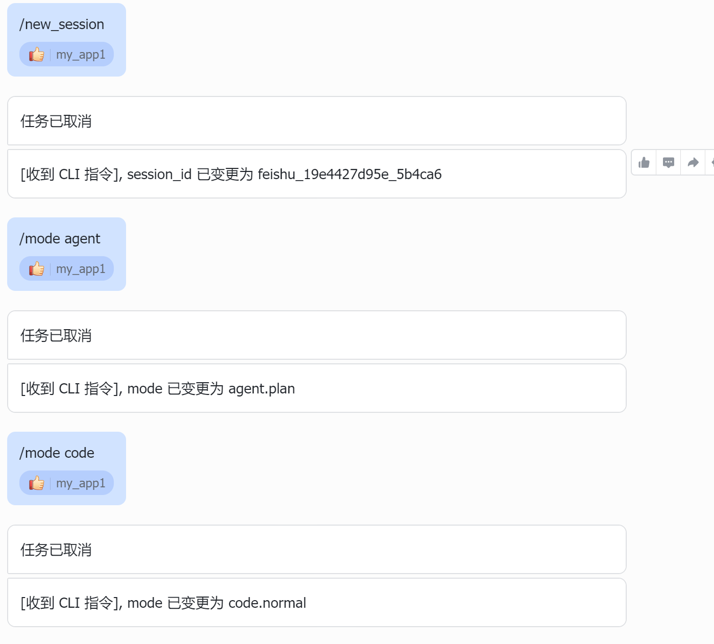

## 命令行 / 通道控制指令说明

JiuwenSwarm 支持通过「特殊前缀指令」控制会话和模式，这些指令由 Gateway 层的 `MessageHandler` 解析，**不会发给 Agent 本身**。

---

### 受控通道

以下 IM 通道支持控制指令：

- `feishu`（飞书）
- `xiaoyi`（小艺）
- `dingtalk`（钉钉）
- `whatsapp`
- `wechat`（微信）

---

### 1. `/new_session` —— 新建会话 ID

**作用：**

- 为当前通道生成一个新的 `session_id`，形如 `{通道类型}_{毫秒时间戳hex}_{随机hex}`
- 后续从该通道进来的所有普通聊天消息，都会被强制覆盖为这个新的 `session_id`

**使用方式：**

在受控通道中发送：

```text
/new_session
```



Gateway 会：
1. 拦截这条消息（不转发给 Agent）
2. 取消当前 session 正在执行的任务
3. 为该 `channel_id` 生成新的 `session_id`
4. 回复系统提示，例如：`[收到 CLI 指令], session_id 已变更为 feishu_17f2b4b32e0_ab12cd`

---

### 2. `/mode` —— 切换通道模式

**作用：**

为当前通道设置工作模式，Agent 在构造提示词和行为策略时可以使用。

**一级模式（默认映射到二级模式）：**

| 命令 | 映射到 | 说明 |
|------|--------|------|
| `/mode agent` | `agent.plan` | Agent 模式，偏规划、解释、拆解任务 |
| `/mode code` | `code.normal` | 代码模式，Agent 通过代码执行工具与环境交互 |
| `/mode team` | `team` | 组队模式 |

**直达二级模式：**

| 命令 | 说明 |
|------|------|
| `/mode agent.plan` | Agent 模式 + 规划风格（默认） |
| `/mode agent.fast` | Agent 模式 + 自动执行风格 |
| `/mode code.normal` | 代码模式 + 直接执行风格（默认） |
| `/mode code.team` | 代码模式 + 组队风格 |

> 说明：以上是 Gateway 受控通道白名单。TUI 本地 `/mode` 还支持 `/mode plan`（等价于 `agent.plan`）、`/mode team.normal`（等价于 `team`）；这些写法不会被 Gateway 受控通道识别。

**使用方式：**

```text
/mode agent
```

或

```text
/mode code
```

Gateway 会：
1. 拦截这条消息
2. 取消当前 session 正在执行的任务（如果模式发生变化）
3. 更新 `ChannelControlState.mode`
4. 回复系统提示，例如：`[收到 CLI 指令], mode 已变更为 code.normal`

---

### 3. `/switch` —— 切换二级模式

**作用：**

在当前一级模式下切换二级风格，比 `/mode` 更简洁。

| 命令 | 当前 agent 模式时 | 当前 code 模式时 |
|------|------------------|------------------|
| `/switch plan` | → `agent.plan` | 不支持 |
| `/switch fast` | → `agent.fast` | 不支持 |
| `/switch normal` | 不支持 | → `code.normal` |
| `/switch team` | 不支持 | → `code.team` |

> TUI 代码中也有 `/switch` 实现，但当前默认 TUI 命令注册表未注册该命令；在 TUI 中切换子模式请优先使用 `/mode ...` 或 `/plan`。

**使用方式：**

```text
/switch plan
```

---

### 4. `/skills list` —— 列出可用技能

**作用：**

查询当前可用的技能列表。

**使用方式：**

```text
/skills list
```

Gateway 会调用 `skills.list` 并以通知形式回复技能列表。

---

### 5. `/branch` —— 分叉会话

**作用：**

从当前会话分叉出一个新会话，保留原有对话历史，适合在不影响原会话的情况下探索新方向。

**使用方式：**

```text
/branch
```

或带自定义名称：

```text
/branch 修复登录问题
```

Gateway 会：
1. 调用 `session.fork` 创建新会话
2. 切换到新会话
3. 回复提示，例如：`[收到 /branch 指令] 已分叉会话「修复登录问题」，当前已切换到新会话。`

---

### 6. `/rewind` —— 回退对话

**作用：**

将当前会话回退到指定轮次，删除该轮次及之后的所有对话记录。

**使用方式：**

先发送回退请求：

```text
/rewind 3
```

Gateway 会回复确认提示，要求用户确认：

```
[收到 /rewind 3 指令] 确认要回退到第 3 轮吗？
此操作不可逆，将删除第 3 轮及之后的所有对话。
请回复 /rewind confirm 3 确认，或 /rewind cancel 取消。
注意：回退不影响手动编辑的文件或通过 bash 执行的命令。
```

确认执行：

```text
/rewind confirm 3
```

取消操作：

```text
/rewind cancel
```

---

### 配置说明

- 模式是 **按通道维度** 存储的（`channel_id` → `mode`），同一通道的所有后续消息都会自动带上当前模式
- `config.yaml` 中可设置 `default_mode` 作为初始值，`MessageHandler` 启动时会读取
- `/new_session` 和 `/mode` 变更时会自动取消当前 session 正在执行的任务

---

## 终端 CLI：`jiuwenswarm chat`

从 v0.2.3 开始，JiuwenSwarm 提供了原生命令行聊天入口，可以在终端中直接与 JiuwenSwarm 对话。

### 快速开始

```bash
# 启动 Gateway 和 AgentServer（如未启动）
jiuwenswarm-start app

# 发送一条消息
jiuwenswarm chat "你好，介绍一下你自己"
```

`jiuwenswarm chat` 通过 Gateway 的 `/tui` WebSocket 路由（`channel_id="tui"`）调用 JiuwenSwarm 的运行时，与 TUI 共用相同的 MessageHandler 和 AgentServer 路径。

### 基本用法

| 命令 | 说明 |
|---|---|
| `jiuwenswarm chat "hello"` | 发送单条消息 |
| `jiuwenswarm chat 检查 仓库 并 给出 建议` | 多词自动拼接为一个 prompt |
| `echo "分析 main.py" \| jiuwenswarm chat` | 管道输入 |
| `jiuwenswarm chat` | 无参数 + 交互终端 → 进入 REPL 模式 |

### 选项

| 选项 | 默认值 | 说明 |
|---|---|---|
| `--mode <mode>` | `code.normal` | 执行模式，见[模式系统](模式系统.md) |
| `--session <id>` | 自动生成 | 指定或复用会话 ID |
| `--cwd <path>` | 当前目录 | 文件引用和 Agent 上下文的工作目录 |
| `--project-dir <path>` | `--cwd` | 项目和 agent 缓存标识 |
| `--trusted-dir <path>` | `--project-dir` | 信任目录（可重复） |
| `--gateway-url <url>` | `ws://127.0.0.1:19001/tui` | 自定义 Gateway 地址 |
| `--name <instance>` | — | 多实例隔离 |
| `--dotenv <path>` | — | 指定 .env 文件 |
| `--json` | — | 输出一个最终 JSON 对象 |
| `--jsonl` | — | 逐行输出 JSON 事件帧 |
| `--show-reasoning` | — | 显示推理过程（输出到 stderr） |
| `--show-tools` | — | 显示工具调用/结果（输出到 stderr） |
| `--timeout <seconds>` | — | 总响应超时（秒） |

### 模式（`--mode`）

支持的模式值与[模式系统](模式系统.md)和 TUI `/mode` 命令一致：

| 模式 | 别名 | 说明 |
|---|---|---|
| `code.normal` | `code` | 默认，代码普通模式 |
| `code.plan` | — | 代码规划模式 |
| `code.team` | — | 代码团队模式 |
| `agent.plan` | `agent` | Agent 规划模式 |
| `agent.fast` | — | Agent 快速模式 |
| `team` | — | 团队模式 |

```bash
# 使用别名
jiuwenswarm chat --mode agent "帮我做规划"
jiuwenswarm chat --mode code "帮我分析代码"

# 使用规范值
jiuwenswarm chat --mode code.plan "设计一个用户系统"
```

### 会话复用

```bash
# 首次：指定会话名
jiuwenswarm chat --session project-a "分析项目架构"

# 后续：复用同一会话，保持上下文
jiuwenswarm chat --session project-a "有什么改进建议？"

# 不指定 --session 时自动生成 cli-YYYYMMDD-HHMMSS-xxxxxxxx
```

### REPL 模式

不带 prompt 参数直接运行，自动进入多轮对话：

```bash
jiuwenswarm chat
# Session: cli-20260616-120500-abc12345
# > 帮我看看当前目录的文件
# > 分析 main.py
# > /exit
```

REPL 中所有消息复用同一个 session，保持上下文连续。

**退出 REPL** 的方式：

- `/exit`、`/quit` 或 `/q`
- `Ctrl+D`（Unix）/ `Ctrl+Z`+Enter（Windows）
- 在输入提示符下按 `Ctrl+C`

### 加载动画

发送请求后，在等待第一个回复期间，终端会显示动态加载提示（输出到 stderr，不影响内容重定向）：

```
✢ analyzing (3s)
```

- **12 帧 ping-pong 动画**：`␣ · ✢ ✳ ✶ ✻ ✽` 正反循环
- **随机动词**：analyzing, thinking, planning, exploring, searching, reading, computing, processing, generating, understanding, writing, compiling, checking, optimizing, learning
- **计时器**：1 秒后开始显示耗时
- **卡顿检测**：3 秒无新内容时图标变红
- 收到第一个 delta 后自动清除

### 输出模式

| 模式 | 命令 | 说明 |
|---|---|---|
| 人类可读（默认） | — | 流式输出 delta 到 stdout |
| JSON | `--json` | 缓冲所有事件，最后输出一个 JSON 对象 |
| JSONL | `--jsonl` | 每收到一个事件帧就输出一行 JSON |

```bash
# JSON 输出
jiuwenswarm chat --json "分析 README"
# → {"ok": true, "content": "..."}

# JSONL 输出（适合管道处理）
jiuwenswarm chat --jsonl "分析 README" | jq
```

### 中断操作

| 操作 | 行为 |
|---|---|
| 第一次 Ctrl+C | 发送 `chat.interrupt` 给 Agent，尝试优雅取消。在 REPL 模式下，取消后留在循环中等待下一个输入 |
| 第二次 Ctrl+C | 强制退出（退出码 130） |

> **Windows 注意**：Windows 不支持 `loop.add_signal_handler`。CLI 会回退到 `signal.signal(SIGINT, ...)`，使 Ctrl+C 仍能触发优雅取消（发送 `chat.interrupt`），而不是抛出未处理的 `KeyboardInterrupt`。连续两次快速 Ctrl+C 在 Windows 上同样会强制退出。

### 退出码

| 码 | 含义 |
|---|---|
| 0 | 成功 |
| 1 | Agent 返回错误 |
| 2 | CLI 参数错误 |
| 3 | Gateway 不可达 |
| 4 | 需要交互输入但 stdin 不是 TTY |
| 130 | 用户中断 |

### 与 TUI 的关系

`jiuwenswarm chat` 复用 TUI 的 `/tui` 路由（`channel_id="tui"`），与 TUI 共用同一套 MessageHandler 和 AgentServer 管线。同一 `channel_id="tui"` 同一时刻只能有一个 WebSocket 客户端在线——在 `jiuwenswarm chat` 运行时打开 TUI（或反过来）会替换该通道上的上一个客户端。终端 CLI 的第一版不追求完整复刻 TUI 的所有 slash command。


