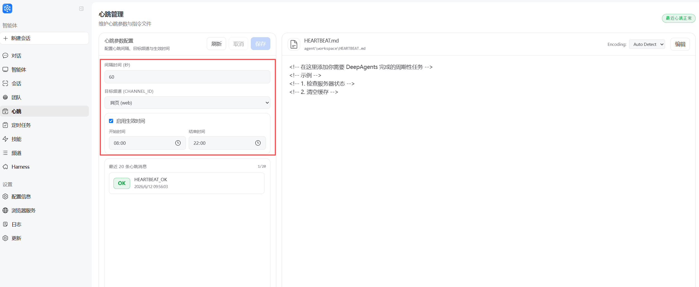
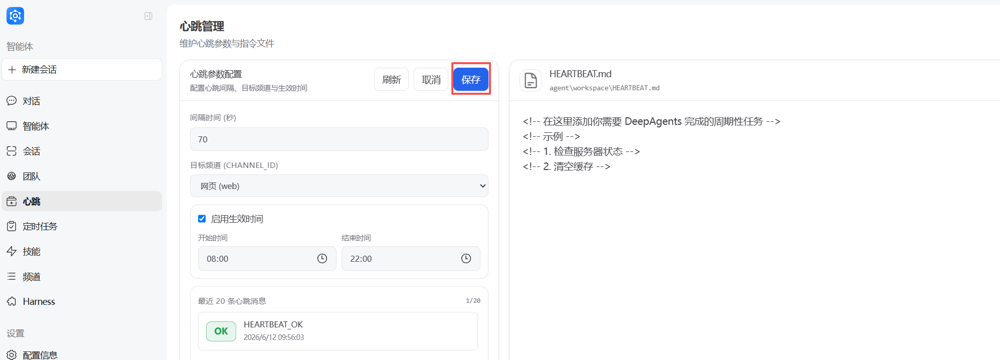
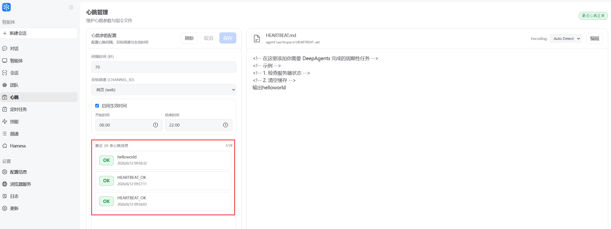
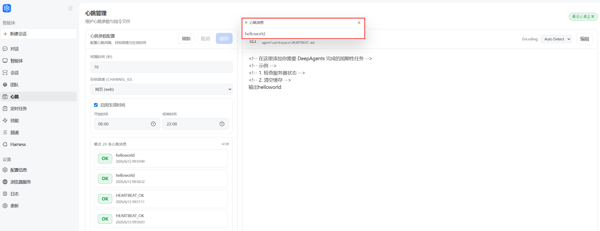
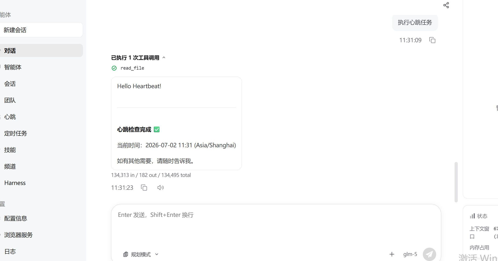

# 心跳

[英文文档](../en/Heartbeat.md)

---

## 概念科普

### 什么是心跳机制

Heartbeat（心跳）是网关按固定间隔向 AgentServer 发送的探活请求，用于检测连接与 Agent 是否可用；若配置了 `workspace/HEARTBEAT.md`，还可驱动 Agent 周期性执行其中列出的任务。并且支持用户选择频道返回 Agent 执行的结果（默认 web）。

### 心跳与定时任务的对比

| 特性 | 心跳 | 定时任务 |
|------|------|----------|
| **触发方式** | 固定时间间隔（秒），如每小时一次 | Cron 表达式，支持复杂调度规则 |
| **发起方** | Gateway 主动向 AgentServer 发送探活请求 | 独立的 Scheduler 模块调度执行 |
| **任务定义** | 通过 `workspace/HEARTBEAT.md` 文件定义任务列表 | 通过前端创建任务，包含 query、interval_hours 等参数 |
| **执行机制** | 读取 HEARTBEAT.md 内容注入到 chat 请求中，走正常对话流程 | 创建独立的执行会话，支持执行历史记录和状态管理 |
| **主要用途** | 服务探活、周期性任务执行、状态检测 | 定时触发特定任务，支持单次/周期性执行 |
| **结果回传** | 通过 `heartbeat.relay` 事件推送到指定 Channel | 结果存储在任务执行历史中，可在前端查看 |

### 心跳的工作流程

1. **启动阶段**：Gateway 启动时初始化 `GatewayHeartbeatService`，根据配置的 `interval_seconds` 创建周期任务。

2. **周期调度**：服务启动后进入主循环，每隔 `interval_seconds` 秒执行一次探活（`_tick`）。

3. **时间检查**：执行探活前，根据 `active_hours` 配置判断当前时间是否在生效时间段内，不在则跳过本次心跳。

4. **请求构造**：构造 E2A 协议请求，包含心跳标识和 HEARTBEAT.md 的读取指令，发送给 AgentServer。

5. **Agent 处理**：AgentServer 识别到心跳请求后，读取 `workspace/HEARTBEAT.md` 文件内容，将任务列表注入到 query 中，走正常对话流程执行任务。

6. **结果回传**：执行完成后，若配置了 `relay_channel_id`（如 `web`），心跳响应通过 `heartbeat.relay` 事件推送到前端，更新心跳状态和历史记录。

---

## 配置指导

### 1. 前端「心跳」面板

Web 端左侧导航进入 **心跳** 面板，可查看和修改心跳配置：



**配置项说明：**

| 配置项 | 说明 | 默认值 |
|--------|------|--------|
| **心跳间隔** | 心跳发送的时间间隔（秒），必须 > 0 | 3600 |
| **回传目标** | 心跳结果回传的 channel，一般为 `web` | web |
| **生效时间段** | 心跳仅在此区间内发送，格式为 `HH:MM`（24小时制） | 不配置则全天生效 |

修改配置后点击保存，会写回 `config/config.yaml` 的 `heartbeat` 段，并自动重启心跳服务。



### 2. 配置文件 `config/config.yaml`

在 `config/config.yaml` 中配置 `heartbeat` 段：

```yaml
heartbeat:
  # 心跳间隔（秒），默认 3600
  every: 3600
  # 心跳结果回传的 channel（如 "web" 表示 Web 前端）
  target: web
  # 心跳生效时间段（本地时间），仅在此区间内发送心跳；不配置则始终生效
  active_hours:
    start: 08:00
    end: 22:00
```

| 字段 | 含义 | 说明 |
|------|------|------|
| `every` | 心跳间隔（秒） | 必须 > 0，例如 60 表示每分钟一次，3600 表示每小时一次。 |
| `target` | 回传目标 channel | 一般为 `web`，表示把心跳响应通过 WebChannel 推到前端；留空或不存在则不回传。 |
| `active_hours` | 生效时间段 | `start` / `end` 格式为 `HH:MM`（24小时制）。仅当当前时间在 [start, end] 内才发心跳；不配置则全天生效。支持跨午夜（如 22:00–06:00）。 |

### 3. 环境变量（覆盖 YAML）

| 变量名 | 含义 | 示例 |
|--------|------|------|
| `HEARTBEAT_INTERVAL` | 心跳间隔（秒） | `3600` |
| `HEARTBEAT_RELAY_CHANNEL_ID` | 回传目标 channel | `web` |
| `HEARTBEAT_TIMEOUT` | 单次心跳请求超时（秒） | `30` |

环境变量优先级高于 `config/config.yaml` 中的 `heartbeat` 段。

---

## 查看心跳

### 心跳历史记录

在心跳面板的「最近 20 条心跳消息」显示框里可以查看心跳历史记录，包括每次心跳的状态（正常 / 告警）、内容与时间。



### 弹窗提示

当 `target` 设置为 `web` 时，每次心跳响应会通过 `heartbeat.relay` 事件推到前端。若内容非 `HEARTBEAT_OK`，则以弹窗形式提示，便于查看任务执行结果或异常信息。



---

## 案例实践

### 案例：打印 Hello World

在 `HEARTBEAT.md` 中添加以下内容：

```markdown
请输出 "Hello Heartbeat!"
```

心跳执行时，Agent 会读取该内容并输出 `Hello Heartbeat!`，结果会通过 `heartbeat.relay` 事件回传到前端。


---

## 常见问题

**Q：修改了 `config/config.yaml` 的 heartbeat 段，为何没生效？**  
A：应用启动时读取配置；若通过前端「心跳」面板修改，会写回 YAML 并自动重启心跳服务。若直接改 YAML，需重启整个应用（如重启 jiuwenswarm-web）后新配置才会生效。

**Q：如何只在工作时间发心跳？**  
A：在 `heartbeat.active_hours` 中设置 `start` / `end`，例如 `start: 09:00`、`end: 18:00`，则仅在 09:00–18:00 之间发送心跳。

**Q：心跳请求超时怎么办？**  
A：可设置环境变量 `HEARTBEAT_TIMEOUT`（秒）。超时后本次心跳记为失败，会在日志中打 WARNING

**Q：HEARTBEAT.md 放在哪里？**
A：必须放在 DeepAgent workspace 根目录下：`~/.jiuwenswarm/agent/workspace/HEARTBEAT.md`。否则会被视为「无自定义任务」，仅返回 `HEARTBEAT_OK`。

---

## 机制介绍与关键代码

### 心跳机制下 Agent 行为简述

服务端实现会读取 `HEARTBEAT.md`，解析出任务列表，拼成一条 chat 请求发给 Agent，走正常对话流程；解析失败或任务列表为空时，直接返回 `HEARTBEAT_OK`；否则执行任务返回响应。心跳响应结果通过 `heartbeat.relay` 事件推送到前端，用于更新状态与历史记录；若内容非 `HEARTBEAT_OK`，则以弹窗形式提示。

### 相关代码与配置索引

| 代码路径 | 功能说明 |
|----------|----------|
| `jiuwenswarm/gateway/heartbeat/heartbeat.py` | 心跳服务实现，包含周期调度和 E2A 请求构造 |
| `jiuwenswarm/common/config.py` | 配置读取与写回，`update_heartbeat_in_config` 函数 |
| `jiuwenswarm/app.py` | 应用启动时从配置文件和环境变量构建 `HeartbeatConfig` |
| `jiuwenswarm/server/runtime/agent_adapter/interface_deep.py` | Agent 侧 HEARTBEAT.md 处理，识别心跳会话并触发任务 |
| `jiuwenswarm/channels/web/frontend/src/components/HeartbeatPanel/` | 前端心跳面板组件 |
| `heartbeat.get_conf` / `heartbeat.set_conf` | 前端配置读取与设置 API |
| `heartbeat.relay` | 心跳响应推送事件 |