# 技能
---

## 概念科普

### 技能是什么

**定义：**

技能（Skill）是给 JiuwenSwarm 补充特定能力的模块，可理解为**可安装、可管理、可复用的能力包**。

就像手机上的 App 扩展了手机的功能，技能扩展了智能体的能力边界。
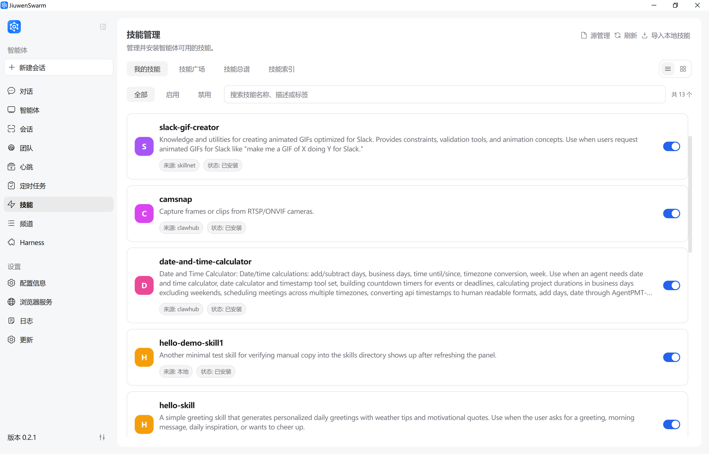

### 技能目录与 SKILL.md（常见结构）

每个技能通常是一个文件夹，至少包含 **`SKILL.md`**（技能定义，说明用途、步骤与约束）；可选包含 `references/`（参考文档）、`scripts/`（辅助脚本）等。**正文科普仍以概念为主**，自定义技能的目录示例与 **YAML frontmatter** 写法见下文 [如何自定义技能](#如何自定义技能)。

**为什么需要技能：**

| 场景 | 没有技能时 | 有技能后 |
|------|-----------|----------|
| 创建 GitCode PR | 需要手动调用多个 API、处理分支、写提交信息 | 一句话"帮我提个 PR"，技能自动完成全流程 |
| 制作 PPT | 需要逐步指导内容、格式、导出 | 加载 PPT 技能后，直接生成完整演示文稿 |
| 处理 PR 检视意见 | 需要逐条读取评论、修改代码、回复讨论 | 技能自动获取意见、修改代码、回复平台 |


**技能与智能体、对话的关系：**

```
┌───────────────────────────────────────────────────────┐
│                     智能体 (Agent)                     │
│                                                       │
│   基础能力：对话、文件操作、网络搜索、代码执行            │
│                                                       │
│   ┌───────────────────────────────────────────────┐   │
│   │               技能层 (Skills)                  │   │
│   │                                               │   │
│   │   ┌───────────┐ ┌───────────┐ ┌─────────────┐ │   │
│   │   │ gitcode-pr│ │pptx-craft ││gitcode-pr-fix│ │   │
│   │   │  Git操作   │ │  PPT制作  │ │处理PR检视意见│ │   │
│   │   └───────────┘ └───────────┘ └─────────────┘ │   │
│   │                                               │   │
│   │   可安装、可卸载、可扩展                        │   │
│   └───────────────────────────────────────────────┘   │
│                                                       │
└───────────────────────────────────────────────────────┘

用户对话 → 智能体识别需求 → 加载对应技能 → 执行专业流程 → 返回结果
```

**技能来源：**

JiuwenSwarm 支持多种技能来源：

| 来源 | 说明                       | 特点 |
|------|--------------------------|------|
| **内置技能** | 系统内置的核心技能，在「技能广场 → 预置」中安装    | 与产品版本一致|
| **SkillNet** | 一个通用的 AI 技能管理与连接平台（开源技能库）       | 可匿名使用；配置 GitHub Token 可提升 API 限额与稳定性 |
| **ClawHub** | JiuwenSwarm 框架下的技能“应用商店”（企业技能库） | 需配置 CLI Token；访问 https://clawhub.ai/skills |
| **SwarmSkills** | 团队/集群技能库，在「技能广场 → SwarmSkills在线搜索」中检索 | 无需额外配置 |
| **本地导入** | 用户自建技能文件                 | 完全自定义，适合开发调试 |

> **安全提示**：技能可能涉及文件修改、命令执行、外部服务访问。安装和使用前请先查看来源与说明，优先选择可信来源的技能。

---

## 操作指导

### 技能安装

无论从内置包、SkillNet、ClawHub 还是本地目录获取技能，**安装与启用均在前端「技能」页面完成**。技能页面顶部分为 **我的技能**、**技能广场**、**技能总谱**、**技能索引** 四个标签页：在线安装在 **技能广场** 中进行，已安装技能在 **我的技能** 中管理。下面按来源说明前置条件与操作路径。

#### 内置技能

内置技能指打包在 JiuwenSwarm 中的技能资源。

1. **安装**

   操作路径：左侧导航栏 → **技能** → **技能广场** → **预置**，找到目标技能后点击 **安装**。  
   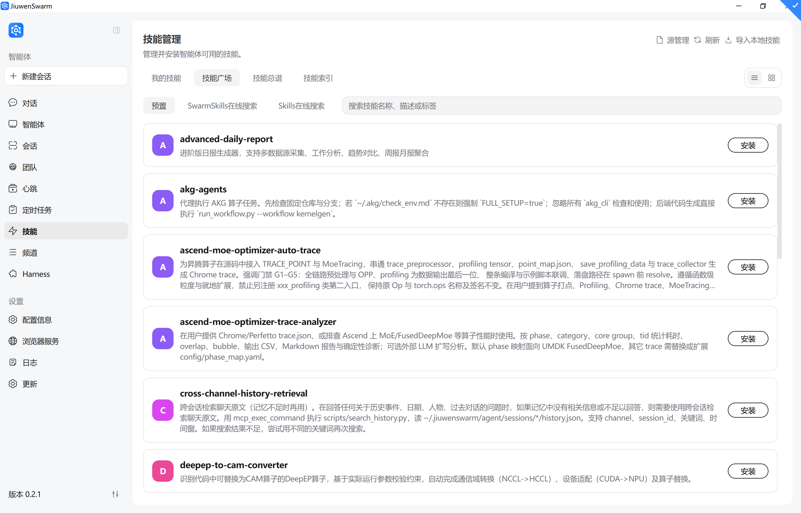

#### 从 SkillNet 安装技能

SkillNet 是基于 GitHub 的技能仓库网络。

**前置条件：**
- 建议配置 GitHub Token（用于提升 GitHub API 限额与稳定性）
- Token 获取方式：GitHub → Settings → Developer settings → Personal access tokens → Generate new token

**安装步骤：**

1. **（可选）配置 GitHub Token**

   打开左侧导航栏 → **配置信息** → **其他配置** → **第三方服务配置**，填写 `github_token`（可选；用于提升 GitHub API 限额与稳定性）。
   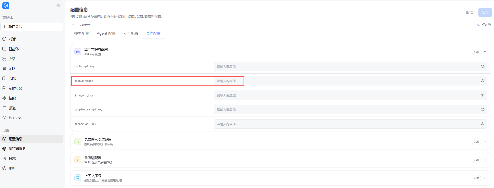

   或在 `~/.jiuwenswarm/config/.env` 中配置：

   ```dotenv
   GITHUB_TOKEN=ghp_your_token_here
   ```

   （配置页面填写后也是写入同一个 `.env`；token 最终从环境变量 `GITHUB_TOKEN` 读取。）

2. **安装**

   在前端完成安装：
   操作路径：左侧导航栏 → **技能** → **技能广场** → **Skills在线搜索**，点击右上角 **源管理**，选择 **SkillNet**，然后在搜索框输入关键词搜索，并点击目标技能右侧的 **安装**。
   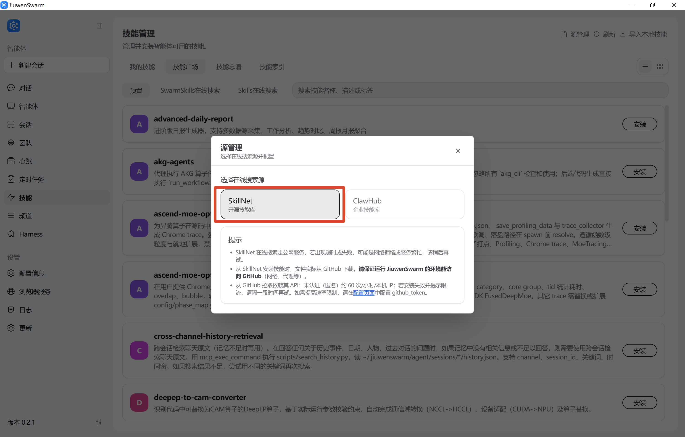

3. **确认安装成功**

   安装完成后，在 **技能** → **我的技能** 列表中确认新技能已出现。

#### 从 ClawHub 安装技能

ClawHub 访问地址：https://clawhub.ai/skills

**前置条件：**
- 首次使用需要配置 ClawHub Token
- Token 从 ClawHub 平台个人设置中创建

**安装步骤：**

1. **获取 ClawHub Token**

   访问 https://clawhub.ai/skills，登录后进入右上角 **Settings**，创建 Token。

2. **在前端配置 Token 并完成安装**

   操作路径：左侧导航栏 → **技能** → 右上角 **源管理** → 选择 **ClawHub**。  
   首次使用时在弹窗中填写从 ClawHub 平台获取的 CLI Token 并保存：
   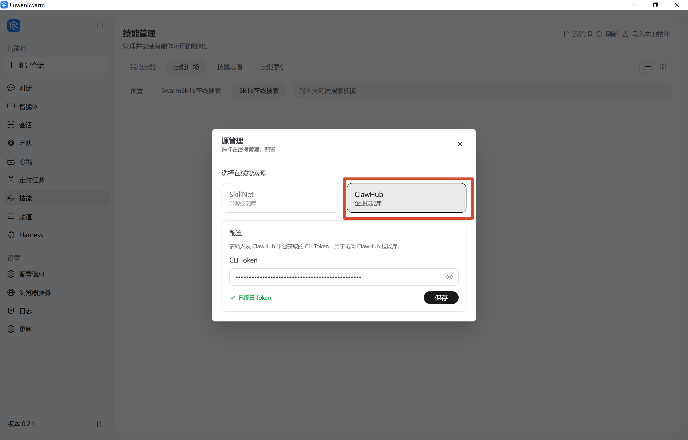

   配置完成后，进入 **技能广场** → **Skills在线搜索**，搜索目标技能名称，点击 **安装**：
   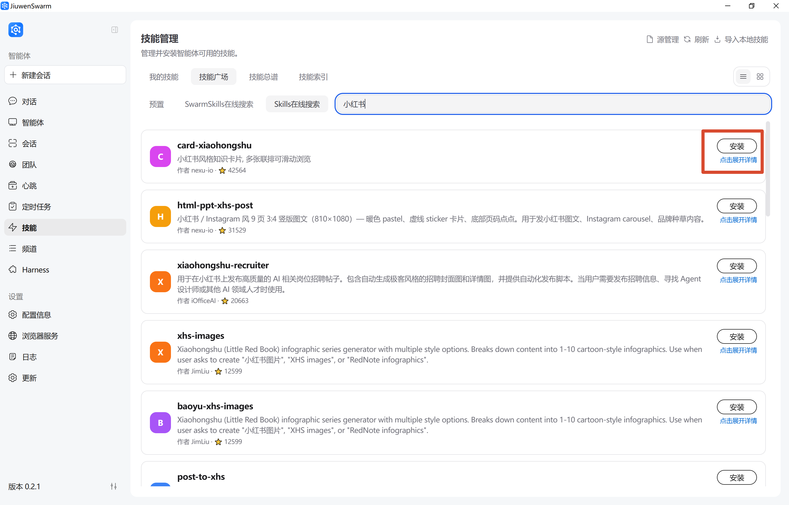

#### 导入本地技能

本地技能适合以下场景：
- 自己开发的技能，正在调试
- 从他人处获取的技能文件包
- 需要修改定制已有技能

**安装步骤：**

1. **准备技能文件**

   确保技能目录包含 `SKILL.md` 文件，结构如下：
   ```
   my-skill/
   ├── SKILL.md          # 技能定义文件（必需）
   ├── references/       # 参考文档（可选）
   └── scripts/          # 辅助脚本（可选）
   ```

2. **本地导入（前端）**

   操作路径：左侧导航栏 → **技能** → 右上角 **导入本地技能**，在弹窗中输入服务端本地 skill 路径（`SKILL.md` 文件或技能目录），点击确定。
   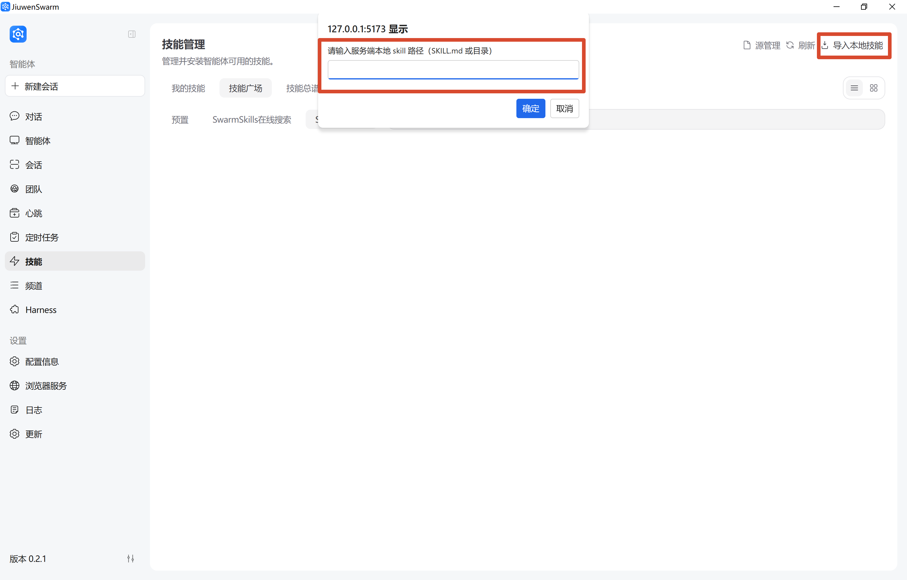

3. **手动放置到技能目录（可选）**

   将技能文件夹复制到：
   ```
   C:\Users\<用户名>\.jiuwenswarm\service_default\agent_default\jiuwenswarm_workspace\skills\
   ```

4. **确认生效**

   安装完成后，在 **技能** → **我的技能** 列表中确认新技能已出现。

---

### 技能管理页面

技能管理页面是管理和查看所有技能的核心界面，可通过左侧导航栏的"技能"入口进入。页面顶部分为四个标签页，右上角提供 **源管理**、**刷新**、**导入本地技能** 入口。

| 标签页 | 功能 |
|--------|------|
| **我的技能** | 浏览、检索已安装技能，支持按"全部 / 启用 / 禁用"筛选，可启停技能、进入详情 |
| **技能广场** | 安装新技能，含 **预置**（内置技能）、**SwarmSkills在线搜索**、**Skills在线搜索**（SkillNet / ClawHub）三个子页 |
| **技能总谱** | 可视化展示已安装技能之间的能力关系图谱，详见 [Symphony](symphony-技能编排与分发.md) |
| **技能索引** | 构建本地技能检索索引，可按任务需求检索匹配的技能，详见 [Symphony](symphony-技能编排与分发.md) |

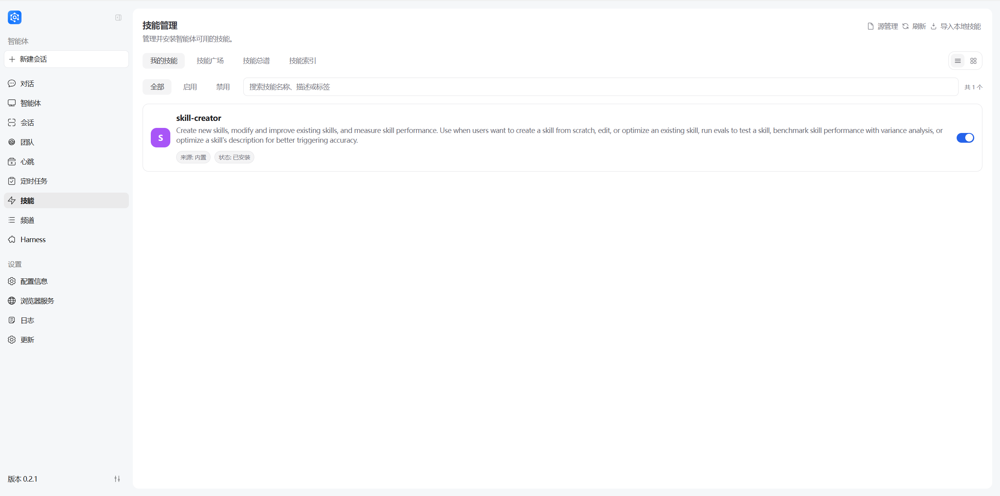

#### 页面展示内容

在「我的技能」列表中，每个技能会展示以下关键信息：

| 展示项 | 说明 |
|--------|------|
| **技能名称** | 技能的唯一标识名称，如 `gitcode-pr`、`weather` |
| **描述** | 技能的功能描述，简要说明该技能能完成什么任务 |
| **来源** | 技能的获取来源，如 `本地`、`内置`、`skillnet`、`clawhub` |
| **状态** | 技能的当前状态，如"已安装"、"未安装" |
| **启用开关** | 控制该技能是否可在对话中被加载使用 |

#### 查看技能经验

在技能列表中，点击某个技能的 **查看技能经验**，可逐条查看该技能产生的演进经验。

**每条经验通常包含：**
- **来源**：经验产生的来源（如检测到的信号、对话或执行上下文）
- **时间**：记录生成或写入的时间
- **上下文**：触发该条经验时的会话/任务背景说明
- **经验内容**：具体改进说明，对应数据中的 `change.content` 字段

> **如何能看到数据：** 当某个技能已经保存演进经验时，技能列表中的 **查看技能经验** 会变为可用，点击即可查看。若暂时没有数据，说明该技能还没有已保存的演进记录；这些记录可以通过 `/evolve <skill_name> [user_query]` 手动生成，也可以在 **自演进配置** 中开启 **自动检测可演进信号** 后，由系统在失败、纠错等场景中自动产生。详见[配置信息](配置信息.md)与 [Skill 自演进](Skill自演进.md)。

> **用途说明**：技能经验反映自演进与真实使用中的改进沉淀，便于判断技能是否持续可用，也为技能维护者提供依据。


#### 技能总谱与技能索引

技能页中的 **技能总谱** 和 **技能索引** 属于 Symphony 能力：技能索引用来在大量已安装技能中逐步找到候选技能，技能总谱用 `can_feed` 关系展示技能之间是否能够衔接。多技能任务的编排、读谱、构建和对话使用方式，详见 [Symphony：技能检索、编排与分发](symphony-技能编排与分发.md)。

---

### 源管理

**源管理** 用于选择「技能广场 → Skills在线搜索」所使用的在线技能源，并完成相应凭据配置。

操作路径：左侧导航栏 → **技能** → 右上角 **源管理**。

| 操作 | 说明 |
|------|------|
| **选择 SkillNet** | Skills在线搜索将从 SkillNet（开源技能库）检索；弹窗内附网络与 GitHub API 限流提示，如频繁失败可前往配置页面填写 `github_token` |
| **选择 ClawHub** | Skills在线搜索将从 ClawHub（企业技能库）检索；首次使用需在弹窗内填写并保存 CLI Token |


> **提示**：内置技能（技能广场 → 预置）与 SwarmSkills 在线搜索不依赖源管理，可直接使用。切换源后，已安装的技能不受影响。

---

### 安装后管理

安装技能后，需要进行查看、验证、卸载等管理操作。

#### 查看已安装技能

**方法一：前端查看**

左侧导航栏 → **技能** → **我的技能**，即可浏览已安装技能，并可按"全部 / 启用 / 禁用"筛选或按名称、描述、标签搜索（界面布局与上文「技能列表与检索」示意图一致，此处不再重复插图）。

**方法二：通过对话**

```
帮我查看已安装的技能列表
```

智能体会列出所有已安装技能的名称、来源、版本等信息。

**方法三：查看技能目录**

直接打开文件夹：
```
C:\Users\<用户名>\.jiuwenswarm\service_default\agent_default\jiuwenswarm_workspace\skills\
```

每个子文件夹对应一个技能。

#### 查看技能详情

查看技能详情有两种常见方式：**通过对话展示**，或**从前端技能页点进详情**。

**方式一：通过对话**

在对话中请求展示某个技能的详情，例如：

```
帮我查看 gitcode-pr 技能的详情
```

智能体会在对话里汇总并展示该技能的关键信息（可与下图类似）。
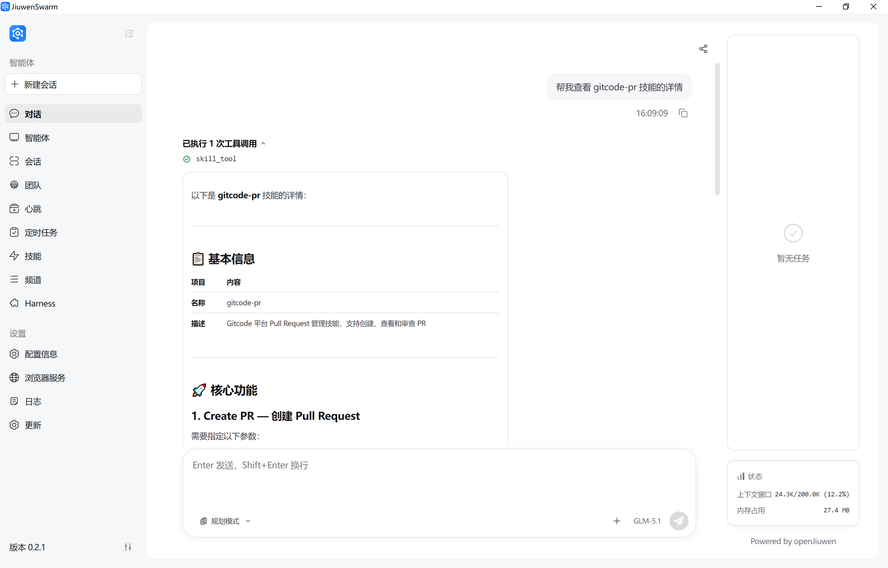

**方式二：从前端进入**

操作路径：左侧导航栏 → **技能** → **我的技能** → **点击目标技能**，进入技能详情页查看完整内容。
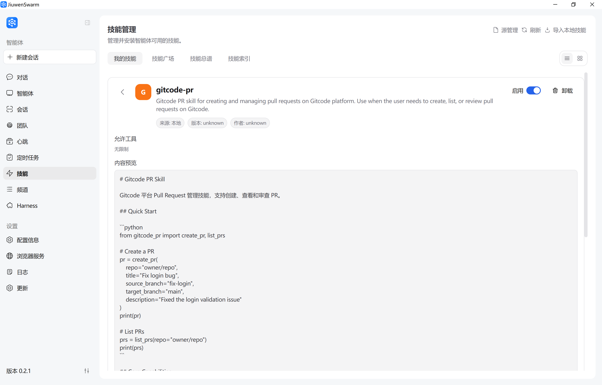

详情包括：
- **来源 / 版本 / 作者**：技能的获取来源（本地 / 内置 / skillnet / clawhub 等）与版本信息
- **说明**：技能用途描述
- **启用开关与卸载按钮**：位于详情页右上角
- **允许工具**：该技能可调用的工具列表（未声明时显示"无限制"）
- **内容预览**：SKILL.md 技能定义文件全文

#### 卸载技能

卸载入口位于**技能详情页**：

1. 在 **我的技能** 列表中点击目标技能，进入技能详情页。
2. 点击详情页右上角的 **卸载** 按钮，确认后完成卸载。
   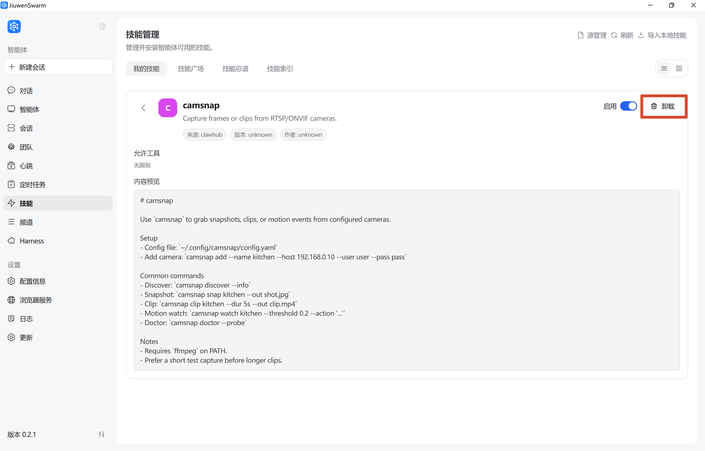

卸载后：
- 技能文件从 skills 目录移除
- 对话中不再自动加载该技能
- 已执行的任务结果不受影响

#### 判断技能是否生效

**检查方法：**

1. **查看技能列表**：确认技能出现在已安装列表中
2. **尝试调用**：用相关需求测试技能是否被触发
3. **查看日志**：检查 logs 目录，确认技能加载记录

**常见状态：**

| 状态 | 说明 | 处理建议 |
|------|------|----------|
| 已安装且生效 | 正常可用 | 无需处理 |
| 已安装但未加载 | 可能需要重启服务 | 重启后重试 |
| 安装失败 | Token/网络/源问题 | 查看错误信息，检查配置 |
| 版本过旧 | 功能可能受限 | 更新到最新版本 |

---

## 使用教程

### 如何在对话中使用技能

安装完成后，技能会在对话中自动或手动触发。

#### 自动触发

智能体根据用户需求自动识别并加载合适技能。

**示例：**

```
用户：帮我往 GitCode 提一个 PR
智能体：[自动加载 gitcode-pr 技能] 
        好的，我来帮你创建 PR...
```

#### 手动指定

用户可以明确指定使用某个技能。

**示例：**

```
用户：请使用 pptx-craft 技能帮我做一个产品介绍 PPT
智能体：[加载 pptx-craft 技能]
        好的，我来制作 PPT...
```

### 如何描述需求更容易调用技能

**推荐写法：**

| 推荐 Prompt | 说明 |
|-------------|------|
| "帮我在 GitCode 提一个 PR" | 明确平台和操作，触发 gitcode-pr |
| "用 pptx-craft 做一个技术分享 PPT" | 明确技能名和任务类型 |
| "帮我深度研究一下 AI 行业趋势" | 任务关键词匹配 deep-research 技能 |
| "处理一下 PR #123 的检视意见" | PR 相关任务触发 review-fix 技能 |

**不推荐写法：**

| 不推荐 Prompt | 问题 |
|---------------|------|
| "帮我弄一下那个东西" | 太模糊，无法识别技能 |
| "做个文档" | 未明确类型，可能不触发特定技能 |
| "提交代码" | 未明确平台，可能不触发 GitCode 技能 |

### 技能详情中值得关注的信息

在使用技能前，建议先查看技能详情：

| 信息项 | 为什么重要 |
|--------|------------|
| **来源** | 判断技能可信度 |
| **说明** | 了解技能适用场景 |
| **允许工具** | 知晓技能可执行的操作范围（如文件修改、命令执行） |
| **版本** | 确认是否为最新版本 |

**查看方式：**

```
请展示 gitcode-pr 技能的详情和 SKILL.md 内容
```

### 多技能任务：Symphony 技能编排

如果任务需要多个技能配合，例如“先识别图片文字，再翻译，再写文案，最后发送邮件”，可以使用 Symphony 的技能编排生成技能链，再确认是否继续执行。完整准备步骤、推荐提问方式和编排结果解读，详见 [Symphony：技能检索、编排与分发](symphony-技能编排与分发.md)。

---

## 案例实践

### 案例 1：天气查询（SkillNet）

**场景：**
用户希望快速获取某个城市的天气与近期预报。

**Skill 获取方式（可复现，来自 SkillNet）：**
1. 左侧导航栏进入 **技能** → **技能广场** → **Skills在线搜索**（右上角 **源管理** 中选择 SkillNet）。  
2. 在搜索框中搜索 `weather`。  
3. 点击安装，并在 **我的技能** 列表中确认 `weather` 已出现。  
4. 如搜索频率受限，可在 **配置信息 → 其他配置 → 第三方服务配置** 中填写 `github_token` 后重试。  

**前置条件（确保稳定复现）：**
- 已安装 `weather` 技能（按上面 SkillNet 步骤）
- 网络可访问公共天气服务（如 wttr.in / Open-Meteo）

**用户输入（示例）：**
```
请使用 weather 技能，查询北京今天和未来三天的天气。
```

**执行过程（预期）：**
1. 智能体识别并加载 `weather` 技能
2. 请求天气接口获取实时与预报数据
3. 汇总为可读结果（温度、天气、风力/降水等）

**结果展示（示例）：**
```
北京天气：
- 今日：多云，16~28°C
- 明日：晴，18~30°C
- 后天：小雨，19~26°C
（含体感温度与降水概率）
```

**该案例可稳定复现的关键：**
- Skill 来源固定（SkillNet）
- 输入模板简单明确（城市 + 时间范围）
- 无需额外业务账号或复杂本地环境

---

### 案例 2：PDF 文档处理（SkillNet）

**场景：**
你需要快速处理 PDF（如合并多个 PDF、拆分页面、提取文本），并得到可直接使用的结果文件。

**Skill 获取方式（可复现，来自 SkillNet）：**
1. 左侧导航栏进入 **技能** → **技能广场** → **Skills在线搜索**（右上角 **源管理** 中选择 SkillNet）。  
2. 在搜索框中搜索 `pdf`。  
3. 点击安装，并在 **我的技能** 列表中确认安装成功。  
4. 如搜索受限，先在配置页填写 `github_token`，再安装。  

**前置条件（确保稳定复现）：**
- 已安装 `pdf` 技能（按上面 SkillNet 步骤）
- 准备 2 个可访问的 PDF 文件（例如 `a.pdf`、`b.pdf`）

**用户输入（示例）：**
```
请使用 pdf 技能，把 `a.pdf` 和 `b.pdf` 合并为 `merged.pdf`，
并额外输出前两页的文本摘要。
```

**执行过程（预期）：**
1. 智能体识别并加载 `pdf` 技能
2. 定位输入 PDF 文件并执行合并
3. 对指定页面执行文本提取/摘要
4. 返回输出文件路径与摘要结果

**结果展示（示例）：**
```
处理完成：
1) 已生成合并文件：merged.pdf
2) 已提取第 1-2 页文本摘要：
- 第 1 页：……
- 第 2 页：……
```

---

## 进阶与排查

### 常见问题与注意事项

#### 常见问题

**问题 1：安装失败**

| 可能原因 | 解决方案 |
|----------|----------|
| Token 未配置或无效 | 检查 `github_token` / ClawHub CLI Token 配置 |
| 网络连接问题 | 检查网络，尝试重新安装 |
| 在线源不可达 | 确认运行环境可访问 GitHub（SkillNet）或 ClawHub 服务 |
| 技能不存在 | 确认技能名称正确 |

**问题 2：技能安装后看不到**

| 可能原因 | 解决方案 |
|----------|----------|
| 未重启服务 | 重启 JiuwenSwarm 服务 |
| 安装路径错误 | 确认技能文件在正确目录 |
| SKILL.md 缺失 | 确认技能包含 SKILL.md 文件 |

**问题 3：能看到技能但调用不到**

| 可能原因 | 解决方案 |
|----------|----------|
| 需求描述不匹配 | 使用更明确的 prompt |
| 技能未启用 | 检查技能状态 |
| 技能工具权限受限 | 检查配置中的工具权限 |

**问题 4：结果不符合预期**

| 可能原因 | 解决方案 |
|----------|----------|
| 技能版本过旧 | 更新到最新版本 |
| 输入信息不完整 | 补充必要参数 |
| 技能配置问题 | 查看 SKILL.md 了解正确用法 |

**问题 5：Token / 权限 / 来源问题**

| 问题类型 | 解决方案 |
|----------|----------|
| GitHub Token 无效 | 重新生成 Token，确保有 repo 权限 |
| ClawHub Token 过期 | 从平台重新获取 |
| 来源不可信 | 查看技能详情，确认来源可信 |

#### 注意事项

1. **优先安装可信来源技能**
   - SkillNet、内置等资源相对集中，仍建议先看说明再安装
   - ClawHub 等在线源技能需确认来源与作者可信

2. **使用前先看说明**
   - 查看 SKILL.md 了解技能用途
   - 确认技能适用场景

3. **涉及外部服务时关注密钥配置**
   - GitCode 技能需配置 GITCODE_TOKEN
   - 其他平台技能按说明配置相应 Token

4. **涉及文件或命令操作时先确认作用范围**
   - 查看技能的"允许工具"列表
   - 确认操作不会影响重要文件

---

### 如何自定义技能

作为进阶内容，用户可以从零开发或修改已有技能。

#### 从零开发技能

**技能基本结构：**

```
my-custom-skill/
├── SKILL.md              # 技能定义文件（必需）
├── references/           # 参考文档（可选）
│   └── api-reference.md
└── scripts/              # 辅助脚本（可选）
    └── helper.py
```

**SKILL.md 核心内容：**

你可以通过 JiuwenSwarm 帮助你生成；**推荐使用 `YAML frontmatter`（置于首个 `---` 与第二个 `---` 之间）声明元数据**，其后的 Markdown 为**技能正文**，即 Agent 执行时的操作说明。完整示例如下：

```markdown
---
name: my-custom-skill
version: 1.0.0
author: your-name
description: 这个技能用于演示如何编写自定义 Agent 技能
tags: [demo, tools]
allowed_tools: [webSearch, readFile]
---

# 我的自定义技能

当本技能被选用时，请按以下说明协助用户。

## 适用场景
- …

## 执行步骤
1. …
2. …
```

**frontmatter 关键字段说明：**

| 字段 | 必填性 | 说明 |
|------|--------|------|
| `name` | 强烈建议 | 技能唯一标识，宜 `kebab-case`；未写时部分场景会用目录名推断 |
| `description` | 强烈建议 | 一句话用途说明；流水线校验通常要求存在，且不宜含 `<`、`>` |
| `version` / `author` | 可选 | 版本号、作者 |
| `tags` | 可选 | 列表或逗号分隔字符串 |
| `allowed_tools` | 可选 | 与本技能相关的工具名列表（亦支持逗号分隔）；**实际能否调用以 Agent 工具配置与权限为准** |

**界面配图：** 将自定义技能文件夹载入产品时，操作界面可参考上文 [导入本地技能](#导入本地技能) 中的「导入本地技能」截图；技能安装入口的通用 UI 可参考 [内置技能](#内置技能) 小节的安装示意图。

#### 基于已有技能修改

1. **通过JiuwenSwarm修改已有skill**

通过与JiuwenSwarm进行对话，输入帮我优化xxx skill，新增 xxx 功能

### 示例：优化weather skill，新增紫外线展示

### 优化前
输出结果只包含气温、风速、降水概率、穿衣建议等基础项
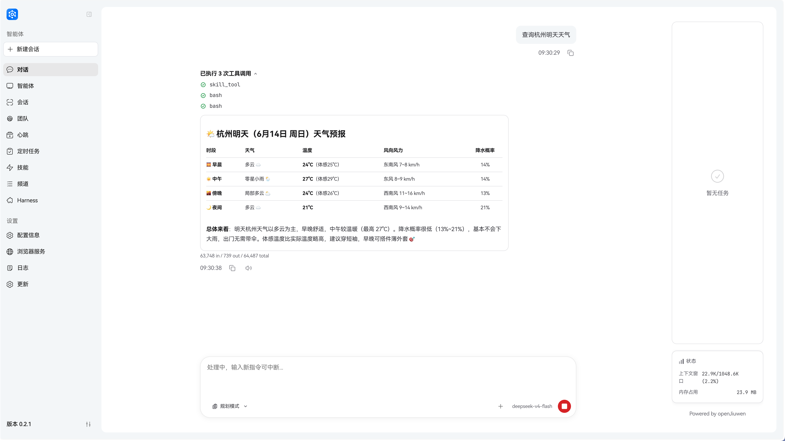

### 通过与JiuwenSwarm对话：“优化一下weather skill， 添加展示紫外线强度”，对skill完成优化
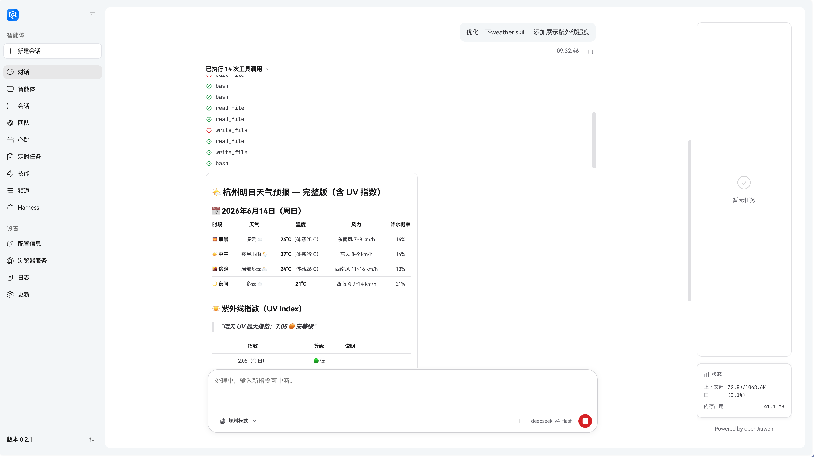

### 优化后
再次调用，输出结果不仅包含气温、风速等基础项，还带上了紫外线强度
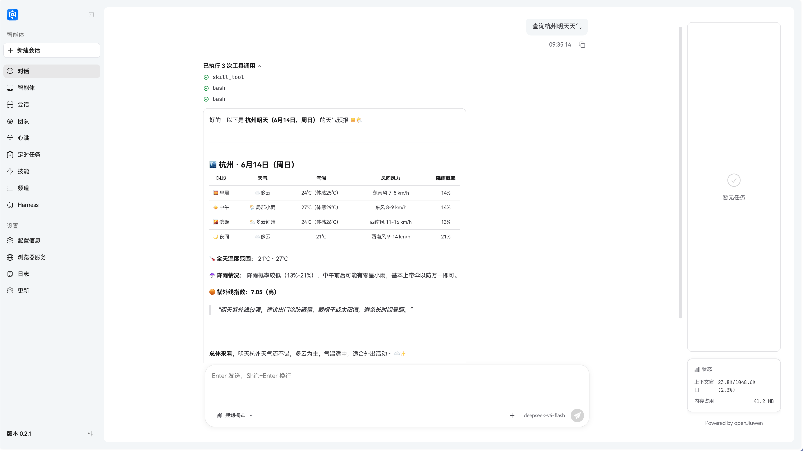


