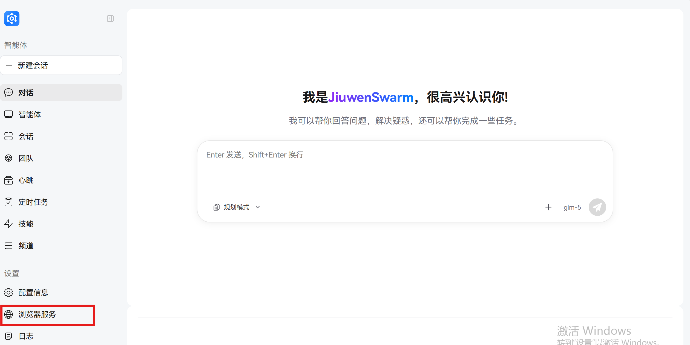
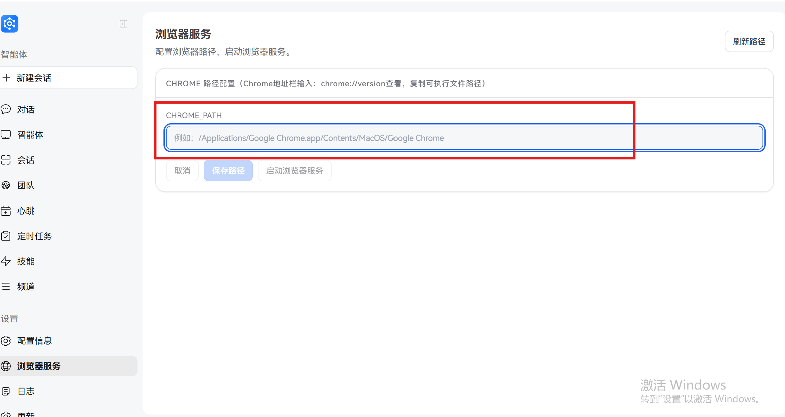

# 浏览器工具说明

## 1. 概念科普
浏览器工具是 JiuwenSwarm 中用于驱动真实浏览器完成网页任务的一套能力。它适合处理需要表单填写、页面点击、文件上传、网页检索等场景。

从使用方式上看，用户先在前端页面中配置本机 Chrome 路径并启动浏览器服务。系统会拉起一个可被授权的 Chrome 浏览器实例；后续在任务需要时，Agent 会连接并操控这个浏览器完成操作。

### 1.1 主要功能
浏览器工具目前主要支持以下能力：

- 打开网页并等待页面加载
- 在已登录网站中继续操作
- 点击按钮、输入文本、选择页面元素
- 执行多步网页任务
- 复用同一浏览器会话，减少重复登录
- 在需要时读取页面标题、URL、页面结果
- 配合附件上传、邮件填写、网页表单提交等复杂任务

### 1.2 典型使用场景

- **网页信息提取**：从新闻网站、文档页面等提取结构化信息
- **邮件操作**：登录邮箱发送邮件、查看收件箱、下载附件
- **表单填写**：自动填写在线报名、注册、申请等表单
- **在线购物**：浏览商品、比较价格、加入购物车
- **企业系统操作**：在内部系统中完成审批、查询等任务

## 2. 快速上手（仅展示前端操作即可）

如果要在前端使用浏览器工具，请先确保本机已经安装 Chrome 浏览器。

### 2.1 步骤 1：确认 Chrome 安装路径和 Profile 目录
1. 打开 Chrome 浏览器。
2. 在地址栏输入 `chrome://version` 并回车。
3. 记录以下两个信息：
   - **可执行文件路径**：用于填写 `CHROME_PATH`
   - **个人资料路径 / Profile 路径**：用于确认当前浏览器使用的用户目录和配置目录

其中：
- 可执行文件路径一般是 `chrome.exe` 的完整路径。
- Profile 目录用于帮助确认当前浏览器账户和资料目录，方便排查登录态或授权问题。

### 2.2 步骤 2：打开前端的“浏览器服务”面板

1. 打开 JiuwenSwarm 前端页面。

   

2. 进入“设置”中的“浏览器服务”区域。
3. 找到 Chrome 路径输入框。

   


### 2.3 步骤 3：填写 CHROME_PATH
1. 将在 `chrome://version` 中看到的 Chrome 可执行文件完整路径复制出来。

   

2. 粘贴到前端页面的 `CHROME_PATH` 输入框中。
3. 点击“保存路径”。

### 2.4 步骤 4：启动浏览器服务
1. 在浏览器服务面板中点击“启动浏览器服务”。
2. 系统会调用后端启动脚本，拉起一个 Chrome 浏览器。
3. 如果启动成功，通常会弹出一个新的 Chrome 窗口。

这个弹出的 Chrome 就是后续可被 Agent 操控的浏览器实例。

### 2.5 步骤 5：在弹出的浏览器中完成必要授权
如果你的任务需要登录网站、授权邮箱、访问企业系统或使用已有账号状态，请在这个 Chrome 中完成必要的人工操作，例如：

- 登录 Gmail / Outlook / 企业邮箱
- 通过短信、验证码、扫码等人工认证
- 允许站点访问权限
- 打开需要操作的目标页面

### 2.6 步骤 6：交给 Agent 使用浏览器工具
完成授权后，用户就可以在对话里提出需要浏览器执行的任务，例如：

- 打开某个网页并读取信息
- 登录后继续点击和填写表单
- 在邮箱中写邮件、上传附件、等待确认

当任务需要浏览器时，Agent 会操控这个已经获得授权的 Chrome，而不是重新新建一个完全无状态的浏览器。

## 3. 使用建议

为了让浏览器工具更稳定，建议遵循以下做法：

- 尽量使用本机真实安装的 Chrome，而不是临时浏览器。
- 启动浏览器服务后，优先在弹出的 Chrome 中完成登录和授权。
- 对于长流程任务，尽量保持同一个会话，避免频繁更换浏览器状态。
- 如果任务涉及邮箱、企业系统、网银等场景，建议先人工完成一次登录，再交给 Agent 继续操作。
- 如果浏览器状态异常，可以重新启动浏览器服务后再测试。
- 建议让 `PLAYWRIGHT_CDP_URL` 与 `config.yaml` 中的远程调试地址、端口保持一致。
- 建议保持 `BROWSER_ALLOW_SHORT_TIMEOUT_OVERRIDE=0`，避免模型把浏览器任务拆成过多短调用。

## 4. 案例实践

### 4.1 案例一：网页信息提取
**任务描述**：从特定网页提取新闻标题和摘要

**操作步骤**：
1. 启动浏览器服务并完成必要的授权
2. 在对话中输入："请从 https://example.com/news 提取今天的头条新闻标题和摘要"
3. Agent 会自动调用浏览器工具访问指定网页
4. 浏览器会解析页面内容并提取所需信息
5. Agent 将提取到的信息整理后返回给用户

### 4.2 案例二：邮件发送（带附件）
**任务描述**：使用 Gmail 发送一封包含附件的邮件

**操作步骤**：
1. 启动浏览器服务
2. 在弹出的 Chrome 中登录 Gmail 账号
3. 在对话中输入："请帮我发送一封邮件，收件人：test@example.com，主题：测试邮件，内容：这是一封测试邮件，附件：/path/to/file.pdf"
4. Agent 会调用浏览器工具，打开 Gmail 写信页面
5. 浏览器会自动填写收件人、主题、内容，并上传附件
6. 发送完成后，Agent 会通知用户邮件已发送

> **说明**：后续前端更新后会补充操作配图，每个案例将展示1-2张图片，主要展示关键执行流程和最终结果。

## 5. 后端配置方式

### 5.1 配置文件概述

浏览器工具的配置涉及以下几个核心文件，它们共同协作完成浏览器的配置和运行：

- **`config/config.yaml`**：主要配置 Chrome 启动参数，如 Chrome 可执行文件路径、远程调试地址和端口等，这些配置是浏览器启动的基础
- **`.env`**：配置浏览器运行时、MCP 连接、Playwright 参数和超时设置等环境变量，这些配置会影响浏览器的运行时行为
- **`.env.template`**：环境变量模板文件，包含所有可用的环境变量及其默认值，可作为配置参考

这三个文件的关系是：`config/config.yaml` 提供浏览器启动的基础参数，`.env` 提供运行时环境配置，两者结合确保浏览器工具正常工作。

### 5.2 config.yaml 中浏览器配置

| 配置项 | 类型 | 默认值 | 说明 |
|--------|------|--------|------|
| `browser.chrome_path` | string/map | - | Chrome 可执行文件路径，可以是单个字符串或按 OS 写成 map |
| `browser.remote_debugging_address` | string | "127.0.0.1" | Chrome 远程调试监听地址 |
| `browser.remote_debugging_port` | integer | 9222 | Chrome 远程调试端口 |
| `browser.user_data_dir` | string | "" | Chrome 用户数据目录，留空时使用系统默认目录 |
| `browser.profile_directory` | string | "Default" | 要使用的 Chrome Profile 名称 |

**按操作系统配置示例**：
```yaml
browser:
  chrome_path:
    windows: "C:\\Users\\YOUR_USER\\AppData\\Local\\Google\\Chrome\\Application\\chrome.exe"
    macos: "/Applications/Google Chrome.app"
    linux: "/usr/bin/google-chrome"
  remote_debugging_address: "127.0.0.1"
  remote_debugging_port: 9222
  user_data_dir: ""
  profile_directory: "Default"
```

### 5.2 .env 中浏览器配置

#### 5.2.1 浏览器 MCP wrapper 配置

| 环境变量 | 默认值 | 说明 |
|----------|--------|------|
| `BROWSER_RUNTIME_MCP_ENABLED` | 1 | 是否启用浏览器 MCP wrapper |
| `BROWSER_RUNTIME_MCP_CLIENT_TYPE` | streamable-http | MCP client 类型 |
| `BROWSER_RUNTIME_MCP_SERVER_ID` | playwright_runtime_wrapper | wrapper 的标识信息 |
| `BROWSER_RUNTIME_MCP_SERVER_NAME` | playwright-runtime-wrapper | wrapper 的名称 |
| `BROWSER_RUNTIME_MCP_SERVER_PATH` | http://127.0.0.1:8940/mcp | wrapper 访问地址 |
| `BROWSER_RUNTIME_MCP_TIMEOUT_S` | 300 | MCP 连接或调用层的超时控制 |
| `BROWSER_RUNTIME_MCP_HOST` | 127.0.0.1 | 本地自动拉起 wrapper 时使用的 host |
| `BROWSER_RUNTIME_MCP_PORT` | 8940 | 本地自动拉起 wrapper 时使用的 port |
| `BROWSER_RUNTIME_MCP_PATH` | /mcp | 本地自动拉起 wrapper 时使用的 path |
| `BROWSER_RUNTIME_MCP_COMMAND` | - | wrapper 启动命令覆盖项，通常留空 |
| `BROWSER_RUNTIME_MCP_ARGS` | - | wrapper 启动参数覆盖项，通常留空 |
| `BROWSER_RUNTIME_MCP_AUTO_SSE_FALLBACK` | 1 | 某些模式下是否允许 SSE fallback |

#### 5.2.2 Playwright 官方 MCP 配置

| 环境变量 | 默认值 | 说明 |
|----------|--------|------|
| `PLAYWRIGHT_MCP_COMMAND` | npx | 启动官方 Playwright MCP 的命令 |
| `PLAYWRIGHT_MCP_ARGS` | -y @playwright/mcp@latest | 启动官方 Playwright MCP 的参数 |
| `PLAYWRIGHT_CDP_URL` | http://127.0.0.1:9222 | 连接到已启动 Chrome 的 CDP 地址，应与 config.yaml 中的调试地址和端口保持一致 |

#### 5.2.3 超时与执行策略配置

| 环境变量 | 默认值 | 说明 |
|----------|--------|------|
| `PLAYWRIGHT_TOOL_TIMEOUT_S` | 300 | 浏览器工具执行的总 watchdog 超时 |
| `BROWSER_TIMEOUT_S` | 300 | 浏览器任务默认长超时，如果模型传入的 timeout_s 更小，默认会被钳回至少这个值 |
| `BROWSER_ALLOW_SHORT_TIMEOUT_OVERRIDE` | 0 | 是否允许模型把任务超时改得更短，推荐保持为 0 |

### 5.3 推荐最小配置

要正常使用浏览器工具，至少保证下面这些字段配置正确：

**config/config.yaml**
```yaml
browser:
  chrome_path: "C:\\Users\\YOUR_USER\\AppData\\Local\\Google\\Chrome\\Application\\chrome.exe"
  remote_debugging_address: "127.0.0.1"
  remote_debugging_port: 9222
  user_data_dir: ""
  profile_directory: "Default"
```

**.env**
```dotenv
BROWSER_RUNTIME_MCP_ENABLED=1
BROWSER_RUNTIME_MCP_CLIENT_TYPE=streamable-http
BROWSER_RUNTIME_MCP_SERVER_PATH=http://127.0.0.1:8940/mcp
PLAYWRIGHT_MCP_COMMAND=npx
PLAYWRIGHT_MCP_ARGS=-y @playwright/mcp@latest
PLAYWRIGHT_CDP_URL=http://127.0.0.1:9222
PLAYWRIGHT_TOOL_TIMEOUT_S=300
BROWSER_TIMEOUT_S=300
BROWSER_ALLOW_SHORT_TIMEOUT_OVERRIDE=0
```

## 6. 原理与代码架构

### 6.1 技术架构

当前浏览器工具的核心链路如下：

- **前端页面**：提供「浏览器服务」面板，用于配置 Chrome 可执行文件路径并启动浏览器服务
- **后端应用**：通过 `browser_start_client.py` 启动本机 Chrome，并开启远程调试能力
- **浏览器运行时**：基于 Playwright MCP 封装，浏览器工具通过 MCP client 与运行时通信
- **Agent 调用**：Agent 调用 `browser_run_task` 等工具时，运行时会把自然语言任务转换为浏览器操作步骤
- **会话管理**：浏览器会按 `session_id` 复用，同一会话下可以保持登录态、页面上下文和授权状态

可以简单理解为：

`前端配置 → 启动 Chrome → 运行时接管 Chrome → Agent 在需要时操控浏览器执行任务`

### 6.2 核心代码

浏览器工具的核心代码主要分布在以下模块：

#### Chrome 启动脚本
- `jiuwenswarm/agentserver/tools/browser_start_client.py`
  - 读取 `config/config.yaml` 中的 `browser.*` 配置
  - 启动带远程调试能力的 Chrome

#### 浏览器 MCP 接入
- `jiuwenswarm/agentserver/tools/browser_tools.py`
  - 浏览器 MCP wrapper 的接入、自动拉起、client patch、配置构建

#### 浏览器运行时
- `jiuwenswarm/agentserver/tools/browser-move/src/playwright_runtime_mcp_server.py`
  - 浏览器 runtime 的 MCP server 入口
- `jiuwenswarm/agentserver/tools/browser-move/src/playwright_runtime/runtime.py`
  - 浏览器 runtime 编排层
- `jiuwenswarm/agentserver/tools/browser-move/src/playwright_runtime/service.py`
  - 浏览器任务执行、session 复用、timeout guardrails
- `jiuwenswarm/agentserver/tools/browser-move/src/playwright_runtime/agents.py`
  - 主编排 agent 与浏览器 worker agent 的提示词和构造逻辑
- `jiuwenswarm/agentserver/tools/browser-move/src/playwright_runtime/config.py`
  - Playwright MCP 与浏览器运行时配置解析

- **工具管理模块**：`jiuwenswarm/agents/harness/common/tools/` 是系统管理所有工具的底层模块，浏览器相关工具主要在此模块下实现
- **前端界面模块**：`jiuwenswarm/channels/web/frontend/` 负责用户界面交互

具体文件说明：

| 模块 | 文件路径 | 功能说明 |
|------|----------|----------|
| 前端浏览器服务面板 | `jiuwenswarm/channels/web/frontend/src/components/BrowserPanel/index.tsx` | 负责读取路径、保存路径、触发「启动浏览器服务」 |
| 后端应用入口 | `app.py` | 提供 `path.get`、`path.set`、`browser.start` 等前端调用入口 |
| Chrome 启动脚本 | `jiuwenswarm/agentserver/tools/browser_start_client.py` | 读取 `config/config.yaml` 中的 `browser.*` 配置，启动带远程调试能力的 Chrome |
| 浏览器 MCP 接入 | `jiuwenswarm/agentserver/tools/browser_tools.py` | 浏览器 MCP wrapper 的接入、自动拉起、client patch、配置构建 |
| 浏览器运行时 MCP 服务 | `jiuwenswarm/agentserver/tools/browser-move/src/playwright_runtime_mcp_server.py` | 浏览器 runtime 的 MCP server 入口 |
| 浏览器运行时编排层 | `jiuwenswarm/agentserver/tools/browser-move/src/playwright_runtime/runtime.py` | 浏览器 runtime 编排层 |
| 浏览器任务执行 | `jiuwenswarm/agentserver/tools/browser-move/src/playwright_runtime/service.py` | 浏览器任务执行、session 复用、timeout guardrails |
| 浏览器运行时配置 | `jiuwenswarm/agentserver/tools/browser-move/src/playwright_runtime/config.py` | Playwright MCP 与浏览器运行时配置解析 |

## 7. 一句话总结

浏览器工具的本质，是让 Agent 在用户已经授权过的真实 Chrome 上执行网页操作；前端负责配置和启动，后端负责接管和自动化执行。