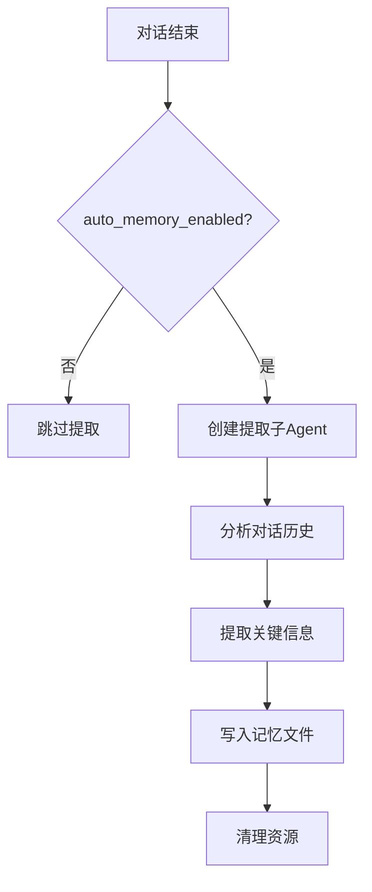

# 自动记忆（Auto Memory）

自动记忆是 JiuwenSwarm 的对话后记忆提取功能，在每次对话结束后自动分析对话内容，提取值得长期保留的信息并写入记忆文件，按项目隔离存储。

---

## 功能概述

- **自动提取**：对话结束后无需用户干预，系统自动分析并提取关键信息
- **项目隔离**：每个项目独立存储记忆，避免跨项目信息混淆
- **可配置开关**：通过配置文件或 TUI 命令灵活启用/禁用

---

## 启用方式

### 配置文件启用

在 `config.yaml` 中设置 `auto_memory_enabled`：

```yaml
# Auto Memory：对话结束后自动提取记忆，按项目隔离存储
auto_memory_enabled: true
```

### TUI 命令启用

在 TUI 终端中使用 `/memory` 命令切换：

```
/memory          # 进入记忆管理界面
/memory toggle   # 显示所有记忆开关
/memory toggle auto_memory_enabled   # 切换自动记忆开关
```

在交互界面中，选择 `Auto-memory: on/off` 选项即可切换。

---

## 存储路径

自动记忆按项目路径隔离存储：

```
~/.jiuwenswarm/projects/{sanitized-project-path}/memory/
├── MEMORY.md                    # 长期记忆
├── YYYY-MM-DD.md                # 每日记忆
└── consolidated_{hash}.md       # 整合记忆（可选）
```

其中 `{sanitized-project-path}` 是项目路径经过安全处理后的字符串（替换特殊字符为下划线）。

---

## 工作机制

### 提取时机

自动记忆在以下时机触发：

1. **对话结束时**：每次用户与 Agent 的对话结束后，系统检查是否需要提取记忆
2. **非流式请求**：`process_message` 返回结果后触发
3. **流式请求**：`process_message_stream` 完成后触发

### 提取内容

系统通过子 Agent 分析对话内容，提取以下类型的信息：

| 信息类型 | 说明 | 示例 |
|----------|------|------|
| 用户偏好 | 用户明确表达的偏好或习惯 | "用户偏好使用 pytest 框架" |
| 项目决策 | 技术选型、架构决策 | "项目采用 FastAPI 作为后端框架" |
| 关键事实 | 需要长期记住的事实 | "数据库连接字符串存储在 .env 文件" |
| 问题解决 | 调试过程、问题根因 | "登录失败原因是 JWT 过期时间配置错误" |

### 提取流程



---

## 配置说明

| 配置项 | 说明 | 默认值 |
|--------|------|--------|
| `auto_memory_enabled` | 是否启用自动记忆提取 | `false` |

---

## TUI 交互

### `/memory` 命令

在 TUI 中输入 `/memory` 命令，会显示记忆管理界面：

```
Memory
Select a memory file to edit:

  Auto-memory: on          [Press Enter to toggle]
  Project memory           Checked in at ./JIUWENSWARM.md
  Local memory             Saved in ./JIUWENSWARM.local.md
  User memory              Saved in ~/.jiuwen/JIUWENSWARM.md
  Open auto-memory folder
```

选择 `Auto-memory: on/off` 行并按 Enter，即可切换自动记忆开关。

---

## 注意事项

1. **首次启用**：首次启用自动记忆后，需要重启会话才能生效
2. **存储空间**：长期使用会积累记忆文件，建议定期清理过期内容
3. **敏感信息**：系统会自动过滤密码、API Key 等敏感信息（通过 `memory.forbidden_memory_definition` 配置）
4. **性能影响**：提取过程在后台异步执行，不影响对话响应速度

---

## 详见

- [配置信息](配置信息.md) — 配置文件详细说明
- [TUI 使用指南](TUI使用指南.md) — TUI 命令使用方法