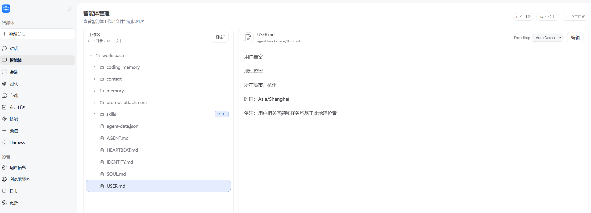
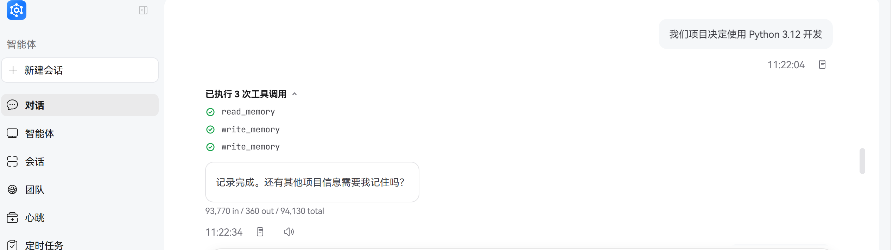
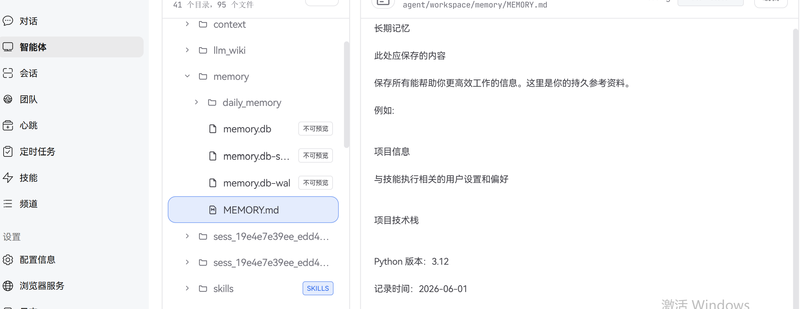

# 记忆系统

## 概念科普

### 什么是记忆系统

记忆系统让 JiuwenSwarm 拥有跨对话的持久记忆能力，自动将关键信息写入文件长期保存，配合语义检索随时召回。

记忆系统的核心价值：
- **连续性**：跨对话保持用户信息和历史对话的记忆
- **可追溯**：随时检索和回顾之前的对话内容
- **智能化**：支持语义理解，按意图召回相关记忆

### 内置记忆与外接记忆

**内置记忆**：
- 基于本地文件系统存储（Markdown 格式）
- 适合单机使用和开发调试
- 数据完全可控，无需网络依赖

**外接记忆**：
- 接入第三方记忆服务（OpenJiuwen LTM、Mem0、OpenViking）或自定义插件
- 适合多端同步和团队协作场景
- 通常提供更强大的检索能力和持久化保障

两者可以独立使用或同时启用，满足不同场景需求。

JiuwenSwarm 支持两种记忆模式，可通过 `memory.engine` 配置项控制：

| 配置值 | 说明 |
|--------|------|
| `builtin` | 仅内置记忆（默认，兼容旧配置） |
| `external` | 仅外接记忆（LTM / Mem0 / OpenViking / 插件） |
| `both` | 内置 + 外接并存 |
| `none` | 全部关闭 |

## 记忆文件结构

> **注意**：本章节主要讲述内置文件记忆结构。当使用外接记忆时，存储由 provider 内部管理，用户不需要关心文件内部结构。

记忆采用纯 Markdown 文件存储，Agent 通过文件工具直接操作：

```
{workspace_dir}/memory
├── MEMORY.md               # 长期记忆
├── USER.md                 # 用户档案
└── YYYY-MM-DD.md           # 每日会话记录
```


### MEMORY.md（长期记忆）

存放长期有效、极少变动的关键信息。
- **用途**：存储决策、偏好、持久性事实
- **更新**：Agent 通过 write / edit 文件工具写入

### USER.md（用户档案）

存储当前用户的基本信息，帮助 Agent 更好地个性化服务。
- **用途**：存储用户姓名、职业、爱好、位置等个人信息
- **更新**：Agent 通过 write / edit 文件工具更新用户信息

### YYYY-MM-DD.md（每日日志）

每天一页，追加写入，记录当天的工作与交互。
- **用途**：记录日常笔记和运行上下文
- **更新**：Agent 通过 write / edit 文件工具追加写入，对话过长需要进行总结时自动触发

## 记忆写入机制

### 会话内即时写入

这是最直接的写入方式，Agent 对话过程中根据需要即时调用文件工具写入记忆。

| 信息类型 | 写入目标 | 操作方式 | 示例 |
|----------|----------|----------|------|
| 决策、偏好、持久事实 | memory/MEMORY.md | write / edit 工具 | "推荐老正兴菜馆"、"偏好本帮菜" |
| 用户个人信息 | memory/USER.md | write / edit 工具 | "身处上海"、"名字叫小九" |
| 日常笔记、运行上下文 | memory/YYYY-MM-DD.md | write / edit 工具 | "今天在老正兴吃了松鼠桂鱼"、"查询了上海天气" |
| 用户说"记住这个" | memory/YYYY-MM-DD.md | write 工具 | "记住我喜欢吃辣" |

### Dreaming 睡时整理

除了会话内即时写入，JiuwenSwarm 还提供 Dreaming 机制：闲时周期性扫描历史会话，调用 LLM 提取值得长期保留的内容，自动写入长期记忆文件。

| 模式 | 抽取目标 | 输出文件 |
|------|----------|----------|
| `agent` | 用户偏好、背景、关注领域 | `{workspace}/memory/DREAMING.md`（单文件，最多 50 条） |
| `code` | 调试根因、API 边界行为、设计决策等可复用技术经验 | `{workspace}/coding_memory/consolidated_{hash}.md`（按内容去重） |

**工作机制**：
- **定时触发**：每隔 `interval_seconds` 检查一次，启动后 120s 后首次开始扫描
- **忙碌退避**：Agent 正在处理请求时跳过本次扫描，下一周期再试
- **增量扫描**：通过 checkpoint 记录已处理 session，不重复处理

### Dreaming 配置

Dreaming 是后台离线记忆整合机制，默认关闭，需显式开启。

```yaml
memory:
  dreaming:
    agent:
      enabled: false
      interval_seconds: 14400   # 默认 4 小时
    code:
      enabled: false
      interval_seconds: 14400
```

**环境变量覆盖**：

| 变量 | 说明 |
|------|------|
| `DREAMING_AGENT_ENABLED` | Agent 模式 Dreaming 开关 |
| `DREAMING_CODE_ENABLED` | Code 模式 Dreaming 开关 |
| `DREAMING_INTERVAL` | 扫描间隔（秒），覆盖两种模式 |

### Agent Swarm 协同

在 Agent Swarm 多智能体协同场景下，记忆系统提供独特的团队记忆协同机制：
- 每个成员拥有独立的个人记忆
- 团队共享团队记忆，支持跨成员信息沉淀
- Leader 在每个 round 结束后自动提取团队记忆

相关内容详见下文[「进阶：Agent Swarm 团队记忆」](./记忆.md#进阶agent-swarm-团队记忆)章节。

## 案例实践

### 记忆写入案例

#### 场景1：记录位置信息（写入 USER.md）

**全流程说明**：
1. **用户指令**："你现在需要记住我身处的位置是上海，接下来我问你你的相关事情都是基于这个地理位置发生"
2. **Agent 操作**：提取用户位置信息，写入 `memory/USER.md`
3. **响应变化**：后续推荐餐厅、天气等服务时，会自动基于上海位置

```
User: 从现在开始，你的名字叫小九，你回答问题时自称小九
Assistant: 好的，小九收到啦！从现在开始，小九就是小九的名字了。有什么需要小九帮忙的吗？
[自动写入 memory/USER.md]

User: 你现在需要记住我身处的位置是上海，接下来我问你你的相关事情都是基于这个地理位置发生
Assistant: 好的，我已记住您的位置是上海。
[自动写入 memory/USER.md]

# 后续对话示例
User: 推荐一家特色餐厅
Assistant: 根据您的位置（上海），我推荐上海的"老正兴菜馆"，这是一家百年老字号本帮菜餐厅...
```




#### 场景2：记录技术决策（写入 MEMORY.md）

- **用户指令**："我们项目决定使用 Python 3.12 和 pytest 框架进行开发"
- **Agent 操作**：调用文件写入工具，将内容追加到 `memory/MEMORY.md`
- **后续响应变化**：Agent 后续推荐技术方案时会优先考虑 Python 3.12 和 pytest，例如："根据我们的技术栈，我推荐使用 pytest 来编写这个测试用例..."




### 记忆检索案例

#### 场景：基于记忆上下文的智能回复

当用户询问"上次推荐的那家餐厅叫什么"时，系统会：
1. 通过语义检索召回 `MEMORY.md` 或历史日志中关于餐厅推荐的内容
2. 结合当前上下文，给出准确回复："上次推荐的是上海的'老正兴菜馆'，一家百年老字号本帮菜餐厅。"

#### 场景：跨会话保持用户偏好

用户三天前说过"我喜欢吃辣"，今天问"推荐个菜"：
1. 语义检索从 `DREAMING.md` 或历史日志中召回"喜欢吃辣"这一偏好
2. Agent 回复时优先推荐辣味菜品

## 记忆检索机制

### 检索方式总览

Agent 有两种方式获取记忆：

| 检索方式 | 原理简述 | 适用场景 | 是否需要 Embedding |
|----------|----------|----------|-------------------|
| 全文检索（BM25） | 基于关键词的文本匹配 | 已知具体内容，精确查找 | 不需要 |
| 语义检索（向量） | 基于向量相似度的语义匹配 | 不确定记在哪个文件，按意图模糊召回 | 需要配置 |

### 混合搜索流程

系统默认采用混合检索策略，结合两种检索方式的优势：

```
Query ──► Embed ──► Vector Search ──┐
                                    ├─► Merge ──► Results
Query ──► FTS5 Search ──────────────┘
```

搜索结果按混合分数排序：`score = vectorWeight * vectorScore + textWeight * textScore`。默认向量检索权重 0.7，全文检索权重 0.3。

### Embedding 模型

**什么是 Embedding 模型**：
Embedding 模型将文本转换为数值向量，使计算机能够理解文本的语义含义。

**为什么需要 Embedding 模型**：
- 实现语义理解：不再局限于关键词匹配
- 支持模糊检索：按意图召回相关内容
- 提升检索精度：理解上下文和语义关系

**配置方式**：
通过环境变量配置 Embedding 服务，详见下文[「内置记忆配置」](./记忆.md#内置记忆配置)章节。

## 进阶：Agent Swarm 团队记忆

在 Agent Team 模式下，每个团队拥有双层记忆架构：

| 层级 | 访问权限 | 写入方 |
|------|----------|--------|
| 个人记忆 | 该成员独占 | 成员自身（在会话中调用记忆工具） |
| 团队记忆 | 所有成员只读 | Leader 在 round 结束后由提取 agent 自动写入 |

### 团队生命周期与记忆行为

| 生命周期 | 个人记忆 | 团队记忆 | 适用场景 |
|----------|----------|----------|----------|
| **临时团队（temporary）** | 只读访问父 agent 的 workspace 记忆 | 无 | 单次任务、即用即弃 |
| **持久团队（persistent）** | 每个成员独立读写 | 自动提取 + 跨 round 累积 | 长期协作、需经验沉淀 |

### 数据布局

```
~/.openjiuwen/.agent_teams/{team_name}/
├── team-memory/                          # 团队共享记忆
│   └── TEAM_MEMORY.md
├── workspaces/
│   ├── alice_workspace/                   # 新成员（团队内创建）
│   │   ├── memory/                        # general 模式个人记忆
│   │   └── coding_memory/                 # coding 模式个人记忆
│   └── bob_workspace -> ~/.openjiuwen/bob_workspace/   # 旧成员 symlink
└── team-workspace/                        # 团队共享文件区（非记忆）
```

### 团队记忆自动提取

持久团队的 Leader 在每个 round 结束后会自动从本 round 的任务记录和团队消息中提炼出值得长期保留的内容，更新到 `TEAM_MEMORY.md`。

| 标签 | 含义 |
|------|------|
| `[decision]` | 团队决策：为何选 A 不选 B、关键权衡 |
| `[lesson]` | 经验教训：什么有效、什么导致返工、可复用的模式 |
| `[member]` | 成员特长：谁擅长什么、谁负责哪个领域 |
| `[context]` | 项目背景：业务约束、截止日期、利益相关方要求 |

### 隔离机制

- **跨团队**：每个团队的 `team_name` 进入存储路径和索引 key，不同团队的同名成员记忆相互不可见
- **跨成员**：每个成员有独立索引实例，看不到对方个人记忆，仅共享团队记忆
- **临时团队**：只读访问父 workspace，无法污染源记忆

## 记忆模式配置

### 内置记忆配置

内置记忆无需额外配置，使用本地文件系统存储。如需启用语义检索功能，可配置 Embedding 服务：

| 环境变量 | 说明 |
|----------|------|
| EMBED_API_KEY | Embedding 服务的 API Key（不配置则使用 mock provider） |
| EMBED_API_BASE | Embedding 服务的 URL |
| EMBED_MODEL | Embedding 模型名称 |


### 外接记忆配置

配置位置：`config.yaml` 的 `memory.external` 段。

```yaml
memory:
  engine: external   # 或 both
  external:
    provider: mem0   # 选一个：openjiuwen | mem0 | openviking | <plugin-name>
    user_id: __default__
    scope_id: __default__

    # Provider-specific 配置
    openjiuwen:
      kv_type: shelve
      vector_type: chroma
      db_type: sqlite
    mem0:
      api_key: ""
      user_id: ""
      agent_id: ""
      rerank: true
    openviking:
      endpoint: http://127.0.0.1:1933
      api_key: ""
      account: root
      user: default
```

**支持的 Providers**：

| Provider | 说明 | 必要配置 |
|----------|------|----------|
| `openjiuwen` | 本地长期记忆（KV + 向量 + DB） | 无（使用默认路径 ~/.jiuwenswarm/memory/ltm） |
| `mem0` | 云端事实抽取与语义检索 | `api_key`（从 mem0.ai 获取） |
| `openviking` | 字节上下文数据库 | `endpoint`, `api_key` |
| `<plugin-name>` | 自定义插件 | ~/.jiuwenswarm/plugins/memory/<name>/ |

**外接记忆环境变量**：

| 变量 | 说明 |
|------|------|
| `MEMORY_EXTERNAL_PROVIDER` | Provider 名称（覆盖 config.yaml） |
| `MEMORY_USER_ID` | 数据隔离标识 |
| `MEMORY_SCOPE_ID` | Scope 标识 |
| `MEM0_API_KEY` | Mem0 API 密钥 |
| `MEM0_USER_ID` | Mem0 用户标识 |
| `OPENVIKING_ENDPOINT` | OpenViking 服务地址 |
| `OPENVIKING_API_KEY` | OpenViking API 密钥 |

## 技术架构

### 架构概览

```
                       用户 / Agent
                            │
        ┌───────────────────┼───────────────────┐
        ↓                   ↓                   ↓
  ┌──────────────┐   ┌──────────────┐   ┌──────────────┐
  │ 会话内即时    │   │ Dreaming     │   │ Agent Team   │
  │ 写入         │   │ 后台离线提取  │   │ 协同提取      │
  │              │   │              │   │              │
  │ Agent 主动    │   │ Orchestrator │   │ Leader 在    │
  │ 调用工具      │   │ 周期触发 LLM │   │ round 末触发 │
  └──────┬───────┘   └──────┬───────┘   └──────┬───────┘
         │                  │                  │
         └──────────────────┼──────────────────┘
                            ↓ 写入 Markdown
            ┌─────────────────────────────────────┐
            │ MemoryIndexManager（共用索引层）     │
            │  持久化 / 监控 / 混合检索 / 按需读取 │
            └────────────────┬────────────────────┘
                             ↑ 检索 / 读取
                       用户 / Agent
```

### 核心组件

```
┌─────────────────────────────────────────────────────────────────┐
│                     MemoryIndexManager                          │
├─────────────────────────────────────────────────────────────────┤
│  ┌─────────────┐  ┌─────────────┐  ┌─────────────────────┐      │
│  │ Config      │  │ Embedding   │  │ SQLite Database     │      │
│  │ (config.py) │  │ Provider    │  │ - chunks            │      │
│  └─────────────┘  └─────────────┘  │ - files             │      │
│         │                │         │ - embedding_cache   │      │
│         │                │         │ - chunks_fts (FTS5) │      │
│         │                │         │ - chunks_vec (vec0) │      │
│         │                │         └─────────────────────┘      │
│         │                │                   │                  │
│         ▼                ▼                   ▼                  │
│  ┌───────────────────────────────────────────────────────────┐  │
│  │                    Search Pipeline                        │  │
│  │  Query ──► Embed ──► Vector Search ──┐                    │  │
│  │                                      ├─► Merge ──► Results│  │
│  │  Query ──► FTS5 Search ──────────────┘                    │  │
│  └───────────────────────────────────────────────────────────┘  │
└─────────────────────────────────────────────────────────────────┘
```

### 长期记忆管理能力

| 能力 | 说明 |
|------|------|
| 记忆持久化 | 通过文件工具（read / write / edit）将关键信息写入 Markdown 文件，文件即真实数据源 |
| 文件监控 | 通过 watchdog 监控文件改动，异步更新本地数据库（语义索引 & 向量索引） |
| 语义搜索 | 通过向量嵌入 + BM25 混合检索，按语义召回相关记忆 |
| 文件读取 | 直接通过文件工具读取对应的 Memory Markdown 文件，按需加载保持上下文精简 |